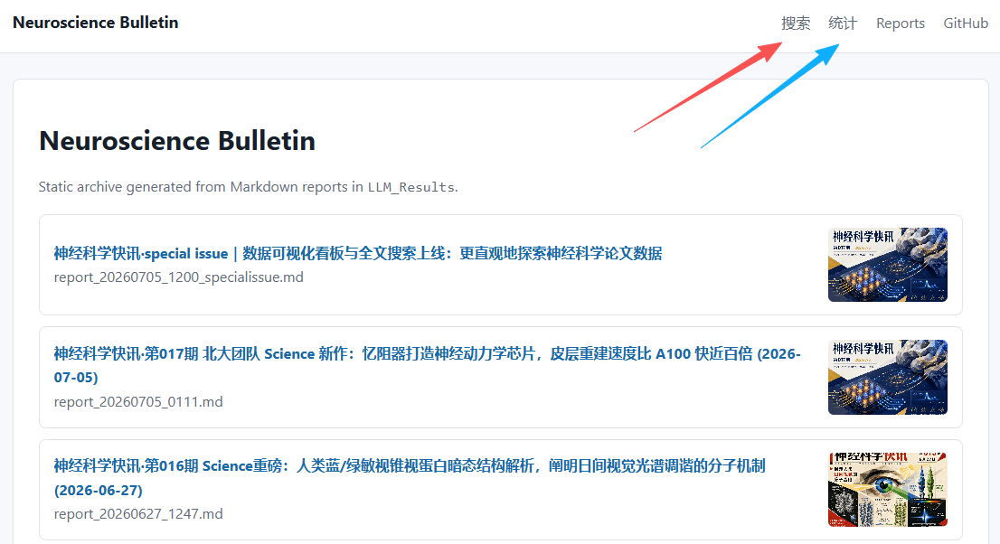
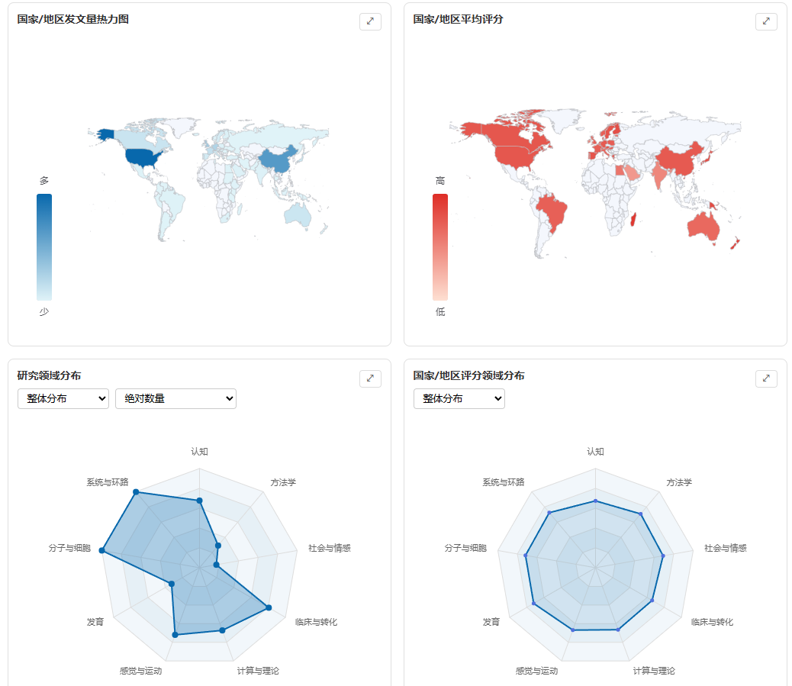
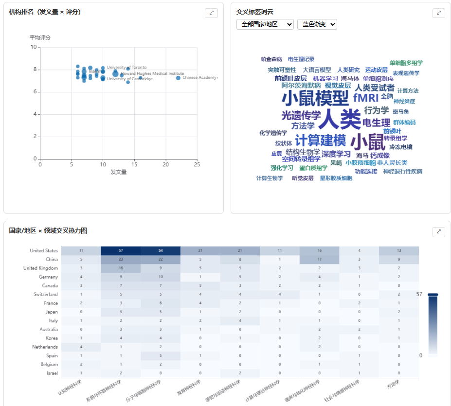
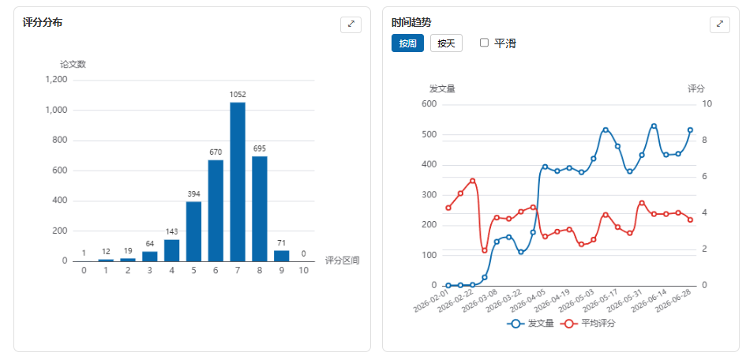
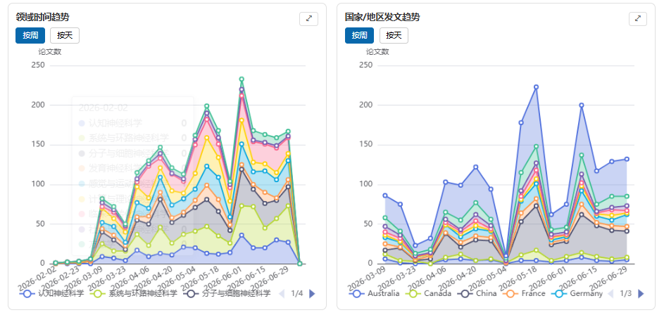
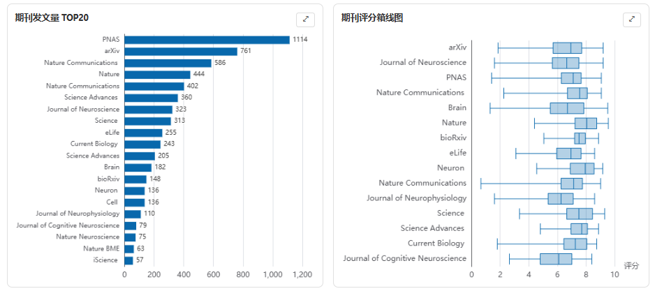

# 数据可视化看板与全文搜索上线：更直观地探索神经科学论文数据

过去几周，我们在持续更新每周神经科学快讯的同时，也在思考一个问题：积累了这么多期的论文数据，能不能用更直观的方式呈现出来？

今天，我们上线了两个新功能：**📊 交互式数据可视化看板** 和 **🔍 全文搜索引擎**。

👉 看板地址：https://zhang-zhaoji.github.io/scientific-bulletin/dashboard.html

👉 搜索地址：https://zhang-zhaoji.github.io/scientific-bulletin/search.html

## 📊 数据可视化看板

看板页面整合了我们数据库中所有论文的元数据（国家/地区、机构、研究领域、评分、期刊、交叉标签等），通过 13 个交互式图表呈现出来。

### 看板里有什么？

**国家/地区维度（4个图表）**

- **发文量热力图**：在世界地图上按颜色深浅展示各国家/地区的论文数量
- **平均评分热力图**：展示各国家/地区论文的平均质量评分
- **研究领域分布雷达图**：展示 9 个神经科学子领域的论文分布，支持国家/地区对比模式（可选 World + 最多 5 个国家叠加显示）
- **国家/地区评分领域分布雷达图**：类似上图，但展示的是平均评分而非数量

**研究领域维度（3个图表）**
- **机构排名散点图**：x 轴发文量、y 轴平均评分，圆圈大小代表评分方差，标注机构名
- **交叉标签词云**：展示论文交叉标签的词频，支持按国家/地区筛选和 7 种配色方案
- **× 领域交叉热力图**：展示国家/地区与研究领域的交叉分布，支持三种归一化模式——绝对数量、贡献比例（该国该领域占全球该领域的比例）、专注度（该国该领域占该国总数的比例）

**其他（6个图表）**

- **评分分布**：直方图展示所有论文的评分分布
- **时间趋势**：折线图展示发文量和平均评分的时间变化，支持平滑选项
    
- **领域时间趋势**：堆叠面积图展示各研究领域随时间的变化趋势
- **发文趋势**：按周或按天展示 TOP10 国家/地区的发文量变化
    
- **期刊发文量 TOP20**：横向条形图展示发文量最多的期刊
- **期刊评分箱线图**：展示 TOP15 期刊的评分分布（中位数、四分位数、极值）
    

### 交互功能

- **日期范围选择器**：选择任意时间段，所有图表实时联动更新
- **领域多选筛选**：勾选/取消特定研究领域，图表数据自动过滤
- **图表展开**：每个图表右上角有 ⤢ 按钮，点击可占满整行查看大图
- **归一化切换**：交叉热力图和雷达图支持多种归一化模式

### 技术实现

看板使用 [sql.js](https://sql.js.org/) 在浏览器端直接运行 SQLite 数据库查询，无需后端服务器。具体流程：

1. 从完整数据库（14.5MB）中构建精简版本（7.3MB），去除 abstract、url、doi 等大字段
2. 浏览器首次加载精简数据库后缓存到 IndexedDB，二次访问秒级加载
3. 用户交互时执行 SQL 查询，结果通过 [ECharts](https://echarts.apache.org/) 渲染为图表

这意味着所有数据查询都在客户端完成，不需要服务器算力，也不存在请求延迟。

## 🔍 全文搜索

搜索页面支持对所有我们介绍的论文进行检索，快速找到感兴趣的文献。

### 搜索功能特点

- **模糊搜索**：基于 [MiniSearch](https://github.com/lucaong/minisearch) 引擎，支持中英文全文搜索，容错拼写
- **搜索范围**：标题、中文标题、摘要、期刊名
- **搜索结果**：展示标题、中文标题、期刊、评分、推荐等级和摘要片段
- **锚点跳转**：点击搜索结果直接跳转到对应报告页面的对应文章位置
- **收藏夹**：可以收藏感兴趣的论文，收藏夹数据保存在浏览器本地

### 搜索索引

搜索索引包含所有 17 期常规报告和 2 期特刊中的论文数据，索引文件仅 3.4MB（包含截断摘要），加载迅速。

## 🛠️ 技术栈

两个功能都完全运行在静态网站上，无需后端：

| 功能 | 技术 | 依赖大小 |
|------|------|---------|
| 数据看板 | sql.js + ECharts + ECharts WordCloud | ~1MB (sql.js) + ~1MB (ECharts) |
| 全文搜索 | MiniSearch | ~19KB |
| 数据传输 | 精简数据库 gzip 后约 3MB | 首次加载 2-3 秒 |
| 缓存 | IndexedDB | 二次访问秒级 |

所有第三方库都已本地化，不依赖外部 CDN，确保国内访问稳定性。

## 📁 数据覆盖

目前看板和搜索覆盖的数据：

- **时间范围**：2026 年 3 月至 7 月
- **论文总数**：约 7000 篇
- **常规报告**：17 期
- **特刊**：2 期
- **来源期刊**：18+ 种（Nature, Science, Cell, Neuron, Nature Neuroscience, PLoS 系列等）
- **国家/地区**：80+ 个
- **研究领域**：9 个神经科学子领域

## 如何访问

- **GitHub Pages**：https://zhang-zhaoji.github.io/scientific-bulletin/
- **Netlify（国内可访问）**：https://neurosciencebulletin.netlify.app/

看板和搜索页面入口已在网站导航栏中添加，每页顶部都可以直接点击访问。

---

我们希望这些新功能能帮助大家更方便地探索和发现神经科学前沿研究。如果有任何建议或发现 bug，欢迎在 GitHub 上提 issue 或联系我们。
