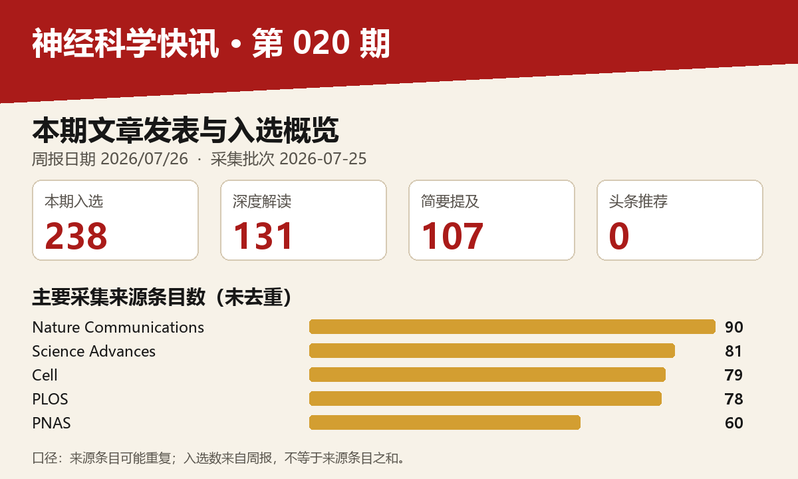

# 神经科学快讯·第020期（2026/07/26）｜1/2

图示口径：采集来源条目未去重；入选文章数以本期周报分类为准。

## 📊 本周概览

- **头条推荐**: 0 篇
- **深度解读**: 131 篇  
- **简要提及**: 107 篇
- **跨界启发**: 0 篇
- **已过滤**: 320 篇

---

### 🌍 国家/地区分布 TOP 10

| 排名 | 国家 | 文章数量 |
|------|------|----------|
| 1 | United States | 570 |
| 2 | China | 226 |
| 3 | United Kingdom | 141 |
| 4 | Germany | 105 |
| 5 | Canada | 59 |
| 6 | Switzerland | 57 |
| 7 | France | 38 |
| 8 | Japan | 31 |
| 9 | Australia | 30 |
| 10 | Korea | 29 |

**总计**: 1286 篇文章

### 🏢 研究机构 TOP 10

| 排名 | 机构 | 文章数量 |
|------|------|----------|
| 1 | Chinese Academy of Sciences | 37 |
| 2 | Stanford University | 29 |
| 3 | University of Oxford | 25 |
| 4 | University of Pennsylvania | 24 |
| 5 | Fudan University | 24 |
| 6 | Howard Hughes Medical Institute | 21 |
| 7 | University of Cambridge | 20 |
| 8 | Tsinghua University | 17 |
| 9 | Harvard University | 17 |
| 10 | McGill University | 16 |

### 📊 评分分布

| 评分区间 | 文章数量 |
|----------|----------|
| 3-4 | 2 |
| 4-5 | 2 |
| 5-6 | 10 |
| 6-7 | 59 |
| 7-8 | 146 |
| 8-9 | 52 |
| 9-10 | 1 |

**总计**: 272 篇评分文章

## 📈 各领域文章分布

| 领域 | 深度解读 | 简要提及 | 总计 |
|------|----------|----------|------|
| 未知领域 | 0 | 63 | 63 |
| 系统与环路神经科学 | 26 | 4 | 30 |
| 感觉与运动神经科学 | 18 | 11 | 29 |
| 分子与细胞神经科学 | 23 | 4 | 27 |
| 认知神经科学 | 19 | 8 | 27 |
| 临床与转化神经科学 | 12 | 10 | 22 |
| 计算与理论神经科学 | 13 | 2 | 15 |
| 方法学 | 12 | 2 | 14 |
| 发育神经科学 | 7 | 2 | 9 |
| 社会与情感神经科学 | 1 | 1 | 2 |

**合计**: 深度解读 131 篇，简要提及 107 篇，共 238 篇

---

## 📚 精选文献（按领域分类）

### 临床与转化神经科学

### Single-cell multiomics connects 3D genome and transcriptome alterations in Alzheimer's disease.

**中文标题**: 单细胞多组学连接阿尔茨海默病中3D基因组和转录组的改变

**作者**: Zhang Y, Lu X, Kunisky AK et al.

**期刊**: Science + Europe PMC | **发表日期**: 23 Jul 2026

**研究领域**: 临床与转化神经科学 / ['临床与转化神经科学', '方法学']

**关键词**: 单细胞多组学, 3D基因组, 阿尔茨海默病, 人类, 全脑, 空间转录组

**推荐等级**: 深度解读

**评分**: 8.7/10  

**亮点**: 单细胞多组学揭示3D基因组重组是阿尔茨海默病细胞类型特异性基因表达失调的新机制。

**核心优势**: 首次在单细胞分辨率下联合分析AD患者脑组织中3D基因组与转录组，结合空间转录组和深度学习预测。

**研究局限**: 基于死后脑组织样本，可能受死后间隔影响；深度学习模型的可解释性有限；需更多队列验证。

**目标读者**: 神经科学、表观遗传学、计算生物学和神经退行性疾病研究者

**推荐理由**: 这项研究首次在单细胞水平联合解析阿尔茨海默病（AD）患者脑组织的三维基因组结构与转录组变化，揭示了染色质重组与细胞类型特异性基因表达失调之间的直接联系。通过GAGE-seq方法并结合空间转录组数据，为理解AD的表观遗传机制提供了全新维度，也为未来靶向染色质结构的治疗策略奠定了基础。

### Cerebral venous blood flow regulates intracerebral pressure and brain clearance via meningeal lymphatic vessels

**中文标题**: 脑静脉血流通过脑膜淋巴管调节颅内压和脑清除

**作者**: Marie-Renee El Kamouh, Myriam Spajer, Stéphanie Lenck

**期刊**: Nature Neuroscience | **发表日期**: 22 Jul 2026

**研究领域**: 临床与转化神经科学 / ['临床与转化神经科学', '系统与环路神经科学']

**关键词**: MRI, 人类, 小鼠, 硬脑膜静脉窦, 颅内高压, 脑膜淋巴管

**推荐等级**: 深度解读

**评分**: 8.3/10  

**亮点**: 脑静脉血流通过脑膜淋巴管调控颅内压与脑清除的新机制

**核心优势**: 结合人体影像与动物模型，首次揭示静脉血流通过脑膜淋巴管调控颅内压的完整通路

**研究局限**: 小鼠模型为急性结扎，与IIH慢性病程不完全一致；人体影像证据为相关性

**目标读者**: 神经血管生理学家、脑淋巴系统研究者、神经内科医生（特别是IIH方向）

**推荐理由**: 该研究通过临床影像与动物模型相结合，揭示了脑静脉血流通过脑膜淋巴管调节颅内压及脑清除的关键机制。特发性颅内高压患者的静脉窦狭窄导致静脉周围液体异常和脑水肿，而小鼠颈静脉结扎模型进一步证实了静脉血流障碍引发短暂颅内高压和脑水肿。这一发现不仅为IIH的病理生理提供了新解释，也为通过干预静脉-淋巴通路治疗颅内压异常和相关神经疾病（如阿尔茨海默病）开辟了新方向。研究整合了临床观察与机制探索，具有较强的转化价值。

### Localized PD-1 CAR T therapy reprograms neuroinflammation.

**中文标题**: 局部PD-1 CAR T疗法重编程神经炎症

**作者**: Shalita R, Ben Yehuda M, Gur C et al.

**期刊**: Cell + Europe PMC | **发表日期**: 21 Jul 2026

**研究领域**: 临床与转化神经科学 / ['临床与转化神经科学', '方法学']

**关键词**: 单细胞RNA测序, CAR T细胞治疗, 多发性硬化症, 神经炎症, B细胞, 浆细胞

**推荐等级**: 深度解读

**评分**: 8.2/10  

**亮点**: 局部PD-1 CAR T疗法通过重编程神经炎症实现精准免疫调控

**核心优势**: 首次利用单细胞组学鉴定MS中致病性PD-1+ Tfh样细胞，并设计局部释放IL-10的CAR T细胞精准清除，开辟了神经免疫疾病局部免疫治疗新范式。

**研究局限**: 主要基于小鼠模型验证，人体疗效和安全性未知；CAR T细胞持久性和脱靶风险仍需深入评估。

**目标读者**: 神经免疫学、CAR T细胞工程、多发性硬化症和自身免疫疾病研究者

**推荐理由**: 本研究通过大规模单细胞RNA测序构建了多发性硬化症患者脑脊液、脑和血液的免疫细胞图谱，发现疾病特异的IgG+ B细胞和浆细胞富集，并定位到罕见活化T细胞亚群。在此基础上提出局部PD-1 CAR T细胞疗法重塑神经炎症的新策略，为抗体阴性复发患者提供了精准免疫干预的潜在靶点。方法学上，跨组织单细胞分析与临床转化紧密结合，为神经免疫疾病研究树立了范式。

### Host-directed treatments for tuberculous meningitis utilizing a multi-platform approach across mouse and human models

**中文标题**: 利用小鼠和人类模型的多平台方法开发结核性脑膜炎的宿主导向治疗

**作者**: Carlos E. Ruiz-Gonzalez, Medha Singh, Sanjay K. Jain

**单位**: Department Of Pediatrics, Cincinnati Children'S Hospital Medical Center, Cincinnati, Oh, Usa

**期刊**: Nature Communications + Europe PMC | **发表日期**: 21 Jul 2026

**研究地区**: United States

**研究领域**: 临床与转化神经科学 / ['临床与转化神经科学', '方法学']

**关键词**: 结核性脑膜炎, 宿主导向治疗, 免疫调节, 跨物种平台, 人类脑类器官, 小鼠模型

**推荐等级**: 深度解读

**评分**: 8.1/10  

**亮点**: 多平台筛选揭示结核性脑膜炎宿主导向治疗新候选药物

**核心优势**: 结合小鼠模型、新型人脑类器官和患者PBMC，系统评估12种免疫调节药物，揭示多种药物优于标准治疗。

**研究局限**: 结果主要基于动物和体外模型，临床转化仍需大规模临床试验验证；药物作用机制和长期安全性有待深入研究。

**目标读者**: 神经感染病学、神经免疫学、药物开发及转化医学研究者

**推荐理由**: 该研究通过整合小鼠模型和新型免疫血管化人类脑类器官模型，系统评估了12种免疫调节药物对结核性脑膜炎的宿主导向治疗效果。跨物种平台的设计有效弥补了传统动物模型与人类病理的差距，为神经炎症性疾病的药物筛选提供了兼具临床终点和机制解析的可迁移方法。对于关注神经免疫互作及转化策略的研究者，这是一项兼具深度与广度的示范性工作。

### Mapping the Heart-Brain Continuum beyond Heart Failure: Why Neurology Matters.

**中文标题**: 超越心力衰竭的心脑连续体映射：为何神经科学至关重要

**作者**: Zhang X, Grigoryan KA, Scherf N et al.

**期刊**: Journal of Neuroscience | **发表日期**: 22 Jul 2026

**研究领域**: 临床与转化神经科学 / ['临床与转化神经科学']

**关键词**: 心脑轴, 神经心脏病学, 心力衰竭, 认知障碍, 临床综述

**推荐等级**: 深度解读

**评分**: 7.7/10  

**亮点**: 系统梳理心脑连续体超越心衰的新视角，强调神经科学在心脏疾病中的关键作用

**核心优势**: 整合多学科证据，提出整合心脑研究的临床意义

**研究局限**: 缺乏具体数据支持，主要基于作者观点

**目标读者**: 神经科学家、心脏病专家、心身医学研究者

**推荐理由**: 本文系统综述了心力衰竭及其相关心血管疾病与大脑功能障碍之间的双向病理生理联系，提出了'心脑连续体'的概念框架。作者强调，神经科医生在识别和处理心衰患者中的认知障碍、卒中及自主神经功能紊乱方面具有不可替代的作用。该文为跨学科协作提供了新的临床思路，对神经心脏病学领域的临床实践具有重要启示。

### Spatial transcriptomics reveals distinct cell type dynamics following opioid dependence in female mice with the common human μ-opioid receptor variantOprm1A118G

**中文标题**: 空间转录组学揭示常见人μ-阿片受体变体Oprm1A118G雌性小鼠阿片类药物依赖后不同的细胞类型动态

**作者**: Yihan Xie, Anna K. Leonard, Julie A. Blendy

**期刊**: Nature Communications | **发表日期**: 23 Jul 2026

**研究领域**: 临床与转化神经科学 / ['临床与转化神经科学', '分子与细胞神经科学']

**关键词**: 空间转录组学, 小鼠, 阿片依赖, μ-阿片受体, 基因变异, 雌性小鼠

**推荐等级**: 深度解读

**评分**: 7.7/10  

**亮点**: 结合人类遗传变异与空间转录组学，揭示阿片依赖中细胞类型动态的性别特异性机制。

**核心优势**: 首次将常见人类μ-阿片受体基因变异与阿片依赖的细胞类型空间动态联系起来，为个体化治疗提供新靶点。

**研究局限**: 仅关注雌性小鼠，未包括雄性，可能限制泛化；且空间转录组学分辨率有限，不能完全替代单细胞分辨率。

**目标读者**: 神经科学、阿片研究、遗传学、空间转录组学、性别差异研究者

**推荐理由**: 该研究利用空间转录组学技术，在携带常见人类μ-阿片受体变体Oprm1A118G的雌性小鼠中，揭示了阿片依赖过程中不同脑区细胞类型的动态变化。结果不仅为理解遗传变异如何调控阿片反应的性别特异性提供了新机制，也为开发个性化阿片使用障碍治疗策略指明了潜在靶点。

### Wireless, skin-attachable patch with 3D liquid metal electrodes for vagus nerve stimulation in depression.

**中文标题**: 用于抑郁症迷走神经刺激的无线、可贴附皮肤的三维液态金属电极贴片

**作者**: Park W, Kim E, Kang DH et al.

**期刊**: PNAS | **发表日期**: 22 Jul 2026

**研究领域**: 临床与转化神经科学 / ['临床与转化神经科学', '方法学']

**关键词**: 无线, 可穿戴设备, 液态金属电极, 迷走神经刺激, 抑郁症, 神经调控

**推荐等级**: 深度解读

**评分**: 7.4/10  

**亮点**: 无线皮肤贴片结合3D液态金属电极，实现抑郁治疗中迷走神经的无创高效刺激

**核心优势**: 创新的3D液态金属电极设计，实现稳定皮肤贴合与高效神经刺激

**研究局限**: 缺乏长期人体临床试验数据，实际疗效和安全性需进一步验证

**目标读者**: 生物电子医学、神经调控、材料科学研究者

**推荐理由**: 这项研究开发了一种集成3D液态金属电极的无线可穿戴皮肤贴片，实现对迷走神经的无创精准电刺激，为抑郁症的神经调控治疗提供了便捷、低成本的解决方案。其柔性电极设计解决了传统硬质电极的皮肤贴合问题，有望推动迷走神经刺激疗法从临床环境向家庭日常应用的转化，对精神病学与神经工程交叉领域具有重要启示。

### Enabling Rapid Calibration of BCI Systems that Detect Movement-Related Cortical Potentials in Children with Cerebral Palsy

**中文标题**: 实现脑瘫儿童运动相关皮层电位BCI系统的快速校准

**作者**: R. Saadatyar, D. Damiano, A. Behboodi

**期刊**: arXiv | **发表日期**: 18 Jul 2026

**研究领域**: 临床与转化神经科学 / ['临床与转化神经科学', '方法学']

**关键词**: 深度学习, 脑电图, 脑机接口, 运动皮层电位, 儿童脑瘫, 运动意图检测

**推荐等级**: 深度解读

**评分**: 7.2/10  

**亮点**: 深度学习大幅减少脑瘫儿童BCI校准时间，跨被试学习达到91%准确率

**核心优势**: 提出跨被试累积学习和迁移学习策略，无需每次校准即可保持高解码性能，显著提升临床可行性

**研究局限**: 样本量小（仅4名儿童），疾病异质性可能影响泛化性，且缺乏真实临床环境下的验证

**目标读者**: 脑机接口、康复工程、儿科学神经康复及运动神经科学研究者

**推荐理由**: 本研究针对脑机接口康复训练中校准耗时的瓶颈，开发了基于深度学习的快速校准框架，显著降低了儿童脑瘫患者运动意图检测的准备时间。该工作不仅推动了MRCP-BCI系统的临床实用性，也为儿科神经康复提供了一种更加高效、用户友好的技术方案。

### Microbiome-to-Nigrostriatal Vulnerability Mapping Prioritizes SCFA-Linked Gut-Brain Axes in Parkinson's Disease

**中文标题**: 帕金森病中微生物组到黑质纹状体易损性的图谱优先考虑SCFA相关的肠-脑轴

**作者**: Ghosh, N.

**期刊**: bioRxiv | **发表日期**: 17 Jul 2026

**研究领域**: 临床与转化神经科学 / ['临床与转化神经科学', '方法学']

**关键词**: 微生物组, 短链脂肪酸, 肠-脑轴, 帕金森病, 多巴胺系统, 计算建模

**推荐等级**: 深度解读

**评分**: 7.2/10  

**亮点**: 提出NGBCS评分系统，优先化SCFA-IL1B轴为帕金森病潜在炎症通路。

**核心优势**: 集成多组学数据的轻量级计算框架，系统评估微生物-代谢物-宿主基因-脑区联系。

**研究局限**: 完全基于公开数据库和生物信息学分析，缺乏湿实验验证，预测结果需后续检验。

**目标读者**: 计算神经科学、微生物组学和帕金森病研究者

**推荐理由**: 该研究开发了一套轻量级计算流程MiNi-PD，系统整合肠道微生物功能、代谢物、宿主基因和脑区转录组数据，优先筛选出与SCFA（短链脂肪酸）相关的肠-脑轴，揭示帕金森病中黑质纹状体易损性的潜在微生物-代谢-免疫机制。方法学上可推广至其他神经退行性疾病，为理解微生物组如何影响特定脑区脆弱性提供了可量化的整合分析框架。

### Mechanisms of von Willebrand factor activation driving no reflow in ischemic stroke.

**中文标题**: 血管性血友病因子激活驱动缺血性卒中无复流现象的机制

**作者**: Laroche A, Rovito N, Liu A et al.

**期刊**: PNAS | **发表日期**: 22 Jul 2026

**研究领域**: 临床与转化神经科学 / ['临床与转化神经科学', '分子与细胞神经科学']

**关键词**: 缺血性卒中, 无复流现象, von Willebrand因子, 血栓形成, 微血管阻塞, 小鼠模型

**推荐等级**: 深度解读

**评分**: 7.1/10  

**亮点**: 揭示von Willebrand因子激活在缺血性卒中无复流中的关键机制

**核心优势**: 首次系统阐明vWF激活驱动无复流的分子通路，提供潜在治疗靶点。

**研究局限**: 主要基于动物模型，临床转化证据不足；样本量可能有限。

**目标读者**: 脑血管病研究者、止血与血栓领域专家、神经科学家

**推荐理由**: 该研究揭示了von Willebrand因子激活驱动缺血性卒中后无复流现象的关键机制，为理解脑微血管功能障碍提供了新视角。通过阐明vWF在血栓形成和血流受阻中的具体作用，不仅深化了对卒中病理生理的认识，也为开发针对无复流的治疗策略指明了分子靶点，具有重要的临床转化潜力。

### Episodic memory ERPs reflect preclinical Alzheimers disease progression

**中文标题**: 情景记忆ERP反映了临床前阿尔茨海默病的进展

**作者**: Raposo Pereira, F., Chaumon, M., Dubois, B. et al.

**期刊**: bioRxiv | **发表日期**: 17 Jul 2026

**研究领域**: 临床与转化神经科学 / ['临床与转化神经科学', '方法学']

**关键词**: EEG, 事件相关电位, 情景记忆, 阿尔茨海默病, 临床前诊断, 认知正常老年人

**推荐等级**: 深度解读

**评分**: 7.1/10  

**亮点**: 纵向EEG-ERP标记揭示临床前阿尔茨海默病进展，为早期风险分层提供非侵入性指标

**核心优势**: 5年纵向设计结合多个ERP成分（FN400、P600、监测电位）及源定位，系统刻画了认知正常Aβ+个体的记忆衰退轨迹

**研究局限**: 样本量较小（每组15人），且仅纳入单一记忆范式，统计效力有限，结果需在独立队列中验证

**目标读者**: 阿尔茨海默病早期诊断、认知老化、EEG生物标记物及神经心理学研究者

**推荐理由**: 本研究通过高密度EEG记录认知正常老年人的情景记忆任务，发现事件相关电位（ERPs）可区分β-淀粉样蛋白阳性进展者与稳定者，为阿尔茨海默病的临床前诊断提供了非侵入性、低成本的电生理标记。这一发现拓展了ERPs在早期AD检测中的应用价值，并为大规模筛查和纵向监测提供了新的可行方案。

### Beyond distal arthrogryposis: refining the phenotypic landscape of PIEZO2-related disorders.

**中文标题**: 超越远端关节挛缩：细化PIEZO2相关疾病的表型图谱

**作者**: Capece G, Di Feo MF, Melnik E et al.

**期刊**: Brain | **发表日期**: 24 Jul 2026

**研究领域**: 临床与转化神经科学 / ['临床与转化神经科学']

**关键词**: PIEZO2, 远端关节挛缩, 临床表型, 遗传学, 人类, 基因测序

**推荐等级**: 深度解读

**评分**: 7.1/10  

**亮点**: 系统性扩展PIEZO2突变相关疾病的临床谱系，提出超越传统远端关节挛缩症的表型分类

**核心优势**: 基于大规模患者队列和多维度表型分析，揭示了PIEZO2相关疾病中之前未被充分认识的神经肌肉和感觉异常特征

**研究局限**: 缺乏功能验证实验，部分新表型关联的家系证据尚不充分，未能明确基因型-表型对应关系

**目标读者**: 临床遗传学家、神经肌肉疾病专家、儿童神经科医生及从事离子通道疾病研究的科研人员

**推荐理由**: 该研究系统性地描述了PIEZO2基因突变相关的临床表型谱，超越了传统的远端关节挛缩诊断框架。通过大规模患者队列分析，揭示了从感觉神经缺陷到骨骼发育异常的广泛表型，为临床遗传咨询和精准诊断提供了关键依据，同时为机械敏感离子通道在神经发育中的作用提供了新视角。

### Inflammatory proteins and cognitive decline in older black adults.

**中文标题**: 老年黑人中炎症蛋白与认知衰退

**作者**: Yaskolka Meir A, Adeola HA, Tasaki S et al.

**期刊**: Brain | **发表日期**: 18 Jul 2026

**研究领域**: 临床与转化神经科学 / ['临床与转化神经科学']

**关键词**: 人类, 炎症标记物, 认知衰退, 蛋白质组学, 种族差异, 纵向研究

**推荐等级**: 简要提及

**评分**: 7.0/10 | **摘要**: 聚焦老年黑人群体，揭示炎症蛋白作为认知下降的生物标志物

**优势**: 针对代表性不足的种族群体，提供特定于老年黑人的炎症-认知关联证据
**局限**: 观察性设计，因果推断受限；样本量可能有限
**受众**: 衰老神经科学、种族健康差异、蛋白质组学研究者

### Functional muscle networks as biomarkers of post-stroke motor impairment and therapeutic responsiveness.

**中文标题**: 功能性肌肉网络作为中风后运动损伤和治疗反应的生物标志物

**作者**: O'Reilly D, Pregnolato G, Turolla A et al.

**期刊**: eLife | **发表日期**: 23 Jul 2026

**研究领域**: 临床与转化神经科学

**推荐等级**: 简要提及

**评分**: 6.8/10 | **摘要**: 功能肌肉网络作为临床可用的生物标志物，为中风康复评估提供新框架

**优势**: 首次将肌肉协同网络分析应用于预测个体化治疗反应，具有潜在转化价值
**局限**: 样本量有限且缺乏独立验证队列，网络构建方法依赖特定EMG设置
**受众**: 神经康复、计算神经科学及运动控制领域研究者

### MEG-informed navigated TMS for individualized speech cortical mapping

**中文标题**: 基于MEG的导航TMS用于个体化言语皮层映射

**作者**: Autti, S., Korkealaakso, S., Gogulski, J. et al.

**期刊**: bioRxiv | **发表日期**: 17 Jul 2026

**研究领域**: 临床与转化神经科学

**推荐等级**: 简要提及

**评分**: 6.7/10 | **摘要**: 利用个体MEG激活时程优化TMS脉冲定时，实现个性化言语皮层功能定位

**优势**: 首次将MEG时间信息与TMS脉冲定时相结合，为言语皮层映射提供个体化时空引导
**局限**: 样本量小(n=13)，仅在健康被试验证，缺乏与金标准（直接电刺激）的比较，且为预印本
**受众**: 神经外科、认知神经科学、功能神经影像、言语研究领域的科学家和临床医生

### A spatially-specific pattern of cortical thickness in frontal lobe predisposes to faster future amyloid accumulation in individuals with subjective cognitive decline

**中文标题**: 额叶皮质厚度的空间特异性模式预示主观认知下降个体未来更快的淀粉样蛋白积累

**作者**: Vidaurre, D., Moreno, A., Sotolongo-Grau, O. et al.

**期刊**: bioRxiv | **发表日期**: 17 Jul 2026

**研究领域**: 临床与转化神经科学

**推荐等级**: 简要提及

**评分**: 6.6/10 | **摘要**: 发现无症状个体额叶皮层厚度模式可预测五年后淀粉样蛋白积累速度

**优势**: 利用纵向数据建立早期结构指标与后续病理变化的关联
**局限**: 样本量有限，单中心，未在独立队列验证，且效应大小未知
**受众**: 阿尔茨海默病早期检测、神经影像学、认知衰退临床研究者

### Unilateral Striatal Deep Brain Stimulation Improves Cognitive Control.

**中文标题**: 单侧纹状体深部脑刺激改善认知控制

**作者**: Sachse EM, Dastin-van Rijn EM, Bennek JP et al.

**期刊**: Journal of Neuroscience | **发表日期**: 22 Jul 2026

**研究领域**: 临床与转化神经科学

**推荐等级**: 简要提及

**评分**: 6.5/10 | **摘要**: 单侧纹状体DBS增强认知控制的新证据

**优势**: 聚焦DBS对认知控制的具体效应，行为学与电生理结合
**局限**: 缺乏机制深入解析，单侧刺激的普适性未验证
**受众**: 认知神经科学、神经调控、运动障碍疾病研究者

### Alzheimer's trial results lend momentum to drugs targeting tau.

**中文标题**: 阿尔茨海默病试验结果为靶向tau蛋白的药物增添势头

**作者**: Smith JE

**期刊**: Science + Europe PMC | **发表日期**: 23 Jul 2026

**研究领域**: 临床与转化神经科学

**推荐等级**: 简要提及

**评分**: 6.4/10 | **摘要**: 首个降低tau蛋白并减缓认知衰退的药物试验结果引发关注，尽管数据令人困惑。

**优势**: 及时报道了阿尔茨海默病治疗领域的前沿进展，突出tau靶向药物的最新趋势。
**局限**: 缺乏关键数据细节和深入分析，内容过于简化，未对困惑数据提供解释。
**受众**: 对AD药物研发感兴趣的神经科学家、临床医生和患者。

### Bilateral gamma knife radiosurgery in severe essential tremor: a prospective trial.

**中文标题**: 双侧伽玛刀放射外科治疗严重特发性震颤的前瞻性试验

**作者**: Régis J, Mira V, Pinto S et al.

**期刊**: Brain | **发表日期**: 23 Jul 2026

**研究领域**: 临床与转化神经科学

**推荐等级**: 简要提及

**评分**: 6.4/10 | **摘要**: 双侧伽玛刀放射治疗重度特发性震颤的安全性与有效性前瞻性评估

**优势**: 前瞻性临床试验设计，评估双侧伽玛刀治疗对药物难治性重度震颤的长期效果
**局限**: 缺乏随机对照组，可能无法完全排除安慰剂效应或自然病程变化的影响
**受众**: 功能性神经外科医生、运动障碍疾病专家、伽玛刀放射外科从业者

### Treatment escalation after clinically silent MRI lesions in relapsing-remitting multiple sclerosis.

**中文标题**: 复发-缓解型多发性硬化中临床静默MRI病变后的治疗升级

**作者**: Daruwalla C, Kremler C, Patti F et al.

**期刊**: Brain | **发表日期**: 24 Jul 2026

**研究领域**: 临床与转化神经科学

**推荐等级**: 简要提及

**评分**: 6.3/10 | **摘要**: 基于无症状MRI病灶指导复发缓解型多发性硬化治疗升级的临床决策依据

**优势**: 聚焦临床实践中常见的决策难题，提供真实世界数据支持
**局限**: 可能为回顾性设计，因果推断受限，且缺乏完整研究细节
**受众**: 神经内科医生、多发性硬化诊疗专家、临床研究人员

### 'Only in England': the origins of the British Migraine Association and Migraine Trust, 1954-66.

**中文标题**: “仅在英格兰”：英国偏头痛协会与偏头痛信托基金的起源，1954-66年

**作者**: Weatherall M

**期刊**: Brain | **发表日期**: 24 Jul 2026

**研究领域**: 临床与转化神经科学

**推荐等级**: 简要提及

**评分**: 5.4/10 | **摘要**: 详实记录英国偏头痛患者组织与慈善机构的早期历史

**优势**: 基于档案资料还原了偏头痛倡导组织创立的社会与医学背景
**局限**: 缺乏对偏头痛科学研究的直接贡献，且仅限于英国地域
**受众**: 医学史研究者、偏头痛领域临床医生及患者组织兴趣者

### FMRP-LEAN: A HIPAA-Compliant AI-Augmented LIMS Architecture for End-to-End Clinical Assay Workflow Optimization

**中文标题**: FMRP-LEAN：一种符合HIPAA标准的AI增强型LIMS架构，用于端到端临床检测工作流优化

**作者**: Eva McCord, Ernest Pedapati, Zag ElSayed

**期刊**: arXiv | **发表日期**: 22 Jul 2026

**研究领域**: 临床与转化神经科学

**推荐等级**: 简要提及

**评分**: 5.4/10 | **摘要**: 面向临床检测的HIPAA合规AI增强LIMS架构，提升多日检测工作流可见性和合规性。

**优势**: 将有限状态机模型与AI辅助QC结合，在保障数据隐私前提下优化工作流透明度。
**局限**: 缺乏与现有系统的定量比较和严格性能评估，证据说服力不足。
**受众**: 临床实验室信息学、生物样本库管理、转化医学研究者

### 分子与细胞神经科学

### PKMζ-PKCι/λ double-knockout demonstrates atypical PKC is crucial for the persistence of hippocampal LTP and spatial memory.

**中文标题**: PKMζ-PKCι/λ双敲除证明非典型PKC对于海马LTP和空间记忆的维持至关重要

**作者**: Tsokas P, Hsieh C, Grau-Perales A et al.

**期刊**: eLife | **发表日期**: 22 Jul 2026

**研究领域**: 分子与细胞神经科学 / ['分子与细胞神经科学', '系统与环路神经科学']

**关键词**: 基因敲除, 海马, LTP, 空间记忆, 非典型PKC, 小鼠

**推荐等级**: 深度解读

**评分**: 8.7/10  

**亮点**: 遗传学证据证明aPKC家族是海马LTP和空间记忆维持所必需的

**核心优势**: 通过双敲除策略直接解决了aPKC在记忆维持中必要性的长期争议，提供了最直接的遗传学证据

**研究局限**: 可能需要进一步验证其他脑区和记忆类型；双敲除的潜在发育补偿效应未能完全排除

**目标读者**: 学习记忆、突触可塑性和神经遗传学研究者

**推荐理由**: 该研究通过双重敲除PKMζ和PKCι/λ，直接证明了非典型PKC家族在维持海马长时程增强（LTP）和空间记忆中的关键作用，解决了长期以来关于PKMζ必要性的争议。实验结合电生理记录和水迷宫行为学，为突触可塑性维持的分子机制提供了决定性的遗传学证据，对记忆存储理论具有重要影响。

### A genetically encoded sensor of ionic stress links cellular proton dynamics to sleep

**中文标题**: 一种基因编码的离子应激传感器将细胞质子动力学与睡眠联系起来

**作者**: Zhijian Ji, Bingying Wang, Zhimin Ma et al.

**单位**: Cardiovascular Research Institute, University Of California, San Francisco, San Francisco, Ca, Usa; Department Of Molecular And Cellular Physiology, Stanford University School Of Medicine, Stanford, Ca, Usa; Nagi Bioscience Sa, Rue Des Jordils 1A, 1025 Saint-Sulpice, Switzerland 等

**期刊**: Science Advances + Europe PMC | **发表日期**: 24 Jul 2026

**研究地区**: United States, Switzerland

**研究领域**: 分子与细胞神经科学 / ['分子与细胞神经科学', '方法学']

**关键词**: 遗传编码传感器, 离子应激, 秀丽隐杆线虫, 睡眠, 微流控, 核转位成像

**推荐等级**: 深度解读

**评分**: 8.7/10  

**亮点**: 新型遗传编码传感器揭示质子离子节律调控发育性睡眠的新机制

**核心优势**: 开发了首个活体离子应激传感器GENTIS，直接证明了质子积累通过V-ATP酶调控睡眠。

**研究局限**: 研究限于线虫模型，在高等动物中的泛化性及睡眠调控的保守性有待验证。

**目标读者**: 神经科学、睡眠研究、细胞生物学家及生物传感器开发者

**推荐理由**: 本研究开发了遗传编码的核转位离子传感器（GENTIS），首次实现了活体动物内离子应激的实时可视化。利用该传感器结合自动化微流控平台，在线虫中发现蜕皮期间肠道离子强度出现高度同步的节律性升高，与发育定时睡眠紧密相关。工作揭示了细胞质子动态与睡眠之间的直接联系，为理解睡眠的细胞机制提供了全新工具和视角，对分子与细胞神经科学领域具有重要创新价值。

### Dopamine D2 receptors bypass canonical signaling to directly tune NMDA receptor function and aversive learning

**中文标题**: 多巴胺D2受体绕过经典信号直接调节NMDA受体功能和厌恶学习

**作者**: Sheng Gong, Joy Adler, Ying Zhu et al.

**单位**: Department Of Psychiatry, Columbia University Vagelos College Of Physicians & Surgeons, New York, Ny 10032, Usa; Barnard College Of Columbia University, New York, Ny 10032, Usa; Department Of Pharmacology, University Of Colorado School Of Medicine, Anschutz Medical Campus, Aurora, Co 80045, Usa

**期刊**: Science Advances + Europe PMC | **发表日期**: 23 Jul 2026

**资深研究者**: Sheng Gong (h指数=21)

**研究地区**: United States

**研究领域**: 分子与细胞神经科学 / ['分子与细胞神经科学', '系统与环路神经科学']

**关键词**: D2R, NMDA受体, GluN2B, 异源相互作用, 伏隔核, 厌恶学习

**推荐等级**: 深度解读

**评分**: 8.5/10  

**亮点**: 发现D2受体通过物理耦合直接抑制NMDA受体，绕过经典信号通路，实现输入特异性和厌恶学习调控

**核心优势**: 揭示D2R调节谷氨酸突触传递的非经典机制，通过受体-受体直接相互作用，并证明其行为相关性

**研究局限**: 机制仅基于NAc脑区，限于D2R与GluN2B-NMDA的相互作用，泛化性需验证；详细结构基础未明

**目标读者**: 多巴胺信号、突触可塑性、谷氨酸受体、厌恶学习和成瘾领域的研究者

**推荐理由**: 本研究揭示D2R通过直接物理耦联GluN2B-NMDA受体，绕过经典G蛋白信号通路，精准调控伏隔核中棘神经元的突触功能与厌恶学习。这一发现颠覆了以往对D2R信号转导的认知，为理解成瘾、精神分裂症等疾病中D2R功能障碍提供了全新的分子机制，并开辟了靶向受体-受体相互作用而非传统配体的治疗策略。

### Conditional Deletion of All Neurexins Defines Diversity of Essential Synaptic Organizer Functions for Neurexins

**中文标题**: 条件性删除所有神经连接蛋白定义了神经连接蛋白作为必需突触组织蛋白功能的多样性

**作者**: Jiang, M., Li, Y., Artyukhova, M. et al.

**期刊**: bioRxiv | **发表日期**: 17 Jul 2026

**研究领域**: 分子与细胞神经科学 / ['分子与细胞神经科学']

**关键词**: 条件性基因敲除, 神经连接蛋白, 突触组织者, 电生理, 分子多样性, 小鼠

**推荐等级**: 深度解读

**评分**: 8.4/10  

**亮点**: 首个系统性跨突触类型比较揭示neurexin的突触特异性功能

**核心优势**: 使用三重条件性敲除小鼠结合多种电生理和成像技术，直接比较了不同突触类型中neurexin的差异性作用

**研究局限**: 研究仅限于特定脑区和神经元亚型，且未探讨Neurexin-1γ的贡献可能影响结论完整性

**目标读者**: 突触生物学、神经递质分子机制、神经回路研究领域的科研人员

**推荐理由**: 该研究通过条件性敲除所有神经连接蛋白基因，系统比较了不同突触类型中神经连接蛋白的突触组织者功能，揭示了其功能多样性与必要性。尽管原始论文因图像问题被撤回，但重新分析确认了核心结论，为突触粘附分子的功能研究提供了不可替代的基准数据。

### Epigenetic and 3D genome reprogramming during the aging of the human hippocampus.

**中文标题**: 人类海马体老化过程中的表观遗传和三维基因组重编程

**作者**: Zemke NR, Lee S, Mamde S et al.

**期刊**: Science + Europe PMC | **发表日期**: 23 Jul 2026

**资深研究者**: Chen C (h指数=108)

**研究领域**: 分子与细胞神经科学 / ['分子与细胞神经科学', '方法学']

**关键词**: 单核多组学, 表观基因组, 3D染色质架构, 人类, 海马, 衰老

**推荐等级**: 深度解读

**评分**: 8.3/10  

**亮点**: 多组学单核分析揭示人类海马衰老中细胞类型特异性的表观基因组和3D基因组重编程

**核心优势**: 整合单核转录组、表观组和3D基因组，首次系统描绘人类海马衰老过程中的动态基因调控变化，并发现关键细胞亚群替换

**研究局限**: 样本量有限，且主要为相关性分析，因果关系未验证

**目标读者**: 神经科学家、表观遗传学家、计算生物学家、衰老研究者

**推荐理由**: 该研究首次以单核分辨率整合了人类海马体衰老过程中的基因表达、染色质可及性、DNA甲基化和3D染色质架构，揭示了线性和非线性动态的基因调控重编程。特别值得注意的是，发现50-75岁间胚胎卵黄囊来源的小胶质细胞被外周血单核细胞样细胞取代，为理解衰老相关的神经炎症和认知衰退提供了全新视角。这项多模态单核组学分析框架也为其他脑区的衰老研究树立了方法学标杆。

### Spatial multi-omics identifies early synaptic pruning and context-specific dopaminergic vulnerability in synucleinopathies

**中文标题**: 空间多组学揭示突触核蛋白病中的早期突触修剪和情境依赖的多巴胺能脆弱性

**作者**: Svenja-Lotta Rumpf, Felix L. Strübing, Thomas Koeglsperger

**单位**: German Center For Neurodegenerative Diseases (Dzne), Munich, Germany; Koeglsperger@Med; Thomas 等

**期刊**: Nature Communications + Europe PMC | **发表日期**: 21 Jul 2026

**研究地区**: Germany

**研究领域**: 分子与细胞神经科学 / ['分子与细胞神经科学', '方法学']

**关键词**: 空间转录组学, 空间蛋白质组学, 突触修剪, 多巴胺能神经元, α-突触核蛋白, 人类脑组织

**推荐等级**: 深度解读

**评分**: 8.2/10  

**亮点**: 空间多组学揭示帕金森病发生前补体介导的抑制性突触重塑

**核心优势**: 结合空间转录组学、蛋白质组学和种子扩增实验，在iLBD阶段发现补体C1QC上调与抑制性突触丢失，揭示前驱期分子事件。

**研究局限**: 关联性而非因果性，样本量可能有限（人脑组织），且仅聚焦中脑黑质，其他脑区未涉及。

**目标读者**: 神经退行性疾病研究者、突触生物学、空间组学专家、系统生物学

**推荐理由**: 该研究通过整合空间转录组学、空间蛋白质组学和α-突触核蛋白种子扩增实验，对死后中脑组织进行系统分析，首次在分子水平上揭示了早期突触修剪事件在帕金森病（PD）谱系中的关键作用，并阐明了多巴胺能神经元脆弱性的环境特异性。研究发现αSyn播种活性与多巴胺能神经元损失在PD中相关，但在阿尔茨海默病伴路易体病理中不相关，提示不同突触核蛋白病的分子机制存在差异。该工作为理解PD的早期分子病理提供了高分辨率的空间图谱，并为开发早期诊断和干预策略奠定了多组学基础。

### Cortical gray matter myelin cuts energy cost of spike propagation without increasing conduction velocity.

**中文标题**: 皮层灰质髓鞘在不增加传导速度的情况下降低动作电位传播的能量成本

**作者**: Kotler O, Khrapunsky Y, Melamed I et al.

**期刊**: PNAS | **发表日期**: 22 Jul 2026

**研究领域**: 分子与细胞神经科学 / ['分子与细胞神经科学', '系统与环路神经科学']

**关键词**: 皮层灰质, 髓鞘, 能量代谢, 动作电位传导, 电生理, 计算建模

**推荐等级**: 深度解读

**评分**: 8.2/10  

**亮点**: 发现皮质灰质髓鞘降低能量成本而不影响传导速度，揭示灰质髓鞘的新功能

**核心优势**: 首次直接测量并证明灰质髓鞘的节能效应，挑战了髓鞘主要加速传导的传统观点

**研究局限**: 局限于特定脑区和实验条件，分子机制和长期可塑性尚不明确

**目标读者**: 神经科学家、计算神经科学家、神经代谢研究者、神经发育与疾病研究者

**推荐理由**: 该研究通过实验与建模结合，揭示了皮层灰质髓鞘化主要降低动作电位传播的能量消耗，而非传统认为的加速传导。这一发现颠覆了对灰质髓鞘功能的经典理解，为脑能量预算的优化机制提供了新视角，并对脱髓鞘疾病中能量代谢障碍的病理机制具有潜在启示。

### Focal astrocyte loss reveals nuclear translocation during lesion repopulation

**中文标题**: 局灶性星形胶质细胞缺失揭示损伤再增殖过程中的核转位

**作者**: Marina Herwerth, Matthias T. Wyss, Bruno Weber

**期刊**: Nature Neuroscience | **发表日期**: 23 Jul 2026

**研究领域**: 分子与细胞神经科学 / ['分子与细胞神经科学', '方法学']

**关键词**: 双光子成像, 单细胞转录组, 小鼠, 躯体感觉皮层, 星形胶质细胞消融, 核转位

**推荐等级**: 深度解读

**评分**: 7.9/10  

**亮点**: 星形胶质细胞局部丢失后的核移位与再群体化动力学

**核心优势**: 首次通过纵向双光子成像结合空间转录组学，直接观察并量化了星形胶质细胞在局灶性损伤后的增殖、多核状态及核迁移过程。

**研究局限**: 仅针对特定疾病模型（AQP4抗体介导）和单一脑区，人类星形细胞病变中的普适性及长期功能影响尚需验证。

**目标读者**: 胶质细胞生物学、神经免疫、神经损伤修复及体内成像研究者

**推荐理由**: 本研究通过体内双光子成像与时空转录组结合，揭示了局灶性星形胶质细胞丢失后残留细胞发生核转位等动态反应以重新填充损伤区的新机制。该发现为理解星形胶质细胞在神经免疫疾病（如视神经脊髓炎）中的修复潜能提供了重要细胞学基础，同时为体内长时程追踪胶质细胞行为建立了可迁移的实验范式。

### Synaptic vesicles that store monoamines and glutamate differ in protein composition

**中文标题**: 储存单胺和谷氨酸的突触小泡在蛋白质组成上存在差异

**作者**: Hrach Asmerian, Alexia J. Diaz, Hongfei Xu et al.

**单位**: Center For Neural Science And Medicine, Board Of Governors Regenerative Medicine Institute, Departments Of Biomedical Sciences And Neurology, Cedars-Sinai Health Sciences University, Los Angeles, Ca, Usa; Departments Of Physiology And Neurology, University Of California, San Francisco School Of Medicine, San Francisco, Ca, Usa

**期刊**: Science Advances + Europe PMC | **发表日期**: 23 Jul 2026

**研究地区**: United States

**研究领域**: 分子与细胞神经科学 / ['分子与细胞神经科学', '方法学']

**关键词**: 突触小泡, 单胺类, 谷氨酸, 蛋白质组学, VMAT2, VGLUT2

**推荐等级**: 深度解读

**评分**: 7.8/10  

**亮点**: 比较VMAT2和VGLUT2突触小泡的蛋白质组差异，揭示SCAMP5选择性调控谷氨酸能小泡回收

**核心优势**: 多层面验证（蛋白质组、原代神经元、脑组织）发现VMAT2和VGLUT2小泡的蛋白质组成差异，并定位功能分子SCAMP5

**研究局限**: 功能实验主要在异源表达系统中进行，内源性SCAMP5在体内其他神经元类型中的角色有待探究

**目标读者**: 突触传递、神经递质释放、单胺系统研究者和蛋白质组学研究者

**推荐理由**: 该研究通过比较含有VMAT2和VGLUT2的突触小泡的蛋白质组成，揭示了单胺类和谷氨酸类神经递质释放机制的分子差异。对理解神经调质与经典递质的释放机制有重要价值，也为突触小泡功能异质性提供了新的蛋白质组学视角。

### Functional relevance of mobile and clustered CaV2.1 channels in central synapses

**中文标题**: 中央突触中移动和簇状CaV2.1通道的功能相关性

**作者**: El khallouqi, a., Amaral, C., Lassen, A. S. et al.

**期刊**: bioRxiv | **发表日期**: 17 Jul 2026

**研究领域**: 分子与细胞神经科学 / ['分子与细胞神经科学', '计算与理论神经科学']

**关键词**: 单粒子追踪, 数学建模, CaV2.1, 突触前, 海马, 神经递质释放

**推荐等级**: 深度解读

**评分**: 7.8/10  

**亮点**: 稳态聚集与动态移动CaV2.1通道协调频率依赖的突触传递可靠性

**核心优势**: 首次揭示移动CaV2.1通道在频率>10Hz时对维持释放可靠性至关重要，且光遗传学手段直接验证功能

**研究局限**: 仅局限于海马谷氨酸能突触，且移动通道的具体分子机制（如与哪些蛋白相互作用）尚不清楚

**目标读者**: 突触传递、钙通道生物学、神经递质释放机制研究者

**推荐理由**: 该研究通过单粒子追踪实验与数学模型结合，揭示了海马谷氨酸能突触中CaV2.1钙通道的移动性与聚集分布对神经递质释放可靠性的不同贡献。传统观点认为只有聚集在释放位点的通道才有效，而本研究证明移动的分散通道可通过协同作用增强释放概率，为理解突触传递的灵活调节提供了新机制。

### Global cellular responses to lysosomal damage.

**中文标题**: 溶酶体损伤的全局细胞反应

**作者**: Jia J

**期刊**: Current Biology + Europe PMC | **发表日期**: 20 Jul 2026

**研究领域**: 分子与细胞神经科学 / ['分子与细胞神经科学', '临床与转化神经科学']

**关键词**: 溶酶体, 细胞应激, 膜损伤, 神经退行性疾病, 细胞器互作, 细胞稳态

**推荐等级**: 深度解读

**评分**: 7.8/10  

**亮点**: 系统整合溶酶体损伤后局部修复与整体细胞响应（翻译、代谢、转录）的最新概念进展，揭示其在细胞稳态与疾病中的关键角色。

**核心优势**: 全面覆盖了从局部损伤修复到整体细胞重编程的跨层次调控网络，提供了连贯的概念框架。

**研究局限**: 综述性质，缺乏原始实验数据支撑，对具体信号机制和争议点的讨论深度有限。

**目标读者**: 细胞生物学、膜损伤生物学、神经退行性疾病及溶酶体稳态研究者

**推荐理由**: 该研究系统描绘了细胞应对溶酶体损伤的全局响应机制，揭示了溶酶体如何通过膜修复、信号转导及细胞器互作维持稳态。对于神经科学领域，这一发现为理解溶酶体功能障碍在阿尔茨海默病、帕金森病等神经退行性疾病中的核心作用提供了关键细胞生物学基础，并提示了潜在治疗靶点。

### Trans-dimerization of Amyloid Precursor Protein Family Members Induces Pre- and Postsynaptic Differentiation through Distinct Signaling Pathways.

**中文标题**: 淀粉样前体蛋白家族成员的转二聚化通过不同信号通路诱导突触前和突触后分化

**作者**: Rajender R, Foth N, Eggert S et al.

**期刊**: Journal of Neuroscience | **发表日期**: 22 Jul 2026

**研究领域**: 分子与细胞神经科学 / ['分子与细胞神经科学', '发育神经科学']

**关键词**: APP家族, 跨二聚化, 突触前分化, 突触后分化, 信号通路

**推荐等级**: 深度解读

**评分**: 7.8/10  

**亮点**: 揭示APP家族跨二聚化通过不同信号通路双向调控突触分化

**核心优势**: 发现APP家族成员跨二聚化可同时诱导突触前和突触后分化，为阿尔茨海默病中突触功能障碍提供新机制

**研究局限**: 缺乏对体内生理环境中该现象的验证，且二聚化对突触功能长期影响未涉及

**目标读者**: 突触生物学、阿尔茨海默病机制、信号转导研究者

**推荐理由**: 该研究揭示了淀粉样前体蛋白（APP）家族成员通过跨二聚化作用，经由不同信号通路分别诱导突触前和突触后分化，为理解APP在突触形成与成熟中的双重角色提供了分子机制。这一发现不仅深化了对突触发育调控网络的认识，也为阿尔茨海默病中突触功能异常的病理机制提供了新线索。

### Deciphering the mechanism of protein aggregation and effects of inhibitors using single-molecule mass photometry.

**中文标题**: 使用单分子质量光度法解析蛋白质聚集的机制及抑制剂的效果

**作者**: Lyons A, Paul SS, MacArthur JE et al.

**期刊**: PNAS | **发表日期**: 22 Jul 2026

**研究领域**: 分子与细胞神经科学 / ['分子与细胞神经科学', '方法学']

**关键词**: 单分子质量光度法, 蛋白质聚集, 抑制剂, 神经退行性疾病, 聚集机制

**推荐等级**: 深度解读

**评分**: 7.8/10  

**亮点**: 单分子质量光度学揭示蛋白质聚集机制及抑制剂作用的实时动态

**核心优势**: 利用单分子技术直接观测聚集过程，提供高分辨率动力学信息

**研究局限**: 主要基于体外条件，体内相关性及神经退行性疾病的直接证据有限

**目标读者**: 蛋白质聚集、神经退行性疾病、单分子生物物理研究者

**推荐理由**: 本文利用单分子质量光度法实时追踪蛋白质聚集的动态过程，并定量评估抑制剂的阻断效果。该方法无需标记即可分辨不同寡聚体组分，为神经退行性疾病中淀粉样蛋白聚集的机制研究提供了高分辨工具，尤其有助于解析毒性寡聚体的形成路径，对药物筛选与开发具有直接指导意义。

### Distinct Filament Conformation for Receptor-Bound Amyloid-β from Alzheimer’s Disease Brain

**中文标题**: 阿尔茨海默病脑中受体结合型淀粉样β的独特丝状构象

**作者**: Mikhail A. Kostylev, Carmen Butan, Stephen M. Strittmatter

**期刊**: Nature Communications | **发表日期**: 22 Jul 2026

**研究领域**: 分子与细胞神经科学 / ['分子与细胞神经科学']

**关键词**: 阿尔茨海默病, 淀粉样β, 冷冻电镜, 蛋白构象, 受体结合

**推荐等级**: 深度解读

**评分**: 7.7/10  

**亮点**: 首次解析受体结合态Aβ纤维的独特构象，揭示与游离纤维的结构差异

**核心优势**: 揭示了受体结合态Aβ纤维的独特构象，为理解AD发病机制和开发靶向治疗提供新结构基础

**研究局限**: 主要基于体外或重组系统，缺乏体内验证，且未阐明该构象与病理表型的直接关联

**目标读者**: 结构生物学家、阿尔茨海默病研究者、神经退行性疾病领域学者

**推荐理由**: 该研究首次解析了阿尔茨海默病脑中受体结合状态下的淀粉样β纤维独特构象，揭示了与游离态纤维显著不同的结构特征。这一发现为理解Aβ的病理聚集机制提供了新的分子视角，并可能解释不同受体介导的神经毒性差异。对于从事神经退行性疾病蛋白病理和结构生物学的读者，该工作不仅拓展了构象多样性的认知，也为设计靶向特定纤维构象的干预策略奠定了基础。

### CaMKII-Mediated Phase Separation as a Driver of Synaptic Maturation.

**中文标题**: CaMKII介导的相分离作为突触成熟的驱动因素

**作者**: Idi W

**期刊**: Journal of Neuroscience | **发表日期**: 22 Jul 2026

**研究领域**: 分子与细胞神经科学 / ['分子与细胞神经科学']

**关键词**: 相分离, CaMKII, 突触成熟, 海马, 生化重建, 突触可塑性

**推荐等级**: 深度解读

**评分**: 7.6/10  

**亮点**: 揭示CaMKII通过液-液相分离驱动突触成熟的新型分子机制

**核心优势**: 首次将相分离机制与CaMKII在突触成熟中的功能直接联系，提供了全新理论框架

**研究局限**: 仅基于体外和细胞实验，缺乏体内突触可塑性行为的直接证据

**目标读者**: 分子与细胞神经科学、突触生物学、相分离研究者

**推荐理由**: 该研究揭示了CaMKII通过液-液相分离驱动突触后致密区组装和成熟的新机制，为长期增强的分子基础提供了全新视角。通过体外重建和神经元实验，作者证明CaMKII的相分离能力对于突触结构成熟和功能维持至关重要。这一发现不仅解释了突触可塑性中蛋白动态聚集的物理基础，也为神经发育和认知障碍中突触异常的机制研究开辟了新方向。

### Sequelae and reversal of age-dependent alterations in mitochondrial dynamics via autophagy enhancement in reprogrammed human neurons

**中文标题**: 通过自噬增强逆转年龄依赖性线粒体动力学改变在重编程人类神经元中的研究

**作者**: Klinman, E., Kwon, J.-S., Dolle, R. E. et al.

**期刊**: bioRxiv | **发表日期**: 17 Jul 2026

**研究领域**: 分子与细胞神经科学 / ['分子与细胞神经科学']

**关键词**: 直接重编程, 人类神经元, 线粒体动力学, 自噬, 转录组学, 衰老

**推荐等级**: 深度解读

**评分**: 7.6/10  

**亮点**: 揭示人类神经元衰老中线粒体动力学与自噬障碍的补偿机制

**核心优势**: 利用人类原代成纤维细胞重编程神经元，结合活细胞成像和转录组学，系统揭示了年龄依赖性自噬流下降导致线粒体分裂融合代偿性增加。

**研究局限**: 研究基于体外培养的诱导神经元，缺乏体内衰老环境的验证，且样本量和批次效应控制未明确说明。

**目标读者**: 神经衰老、线粒体生物学、自噬机制和重编程技术研究者

**推荐理由**: 本研究利用微RNA诱导的直接重编程人类神经元（miNs）保留供体年龄特征的优势，系统比较了年轻与老年个体来源神经元的转录组和细胞器动力学。发现老年神经元中线粒体碎片化、自噬流受损，并通过增强自噬成功逆转了这些年龄依赖的线粒体动态缺陷。该工作为理解神经元衰老中细胞器互作机制提供了新视角，并提示自噬增强作为干预神经衰老的潜在策略。

### DNA tensiometer reveals catch-bond detachment kinetics of kinesin-1, -2, and -3.

**中文标题**: DNA张力计揭示驱动蛋白-1、-2和-3的捕获键解离动力学

**作者**: Noell CR, Ma TC, Jiang R et al.

**期刊**: eLife | **发表日期**: 20 Jul 2026

**研究领域**: 分子与细胞神经科学 / ['分子与细胞神经科学', '方法学']

**关键词**: DNA tensiometer, kinesin, catch-bond, 轴突运输, 单分子力谱, 分子马达

**推荐等级**: 深度解读

**评分**: 7.6/10  

**亮点**: 利用DNA张力计揭示三类驱动蛋白catch-bond解离动力学的系统比较

**核心优势**: 首次系统比较kinesin-1, -2, -3的catch-bond特性，揭示亚型特异性力学调控

**研究局限**: 体外单分子实验，无法完全反映细胞内复杂环境对catch-bond的影响

**目标读者**: 分子马达、单分子生物物理、细胞骨架运输研究者

**推荐理由**: 本研究利用DNA张力计直接测量了三种驱动蛋白（kinesin-1, -2, -3）在机械力下的解离动力学，发现它们均呈现catch-bond行为——即力增强结合寿命。这一发现颠覆了传统滑动键模型，为理解轴突运输中分子马达在负载下的持续工作能力提供了新机制。方法上，DNA张力计作为一种可编程的力传感器，为活细胞甚至体内分子力的实时测量开辟了新路径。

### VAMP7-dependent mitochondria-lysosome contacts contribute to glial mitochondrial dynamics and dopaminergic neuron survival.

**中文标题**: VAMP7依赖的线粒体-溶酶体接触促进胶质细胞线粒体动力学和多巴胺能神经元存活

**作者**: Wang H, Wang M, Tsai YT et al.

**期刊**: PNAS | **发表日期**: 24 Jul 2026

**研究领域**: 分子与细胞神经科学 / ['分子与细胞神经科学', '临床与转化神经科学']

**关键词**: 线粒体-溶酶体接触, 胶质细胞, 多巴胺神经元, VAMP7, 线粒体动力学, 细胞器互作

**推荐等级**: 深度解读

**评分**: 7.5/10  

**亮点**: 胶质细胞中VAMP7依赖的线粒体-溶酶体接触调控线粒体动态并支持多巴胺能神经元存活

**核心优势**: 首次在胶质细胞中鉴定VAMP7介导的线粒体-溶酶体接触功能，连接细胞器通讯与神经元保护

**研究局限**: 机制解析局限于细胞和动物模型，缺乏人类样本验证及VAMP7上下游信号通路的详尽刻画

**目标读者**: 细胞器生物学、胶质细胞与神经元互作、帕金森病机制研究者

**推荐理由**: 该研究揭示了胶质细胞中VAMP7依赖的线粒体-溶酶体接触在调节线粒体动力学和维持多巴胺能神经元存活中的关键作用。通过阐明星形胶质细胞如何通过细胞器互作支持神经元功能，为帕金森病等神经退行性疾病的胶质细胞病理机制提供了新见解。研究使用多种细胞和分子技术，是理解非细胞自主性神经元保护的典范。

### The ARHGAP32 isoform PX-RICS is specifically targeted to inhibitory synapses by binding to gephyrin.

**中文标题**: ARHGAP32亚型PX-RICS通过与gephyrin结合特异性靶向抑制性突触

**作者**: Bai G, Huang R, Lian Y et al.

**期刊**: PNAS | **发表日期**: 21 Jul 2026

**研究领域**: 分子与细胞神经科学 / ['分子与细胞神经科学', '系统与环路神经科学']

**关键词**: 抑制性突触, gephyrin, ARHGAP32, 蛋白互作, 突触靶向, 异构体

**推荐等级**: 深度解读

**评分**: 7.2/10  

**亮点**: 发现ARHGAP32亚型PX-RICS通过直接结合gephyrin特异性靶向抑制性突触的分子机制

**核心优势**: 鉴定出PX-RICS作为抑制性突触特异性的脚手架蛋白，拓展了对突触组装调控的理解

**研究局限**: 缺乏体内功能验证和多模态实验支撑，机制细节有待深入

**目标读者**: 突触生物学、神经发育疾病、细胞骨架信号研究者

**推荐理由**: 该研究揭示了ARHGAP32的PX-RICS异构体如何通过直接结合gephyrin被特异性招募至抑制性突触，为理解抑制性突触后支架的分子组装提供了新机制。这一发现不仅填补了gephyrin结合蛋白谱的空白，也对兴奋/抑制平衡的调控研究具有重要启示，是突触分子组织领域的一项关键进展。

### FMRP regulates neuronal RNA granules containing stalled ribosomes, not where ribosomes stall.

**中文标题**: FMRP调控含有停滞核糖体的神经元RNA颗粒，而非核糖体停滞的位置

**作者**: Li JT, Amiri M, Kailasam S et al.

**期刊**: eLife | **发表日期**: 20 Jul 2026

**研究领域**: 分子与细胞神经科学 / ['分子与细胞神经科学']

**关键词**: FMRP, RNA颗粒, 核糖体停滞, 神经元, 翻译调控, 脆性X综合征

**推荐等级**: 深度解读

**评分**: 7.2/10  

**亮点**: 揭示FMRP调控停滞核糖体RNA颗粒的新机制

**核心优势**: 区分FMRP对RNA颗粒组成与核糖体停滞位置的不同调控作用

**研究局限**: 缺乏摘要信息，可能样本量或验证不足

**目标读者**: 神经发育疾病、RNA生物学、翻译调控研究者

**推荐理由**: 该研究揭示了FMRP在神经元RNA颗粒中调控停滞核糖体的新机制，挑战了传统观点认为FMRP直接作用于核糖体停滞位点。这一发现为理解脆性X综合征的分子病理提供了关键线索，并深化了我们对局部翻译调控在神经可塑性和发育中作用的认识。

### Enhanced processivity and collective force production of kinesin-1 at low radial forces.

**中文标题**: 低径向力下kinesin-1的持续运动性和集体力产生

**作者**: Hensley AM, Yildiz A

**期刊**: eLife | **发表日期**: 20 Jul 2026

**研究领域**: 分子与细胞神经科学 / ['分子与细胞神经科学', '方法学']

**关键词**: 驱动蛋白, 集体力产生, 单分子力谱, 轴突运输, 光镊

**推荐等级**: 深度解读

**评分**: 7.2/10  

**亮点**: 揭示低径向力下驱动蛋白-1持续性和集体力产生的增强机制

**核心优势**: 结合单分子光学镊子与集体实验，定量解析低径向力对kinesin-1步进行程和力输出的调控。

**研究局限**: 仅基于体外重构系统，缺乏细胞内环境验证，生理相关性待确认。

**目标读者**: 分子马达生物物理、细胞骨架运输、神经科学中轴突运输研究者

**推荐理由**: 本研究通过单分子力谱和光镊技术，揭示了kinesin-1在低径向力下增强的持续运动性和集体力产生机制。这一发现为理解神经元内长距离轴突运输的稳健性提供了分子基础，尤其是在拥挤或受限的微环境中。对于研究细胞内运输、分子马达协调以及神经退行性疾病中运输障碍的学者具有重要参考价值。

### Photobiomodulation of immune crosstalk rescues neuroinflammation in Alzheimer's disease models.

**中文标题**: 光生物调节免疫串扰挽救阿尔茨海默病模型中的神经炎症

**作者**: Shen Q, Chang H, Li J et al.

**期刊**: Brain | **发表日期**: 23 Jul 2026

**研究领域**: 分子与细胞神经科学 / ['分子与细胞神经科学', '临床与转化神经科学']

**关键词**: 光生物调节, 阿尔茨海默病, 神经炎症, 免疫串扰, 小胶质细胞, 小鼠模型

**推荐等级**: 深度解读

**评分**: 7.2/10  

**亮点**: 光生物调节通过调控免疫细胞间串扰减轻阿尔茨海默病模型神经炎症

**核心优势**: 将光生物调节的免疫调节机制与阿尔茨海默病神经炎症联系起来，提供了新的治疗靶点

**研究局限**: 缺乏人体临床数据，且光生物调节的剂量和长期安全性有待进一步验证

**目标读者**: 神经炎症、阿尔茨海默病、光生物调节及神经免疫研究者

**推荐理由**: 该研究揭示了光生物调节通过调控小胶质细胞介导的免疫串扰减轻阿尔茨海默病模型中的神经炎症，为开发非侵入性光疗策略提供了机制基础。其创新性在于将光生物学与神经免疫学交叉，提出了调节神经炎症的新靶点，具有向临床转化的潜力。

### Structural rigidity of the I-II loop couples Ca(V) β anchoring to Ca(V)2.2 gating modes.

**中文标题**: I-II环的结构刚性将Ca(V) β锚定与Ca(V)2.2门控模式耦合

**作者**: Woo JN, Kim JE, Suh BC

**期刊**: PNAS | **发表日期**: 22 Jul 2026

**研究领域**: 分子与细胞神经科学 / ['分子与细胞神经科学', '方法学']

**关键词**: 结构生物学, 钙通道, 门控机制, Ca(V)β亚基, 电生理学, 突变分析

**推荐等级**: 深度解读

**评分**: 7.2/10  

**亮点**: 揭示CaVβ亚基锚定与门控模式的结构耦联机制

**核心优势**: 通过结构-功能分析，将I-II环的刚性直接与通道门控模式联系起来，提供了机械论新见解。

**研究局限**: 缺乏摘要细节，无法评估实验证据的充分性和多模态验证；可能局限于特定细胞模型。

**目标读者**: 离子通道生物物理学、神经递质释放调控和膜蛋白结构研究者

**推荐理由**: 本文揭示了I-II环的结构刚性如何将Ca(V)β亚基的锚定与Ca(V)2.2通道的门控模式偶联，为理解N型钙通道在神经递质释放中的精细调控提供了分子基础。该发现对突触可塑性和疼痛通路的研究具有重要意义，也为开发靶向钙通道的神经疾病药物提供了新结构视角。

### DirectContacts2: a wiring diagram of human physical protein interactions

**中文标题**: DirectContacts2：人类物理蛋白质相互作用接线图

**作者**: Erin R. Claussen, Miles D. Woodcock-Girard, Kevin Drew

**期刊**: Nature Communications | **发表日期**: 24 Jul 2026

**研究领域**: 分子与细胞神经科学

**推荐等级**: 简要提及

**评分**: 6.9/10 | **摘要**: 提供人类蛋白质物理相互作用的高质量图谱，为系统生物学和功能研究提供基础框架。

**优势**: 系统整合了最新的蛋白质相互作用数据，构建了全面的互作网络。
**局限**: 数据来源的验证程度可能不够高，且缺乏细胞类型和组织特异性信息。
**受众**: 系统生物学家、蛋白质组学研究者、计算生物学和功能基因组学研究者。

### Light- and temperature-sensitive seizures are regulated by spatially distinct cortex glial populations in the central nervous system.

**中文标题**: 光和温度敏感的癫痫发作由中枢神经系统中空间上不同的皮层胶质细胞群体调控

**作者**: Kunduri G, Godenschwege TA, Sankey K et al.

**期刊**: PNAS | **发表日期**: 21 Jul 2026

**研究领域**: 分子与细胞神经科学

**推荐等级**: 简要提及

**评分**: 6.9/10 | **摘要**: 揭示皮层胶质细胞空间异质性调控光温敏感性癫痫的新机制

**优势**: 首次发现不同空间位置皮层胶质细胞群体差异性调控癫痫发作
**局限**: 缺乏人类样本验证，机制深度和因果链条有待进一步解析
**受众**: 癫痫研究者、胶质细胞生物学家、神经环路及神经疾病研究者

### Cell-type-specific m1A dynamics are associated with microglial phenotypic transformation and neuronal metabolic adaptation during spinal cord injury.

**中文标题**: 脊髓损伤过程中细胞类型特异性的m1A动态与小胶质细胞表型转化及神经元代谢适应相关

**作者**: Zhang C, Li S, Jiang R et al.

**期刊**: PLOS | **发表日期**: 24 Jul 2026

**研究领域**: 分子与细胞神经科学

**推荐等级**: 简要提及

**评分**: 6.5/10 | **摘要**: 揭示脊髓损伤后m1A修饰在特定细胞类型中的动态变化，关联小胶质细胞表型转化与神经元代谢适应

**优势**: 首次在脊髓损伤模型中解析细胞类型特异性的m1A表观转录组动态，整合小胶质细胞和神经元两种关键细胞类型
**局限**: 缺乏功能性验证实验，如m1A修饰酶敲除/敲入的影响；仅基于相关性，因果关系不明确
**受众**: 表观转录组学、神经免疫、脊髓损伤修复、小胶质细胞生物学研究者

### G-protein coupled receptor, signal and signal-transduction related transcript mapping in nigral volume and pigmented neurons reveals a potential deficit of nigral feedback signals associated with Parkinson's disease.

**中文标题**: 黑质体积和色素神经元中G蛋白偶联受体、信号及信号转导相关转录本图谱揭示帕金森病相关黑质反馈信号的潜在缺陷

**作者**: Haynes JM

**期刊**: PLOS | **发表日期**: 24 Jul 2026

**研究领域**: 分子与细胞神经科学

**推荐等级**: 简要提及

**评分**: 6.5/10 | **摘要**: 黑质神经元中GPCR信号转录本的系统映射揭示帕金森病相关反馈信号缺陷

**优势**: 对黑质多巴胺能神经元中GPCR及信号转导相关转录本进行了全面的空间定位分析
**局限**: 缺乏功能验证和因果机制研究，仅基于转录组关联分析
**受众**: 帕金森病研究者、神经退行性疾病分子机制研究者和GPCR信号转导领域专家

### 发育神经科学

### Condensates of the chromatin regulator ANKRD11 restrict hypertranscribed genes to safeguard development.

**中文标题**: 染色质调节因子ANKRD11的凝聚体限制过度转录基因以保障发育

**作者**: Zhang T, Li X, Zhou W et al.

**期刊**: Cell + Europe PMC | **发表日期**: 22 Jul 2026

**研究领域**: 发育神经科学 / ['发育神经科学', '分子与细胞神经科学']

**关键词**: 遗传筛选, 凝聚体, 染色质调控, 转录调控, KBG综合征

**推荐等级**: 深度解读

**评分**: 8.8/10  

**亮点**: 揭示ANKRD11通过形成相分离凝聚体限制超转录基因，其缺失导致KBG综合征的新机制

**核心优势**: 首次将相分离机制与超转录调控和发育疾病直接关联，并通过多模态实验验证

**研究局限**: 相分离在体内的动态组成和普遍性仍需进一步验证，机制是否适用于其他脑区或疾病模型不确定

**目标读者**: 染色质生物学、转录调控、神经发育疾病领域的研究者

**推荐理由**: 该研究通过双层面遗传筛选发现ANKRD11作为染色质调控因子，通过形成生物分子凝聚体优先抑制高度转录的基因，从而防止发育过程中的转录失调。这一机制揭示了发育障碍（如KBG综合征）中基因剂量敏感的分子基础，为理解染色质凝聚体在细胞命运决定中的作用提供了新范式。

### Subnuclear genome compartmentalization controls bivalent chromatin activity

**中文标题**: 亚核基因组区室化控制二价染色质活性

**作者**: Sajad Hamid Ahanger, Evan R. Semenza, Daniel A. Lim

**期刊**: Nature | **发表日期**: 22 Jul 2026

**研究领域**: 发育神经科学 / ['发育神经科学', '分子与细胞神经科学']

**关键词**: 3D基因组, 核纤层, 核斑点, 二价染色质, 人类, 神经发生

**推荐等级**: 深度解读

**评分**: 8.3/10  

**亮点**: 揭示核层-核斑区室重编程控制神经发生中双价染色质活性与基因表达

**核心优势**: 首次高分辨率解析人类神经发生过程中核层和核斑对双价基因的区室化调控，建立空间位置与表观基因组调控的直接因果联系

**研究局限**: 机制上对核层如何维持转录抑制环境（如与转录延伸机器的空间分离）仍需更直接的分子证据

**目标读者**: 神经发育、表观遗传学、核组织与基因调控、计算基因组学研究者

**推荐理由**: 该研究通过高分辨率基因组互作图谱，揭示了核纤层和核斑点等亚核区室如何协同调控二价染色质活性，在神经谱系细胞中建立了三维基因组结构与表观遗传状态之间的因果联系。这一发现为理解发育过程中基因表达的时空精确调控提供了新的亚核层面机制，对神经发育障碍的研究具有重要意义。

### A consensus atlas of human brain development defines cell type-specific maturation trajectories across the lifespan

**中文标题**: 人类脑发育共识图谱定义细胞类型特异性成熟轨迹跨越整个生命周期

**作者**: Venkatesan, S., Nano, P., Werner, J. et al.

**期刊**: bioRxiv | **发表日期**: 17 Jul 2026

**研究领域**: 发育神经科学 / ['发育神经科学', '方法学']

**关键词**: 单细胞转录组, 人类, 全脑, 发育轨迹, 数据整合, 共识图谱

**推荐等级**: 深度解读

**评分**: 7.9/10  

**亮点**: 统一细胞类型分类揭示人类全生命周期脑发育的成熟轨迹

**核心优势**: 从原始数据整合多研究，建立标准化参考图谱，覆盖从神经发生到成年

**研究局限**: 基于预印本，未经同行评审；未提供独立功能验证；可能受限于原始数据质量

**目标读者**: 发育神经生物学、计算生物学、单细胞基因组学研究者

**推荐理由**: 该研究整合了九个独立数据集，构建了涵盖156个捐赠者约220万个人类大脑细胞的发育转录组图谱，覆盖从神经发生到成年的完整时间跨度。通过统一的数据处理和注释框架，定义了细胞类型特异性的成熟轨迹，揭示了发育过程中的动态基因表达变化。这一资源为理解人类大脑发育的细胞和分子基础提供了前所未有的分辨率和一致性，也为跨研究比较和元分析树立了新标准。

### A Role for Astrocyte Metabolism in Species-Specific Neuronal Development

**中文标题**: 星形胶质细胞代谢在物种特异性神经元发育中的作用

**作者**: Steiner, S. C., Foster, K., Chinn, R. R. et al.

**期刊**: bioRxiv | **发表日期**: 17 Jul 2026

**研究领域**: 发育神经科学 / ['发育神经科学', '分子与细胞神经科学']

**关键词**: 星形胶质细胞, 类脑器官, 代谢组学, 人类, 非人灵长类, 13C代谢流

**推荐等级**: 深度解读

**评分**: 7.8/10  

**亮点**: 星形胶质细胞代谢差异驱动人类神经元发育延缓的新机制

**核心优势**: 首次通过跨物种代谢比较和功能验证，揭示了星形胶质细胞代谢在人类神经发育迟缓中的细胞外作用。

**研究局限**: 基于类器官模型，缺乏体内验证；PHGDH抑制仅部分介导，其他机制未阐明。

**目标读者**: 发育神经生物学、进化神经科学、代谢与胶质细胞生物学研究者

**推荐理由**: 该研究利用人类与非人灵长类类脑器官模型，揭示星形胶质细胞代谢差异是导致人类神经元发育延缓（neoteny）的关键因素。通过转录组和13C代谢流分析，发现NHP星形胶质细胞增强丝氨酸/甘氨酸合成，而人类星形胶质细胞代谢更偏向其他通路。这一发现不仅为物种特异性神经发育提供新的细胞机制，也提示星形胶质细胞代谢在进化中塑造人类大脑独特发育轨迹的潜力。对理解人类脑进化及神经发育障碍具有重要价值。

### Peroxisomal ether lipid synthesis regulates cortical neurogenesis and maintains mitochondrial energy homeostasis in radial glial cells.

**中文标题**: 过氧化物酶体醚脂合成调节放射状胶质细胞的皮层神经发生并维持线粒体能量稳态

**作者**: Li L, Zou W, Lv Y et al.

**期刊**: PNAS | **发表日期**: 22 Jul 2026

**研究领域**: 发育神经科学 / ['发育神经科学', '分子与细胞神经科学']

**关键词**: 过氧化物酶体, 醚脂合成, 放射状胶质细胞, 线粒体能量稳态, 皮质神经发生, 代谢调控

**推荐等级**: 深度解读

**评分**: 7.8/10  

**亮点**: 揭示过氧化物酶体醚脂合成在放射状胶质细胞中维持线粒体能量稳态并调控皮质神经发生的新功能

**核心优势**: 首次将醚脂合成与神经发生过程中的能量代谢直接联系起来，提供了多维度体内外证据

**研究局限**: 机制细节尚待深入，缺乏人类样本验证，且过氧化物酶体代谢的全貌未完全阐明

**目标读者**: 神经发育生物学、神经代谢、脂质生物学和神经干细胞研究者

**推荐理由**: 该研究揭示了过氧化物酶体醚脂合成在皮质神经发生中的关键作用，并证明其通过维持放射状胶质细胞线粒体能量稳态来调控神经前体细胞命运。这一发现将脂质代谢与发育神经生物学联系起来，为理解神经发生过程中的代谢重编程提供了新视角，并可能对神经发育障碍的机制研究有重要启示。

### HUWE1 targets mitochondria via RMC1 to promote neurodevelopment.

**中文标题**: HUWE1通过RMC1靶向线粒体以促进神经发育

**作者**: Yi J, Yang Q, Zhou C et al.

**期刊**: PNAS | **发表日期**: 23 Jul 2026

**研究领域**: 发育神经科学 / ['发育神经科学', '分子与细胞神经科学']

**关键词**: HUWE1, RMC1, 线粒体, 泛素化, 神经发育, 分子机制

**推荐等级**: 深度解读

**评分**: 7.7/10  

**亮点**: 发现HUWE1通过RMC1靶向线粒体调控神经发育的新机制，拓展泛素连接酶在神经发育中的作用

**核心优势**: 首次揭示HUWE1-RMC1-线粒体轴在神经发育中的重要性，结合生化与细胞实验提供机制证据

**研究局限**: 缺乏体内遗传模型或疾病关联验证，机制细节与下游效应有待深入

**目标读者**: 神经发育生物学、线粒体生物学、泛素化与蛋白质降解研究者

**推荐理由**: 该研究揭示了泛素连接酶HUWE1通过接头蛋白RMC1靶向线粒体，从而促进神经发育的新机制。这一发现不仅为HUWE1突变相关的神经发育障碍提供了分子解释，也拓展了我们对泛素-线粒体信号轴在发育中作用的认识。对于关注神经发育机制和线粒体功能的读者具有重要参考价值。

### Receptor allostery promotes context-specific Sonic Hedgehog signaling during embryonic development

**中文标题**: 受体变构促进胚胎发育期间上下文特异性的Sonic Hedgehog信号传导

**作者**: Miriam E. Dillard, Christina A. Daly, Stacey K. Ogden

**期刊**: Nature Communications | **发表日期**: 24 Jul 2026

**研究领域**: 发育神经科学 / ['发育神经科学', '分子与细胞神经科学']

**关键词**: 受体变构, Sonic Hedgehog, 胚胎发育, 信号转导, 上下文特异性, 分子机制

**推荐等级**: 深度解读

**评分**: 7.2/10  

**亮点**: 受体变构调控Shh信号的环境特异性的分子机制

**核心优势**: 揭示受体变构在胚胎发育中调控Hedgehog信号通路特异性的新机制

**研究局限**: 可能局限于特定细胞类型或发育阶段，体内全局验证不足

**目标读者**: 发育生物学家、信号转导研究者、神经发育生物学家

**推荐理由**: 该研究揭示了受体变构如何调控Sonic Hedgehog信号通路的上下文特异性，为理解胚胎发育中信号精确性的分子基础提供了新机制。对发育神经科学和信号转导领域有重要启示。

### Developmental plasticity: Stable roots tether reoriented branches.

**中文标题**: 发育可塑性：稳定的根基系住了重新定向的枝条

**作者**: Solek CM, Ruthazer ES

**期刊**: Current Biology + Europe PMC | **发表日期**: 20 Jul 2026

**研究领域**: 发育神经科学

**推荐等级**: 简要提及

**评分**: 6.9/10 | **摘要**: 视网膜特征调谐的晚期发育可塑性挑战视觉输入稳定性的经典假设

**优势**: 以简洁有力的评论介绍了一项颠覆性发现，并将其置于发育神经可塑性的广泛背景中。
**局限**: 作为一篇评论，缺乏原始数据，且受限于篇幅，批判性分析和未来指导方向不够深入。
**受众**: 发育神经生物学、视觉科学和系统神经科学研究者

### Study protocol for a pilot evaluation of Talk With Me Baby (TWMB) for Well-Child Care: A primary care-integrated language promotion intervention in rural and underserved clinics.

**中文标题**: 在乡村和资源不足诊所中开展的亲子对话项目（TWMB）用于儿童健康护理的初步评估研究方案

**作者**: Salley B, Jaynes M, Huss D et al.

**期刊**: PLOS | **发表日期**: 24 Jul 2026

**研究领域**: 发育神经科学

**推荐等级**: 简要提及

**评分**: 4.0/10 | **摘要**: 利用初级保健常规健康检查推广语言干预，旨在减少农村儿童语言发展差距。

**优势**: 将循证语言干预融入现实世界、资源匮乏的农村诊所，具有公共卫生转化潜力。
**局限**: 仅为研究方案，缺乏实际数据支持，评估效果未知。
**受众**: 儿科医学、早期语言干预、农村公共卫生及健康公平研究者。

### 感觉与运动神经科学

### A vector-based strategy for olfactory navigation in Drosophila

**中文标题**: 基于向量的果蝇嗅觉导航策略

**作者**: Andrew F. Siliciano, Sun Minni, Vanessa Ruta

**期刊**: Nature | **发表日期**: 22 Jul 2026

**资深研究者**: Vanessa Ruta (h指数=23)

**研究领域**: 感觉与运动神经科学 / ['感觉与运动神经科学', '系统与环路神经科学']

**关键词**: 虚拟现实, 果蝇, 嗅觉导航, 行为学, 记忆策略, 矢量导航

**推荐等级**: 深度解读

**评分**: 8.9/10  

**亮点**: 果蝇利用向量记忆追踪气味边界，揭示中央复合体导航计算的保守性

**核心优势**: 首次将矢量计算方法与昆虫嗅觉导航行为直接关联，并识别了FC2神经元作为目标方向信号

**研究局限**: 实验局限在头部固定的虚拟现实环境，自然飞行行为可能有所不同；需验证在复杂自然场景中的适用性

**目标读者**: 系统神经科学、昆虫行为学、计算神经科学研究者

**推荐理由**: 该研究通过精巧的虚拟现实嗅觉范式，揭示了果蝇利用记忆形成矢量策略进行气味追踪的机制。不同于传统的反射性追踪模型，果蝇能够记忆并利用气味边界的空间结构，体现了更高级的导航计算。这项发现为理解昆虫嗅觉导航的认知基础提供了新视角，也为虚拟现实技术在神经行为学中的应用树立了范例。

### Central role for fast nociceptors in mechanical nocifensive behavior and sensitization

**中文标题**: 快速伤害感受器在机械性伤害反射和敏化中的核心作用

**作者**: John Chwen-Yu Chen, Oumie Thorell, Max Larsson

**期刊**: Nature Communications + Europe PMC | **发表日期**: 25 Jul 2026

**研究领域**: 感觉与运动神经科学 / ['感觉与运动神经科学', '方法学']

**关键词**: 光遗传学, 转基因小鼠, 伤害感受器, 机械性疼痛, 行为学, 外周神经

**推荐等级**: 深度解读

**评分**: 8.6/10  

**亮点**: 首次通过交叉遗传学技术明确揭示快速传导A-伤害感受器在机械性伤害性行为和敏化中的核心作用。

**核心优势**: 结合多模态因果操作（光遗传学、抑制）和跨物种（小鼠、人类）证据，首次确立A-伤害感受器在快速机械痛觉中的必要性和充分性。

**研究局限**: 遗传小鼠模型可能未完全覆盖所有A-伤害感受器亚型，人类病例仅为单个个体，结论的普适性需更多验证。

**目标读者**: 疼痛神经科学、感觉系统遗传学、伤害感受器生物学家

**推荐理由**: 该研究通过创新的交叉遗传策略，实现对机械响应性A-伤害感受器（A-MNs）的选择性操控，揭示了快速传导的有髓A纤维在机械性痛觉行为和敏化中的核心作用，突破了以往研究偏重C纤维的局限。光遗传学激活A-MNs可快速诱发退缩反射和厌恶行为，为理解急性痛和慢性痛机制提供了新靶点。这一方法学突破将推动外周痛觉环路的功能解析。

### Single-cell analysis of the epigenome and 3D chromatin architecture in the human retina

**中文标题**: 人类视网膜中表观基因组和三维染色质架构的单细胞分析

**作者**: Ying Yuan, Pooja Biswas, Nathan R. Zemke et al.

**单位**: Ophthalmology, Shiley Eye Institute, Uc San Diego, La Jolla, Ca 92037, Usa; Center For Epigenomics, Uc San Diego, La Jolla, Ca 92037, Usa; Department Of Material Science, Uc San Diego, La Jolla, Ca 92037, Usa 等

**期刊**: Science Advances + Europe PMC | **发表日期**: 23 Jul 2026

**资深研究者**: Yue Wu (h指数=63); Yang Xie (h指数=73)

**研究地区**: United States

**研究领域**: 感觉与运动神经科学 / ['感觉与运动神经科学', '方法学']

**关键词**: 单细胞多组学, 人类视网膜, 染色质架构, 基因调控元件, 表观基因组, 3D基因组

**推荐等级**: 深度解读

**评分**: 8.2/10  

**亮点**: 单细胞多组学共建人视网膜表观基因-三维基因组图谱，解锁非编码眼病风险变异解释

**核心优势**: 首次在单细胞水平整合人视网膜多种表观遗传和三维染色质架构数据，利用深度学习预测非编码变异功能

**研究局限**: 细胞类型覆盖虽广但可能遗漏罕见亚型；深度学习模型依赖于现有数据，泛化性待验证

**目标读者**: 单细胞基因组学、视网膜发育与疾病、计算生物学和人类遗传学研究者

**推荐理由**: 该研究通过单细胞多组学技术系统构建了人类视网膜的基因表达、染色质可及性、DNA甲基化及三维染色质架构图谱，鉴定了超过42万个候选调控元件。这一资源为理解眼部疾病非编码风险变异的功能机制提供了关键基础，并揭示了视网膜细胞类型特异性的调控逻辑，对视觉系统发育和疾病研究具有重要价值。

### Perceived vertical and eye level as one orientation order parameter: a closed-form account of the Li-Matin rules for egocentric space

**中文标题**: 感知垂直与眼水平作为一个方向序参数：Li-Matin自我中心空间规则的封闭形式解释

**作者**: A. Y. Shavit

**期刊**: arXiv | **发表日期**: 22 Jul 2026

**研究领域**: 感觉与运动神经科学 / ['感觉与运动神经科学', '计算与理论神经科学']

**关键词**: 视觉感知, 定向统计, 心理物理学, 计算建模, 空间知觉

**推荐等级**: 深度解读

**评分**: 8.0/10  

**亮点**: 一个统一序参量模型解释了诱导垂直和眼水平的Li-Matin规则。

**核心优势**: 将多个看似独立的经验规律统一为单个序参量的数学推导，无自由参数匹配角度组合系数。

**研究局限**: 仅基于前人数据，无新实验验证；模型对长线数据不能区分简单平均。

**目标读者**: 视觉空间感知、心理物理学和计算神经科学研究者。

**推荐理由**: 该研究为Li和Matin关于视觉诱导垂直的三个经验规则提供了统一的数学基础：通过将刺激方向映射到双倍角域并计算一阶圆矩，简洁地解释了线性叠加与对称抵消现象。这一封闭形式解不仅深化了对空间知觉中视觉背景作用的理解，也为更复杂的自然场景感知建模提供了可扩展的理论框架。

### Skin-innervating glutamatergic neurons modulate aging.

**中文标题**: 皮肤支配的谷氨酸能神经元调节衰老

**作者**: Wang Z, Jin X, Wu Y et al.

**期刊**: Cell + Europe PMC | **发表日期**: 17 Jul 2026

**资深研究者**: Li Y (h指数=60); Fan L (h指数=61)

**研究领域**: 感觉与运动神经科学 / ['感觉与运动神经科学', '分子与细胞神经科学']

**关键词**: 皮肤神经支配, 谷氨酸能神经元, 衰老, 胶原蛋白, 成纤维细胞, 基因敲除

**推荐等级**: 深度解读

**评分**: 8.0/10  

**亮点**: 揭示皮肤谷氨酸能神经元通过Nefh调控成纤维细胞衰老与胶原稳态的新机制

**核心优势**: 首次阐明皮肤神经支配中谷氨酸能神经元对衰老的直接调控作用，提供潜在的抗衰老靶点

**研究局限**: 主要基于小鼠模型，缺乏人类皮肤样本验证；机制链条中Cdk5-Nefh-Vglut2及Slc1a3的功能仍需更直接的证据

**目标读者**: 衰老生物学、皮肤科学、神经科学及神经-免疫交叉领域研究者

**推荐理由**: 该研究揭示了皮肤感觉神经元通过谷氨酸能信号调控成纤维细胞胶原合成，从而影响皮肤衰老进程。通过去神经支配和Nefh基因敲除模型，作者明确了Vglut2+神经元对维持皮肤结构完整性的关键作用，为神经-组织互作领域提供了新的细胞和分子机制，也为衰老相关皮肤疾病的干预提供了潜在靶点。

### LPA/LPAR signaling drives temporomandibular disorders–like pain through regulating the expression and sensitization of PIEZO2

**中文标题**: LPA/LPAR信号通过调控PIEZO2的表达和敏化驱动颞下颌关节紊乱样疼痛

**作者**: Qiaojuan Zhang, Shanchun Su, Pengfei Liang et al.

**单位**: Department Of Anesthesiology, Duke University, Durham, Nc 27710, Usa; Department Of Neurology, Duke University, Durham, Nc 27710, Usa; Department Of Biochemistry, Duke University, Durham, Nc 27710, Usa 等

**期刊**: Science Advances + Europe PMC | **发表日期**: 23 Jul 2026

**资深研究者**: Yong Chen (h指数=76)

**研究地区**: United States

**研究领域**: 感觉与运动神经科学 / ['感觉与运动神经科学', '分子与细胞神经科学']

**关键词**: LPA信号, PIEZO2, 颞下颌关节紊乱, 三叉神经节, 伤害感受, 脂质信号

**推荐等级**: 深度解读

**评分**: 7.9/10  

**亮点**: LPA/LPAR信号通过调控PIEZO2介导颞下颌关节疼痛新机制

**核心优势**: 从患者到小鼠模型建立LPA-PIEZO2通路在TMD疼痛中的核心作用，证据链完整且具有转化价值。

**研究局限**: 机制主要在雄性小鼠中验证，性别差异未探讨；PIEZO2上游调控的具体分子细节需进一步解析。

**目标读者**: 疼痛神经生物学、口腔颌面疼痛、机械感觉转导研究者以及药物开发人员

**推荐理由**: 该研究揭示了LPA/LPAR信号通过上调并敏化机械敏感离子通道PIEZO2驱动颞下颌关节紊乱（TMD）疼痛的新机制。临床样本显示患者血LPA水平升高且与疼痛强度正相关，动物模型证实LPAR1/3介导该效应。研究不仅为TMD疼痛提供了潜在的生物标志物和治疗靶点，也拓展了对脂类信号调控PIEZO通道在慢性痛中作用的认识，对口腔颌面疼痛和机械性痛觉过敏的研究具有重要价值。

### Binocular combination in the autonomic nervous system

**中文标题**: 自主神经系统中的双眼组合

**作者**: Segala, F. G., Bruno, A., Martin, J. T. et al.

**期刊**: bioRxiv | **发表日期**: 17 Jul 2026

**研究领域**: 感觉与运动神经科学 / ['感觉与运动神经科学', '方法学']

**关键词**: 双原色系统, 自主神经, 瞳孔反射, 感光细胞, 双眼整合, 视觉

**推荐等级**: 深度解读

**评分**: 7.9/10  

**亮点**: 揭示不同感光通路在瞳孔调控中双眼整合的差异性，挑战传统视觉皮层主导的观点

**核心优势**: 结合沉默替代与贝叶斯建模，系统表征了多个感光通路在瞳孔反应中的双眼相互作用

**研究局限**: 结果基于瞳孔反应，是否推广到其他自主神经反应未验证；预印本阶段，方法细节和统计分析需进一步审核

**目标读者**: 视觉神经科学、自主神经生理学、计算神经科学研究人员

**推荐理由**: 这项研究首次在自主神经系统中揭示双眼瞳孔反射的独立整合机制，利用双原色系统结合沉默替代技术，分别靶向不同感光通路，发现视锥、视杆和ipRGCs在时间尺度上的分工。研究突破了视觉皮层主导的传统双眼整合认知，为感觉运动反射的自主调控提供了新视角，也为自主神经系统的计算建模开辟了方法学路径。

### Noise-invariant representations of sound emerge along the canonical cortical hierarchy.

**中文标题**: 声音的噪声不变表征沿典型皮层层级涌现

**作者**: Suarez Omedas T, Williamson RS

**期刊**: PLOS | **发表日期**: 20 Jul 2026

**研究领域**: 感觉与运动神经科学 / ['感觉与运动神经科学', '系统与环路神经科学']

**关键词**: 听觉皮层, 层级处理, 噪声不变性, 电生理, 神经编码, 猕猴

**推荐等级**: 深度解读

**评分**: 7.7/10  

**亮点**: 沿皮层层级揭示声音表征的噪声不变性机制

**核心优势**: 明确将噪声不变性与皮层层级处理相联系

**研究局限**: 缺乏对电路层面机制的深入探讨

**目标读者**: 系统神经科学、听觉神经科学、计算神经科学研究者

**推荐理由**: 本研究揭示了沿经典皮层层级（从初级到高级听觉区）声音表征如何逐渐对背景噪声产生不变性。通过电生理记录，作者发现高级区域神经元的反应更为鲁棒，且这种不变性源自层级中逐渐增强的抑制-兴奋平衡。该工作为感觉不变性的神经机制提供了关键的层级视角，对理解听觉感知与场景分析具有重要意义。

### Cholinergic pre-motor modulation of hypoglossal motor activity identified from combined 'opto-dialysis' in-vivo.

**中文标题**: 结合‘光遗传-微透析’技术鉴定的胆碱能前运动调节舌下运动活动

**作者**: Ladha RA, da Silveira Scarpellini C, Liu WY et al.

**期刊**: Journal of Neurophysiology | **发表日期**: 22 Jul 2026

**研究领域**: 感觉与运动神经科学 / ['感觉与运动神经科学']

**关键词**: 光遗传学, 微透析, 舌下运动核, 胆碱能调制, 运动控制, 阻塞性睡眠呼吸暂停

**推荐等级**: 深度解读

**评分**: 7.6/10  

**亮点**: 结合光遗传与微透析原创技术，首次在体揭示胆碱能前运动神经元对舌下运动核的调制机制，为OSA治疗提供新靶点。

**核心优势**: 首创'opto-dialysis'组合技术，直接鉴定胆碱能前运动输入对舌下运动核的抑制性调制，并定位到毒蕈碱受体。

**研究局限**: 未在自然睡眠或呼吸行为中验证该调制的功能意义，缺乏行为学证据支持其与OSA的直接关联。

**目标读者**: 呼吸神经科学、睡眠医学、运动控制及神经药理学研究者

**推荐理由**: 本研究通过结合光遗传学和微透析技术，首次在活体动物中揭示了胆碱能前运动输入对舌下运动核活动的调控机制。研究不仅阐明了毒蕈碱受体抑制舌运动的细胞通路，还为阻塞性睡眠呼吸暂停的药物靶点提供了直接证据。该工作将神经递质调制与运动控制行为紧密联系，为理解上气道运动控制及临床转化开辟了新途径。

### Genetic Targeting and Conductance-Based Modeling Reveal Novel Diversity Within Mouse Type II Spiral Ganglion Neurons.

**中文标题**: 遗传靶向和基于电导的建模揭示小鼠II型螺旋神经节神经元内的新多样性

**作者**: Nowak N, Kalluri R

**期刊**: Journal of Neuroscience | **发表日期**: 20 Jul 2026

**研究领域**: 感觉与运动神经科学 / ['感觉与运动神经科学', '方法学']

**关键词**: 遗传靶向, 电导建模, 小鼠, 螺旋神经节, II型神经元, 神经元多样性

**推荐等级**: 深度解读

**评分**: 7.5/10  

**亮点**: 揭示小鼠II型螺旋神经节神经元的新功能多样性，通过遗传靶向与电导建模联用

**核心优势**: 结合遗传学与计算建模，精细刻画了II型螺旋神经节神经元亚型的电生理与分子特征

**研究局限**: 结果基于小鼠模型，其功能意义及向人类听觉系统的转化仍需进一步验证

**目标读者**: 听觉神经科学、计算神经科学、神经遗传学研究者

**推荐理由**: 该研究通过遗传靶向与电导建模相结合的策略，系统揭示了小鼠II型螺旋神经节神经元中此前未被识别的亚型多样性。这一发现不仅深化了我们对听觉传入通路中神经元异质性的理解，也为感觉神经元分类提供了可借鉴的整合性方法框架，对听觉感知机制及耳聋相关研究具有重要价值。

### Anticipatory modulation of motor unit discharge rate before rapid isometric elbow flexion force production

**中文标题**: 快速等速肘屈曲力量产生前运动单位放电率的预期性调制

**作者**: Park, J., Park, J.-W., Lee, S. et al.

**期刊**: bioRxiv | **发表日期**: 17 Jul 2026

**研究领域**: 感觉与运动神经科学 / ['感觉与运动神经科学', '方法学']

**关键词**: 表面EMG分解, 人类, 运动单位, 放电率调制, 预期性肌肉激活, 肘屈曲

**推荐等级**: 深度解读

**评分**: 7.4/10  

**亮点**: 揭示放电率调制是快速等长力量产生前预期性准备的主要运动单位层面特征

**核心优势**: 首次量化对比了运动单位招募与放电率在预期性准备中的相对贡献

**研究局限**: 样本量小，仅男性，拮抗肌数据不完整

**目标读者**: 运动神经生理学、神经肌肉控制、生物力学研究者

**推荐理由**: 该研究利用表面EMG分解技术，在快速等长肘屈曲任务中揭示了预期性运动单位放电率调制而非募集的变化机制，为理解运动准备阶段的神经控制提供了新的细胞级解释。这一发现对运动控制和神经康复领域有重要参考价值。

### Speech sensorimotor adaptation in young adult cochlear implant users with early implantation.

**中文标题**: 早期植入的年轻人工耳蜗使用者的语音感觉运动适应

**作者**: Ashokumar M, Schwartz JL, Ito T

**期刊**: Journal of Neurophysiology | **发表日期**: 01 Aug 2026

**研究领域**: 感觉与运动神经科学 / ['感觉与运动神经科学', '临床与转化神经科学']

**关键词**: 听觉反馈, 感觉运动适应, 言语产生, 人工耳蜗, 人类, 行为实验

**推荐等级**: 深度解读

**评分**: 7.4/10  

**亮点**: 早期植入和长期经验对言语感觉运动适应的必要性——来自人工耳蜗用户的证据

**核心优势**: 多组对比设计清晰揭示了早期经历和长期适应对感觉运动整合的关键作用

**研究局限**: 样本量偏小，且未深入探讨适应发生的神经机制（缺乏电生理或脑成像数据）

**目标读者**: 听觉神经科学、言语运动控制、人工耳蜗康复领域的研究者

**推荐理由**: 该研究利用改变听觉反馈范式，系统考察了早期植入人工耳蜗的年轻成年使用者言语感觉运动适应的能力。结果揭示了听觉经验对精细运动控制的关键作用，为理解感觉剥夺后运动学习机制以及人工耳蜗康复策略提供了重要证据，对感觉运动整合与临床康复交叉领域具有参考价值。

### Asymmetric Bilateral Deficit and Facilitation in Maximal-Speed Bimanual Finger Coordination.

**中文标题**: 最大速度双手手指协调中的不对称双侧缺陷与促进效应

**作者**: Azuma-Takeshita K, Miyata K, Kurebayashi W et al.

**期刊**: Journal of Neurophysiology | **发表日期**: 23 Jul 2026

**研究领域**: 感觉与运动神经科学 / ['感觉与运动神经科学']

**关键词**: 双手协调, 运动控制, 优势手, 非优势手, 行为学, 人类

**推荐等级**: 深度解读

**评分**: 7.4/10  

**亮点**: 发现优势手与非优势手在最大速度双手协调中表现出相反的双侧效应，挑战双侧缺陷的全局理论。

**核心优势**: 通过实验和建模揭示双手协调中手特异性的双侧缺陷与促进共存，为不对称肢体功能提供新见解。

**研究局限**: 仅研究右利手参与者的手指运动，未探讨神经生理基础，且任务仅限于最大速度。

**目标读者**: 运动神经科学、双手协调、手部运动控制、计算神经科学研究者

**推荐理由**: 该研究揭示了双手快速协调运动中手部特异性的双侧效应：优势手呈现双侧缺陷，而非优势手在相位同步时反而表现出双侧促进。这一发现挑战了传统上认为双侧缺陷均匀作用于双手的假设，提示左右半球在运动控制中的不对称组织可能更复杂。对理解运动协调的神经机制及运动康复策略具有重要价值。

### Quantifying Changes in Pain Sensitivity Using Reproducible Transcutaneous Optogenetic Stimulation in Behaving Mice.

**中文标题**: 使用可重复的经皮光遗传刺激量化行为小鼠的疼痛敏感性变化

**作者**: Xie YF, Dedek C, Prescott SA

**期刊**: Journal of Neuroscience | **发表日期**: 22 Jul 2026

**研究领域**: 感觉与运动神经科学 / ['感觉与运动神经科学', '方法学']

**关键词**: 光遗传学, 经皮刺激, 行为学, 小鼠, 疼痛敏感性, 定量评估

**推荐等级**: 深度解读

**评分**: 7.4/10  

**亮点**: 非侵入性、可重复的经皮光遗传刺激方法，精准量化小鼠疼痛敏感性变化

**核心优势**: 开发了一种新型非侵入性光遗传工具，实现了对疼痛敏感性的可重复、量化测量，弥补了传统方法的不足

**研究局限**: 技术依赖转基因小鼠，可能仅适用于浅表组织，与临床疼痛的转化相关性尚需验证

**目标读者**: 疼痛神经科学、光遗传学、行为神经科学研究者

**推荐理由**: 该研究开发了一种可重复的经皮光遗传刺激方法，能够在清醒小鼠中定量评估疼痛敏感性变化。通过非侵入性刺激外周神经末梢，结合标准化行为范式，实现了对痛觉阈值的精确测量。这一方法不仅减少了传统侵入性操作的变异性，还为慢性疼痛机制研究和镇痛药物筛选提供了可靠的实验工具，具有重要的转化潜力。

### Interactions between motor unit firing and fascicle dynamics during shortening and lengthening contractions.

**中文标题**: 缩短和延长收缩过程中运动单位放电与肌束动力学的相互作用

**作者**: Arvanitidis M, Pincheira PA, Negro F et al.

**期刊**: Journal of Neurophysiology | **发表日期**: 22 Jul 2026

**研究领域**: 感觉与运动神经科学 / ['感觉与运动神经科学', '方法学']

**关键词**: HDEMG, 超声, 运动单位, 束长度, 人类, 肌肉收缩

**推荐等级**: 深度解读

**评分**: 7.2/10  

**亮点**: 首次揭示非等长收缩下运动单位放电与肌束动力学的同步模式及收缩类型依赖的延迟差异

**核心优势**: 创新性地结合高密度表面肌电与超声成像，同时记录神经和力学信号，揭示了缩短与伸长收缩中神经力学延迟的显著差异

**研究局限**: 样本量较小（N=10，仅男性），限于单一肌肉和速度，外推性有限

**目标读者**: 运动神经科学、肌电与超声成像、神经肌肉控制领域研究者

**推荐理由**: 该研究创新性地融合高密度表面肌电图与超声透明电极技术，首次在缩短和拉长收缩条件下同步解析运动单位放电特性与肌束长度动态。成果不仅揭示了非等长收缩模式下神经肌肉控制的新机制，也为运动生理学与神经康复提供了可迁移的实验范式。

### Conservation of a lateralized visuomotor axis in hawkmoth proboscis probing.

**中文标题**: 天蛾口器探测中偏侧视觉运动轴的保守性

**作者**: Walsh L, Kannegieser SM, Stöckl AL

**期刊**: PNAS | **发表日期**: 21 Jul 2026

**研究领域**: 感觉与运动神经科学 / ['感觉与运动神经科学', '系统与环路神经科学']

**关键词**: 天蛾, 偏侧化, 视运动整合, 喙探针行为, 行为定量分析, 比较神经科学

**推荐等级**: 深度解读

**评分**: 7.2/10  

**亮点**: 揭示天蛾探测行为中保守的偏侧化视觉运动轴

**核心优势**: 结合精细行为分析与神经解剖追踪，首次在鳞翅目昆虫中验证偏侧化视觉运动回路的保守性

**研究局限**: 样本仅局限于一种天蛾，缺乏因果干扰实验，偏侧化的功能意义未充分阐明

**目标读者**: 比较神经生物学、昆虫行为学、偏侧化演化研究者

**推荐理由**: 该研究通过高速摄像和行为定量分析，揭示天蛾喙探针运动中存在稳定的偏侧化视运动轴，且该轴在个体间保守。这一发现表明，偏侧化并非脊椎动物特有，可能在昆虫中具有古老的进化起源，为理解感觉运动整合的神经环路原理提供了新的系统模型。

### Dynamic point-light cloths generate rich percepts beyond biology.

**中文标题**: 动态点光源布料产生超越生物学的丰富知觉

**作者**: Erdogan M, Bi W, Yildirim I et al.

**期刊**: Current Biology + Europe PMC | **发表日期**: 20 Jul 2026

**研究领域**: 感觉与运动神经科学 / ['感觉与运动神经科学']

**关键词**: 点光显示, 运动感知, 人类, 视觉皮层, 心理物理学, 非生物运动

**推荐等级**: 深度解读

**评分**: 7.2/10  

**亮点**: 非生物动态点光源布料同样能诱发丰富知觉，挑战传统生物运动感知边界

**核心优势**: 首次系统证明非生物点光源布料可产生类似生物运动的丰富知觉体验

**研究局限**: 仅依赖行为实验，缺乏对神经机制的直接验证

**目标读者**: 视觉知觉、认知科学、计算机视觉研究者

**推荐理由**: 本研究采用动态点光布料刺激，突破传统生物运动范式，揭示了视觉系统对非生物运动模式的感知机制。通过系统操纵布料物理参数，作者发现人类被试能够从稀疏点光中提取丰富的布料动态信息，且感知精度超越对生物运动的模仿。这一发现挑战了运动感知领域对生态效度的依赖，为理解视觉系统如何灵活处理复杂运动特征提供了新视角，并启发生成式模型在视觉研究中的应用。

### Neural evidence for action-related somatosensory predictions.

**中文标题**: 动作相关体感预测的神经证据

**作者**: Moran C, Hogendoorn H, Landau AN

**期刊**: Journal of Neuroscience | **发表日期**: 23 Jul 2026

**研究领域**: 感觉与运动神经科学 / ['感觉与运动神经科学', '认知神经科学']

**关键词**: fMRI, 人类, 躯体感觉皮层, 运动皮层, 预测编码, 行为学

**推荐等级**: 深度解读

**评分**: 7.1/10  

**亮点**: 揭示动作前躯体感觉预测信号的神经编码机制

**核心优势**: 直接提供神经层面证据支持动作相关感觉预测的假说

**研究局限**: 缺乏跨任务和跨脑区验证，且样本量可能有限

**目标读者**: 感知运动系统、预测编码、躯体感觉皮层的神经科学研究者

**推荐理由**: 该研究通过神经影像和行为实验，揭示了大脑在动作执行前即生成躯体感觉预测信号的机制。这种基于动作的预测不仅优化了感觉处理，也为理解运动与感觉系统的交互提供了关键证据。对于研究预测编码、运动控制及跨模态整合的读者具有重要参考价值。

### Whisker stimulation reinforces a resting-state network in the barrel cortex: Nested oscillations and avalanches.

**中文标题**: 触须刺激增强桶状皮层的静息态网络：嵌套振荡与雪崩

**作者**: Mariani B, Guevara R, Tambaro M et al.

**期刊**: PLOS | **发表日期**: 24 Jul 2026

**研究领域**: 感觉与运动神经科学 / ['感觉与运动神经科学', '系统与环路神经科学']

**关键词**: 桶状皮层, 胡须刺激, 静息态网络, 嵌套振荡, 雪崩, 小鼠

**推荐等级**: 简要提及

**评分**: 7.0/10 | **摘要**: 感觉刺激通过嵌套振荡和雪崩动力学重塑皮层静息态网络，揭示状态依赖性处理新机制

**优势**: 将嵌套振荡与雪崩临界态分析相结合，为感觉-静息态网络交互提供跨尺度动态视角
**局限**: 缺乏因果操纵（如光遗传）和多模态验证，结论相关性而非因果性
**受众**: 系统神经科学、计算神经科学、皮层动力学研究者

### Visual Semantic Decoding of Electrocorticography from Video Stimuli using End-to-End Deep Learning

**中文标题**: 基于端到端深度学习的视频刺激下脑皮层电图视觉语义解码

**作者**: Stella Ho, Joel Villalobos, Joseph West et al.

**期刊**: arXiv | **发表日期**: 21 Jul 2026

**研究领域**: 感觉与运动神经科学 / ['感觉与运动神经科学', '方法学']

**关键词**: ECoG, 视觉解码, 端到端深度学习, 少样本学习, 人类, 视频刺激

**推荐等级**: 简要提及

**评分**: 7.0/10 | **摘要**: 端到端深度学习从ECoG解码视频视觉语义，并揭示频谱-时空-皮层维度的神经相关性

**优势**: 结合Transformer和mixup的数据增强，在有限训练样本下实现视频刺激的视觉语义解码，并提供了可解释的神经活动分析。
**局限**: 训练样本极少（每类<50），存在过拟合风险；仅在药物难治性癫痫患者中测试，泛化性存疑；未进行独立重复验证。
**受众**: 计算神经科学、脑机接口、视觉解码和临床神经电生理研究者

### Sustained dynamics of saccadic inhibition and adaptive oculomotor responses during continuous exploration.

**中文标题**: 持续探索过程中眼跳抑制和适应性眼动反应的动态变化

**作者**: Cafaro C, Cirillo G, Vermiglio G et al.

**期刊**: Journal of Neuroscience | **发表日期**: 23 Jul 2026

**研究领域**: 感觉与运动神经科学

**推荐等级**: 简要提及

**评分**: 7.0/10 | **摘要**: 连续探索中扫视抑制与适应性眼动反应的动态耦合机制

**优势**: 揭示了自然探索过程中扫视抑制的持续动态及其与适应性眼动的协同关系
**局限**: 仅限于行为学指标，缺乏神经活动直接证据，且范式生态效度有限
**受众**: 眼动控制、视觉探索、运动学习研究领域的神经科学家和心理学家

### Transcriptomic profiling reveals neurophysiological gene candidates underlying vocal evolution in African clawed frogs.

**中文标题**: 转录组分析揭示非洲爪蟾发声进化背后的神经生理学基因候选

**作者**: Barkan CL, Binder LA, Davis BA et al.

**期刊**: Journal of Neurophysiology | **发表日期**: 22 Jul 2026

**研究领域**: 感觉与运动神经科学

**推荐等级**: 简要提及

**评分**: 6.8/10 | **摘要**: 利用转录组学在近缘种中鉴定与叫声差异相关的神经生理候选基因

**优势**: 将比较转录组与已知神经回路结合，直接筛选行为进化候选基因
**局限**: 缺乏功能验证，仅基于相关性
**受众**: 进化神经科学、比较基因组学、声行为研究者

### Proactive Visual and Motor Prioritization Differentially Scale with Cue Reliability.

**中文标题**: 主动性视觉和运动优先化随线索可靠性差异化缩放

**作者**: Wang 王思思 S, van Ede F

**期刊**: Journal of Neuroscience | **发表日期**: 22 Jul 2026

**研究领域**: 感觉与运动神经科学

**推荐等级**: 简要提及

**评分**: 6.7/10 | **摘要**: 线索可靠性对主动视觉与运动优先排序的差异性调节

**优势**: 系统性比较了视觉与运动注意优先排序如何随线索可靠性变化，揭示了二者不同的调节模式。
**局限**: 仅依靠行为数据，缺乏神经机制的直接测量，研究深度有限。
**受众**: 注意与认知控制、运动神经科学和行为学研究者

### Competitive pre-ordering during planning persists in kinematically fused sequential movements.

**中文标题**: 规划过程中的竞争性预排序在运动学融合的连续动作中持续存在

**作者**: Wright-Wieckowski H, Friedman J, Galea JM et al.

**期刊**: Journal of Neurophysiology | **发表日期**: 23 Jul 2026

**研究领域**: 感觉与运动神经科学

**推荐等级**: 简要提及

**评分**: 6.5/10 | **摘要**: 竞争性排队在连续融合动作中依然存在，且与熟练表现相关

**优势**: 通过操控运动融合度，证明了序列规划不依赖新的运动原语，而是维持独立元素计划
**局限**: 仅使用手写任务，缺乏神经生理学直接证据，泛化性有限
**受众**: 运动控制、序列学习、计算神经科学研究者

### Speakers with Cerebellar Ataxia Do Not Adapt Speech Segment Durations in Response to Durationally Altered Auditory Feedback.

**中文标题**: 小脑性共济失调患者无法响应听觉反馈的持续时间改变而调整言语段时长

**作者**: Karlin R, Parrell B

**期刊**: Journal of Neuroscience | **发表日期**: 22 Jul 2026

**研究领域**: 感觉与运动神经科学

**推荐等级**: 简要提及

**评分**: 6.5/10 | **摘要**: 小脑性共济失调患者无法利用听觉反馈调节言语时长，揭示小脑在运动适应中的关键作用

**优势**: 直接检验小脑病变对听觉-运动整合的影响，提供因果证据
**局限**: 仅考察言语时长一个维度，适应范式简单，外部效度有限
**受众**: 言语运动控制、小脑功能、神经康复领域研究者

### Revisiting face-to-hand area remapping in the human primary somatosensory cortex after a cervical spinal cord injury.

**中文标题**: 重新审视颈脊髓损伤后人类初级体感皮层中的脸-手区域重映射

**作者**: Howell P, Rabe F, Meneghin C et al.

**期刊**: Journal of Neuroscience | **发表日期**: 20 Jul 2026

**研究领域**: 感觉与运动神经科学

**推荐等级**: 简要提及

**评分**: 6.2/10 | **摘要**: 重新审视脊髓损伤后初级体感皮层面部到手部区域的重组现象

**优势**: 针对经典皮层可塑性主题提供新的实验证据和再分析
**局限**: 样本量及纵向追踪数据不足，结论强度有限
**受众**: 皮层可塑性、脊髓损伤和神经康复领域的研究者

### Frequency-dependent effects of motor thalamus deep brain stimulation on speech and swallowing

**中文标题**: 运动丘脑深部脑刺激对言语和吞咽的频率依赖性效应

**作者**: Lilly W. Tang, Erinn M. Grigsby, Elvira Pirondini

**单位**: Elvirap@Pitt; , Floor 4, Pittsburgh, Pa, Usa; Rehab Neural Engineering Labs, University Of Pittsburgh, 1622 Locust St

**期刊**: Nature Communications + Europe PMC | **发表日期**: 18 Jul 2026

**研究地区**: United States

**研究领域**: 感觉与运动神经科学

**推荐等级**: 简要提及

**评分**: 6.2/10 | **摘要**: 首次揭示运动丘脑DBS频率依赖性调控皮质延髓通路改善言语吞咽功能

**优势**: 概念验证性研究，为DBS治疗创伤后构音障碍和吞咽困难提供了新靶点和频率特异性依据。
**局限**: 样本量极小（仅1例TBI患者+8名正常对照），缺乏随机对照和长期随访，证据强度弱。
**受众**: 临床神经调控、脑损伤康复、言语病理学和吞咽障碍研究者

### Physical activity shapes corticospinal capacity and neural efficiency during progressive motor demands.

**中文标题**: 身体活动塑造渐进运动需求过程中的皮质脊髓能力和神经效率

**作者**: Basim S, Taleb O, Khowailed I et al.

**期刊**: Journal of Neurophysiology | **发表日期**: 22 Jul 2026

**研究领域**: 感觉与运动神经科学

**推荐等级**: 简要提及

**评分**: 6.1/10 | **摘要**: 揭示体力活动如何优化运动控制中的神经效率与皮质脊髓储备

**优势**: 整合行为与神经电生理指标，揭示体力活动水平对运动任务中神经效率的调节
**局限**: 横断设计，未能建立因果联系；样本量可能有限
**受众**: 运动神经科学、康复医学、运动生理学研究者

### When to Smell in Stereo

**中文标题**: 何时使用立体嗅觉

**作者**: Sina Tootoonian, Andreas T. Schaefer

**期刊**: arXiv | **发表日期**: 22 Jul 2026

**研究领域**: 感觉与运动神经科学

**推荐等级**: 简要提及

**评分**: 5.7/10 | **摘要**: 利用简单计算定量揭示立体嗅觉在气味边缘检测中的适用条件

**优势**: 从物理原理出发，给出了立体嗅觉优势的定量边界条件，概念清晰。
**局限**: 模型过于简化，缺乏实验验证，实际应用中可能忽略噪声和湍流等因素。
**受众**: 嗅觉神经科学、动物行为学、计算神经科学研究者

### 方法学

### Full-length single-cell spatial transcriptomics reveals spatial and cell-type-specific transcript isoforms in the primate brain

**中文标题**: 全长单细胞空间转录组学揭示灵长类大脑中空间和细胞类型特异性的转录本异构体

**作者**: Hengxin Liu, Yanhong Hong, Wu Wei

**期刊**: Nature Method | **发表日期**: 24 Jul 2026

**研究领域**: 方法学 / ['方法学', '系统与环路神经科学']

**关键词**: 空间转录组学, 长读长测序, 可变剪接, 猕猴, 皮层分层, 单细胞

**推荐等级**: 深度解读

**评分**: 8.9/10  

**亮点**: 首张灵长类大脑全长单细胞空间转录组图谱揭示皮层和区域特异性剪接异构体

**核心优势**: 首次在单细胞分辨率上系统性解析灵长类大脑的全长转录本异构体空间分布，建立新技术框架

**研究局限**: 尚需进一步优化通量及降低成本，目前仅覆盖部分脑区，且功能验证有限

**目标读者**: 计算生物学家、神经科学家、分子生物学家、疾病遗传学研究者

**推荐理由**: 本文开发了Fullscope-seq，一种全长单分子大视野空间转录组测序方法，首次在灵长类大脑中系统性地揭示了数千个基因的转录本异构体在皮层分层、细胞类型和脑区间的差异使用。该方法解决了传统空间转录组学无法捕获全长异构体的局限，为理解灵长类大脑的转录复杂性提供了关键工具，并对神经环路和疾病研究中的细胞类型特异性调控具有重要价值。

### Whole-transcriptome-scale isoform-resolved spatial imaging of single cells in tissues.

**中文标题**: 组织中单细胞的全转录组尺度异构体分辨空间成像

**作者**: Cohen L, Halpern AR, Blosser TR et al.

**期刊**: Cell + Europe PMC | **发表日期**: 16 Jul 2026

**研究领域**: 方法学 / ['方法学']

**关键词**: MERFISH, 空间转录组学, 单细胞, 异构体解析, 原位RNA扩增, 全转录组

**推荐等级**: 深度解读

**评分**: 8.9/10  

**亮点**: 融合原位RNA扩增与MERFISH实现全组织单细胞异构体分辨空间转录组学

**核心优势**: 首次实现全转录组尺度（~33,000 RNAs）异构体分辨的空间成像，为解析细胞功能异质性提供前所未有的分辨率。

**研究局限**: 技术复杂性可能限制其广泛采用，且需进一步验证在不同组织类型的适用性。

**目标读者**: 空间转录组学、单细胞生物学、神经科学、发育生物学和生物技术研究者

**推荐理由**: 该研究通过改进MERFISH技术，实现了全转录组尺度、异构体分辨率的单细胞空间成像，为神经科学中解析细胞类型特异性基因表达和可变剪接的时空动态提供了强大工具。该方法有望揭示复杂组织中细胞功能的分子基础，尤其适用于脑区精细图谱构建和疾病机制研究。

### Ultrafast frame-free imaging of neural activity with event cameras.

**中文标题**: 基于事件相机的神经活动超快无帧成像

**作者**: Forli A, Kasuba KC, Henn KM et al.

**期刊**: Current Biology + Europe PMC | **发表日期**: 20 Jul 2026

**研究领域**: 方法学 / ['方法学']

**关键词**: 事件相机, 无帧成像, 电压成像, 荧光成像, 神经活动, 高时间分辨率

**推荐等级**: 深度解读

**评分**: 8.2/10  

**亮点**: 事件相机实现无帧超快神经元活动成像，突破时空分辨率与数据率权衡

**核心优势**: 首次将事件相机用于电压荧光成像，实现千赫兹级帧率与大幅降低数据量，同时保持单动作电位分辨率

**研究局限**: 目前仅在海马制备中验证，泛化到其他脑区和行为条件仍需进一步实验；事件相机对噪声敏感，可能需要特定荧光探针配合

**目标读者**: 电压成像研究者、光学成像工程师、系统神经科学家、计算神经科学家

**推荐理由**: 本文提出使用事件相机进行无帧荧光成像，通过异步报告荧光变化作为稀疏时空事件，克服了传统帧式成像中时空分辨率耦合和数据冗余的瓶颈。该方法特别适用于电压成像，能够精准捕捉快速、分布式的神经信号，为光学测量神经活动开辟了新路径。对于从事高速神经成像和计算方法的研究者具有重要参考价值。

### A versatile platform for two-photon neuronal population voltage imaging across cortical depths

**中文标题**: 一种用于跨皮层深度的双光子神经元群体电压成像通用平台

**作者**: Jingkun Guo, Kevin Barber, Alipasha Vaziri

**期刊**: Nature Method | **发表日期**: 23 Jul 2026

**研究领域**: 方法学 / ['方法学']

**关键词**: 双光子成像, 电压成像, 皮层深度, 神经元群体, SNR提升, 可扩展性

**推荐等级**: 深度解读

**评分**: 8.2/10  

**亮点**: 灵活可重构的双光子电压成像平台，覆盖多种记录需求

**核心优势**: 首次在同一平台内集成大视场、高速、深层、双平面及高SNR等多种成像模式，显著提升电压成像的通用性和效率

**研究局限**: 主要报道系统性能，缺乏与现有平台在相同条件下的直接定量比较；部分模式（如高SNR）的实际生理验证可能有限

**目标读者**: 双光子成像技术开发者、神经环路功能成像研究者、计算系统生物学家

**推荐理由**: 本研究提出了一种通用、可扩展的双光子成像方案，显著提升了电压成像的信噪比和光稳定性，可在皮层不同深度记录大规模神经元群体的电压活动。该平台解决了电压指示剂在信噪比和光漂白方面的核心瓶颈，为高时空分辨率的群体电生理研究提供了强大的方法学工具，有望推动电压成像在神经环路功能解析中的广泛应用。

### Measuring excitation/inhibition balance through field potentials

**中文标题**: 通过场电位测量兴奋/抑制平衡

**作者**: Rodriguez-Sanchez, J., Diehl, G. W., Cunningham, P. J. et al.

**期刊**: bioRxiv | **发表日期**: 17 Jul 2026

**研究领域**: 方法学 / ['方法学', '系统与环路神经科学']

**关键词**: EEG, 兴奋抑制平衡, 场电位, 前额叶, 视觉皮层, 海马

**推荐等级**: 深度解读

**评分**: 7.7/10  

**亮点**: 系统性比较多种EEG指标与经验测量E/I平衡，为可靠代理指标提供实证依据。

**核心优势**: 多脑区、多物种（大鼠、小鼠）验证，直接对比经验E/I测量，确认宽带和高伽马功率的可靠性。

**研究局限**: 仅限于特定脑区和实验条件，未深入探讨指标与E/I的因果机制，泛化性待验证。

**目标读者**: 神经科学、系统神经科学、神经影像、计算神经科学研究者

**推荐理由**: 本研究系统比较了四种基于场电位的兴奋/抑制平衡（E/I）候选指标，在大鼠和小鼠多个脑区（前额叶、眶额叶、视觉皮层、海马）中，利用单细胞和局部场电位记录直接验证其与实测E/I的相关性。结果发现宽带（6-80 Hz）和高伽马（80-150 Hz）功率在区域和情境下均与E/I一致相关，而1/f斜率和伽马振荡表现依赖脑区和状态。该工作为无创脑电图测量E/I提供了经过严格验证的代理指标，对揭示精神疾病中E/I失衡机制及评估干预效果具有重要方法学价值。

### A hierarchical framework for cortical and subcortical gray-matter parcellation across rodents, primates, and humans

**中文标题**: 跨啮齿类、灵长类和人类的皮层和皮层下灰质分层的层级框架

**作者**: Siva Venkadesh, Yuhe Tian, Fang-Cheng Yeh

**期刊**: Nature Communications + Europe PMC | **发表日期**: 23 Jul 2026

**研究领域**: 方法学 / ['方法学', '系统与环路神经科学']

**关键词**: 跨物种图谱, 脑图谱, 层次框架, 灰质分割, 小鼠, 猕猴

**推荐等级**: 深度解读

**评分**: 7.6/10  

**亮点**: 跨物种层级化脑图谱，解开同源性与进化分歧的钥匙

**核心优势**: 首次提供跨五个物种的层级化灰质分区统一图谱，并量化每区域同源性置信度，验证手段多样严谨

**研究局限**: 依赖已有模板和分割方法，可能受配准和分割误差影响；同源性指数基于几何和示踪剂，缺乏功能验证

**目标读者**: 比较神经科学、转化医学、跨物种功能成像和计算神经科学研究者

**推荐理由**: 本研究开发了一种跨小鼠、大鼠、狨猴、猕猴和人类的层级化灰质分割框架，基于最小变形模板和统一组织分割，实现了皮层与皮层下区域在物种间的同源映射。该图谱为比较神经科学和转化研究提供了关键解剖基础，有助于跨物种脑结构和功能数据的直接对齐与整合。

### Functional imaging of hippocampal layers using VASO and BOLD on the Next Generation (NexGen) 7T Scanner

**中文标题**: 使用VASO和BOLD在下一代(NexGen) 7T扫描仪上对海马层进行功能成像

**作者**: Häkkinen, S., Beckett, A., Walker, E. et al.

**期刊**: bioRxiv | **发表日期**: 17 Jul 2026

**研究领域**: 方法学 / ['方法学', '认知神经科学']

**关键词**: VASO, BOLD, 7T fMRI, 海马, 层特异性, 自传体记忆

**推荐等级**: 深度解读

**评分**: 7.5/10  

**亮点**: 利用NexGen 7T的VASO技术实现海马层特异性功能成像，揭示BOLD静脉偏倚并提供更精确的层分析。

**核心优势**: 优化CBV-VASO在海马分层fMRI中的应用，首次在subiculum显示BOLD静脉偏倚并验证VASO的改善。

**研究局限**: 预印本，样本量有限，仅单一记忆任务范式，需更多验证。

**目标读者**: 神经影像学、海马研究、高场fMRI方法学研究者

**推荐理由**: 本研究在NexGen 7T扫描仪上针对海马层特异性优化了CBV VASO技术，有效克服了传统BOLD信号的静脉污染问题，并结合同步采集的BOLD对比验证了自传体记忆任务中海马前部的层状激活模式。这一方法学突破为高分辨率海马亚区及层特异性功能成像提供了更可靠的技术路径，对记忆、空间导航等认知功能的精细机制研究具有重要价值。

### Siibra: a software tool suite for realizing a Multilevel Human Brain Atlas from complex data resources

**中文标题**: Siibra：实现多级人类脑图谱的软件工具套件

**作者**: Timo Dickscheid, Xiaoyun Gui, Katrin Amunts

**期刊**: Nature Method | **发表日期**: 20 Jul 2026

**研究领域**: 方法学 / ['方法学', '认知神经科学']

**关键词**: 多模态整合, 脑图谱, 软件工具, 数据平台, 人类, 坐标系

**推荐等级**: 深度解读

**评分**: 7.4/10  

**亮点**: 统一跨尺度和多模态人脑图谱数据的开源工具套件

**核心优势**: 提供Python库、Web查看器、HTTP API等多接口，整合EBRAINS基础设施，实现人脑多层级图谱的开放访问。

**研究局限**: 创新性有限，证据强度较弱，缺乏与现有工具（如Allen Atlas）的系统比较和定量评估。

**目标读者**: 计算神经科学家、神经影像学家、人脑图谱数据开发者和生物信息学研究者

**推荐理由**: Siibra提供了一套完整的软件工具套件，将来自不同模态和尺度的复杂脑科学数据与标准人脑图谱进行连接，实现了交互式探索、可重复分析和应用开发。该工具极大地促进了跨学科数据的整合与利用，是计算神经科学和系统神经科学领域推动大数据时代标准化的关键基础设施。

### Deep Shape Regression for Planar Curves with Multimodal Covariates

**中文标题**: 平面曲线的深度形状回归与多模态协变量

**作者**: Manuel Pfeuffer, Roshan Prakash Rane, Hadya Yassin et al.

**期刊**: arXiv | **发表日期**: 21 Jul 2026

**资深研究者**: Kerstin Ritter (h指数=20)

**研究领域**: 方法学 / ['方法学', '临床与转化神经科学']

**关键词**: 深度形状回归, 条件Procrustes均值, 协方差平滑, 神经影像, 高维协变量, 平面曲线

**推荐等级**: 深度解读

**评分**: 7.3/10  

**亮点**: 结合深度学习和弹性形状分析的多模态条件平均估计方法

**核心优势**: 理论推导与深度学习结合，实现复杂协变量下的形状回归

**研究局限**: 真实应用仅展示海马体轮廓，缺乏与基准方法的定量比较

**目标读者**: 计算神经科学、医学影像分析和形状统计研究者

**推荐理由**: 本文提出一种新颖的深度形状回归模型，专门处理开放平面曲线，并允许多模态高维协变量输入。通过将曲线表示为复值函数并利用条件协方差的主导特征函数估计条件Procrustes均值，该方法在神经影像中的结构分析（如脑沟回形态）具有重要应用潜力。它为处理复杂形状数据提供了可扩展的深度学习框架，尤其适用于融合多种影像模态的队列研究。

### Exploring Brain Networks Using Noninvasive Electrophysiological Measurements: Methods and Applications

**中文标题**: 利用无创电生理测量探索脑网络：方法与应用

**作者**: Richard Leahy, Takfarinas Medani

**期刊**: arXiv | **发表日期**: 20 Jul 2026

**研究领域**: 方法学 / ['方法学', '系统与环路神经科学']

**关键词**: EEG, MEG, 脑网络分析, 非侵入性, 人类, 方法学综述

**推荐等级**: 深度解读

**评分**: 7.2/10  

**亮点**: 为EEG/MEG脑网络分析提供从原理到实践的全面方法学指南

**核心优势**: 系统整合了物理原理、源重建、连接度量和分析流程，覆盖全面且实用性强

**研究局限**: 缺乏对最新前沿技术（如深度学习、动态因果模型）的深入批判性评价

**目标读者**: 神经科学研究者和研究生，特别是从事非侵入性电生理数据分析的人员

**推荐理由**: 该综述系统梳理了基于EEG和MEG的非侵入性脑网络分析方法，涵盖从物理原理、正反问题到实践流程的完整框架，为研究者提供了清晰的方法学指南。其内容不仅适用于认知与系统神经科学中大规模功能/有效连接的研究，也有助于推动临床转化中生物标志物的开发，是理解非侵入性电生理网络分析基础与前沿的必读文献。

### Concept2Brain: an AI model for predicting neurophysiological responses to text and pictures

**中文标题**: Concept2Brain: 一个预测文本和图片神经生理反应的AI模型

**作者**: Alejandro Santos-Mayo, Faith Gilbert, Andreas Keil

**期刊**: Nature Communications + Europe PMC | **发表日期**: 23 Jul 2026

**研究领域**: 方法学 / ['方法学', '认知神经科学']

**关键词**: 深度学习, CLIP, 电生理, 语义处理, 跨模态, 脑响应预测

**推荐等级**: 深度解读

**评分**: 7.2/10  

**亮点**: 利用CLIP跨模态特征预测脑电信号，实现从概念到神经响应的AI生成模型

**核心优势**: 首个开放可用的、基于深度网络的文本/图片到脑电响应的预测工具，整合了跨模态表示与神经编码

**研究局限**: 合成EEG与实际神经信号在多样化任务和脑区的匹配程度、生态效度以及泛化能力尚需进一步验证

**目标读者**: 计算神经科学、认知神经科学、脑机接口和AI驱动的神经影像研究者

**推荐理由**: Concept2Brain提出了一个将CLIP多模态表征与脑电/皮层电图等神经生理信号直接映射的深度学习框架，能够从文本和图片输入预测大脑的语义和情感响应。该模型为理解语言与视觉的神经编码提供了新的逆向建模工具，并为开发神经接口、认知状态解码等应用开辟了途径。方法上可迁移至其他模态和脑区，值得计算神经科学和脑机接口领域关注。

### Photo-thermal Bidirectional Coupling Model for Transcranial Photobiomodulation

**中文标题**: 经颅光生物调节的光-热双向耦合模型

**作者**: Zhang, T., Chen, Y., Zeng, X. et al.

**期刊**: bioRxiv | **发表日期**: 17 Jul 2026

**研究领域**: 方法学 / ['方法学', '系统与环路神经科学']

**关键词**: 光热耦合, 计算建模, 经颅光生物调节, 光学剂量, 光子传输, 温度依赖

**推荐等级**: 深度解读

**评分**: 7.2/10  

**亮点**: 光热双向耦合模型揭示tPBM中热反馈对剂量预测的关键影响

**核心优势**: 首次建立光热双向耦合模型，量化被忽略的热反馈，发现脉冲波穿透深度优势。

**研究局限**: 仅基于仿真验证，缺乏实验数据支撑，且未考虑组织异质性和血流效应。

**目标读者**: 光生物调节、神经工程、计算生物物理、治疗剂量学研究者

**推荐理由**: 该研究建立了首个动态光热双向耦合模型，量化了组织加热与光传输之间的相互作用，突破了传统静态光学剂量计算的局限。对于经颅光生物调节这一非侵入性神经调控手段，模型能更精确预测脑组织内实际光剂量，有望提升临床前和临床应用中的剂量可靠性。为计算神经科学中光-热-生物效应的整合模拟提供了方法学新范式。

### Is 3 Really Better Than 2P In vivo Functional Calcium Imaging of Cortical Circuits by Two-and Three-Photon Microscopy.

**中文标题**: 双光子与三光子显微镜在皮层环路活体功能钙成像中的比较：三光子真的比双光子更好吗？

**作者**: Altahini S, Fu T, Backhaus H et al.

**期刊**: Journal of Neurophysiology | **发表日期**: 20 Jul 2026

**研究领域**: 方法学

**推荐等级**: 简要提及

**评分**: 6.7/10 | **摘要**: 系统比较2P与3P成像在皮层功能钙成像中的性能优劣

**优势**: 首次在同一实验体系下严格对比2P和3P成像的成像深度、信噪比和光毒性
**局限**: 仅基于特定GECI和皮层区域，缺乏跨模态验证且未讨论长时程稳定性
**受众**: 神经成像、光学工程及使用钙成像的神经科学家

### Investigating fNIRS Test-Retest Reliability During Lexical Decision

**中文标题**: 探究词汇判断任务中fNIRS的重测信度

**作者**: Elliott, L. M., Rankaduwa, S. S., Hamon-Hill, C. et al.

**期刊**: bioRxiv | **发表日期**: 17 Jul 2026

**研究领域**: 方法学

**推荐等级**: 简要提及

**评分**: 5.8/10 | **摘要**: 评估fNIRS在词汇决策任务中重测信度的系统研究，揭示群体水平可接受但个体水平不足

**优势**: 首次系统评估fNIRS在快速事件相关阅读任务中的重测信度，涵盖群体和个体水平
**局限**: 仅包含英语成人及单一范式，结果对儿童或不同语言环境的推广性有限
**受众**: 功能近红外光谱、阅读神经科学、神经影像学可靠性研究者

### 社会与情感神经科学

### A longitudinal fNIRS hypercanning dataset of same generation and intergenerational relationship development and collaboration

**中文标题**: 同一代和代际关系发展与合作的纵向fNIRS超扫描数据集

**作者**: Moffat, R., Cross, E. S.

**期刊**: bioRxiv | **发表日期**: 17 Jul 2026

**研究领域**: 社会与情感神经科学 / ['社会与情感神经科学', '方法学']

**关键词**: fNIRS, 超扫描, 纵向研究, 代际互动, 社会连接, 老年人

**推荐等级**: 深度解读

**评分**: 7.2/10  

**亮点**: 首个纵向多模态fNIRS超扫描数据集，结合运动捕捉追踪代际关系形成中的神经和行为同步

**核心优势**: 纵向设计（6次会面）与多模态（fNIRS、运动捕捉、自报告）整合，为研究关系形成提供独特资源

**研究局限**: 仅描述数据集，缺乏具体神经科学发现；样本量有限；fNIRS空间分辨率较低

**目标读者**: 社会神经科学、发展心理学、人际同步、代际关系及超扫描方法学研究者

**推荐理由**: 该研究提供了一个宝贵的纵向、多模态超扫描数据集，聚焦于代际关系发展与协作的神经生理和运动学基础。通过6次会话的fNIRS同步记录，数据集为研究社会连接形成及其对孤独感的缓解机制提供了独特的资源。对于希望探索自然主义社会互动中脑间同步动态的神经科学家，该数据集具有重要的再分析和元分析价值。

### The effects of adolescent social isolation and group housing on adolescent binge drinking in mice.

**中文标题**: 青春期社会隔离与群体饲养对小鼠青春期酗酒行为的影响

**作者**: Lodha J, Morgan A, Balguri R et al.

**期刊**: PLOS | **发表日期**: 24 Jul 2026

**研究领域**: 社会与情感神经科学

**推荐等级**: 简要提及

**评分**: 6.3/10 | **摘要**: 探究青少年社会隔离与群体饲养对小鼠狂饮行为的差异化影响

**优势**: 聚焦青少年社会敏感期，比较两种典型饲养条件对饮酒行为的效应
**局限**: 缺乏对潜在神经机制的深入探究，且仅依赖单一行为范式
**受众**: 成瘾神经科学、社会行为学、发育生物学研究者

### 系统与环路神经科学

### Organization of circuits linking descending input to motor output in the Drosophila Male Adult Nerve Cord connectome.

**中文标题**: 果蝇成年雄虫神经索连接组中连接下行输入与运动输出的环路组织

**作者**: Cheong HSJ, Eichler K, Stürner T et al.

**期刊**: eLife | **发表日期**: 20 Jul 2026

**研究领域**: 系统与环路神经科学 / ['系统与环路神经科学', '方法学']

**关键词**: 连接组学, 果蝇, 神经环路, 运动控制, 下行输入, 电子显微镜重建

**推荐等级**: 深度解读

**评分**: 8.9/10  

**亮点**: 首次解析果蝇成年雄性神经索完整连接组，揭示下行指令到运动输出的层级回路组织

**核心优势**: 以全脑EM连接组数据为基础，系统性地绘制了从大脑下行神经元到运动神经元的完整回路图谱，提供了运动控制的解剖学框架。

**研究局限**: 仅基于解剖学连接，缺乏功能验证；且仅限于雄性果蝇，性别差异未知。

**目标读者**: 神经回路解剖学、果蝇运动控制、连接组学和计算神经科学研究者

**推荐理由**: 该研究通过果蝇雄性成虫神经连线的完整连接组，系统描绘了从高级下行神经元到运动前神经元和运动神经元的层级环路组织。首次在全脑尺度上揭示了运动指令的并行与串行处理架构，为理解运动行为的神经编码提供了结构基础。其连接组学方法也为其他物种的运动环路研究提供了可复用的分析框架。

### CSF clearance through arachnoid fenestrations to olfactory meningeal lymphatics.

**中文标题**: 通过蛛网膜孔到嗅脑膜淋巴管的脑脊液清除

**作者**: Hong SP, Jin C, Yang MJ et al.

**期刊**: Cell + Europe PMC | **发表日期**: 21 Jul 2026

**研究领域**: 系统与环路神经科学 / ['系统与环路神经科学', '方法学']

**关键词**: 脑脊液清除, 蛛网膜窗孔, 嗅脑膜淋巴管, 荧光示踪, 小鼠, 非人灵长类

**推荐等级**: 深度解读

**评分**: 8.8/10  

**亮点**: 发现蛛网膜窗孔是脑脊液清除至颈淋巴结的关键通道，并揭示年龄相关损伤的可逆性

**核心优势**: 首次鉴定并表征了蛛网膜窗孔作为CSF清除的关键解剖结构，并在两种物种中验证，通过VEGF-C治疗恢复了老年小鼠的清除功能

**研究局限**: 只在啮齿类和灵长类中验证，人类数据缺失；并未完全阐明所有可能的CSF清除路径的相互作用

**目标读者**: 神经科学、淋巴生物学、脑脊液动力学、神经退行性疾病研究者

**推荐理由**: 该研究通过多模态示踪和跨物种比较，首次揭示了蛛网膜窗孔作为脑脊液从蛛网膜下腔进入嗅脑膜淋巴管的关键结构，完善了脑脊液清除途径的解剖学基础。这一发现不仅深化了对脑类淋巴系统功能的理解，也为脑积水、阿尔茨海默病等脑脊液循环障碍相关疾病提供了新的治疗靶点。方法学上，荧光标记与三维重建的结合为追踪脑脊液流动提供了可复用的技术框架。

### Projectomic Organization of the Serotonin System of the Mouse Brain

**中文标题**: 小鼠脑五羟色胺系统的投射组组织

**作者**: Song, J. H., Friedmann, D., Wu, Y. et al.

**期刊**: bioRxiv | **发表日期**: 17 Jul 2026

**研究领域**: 系统与环路神经科学 / ['系统与环路神经科学', '方法学']

**关键词**: 全脑轴突追踪, 病毒示踪, 小鼠, 中缝核, 血清素系统, 投影组

**推荐等级**: 深度解读

**评分**: 8.7/10  

**亮点**: 首次系统性揭示5-羟色胺系统基于功能相关性的投射组组织原则

**核心优势**: 多模态整合分析（全脑轴突追踪+空间转录组+行为实验）构建了5-羟色胺投射组图谱，为理解其功能分化提供了全新框架。

**研究局限**: 预印本未经同行评审，行为表型分析相对初步，且仅关注小鼠模型，跨物种普适性未知。

**目标读者**: 系统神经科学、神经环路、精神病学及计算神经生物学研究者

**推荐理由**: 本研究通过全脑轴突追踪揭示了血清素系统的投影组组织原则，发现其按目标脑区的功能相关性而非解剖邻近性进行分组。这一发现颠覆了传统对弥漫性神经调质系统均匀作用的认知，为理解血清素在多种精神疾病中的差异化调控提供了全新的结构基础。方法上，系统整合大规模追踪数据与计算分析，为研究其他投射系统的组织逻辑提供了可复用的范式。

### The intrinsic cardiac nervous system is essential for cardiac function and survival.

**中文标题**: 内在心脏神经系统对心脏功能和生存至关重要

**作者**: Xu QJ, Applegate MC, Hsu IY et al.

**期刊**: Cell + Europe PMC | **发表日期**: 22 Jul 2026

**研究领域**: 系统与环路神经科学 / ['系统与环路神经科学', '分子与细胞神经科学']

**关键词**: 遗传学, 成像, 小鼠, 心脏, 自主神经, 副交感

**推荐等级**: 深度解读

**评分**: 8.7/10  

**亮点**: 首次证明内在心脏神经系统对心脏功能和生存是必需的，并鉴定出两种具有不同功能角色的神经元亚型。

**核心优势**: 综合运用遗传、成像、电生理和功能实验，清晰解析了ICNS中两种分子亚型在交感和副交感控制中的不同作用，提供了细胞类型靶向治疗的新框架。

**研究局限**: 主要在健康小鼠中研究，病理模型（如心衰、心肌缺血）中的ICNS功能变化尚未充分探讨，且人类ICNS的通用性需要验证。

**目标读者**: 神经心脏病学、自主神经科学、神经免疫调节、心血管生物学和神经工程研究者

**推荐理由**: 该研究通过整合遗传学和成像技术，首次证明内在心脏神经系统（ICNS）对心脏功能和生存不可或缺，并鉴定出两种分子、输入及功能不同的心脏神经元亚型。其中Npy⁺神经元优先接收迷走输入并介导副交感调控。这一发现不仅重塑了我们对心脑环路组织的理解，也为心脏疾病的神经调控干预提供了精确的细胞靶点。

### Dyscoordination of thalamic reticular spindles is associated with social memory deficits in mice and humans with autism spectrum disorder

**中文标题**: 丘脑网状核纺锤波的不协调与自闭症谱系障碍小鼠和人类社交记忆缺陷相关

**作者**: Dongqi Cui, Xiaodan Wang, Yan Li

**期刊**: Nature Communications | **发表日期**: 23 Jul 2026

**资深研究者**: Yan Li (h指数=95)

**研究领域**: 系统与环路神经科学 / ['系统与环路神经科学', '临床与转化神经科学']

**关键词**: 纺锤波振荡, 丘脑网状核, 社交记忆, 自闭症谱系障碍, 跨物种比较, 电生理

**推荐等级**: 深度解读

**评分**: 8.6/10  

**亮点**: 揭示丘脑网状核纺锤波失调是自闭症社会记忆缺陷的跨物种机制

**核心优势**: 跨物种（小鼠和人类）验证丘脑网状核纺锤波异常与社会记忆缺陷的因果关系

**研究局限**: 机制层面未完全深入细胞或分子细节，纺锤波失调的具体通路尚需进一步解析

**目标读者**: 自闭症神经科学、系统神经科学、睡眠与记忆研究、临床神经科学研究者

**推荐理由**: 该研究揭示了丘脑网状核纺锤波的不协调是自闭症谱系障碍中社交记忆缺陷的跨物种机制。通过小鼠模型和人类患者脑电图，发现纺锤波同步性受损与社交记忆行为异常直接相关，为自闭症的环路功能障碍假说提供了关键证据，并提示纺锤波协调可能成为新的治疗靶点。

### Replay of procedural memory is independent of the hippocampus

**中文标题**: 程序性记忆的重放独立于海马

**作者**: Emmett J. Thompson, Lars B. Rollik, Marcus Stephenson-Jones

**期刊**: Nature Neuroscience | **发表日期**: 23 Jul 2026

**研究领域**: 系统与环路神经科学 / ['系统与环路神经科学']

**关键词**: 背侧纹状体, 小鼠, 程序性记忆, 离线重放, 海马独立性, 钙成像

**推荐等级**: 深度解读

**评分**: 8.6/10  

**亮点**: 挑战经典模型，发现程序性记忆重放独立于海马，揭示并行记忆巩固机制

**核心优势**: 通过完全海马损伤实验直接证明程序性记忆重放不依赖海马，颠覆了传统记忆巩固理论

**研究局限**: 仅在小鼠模型和单一程序性任务中验证，跨任务和物种的普适性有待确认

**目标读者**: 记忆与睡眠研究者、系统神经科学家、计算神经科学家

**推荐理由**: 该研究通过记录小鼠在睡眠期间背侧纹状体的神经元活动，发现程序性记忆的离线重放完全独立于海马，直接挑战了传统观点——即所有记忆重放均起源于海马。这一发现为理解非陈述性记忆的巩固机制提供了新的环路框架，提示基底 ganglia 系统具有自主的离线再激活能力，对解析睡眠依赖的认知过程具有重要理论意义。

### Exceptional brain and ecological diversity in the earliest snakes

**中文标题**: 最早蛇类的非凡脑和生态多样性

**作者**: Tiago R. Simões, Gabriela Sobral, Annie S. Hsiou

**期刊**: Nature | **发表日期**: 22 Jul 2026

**研究领域**: 系统与环路神经科学 / ['系统与环路神经科学', '方法学']

**关键词**: 显微CT, 内耳, 脑内铸型, 蛇类化石, 神经解剖演化, 生态多样性

**推荐等级**: 深度解读

**评分**: 8.5/10  

**亮点**: 单一新化石整合多模态证据揭示早期蛇类惊人神经与生态多样性

**核心优势**: 首次高分辨率重建早期蛇类神经解剖并直接关联生态习性

**研究局限**: 仅依赖单一新化石，样本量有限，泛化至整个早期蛇类演化需更多证据

**目标读者**: 古神经生物学、演化生物学、古生态学研究者

**推荐理由**: 该研究通过对白垩纪早期蛇类化石的高分辨率显微CT扫描，首次重建了颅神经、内耳和脑的精细结构，为理解蛇类从穴居到多样生态适应的神经基础提供了关键化石证据。其方法学（虚拟内铸技术）和演化神经科学视角对比较神经解剖学具有重要启示。

### Spinal nociceptive denervation impedes subsequent chronic autonomic remodeling after myocardial infarction in male swine

**中文标题**: 脊髓伤害性感觉神经去除阻碍心肌梗死后雄性猪的慢性自主神经重塑

**作者**: Valerie Y. H. van Weperen, Jonathan D. Hoang, Marmar Vaseghi

**期刊**: Nature Communications + Europe PMC | **发表日期**: 22 Jul 2026

**研究领域**: 系统与环路神经科学 / ['系统与环路神经科学', '临床与转化神经科学']

**关键词**: 脊髓, 去神经支配, 心肌梗死, 自主神经重构, 心室心律失常, 猪模型

**推荐等级**: 深度解读

**评分**: 8.3/10  

**亮点**: 首次揭示脊髓伤害性传入在心肌梗死后自主神经重塑和室性心律失常中的关键驱动作用

**核心优势**: 通过急性和慢性脊髓伤害性消融实验，在大型动物模型中直接证明了伤害性传入对迷走功能障碍和交感兴奋的因果作用，并降低了心律失常诱导性

**研究局限**: 仅在雄性猪中进行，性别差异未知；样本量未报告；机制层面未明确伤害性传入如何具体影响脊髓和中枢自主网络

**目标读者**: 心脏神经科学、自主神经调控、电生理学、心血管内科以及神经免疫研究者

**推荐理由**: 这项研究通过猪模型揭示脊髓伤害性传入信号在心肌梗死后心脏自主神经重构中的关键启动作用。使用树脂毒素选择性消融脊髓背角神经元，显著减轻了后续的交感神经过度激活和迷走功能失调，降低了室性心律失常易感性。该发现为心源性猝死的神经调控干预提供了新的靶点——从外周伤害性传入而非仅局限于心脏神经丛，拓展了心血管神经科学的环路理解。

### Adolescent exposure to the psychedelic 25C-NBOMe in rats induces lasting competitive avoidance through disrupted hippocampal–prefrontal synchrony

**中文标题**: 青春期大鼠暴露于致幻剂25C-NBOMe通过破坏海马-前额叶同步性诱导持久的竞争性回避

**作者**: Zhi-Peng Yu, Zhong-Yu Zhang, Hao-Wei Shen

**期刊**: Nature Neuroscience | **发表日期**: 20 Jul 2026

**研究领域**: 系统与环路神经科学 / ['系统与环路神经科学', '发育神经科学']

**关键词**: 行为学, 电生理, 大鼠, 海马, 前额叶, 迷幻药

**推荐等级**: 深度解读

**评分**: 8.2/10  

**亮点**: 揭示青春期致幻剂暴露通过破坏海马-前额叶同步性持久损害社会竞争行为的神经机制

**核心优势**: 多记录位点与因果操纵结合，精准锁定vHPC-OFC通路在青春期致幻剂诱导社交缺陷中的核心作用

**研究局限**: 仅使用了雄性大鼠和单一化合物，性别差异和其他致幻剂的普适性未知

**目标读者**: 神经科学、精神药理学、发育神经生物学研究者

**推荐理由**: 该研究揭示了青春期暴露于迷幻药25C-NBOMe可通过破坏海马-前额叶同步性，导致大鼠持续性的竞争性回避行为，且该效应具有发育阶段特异性。研究不仅阐明了青春期作为脆弱窗口期的神经环路基础，也为理解迷幻药对社交行为的长期影响提供了机制性见解，对发育神经科学和精神病学具有重要参考价值。

### Acute rapamycin treatment reveals distinct mechanisms of dysfunction in a maternal inflammation mouse model

**中文标题**: 急性雷帕霉素处理揭示母体炎症小鼠模型中功能障碍的不同机制

**作者**: JE Le Belle, M. C. Condro, HI Kornblum

**期刊**: Nature Communications + Europe PMC | **发表日期**: 23 Jul 2026

**研究领域**: 系统与环路神经科学 / ['系统与环路神经科学', '分子与细胞神经科学']

**关键词**: 雷帕霉素, mTOR通路, 母体炎症, 自闭症模型, 小鼠, 行为学

**推荐等级**: 深度解读

**评分**: 8.2/10  

**亮点**: 急性雷帕霉素2小时内快速逆转成年ASD小鼠模型的多重脑功能和行为缺陷

**核心优势**: 发现mTOR通路失调不仅驱动发育异常，还维持成人期功能障碍，且该功能异常可被急性药物快速可逆

**研究局限**: 机制上仅展示了相关性，缺乏直接因果证据证明mTOR通路在成人期的作用；急性效应持久性未说明

**目标读者**: 神经科学、自闭症研究、mTOR通路、神经药理学和系统生物学研究者

**推荐理由**: 本研究通过急性雷帕霉素处理，在母体炎症诱导的自闭症小鼠模型中揭示了mTOR通路在感觉处理异常和重复行为中的独特机制，区别于慢性处理的预防性作用。为理解mTOR信号的时空特异性及其在神经发育障碍中的角色提供了新视角。

### A global molecular code for birth order and neuronal identity in Drosophila

**中文标题**: 果蝇中出生顺序和神经元身份的全局分子编码

**作者**: Sebastian Cachero, Myrto Mitletton, Erika Donà

**期刊**: Nature | **发表日期**: 22 Jul 2026

**研究领域**: 系统与环路神经科学 / ['系统与环路神经科学', '方法学']

**关键词**: 单细胞转录组, 连接组学, 果蝇, 发育转录组, 神经元身份, 回路组装

**推荐等级**: 深度解读

**评分**: 8.2/10  

**亮点**: 高覆盖发育转录组与连接组对齐，揭示神经元出生顺序和性别决定的全局分子编码

**核心优势**: 首次将出生时间、全局转录因子和性别差异统一为神经环路构建的组织原则，并实现高覆盖转录组-连接组稳健对齐。

**研究局限**: 发现主要基于果蝇神经索的描述性分析，缺乏因果验证和跨物种泛化证据。

**目标读者**: 发育神经生物学、果蝇遗传学、单细胞组学和计算神经科学研究者

**推荐理由**: 该研究通过构建果蝇神经索高分辨率发育转录组图谱，首次将单细胞分子身份与连接组结构系统关联，揭示了编码神经元出生顺序和身份的全局分子代码。工作为理解神经系统多样性产生和精准回路组装提供了跨尺度的整合框架，单细胞组学与连接组学的联合分析方法具有广泛借鉴意义。

### Serotonergic modulation of motor subspace dynamics drives a sleep-independent quiescent state.

**中文标题**: 5-羟色胺能调节运动子空间动力学驱动不依赖于睡眠的静止状态

**作者**: Qi K, Chai Y, Tan G et al.

**期刊**: eLife | **发表日期**: 20 Jul 2026

**研究领域**: 系统与环路神经科学 / ['系统与环路神经科学', '感觉与运动神经科学']

**关键词**: 血清素, 运动子空间, 静止状态, 神经调节, 群体动态, 运动控制

**推荐等级**: 深度解读

**评分**: 7.7/10  

**亮点**: 揭示五羟色胺能调控运动子空间动态，驱动一种独立于睡眠的静止状态。

**核心优势**: 首次将五羟色胺调节与运动子空间动力学直接联系，发现一种非睡眠依赖的静止态。

**研究局限**: 基于摘要难以评估因果证据的强度，可能缺乏多脑区或跨物种验证。

**目标读者**: 系统神经科学、运动控制、五羟色胺研究、计算神经科学研究者

**推荐理由**: 该研究揭示了血清素通过调控运动皮层的子空间动力学，诱导一种不依赖睡眠的静止状态。这一发现不仅深化了对神经调节如何重塑运动输出动态的理解，也为探索休息状态下的神经可塑性及行为恢复提供了新视角。对于关注运动控制和系统神经环路的研究者，这是一项具有启发性且方法学上清晰的工作。

### What Dale never said: multiple incarnations of Dale's Law from the birth of pharmacology to modeling brain circuits.

**中文标题**: 戴尔从未说过的话：从药理学的诞生到脑环路建模，戴尔法则的多种形式

**作者**: Gutierrez GJ, Baas-Thomas N, Marder E

**期刊**: Journal of Neurophysiology | **发表日期**: 23 Jul 2026

**研究领域**: 系统与环路神经科学 / ['系统与环路神经科学', '方法学']

**关键词**: Dale法则, 神经递质, 计算建模, 药理学, 历史综述, 回路模型

**推荐等级**: 深度解读

**评分**: 7.7/10  

**亮点**: 追溯Dale法则的多重演化，澄清历史误解并连接现代电路建模

**核心优势**: 结合历史分析与现代神经回路视角，系统梳理Dale法则的多个版本及其对神经元分类的影响

**研究局限**: 基于有限摘要判断，可能缺乏对最新实验证据的充分涵盖或批判性评价

**目标读者**: 神经科学史、计算神经科学、神经元分类与电路建模研究者

**推荐理由**: 这篇论文回溯了Dale法则从药理学诞生到现代脑环路建模的演变，澄清了该法则的多重误解与真正内涵。对于从事神经元分类、神经递质共释放以及大规模回路建模的研究者而言，它提供了关键的历史视角和概念辨析，有助于避免在实验设计和理论建模中过度简化神经信号传递的复杂性。

### Sigmoidal Decoding from Distinct M1 Spiking Populations and LFP Band Power for Locomotion Speed in Mice.

**中文标题**: 小鼠初级运动皮层不同神经元群和局部场电位频带功率对运动速度的S形解码

**作者**: Tahmasebi G, Vargas S, Fofie Kuete C et al.

**期刊**: Journal of Neurophysiology | **发表日期**: 22 Jul 2026

**研究领域**: 系统与环路神经科学 / ['系统与环路神经科学', '感觉与运动神经科学']

**关键词**: 小鼠, 初级运动皮层, 运动速度编码, 局部场电位, 单单位记录, 群体编码

**推荐等级**: 深度解读

**评分**: 7.7/10  

**亮点**: 揭示M1神经元群体以S形而非线性门控方式编码运动速度，两种功能亚群构成拮抗架构

**核心优势**: 通过大规模长期记录和严谨模型比较，发现速度反相关群体在解码中优势显著，且S形模型优于传统线性模型

**研究局限**: 仅基于跑步机运动范式，缺乏自然运动验证；且未阐明S形计算的突触/网络机制

**目标读者**: 运动神经生理学、神经解码、种群编码和计算神经科学研究者

**推荐理由**: 这项研究揭示了小鼠初级运动皮层中存在两种功能不同的神经元群体，其发放率与运动速度的关系符合Sigmoid状态转换模型，而非传统的线性或增益调节。此外，该Sigmoid框架同样适用于局部场电位频带功率，为跨尺度的速度编码提供了统一解释。研究不仅深化了对运动皮层编码机制的理解，也为分析运动相关的神经群体动力学提供了新视角。

### Hypothalamic Glutamatergic/Orexinergic Neurons Attenuate Fentanyl-Induced Respiratory Depression via Medullary Pre-Bötzinger Complex Pathways.

**中文标题**: 下丘脑谷氨酸能/食欲素能神经元通过髓质前Bötzinger复合体通路减弱芬太尼诱导的呼吸抑制

**作者**: Arakawa H, Arakawa K, Levitt ES

**期刊**: Journal of Neuroscience | **发表日期**: 20 Jul 2026

**研究领域**: 系统与环路神经科学 / ['系统与环路神经科学', '临床与转化神经科学']

**关键词**: 光遗传学, 化学遗传学, 电生理, 小鼠, 下丘脑, 延髓pre-Bötzinger复合体

**推荐等级**: 深度解读

**评分**: 7.6/10  

**亮点**: 揭示下丘脑食欲素神经元通过延髓呼吸中枢减轻芬太尼呼吸抑制的新通路

**核心优势**: 发现内源性食欲素系统可作为阿片呼吸抑制的潜在干预靶点

**研究局限**: 仅啮齿类模型验证，机制细节尚需进一步阐明且缺乏人类数据

**目标读者**: 麻醉学、神经药理学、呼吸神经科学、阿片类药物研究者

**推荐理由**: 本研究揭示下丘脑谷氨酸能/食欲素能神经元通过投射至延髓pre-Bötzinger复合体有效减弱芬太尼诱导的呼吸抑制，为阿片类药物呼吸抑制的神经机制提供了新的环路解释。结合光遗传学与化学遗传学手段，该工作不仅深化了对呼吸中枢调控的理解，还为开发针对性呼吸刺激疗法提供了潜在靶点，对临床阿片类镇痛安全用药具有重要启示。

### Altered postnatal chromatin development in the nucleus accumbens primes enduring stress sensitivity.

**中文标题**: 伏隔核中出生后染色质发育的改变导致持久的应激敏感性

**作者**: Rashford RL, Fang LZ, DeBerardine M et al.

**期刊**: Journal of Neuroscience | **发表日期**: 23 Jul 2026

**研究领域**: 系统与环路神经科学 / ['分子与细胞神经科学', '系统与环路神经科学']

**关键词**: 染色质发育, 伏隔核, 应激敏感性, 表观遗传学, 发育可塑性, 小鼠

**推荐等级**: 深度解读

**评分**: 7.6/10  

**亮点**: 揭示出生后伏隔核染色质发育异常导致成年应激敏感性持续升高的新机制

**核心优势**: 首次将产后染色质发育窗口与成年应激易感性直接因果关联，提供了表观遗传编程的新视角。

**研究局限**: 缺乏跨物种验证，且机制阐释尚停留在染色质结构层面，未深入下游转录与神经环路功能。

**目标读者**: 发育神经生物学、应激神经科学、表观遗传学及精神疾病模型研究者

**推荐理由**: 该研究揭示了出生后伏隔核染色质发育的持久改变如何奠定成年后应激敏感性的基础。通过解析表观遗传编程与环路功能的关联，为理解早期发育窗口对精神疾病易感性的长期影响提供了关键机制。对系统神经科学和分子神经科学的交叉领域具有重要启示。

### How the fly holds a single goal: normalization, not selection, in Drosophila FC2

**中文标题**: 果蝇如何保持单一目标：FC2中的标准化而非选择

**作者**: Gioele Nanni, Christopher Lee

**期刊**: arXiv | **发表日期**: 21 Jul 2026

**研究领域**: 系统与环路神经科学 / ['系统与环路神经科学']

**关键词**: 果蝇, 扇形体, FC2神经元, 连接组, 全局抑制, 目标维持

**推荐等级**: 深度解读

**评分**: 7.6/10  

**亮点**: 从连接组和计算建模出发，揭示果蝇FC2通过全局归一化而非竞争选择维持单一目标的新机制

**核心优势**: 基于完整连接组定量分析与多种动力学模型，系统性地排除了winner-take-all假说，提出并支持全局归一化新机制

**研究局限**: 核心结论依赖FB5A抑制性身份的连接组预测（未实验验证），且实验验证仅停留在建议阶段

**目标读者**: 果蝇神经科学、计算神经科学、系统神经生物学研究者

**推荐理由**: 本研究通过果蝇全脑连接组追踪，揭示了扇形体FC2神经元维持单一目标方向的核心机制：来自FB5A细胞的全局抑制，而非局部竞争性选择。这一发现挑战了传统的赢家通吃模型，提出归一化机制如何稳定神经活动凸包，为理解大脑如何保持行为连贯性提供了新的环路原理。对系统神经科学中目标导向行为的神经计算具有重要意义。

### Placebo effects: Rethinking the mechanisms of morphine analgesia.

**中文标题**: 安慰剂效应：重新思考吗啡镇痛的机制

**作者**: Wager TD

**期刊**: Current Biology + Europe PMC | **发表日期**: 20 Jul 2026

**研究领域**: 系统与环路神经科学 / ['系统与环路神经科学', '认知神经科学']

**关键词**: 安慰剂效应, 内源性阿片, 前额叶, 脑干, 条件化, 镇痛

**推荐等级**: 深度解读

**评分**: 7.5/10  

**亮点**: 基于经典前额叶-脑干通路揭示安慰剂镇痛的内源性阿片释放机制

**核心优势**: 首次将条件性学习与内源性阿片释放的神经环路机制直接联系，提供迄今最全面的机制解释

**研究局限**: 仅基于一项新研究的评述，缺乏系统综述的广度和深度，全面性受限

**目标读者**: 疼痛研究、安慰剂效应、学习与记忆、神经环路研究者

**推荐理由**: 该研究系统揭示了安慰剂镇痛的神经机制，通过条件反射将阿片类药物效应与环境关联，阐明了一个从前额叶到脑干的内源性阿片释放通路。这一发现不仅加深了对认知-药物交互的理解，也为非药物镇痛策略提供了靶点基础。

### Parabrachial Ntsr1 neurons modulate food intake and anxiety through a projection to the ventromedial hypothalamus.

**中文标题**: 臂旁核Ntsr1神经元通过投射至下丘脑腹内侧核调节摄食和焦虑

**作者**: Pauli JL, Park S, Felix RR et al.

**期刊**: PNAS | **发表日期**: 22 Jul 2026

**研究领域**: 系统与环路神经科学 / ['系统与环路神经科学', '认知神经科学']

**关键词**: 臂旁核, 腹内侧下丘脑, Ntsr1, 摄食行为, 焦虑, 光遗传学

**推荐等级**: 深度解读

**评分**: 7.4/10  

**亮点**: 揭示臂旁核Ntsr1神经元通过特定投射调控进食和焦虑的双重功能

**核心优势**: 利用遗传学工具精准解析臂旁核Ntsr1神经元到VMH的环路功能，同时调控进食和焦虑行为。

**研究局限**: 未明确Ntsr1神经元在臂旁核中的细胞类型特异性是否唯一，以及VMH下游机制需进一步探索。

**目标读者**: 神经环路、能量代谢和情绪调控研究者

**推荐理由**: 该研究揭示了臂旁核中表达Ntsr1的神经元通过特异性投射至腹内侧下丘脑，同时调控摄食行为和焦虑样行为。利用光遗传学、化学遗传学和行为学分析，证实该环路在能量平衡与情感状态的整合中发挥关键作用。这一发现为理解进食障碍和焦虑共病提供了新的神经环路靶点，也为系统神经科学中多行为调控的环路机制研究提供了范例。

### Hilar mossy cells control structural and functional organization in the dentate gyrus

**中文标题**: 齿状回中门状苔藓细胞控制结构和功能组织

**作者**: Butler, C. R., Squellati, C. R., Danis, A. B. et al.

**期刊**: bioRxiv | **发表日期**: 17 Jul 2026

**研究领域**: 系统与环路神经科学 / ['系统与环路神经科学', '分子与细胞神经科学']

**关键词**: 病毒操控, 转基因小鼠, 齿状回, 苔藓细胞, 神经环路可塑性, 免疫组化

**推荐等级**: 深度解读

**评分**: 7.4/10  

**亮点**: 通过消融与沉默的对比，揭示苔藓细胞在齿状回结构组织中的关键作用及网络的强大代偿能力

**核心优势**: 创新性地区分了苔藓细胞消融与沉默的不同效应，揭示了结构和功能重塑的机制

**研究局限**: 研究基于小鼠模型且为预印本，缺乏行为学证据和长期稳定性评估

**目标读者**: 海马回路、神经发生、癫痫领域的研究者

**推荐理由**: 该研究通过病毒介导的靶向操作，系统揭示了齿状回门区苔藓细胞在维持海马环路结构和功能稳态中的关键作用。苔藓细胞缺失导致颗粒细胞轴突芽生、异常神经发生和抑制减弱等结构重组，直接关联到多种神经系统疾病的病理机制。研究利用Crlr-Cre转基因小鼠实现了精细的细胞类型特异性操控，为理解海马环路可塑性及其在疾病中的失调提供了新视角。

### Topography of distance-modulated multisensory object location encoding in mouse area RL.

**中文标题**: 小鼠后顶叶RL区域中距离调制的多感官目标位置编码的地形学

**作者**: Zhang Y, Lewin U, La Chioma A et al.

**期刊**: Current Biology + Europe PMC | **发表日期**: 21 Jul 2026

**研究领域**: 系统与环路神经科学 / ['系统与环路神经科学', '感觉与运动神经科学']

**关键词**: 小鼠, 多感觉整合, 距离调制, 物体位置编码, 拓扑图, 电生理

**推荐等级**: 深度解读

**评分**: 7.3/10  

**亮点**: 揭示小鼠RL区域视觉-触觉整合的深度依赖性和共校准自我中心参考框架

**核心优势**: 首次系统阐明距离调制对多感觉整合机制和地形图的影响

**研究局限**: 仅局限于小鼠RL区域，缺乏行为相关性和跨物种验证

**目标读者**: 系统神经科学、多感觉整合、空间认知和行为神经科学研究者

**推荐理由**: 该研究系统揭示了小鼠后顶叶RL区如何以距离依赖的拓扑方式编码多感觉物体位置，为理解跨模态空间信息整合的神经基础提供了新视角。通过对比视觉和触觉表征的拓扑结构，发现了不同感觉模态在空间编码上的共性与特异性，有助于阐明高级感觉皮层的计算原则。

### Subregional and laminar specializations of pyramidal neurons in the macaque anterior cingulate cortex.

**中文标题**: 猕猴前扣带回皮层锥体神经元的亚区和层流特化

**作者**: Zhou Y, Hsiung M, Capriglione AL et al.

**期刊**: Journal of Neuroscience | **发表日期**: 20 Jul 2026

**研究领域**: 系统与环路神经科学 / ['系统与环路神经科学', '方法学']

**关键词**: 非人灵长类, 前扣带回皮层, 锥体神经元, 层状特化, 电生理, 形态学

**推荐等级**: 深度解读

**评分**: 7.2/10  

**亮点**: 猕猴ACC锥体神经元亚区域与层特异性的精细划分

**核心优势**: 系统揭示了ACC不同亚区和层锥体神经元的形态和功能分化

**研究局限**: 仅基于猕猴模型，且缺乏行为或功能验证，结论的普适性有限

**目标读者**: 灵长类系统神经科学家、前扣带回皮层研究者

**推荐理由**: 该研究系统解析了猕猴前扣带回皮层（ACC）不同亚区和层间锥体神经元的形态与电生理特性，揭示了区域和层特异性的突触整合与输出模式。这些精细的细胞结构对于理解ACC在认知控制、情绪调节和社会行为中的环路机制具有重要价值，也为跨物种比较和计算建模提供了关键数据基础。

### Mapping Focal and Generalized Effects of Common Genetic Variants on Human Brain Structure

**中文标题**: 常见遗传变异对人类大脑结构的局灶性和广泛性效应的映射

**作者**: Gleave, E. J., Garcia-Marin, L. M., Ceja, Z. et al.

**期刊**: bioRxiv | **发表日期**: 17 Jul 2026

**研究领域**: 系统与环路神经科学 / ['系统与环路神经科学', '方法学']

**关键词**: GWAS, 多基因评分, 脑结构, 遗传相关性, 皮层下体积, 全脑图谱

**推荐等级**: 深度解读

**评分**: 7.2/10  

**亮点**: 整合PGS与VBM首次绘制常见遗传变异的全脑结构效应图谱

**核心优势**: 将多基因评分与体素形态学结合，揭示局灶与泛化遗传影响的脑区分布模式

**研究局限**: 仅基于十个ROI的PGS，样本量未明确，统计功效和多重比较校正需进一步验证

**目标读者**: 神经遗传学、脑影像遗传学、计算神经科学研究者

**推荐理由**: 该研究通过计算多基因评分并映射至全脑，系统揭示了常见遗传变异对脑结构的局灶性和广泛性影响，提供了首张遗传效应脑图谱。这为理解遗传风险如何转化为神经解剖差异、以及跨脑区共变模式提供了新框架，对系统神经科学和影像遗传学具有重要参考价值。

### Cortical and Thalamic Afferent Connectomes Distinguish ACC Subregions of the Macaque Brain.

**中文标题**: 皮层和丘脑传入连接组区分猕猴脑前扣带回亚区

**作者**: Myers DC, Love TM, Fudge JL

**期刊**: Journal of Neuroscience | **发表日期**: 22 Jul 2026

**研究领域**: 系统与环路神经科学 / ['系统与环路神经科学', '方法学']

**关键词**: 病毒示踪, 连接组学, 猕猴, 前扣带回皮层, 丘脑, 神经解剖

**推荐等级**: 深度解读

**评分**: 7.2/10  

**亮点**: 首次综合比较猕猴ACC多个亚区的皮质和丘脑传入连接谱，为亚区功能特化提供精细结构基础

**核心优势**: 系统描绘了ACC亚区来自全脑的传入连接差异，特别是丘脑与皮质输入的差异化模式，填补了灵长类ACC亚区连接组空白

**研究局限**: 仅基于解剖示踪，缺乏功能验证；样本量有限；结论局限于猕猴，向人类泛化需谨慎

**目标读者**: 比较神经解剖学、灵长类连接组学、情感与认知神经科学研究者

**推荐理由**: 该研究通过系统性的病毒示踪和连接组分析，精细刻画了猕猴前扣带回皮层（ACC）不同亚区的皮层和丘脑输入差异。这些连接组图谱不仅揭示了ACC亚区在环路水平上的功能分化基础，也为理解认知控制、情绪调节等高级功能的神经机制提供了结构蓝图。对于系统神经科学家，这是一项扎实的解剖学工作，为后续功能研究奠定了关键基础。

### Place and behavioral modulation of hippocampal neurons during immobility

**中文标题**: 静止期间海马神经元的位置与行为调制

**作者**: Nicola Sartorato, Ioannis S. Zouridis, Andrea Burgalossi

**期刊**: Nature Communications | **发表日期**: 24 Jul 2026

**研究领域**: 系统与环路神经科学 / ['系统与环路神经科学', '认知神经科学']

**关键词**: 海马, 位置细胞, 静止状态, 电生理, 行为调制, 啮齿类

**推荐等级**: 深度解读

**评分**: 7.2/10  

**亮点**: 静止状态下海马神经元空间与行为调节的系统性解释

**核心优势**: 首次系统揭示静止期海马神经元的双重调节机制

**研究局限**: 缺乏全文，具体实验设计和证据强度未知

**目标读者**: 系统神经科学、海马研究、空间记忆与行为学研究者

**推荐理由**: 该研究揭示了海马神经元在静止状态下同时编码空间位置和行为状态的双重调制机制，挑战了传统上将海马功能局限于运动期空间表征的观点。通过记录大鼠静止时的神经元活动，发现位置场与行为变量（如头部朝向、速度为零时的姿势）存在协同调节，提示静止期可能对记忆巩固和空间认知进行离线重处理。该工作为理解海马在休息时的功能角色提供了新的实验证据，并对认知地图理论中‘离线’状态下的神经计算具有重要意义。

### Single-neuron connectome of the central amygdala in the mouse brain.

**中文标题**: 小鼠大脑中央杏仁核的单神经元连接组

**作者**: Wang LH, Song W, Chen X et al.

**期刊**: Journal of Neuroscience | **发表日期**: 23 Jul 2026

**研究领域**: 系统与环路神经科学 / ['系统与环路神经科学', '方法学']

**关键词**: 单神经元连接组, 小鼠, 中央杏仁核, 环路追踪, connectomics

**推荐等级**: 深度解读

**评分**: 7.2/10  

**亮点**: 首次构建小鼠中央杏仁核单神经元水平连接组图谱

**核心优势**: 提供了中央杏仁核前所未有的突触分辨率连接图谱

**研究局限**: 可能受限于样本量和单一性别或年龄

**目标读者**: 突触连接组学、杏仁核功能、情感神经科学研究者

**推荐理由**: 本研究以单神经元分辨率重建了小鼠中央杏仁核的完整连接图谱，揭示了该脑区内部兴奋性与抑制性神经元之间的精细突触连接规则。这一资源为解析杏仁核在情绪、恐惧和奖赏处理中的环路机制提供了前所未有的结构基础，同时也展示了大规模电子显微镜数据在复杂脑区中重建单神经元连接组的可行性与方法学价值。

### Light pollution: Illuminating sleep effects in reef fish.

**中文标题**: 光污染：揭示珊瑚礁鱼类的睡眠效应

**作者**: Cortesi F

**期刊**: Current Biology + Europe PMC | **发表日期**: 20 Jul 2026

**研究领域**: 系统与环路神经科学

**推荐等级**: 简要提及

**评分**: 6.7/10 | **摘要**: 夜间人造光照如何瓦解珊瑚鱼睡眠与脑健康——结合实验室与野外研究的短评

**优势**: 将实验室急性暴露与野外长期暴露相结合的研究视角，跨尺度揭示光照污染效应
**局限**: 作为短评，缺乏详细数据支持，批判性分析有限
**受众**: 生态毒理学、鱼类生理学、光污染与行为内分泌学研究者

### Integrative neurobiology: Tracing the origins of vocal innovations.

**中文标题**: 整合神经生物学：追踪发声创新的起源

**作者**: Kocsis K, Long MA

**期刊**: Current Biology + Europe PMC | **发表日期**: 20 Jul 2026

**研究领域**: 系统与环路神经科学

**推荐等级**: 简要提及

**评分**: 6.6/10 | **摘要**: 以歌唱小鼠为切入点，梳理发声创新的神经与演化机制

**优势**: 整合了行为学、神经生物学与演化视角，为比较发声研究提供新框架
**局限**: 作为短文综述，覆盖深度有限，缺乏系统实验证据支撑
**受众**: 比较神经生物学、发声行为演化、啮齿类动物模型研究者
