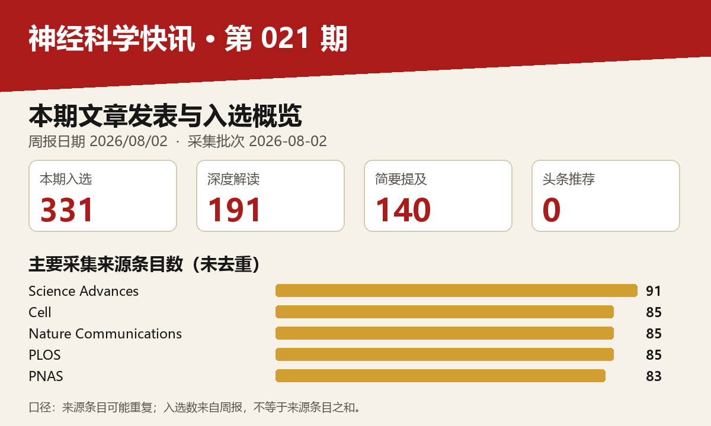

# 神经科学快讯·第021期（2026/08/02）｜1/3

图示口径：采集来源条目未去重；入选文章数以本期周报分类为准。

## 📊 本周概览

- **头条推荐**: 0 篇
- **深度解读**: 191 篇  
- **简要提及**: 140 篇
- **跨界启发**: 0 篇
- **已过滤**: 321 篇

---

### 🌍 国家/地区分布 TOP 10

| 排名 | 国家 | 文章数量 |
|------|------|----------|
| 1 | United States | 675 |
| 2 | China | 323 |
| 3 | United Kingdom | 166 |
| 4 | Germany | 120 |
| 5 | Canada | 71 |
| 6 | Switzerland | 68 |
| 7 | France | 51 |
| 8 | Japan | 42 |
| 9 | Australia | 40 |
| 10 | Korea | 37 |

**总计**: 1593 篇文章

### 🏢 研究机构 TOP 10

| 排名 | 机构 | 文章数量 |
|------|------|----------|
| 1 | Chinese Academy of Sciences | 44 |
| 2 | Stanford University | 33 |
| 3 | University of Oxford | 28 |
| 4 | University of Pennsylvania | 27 |
| 5 | Fudan University | 27 |
| 6 | University of Cambridge | 24 |
| 7 | Tsinghua University | 22 |
| 8 | Howard Hughes Medical Institute | 21 |
| 9 | Peking University | 21 |
| 10 | University College London | 20 |

### 📊 评分分布

| 评分区间 | 文章数量 |
|----------|----------|
| 2-3 | 1 |
| 4-5 | 5 |
| 5-6 | 8 |
| 6-7 | 62 |
| 7-8 | 191 |
| 8-9 | 95 |

**总计**: 362 篇评分文章

## 📈 各领域文章分布

| 领域 | 深度解读 | 简要提及 | 总计 |
|------|----------|----------|------|
| 未知领域 | 0 | 94 | 94 |
| 系统与环路神经科学 | 43 | 9 | 52 |
| 认知神经科学 | 29 | 14 | 43 |
| 分子与细胞神经科学 | 30 | 6 | 36 |
| 临床与转化神经科学 | 25 | 7 | 32 |
| 感觉与运动神经科学 | 19 | 5 | 24 |
| 计算与理论神经科学 | 15 | 3 | 18 |
| 方法学 | 16 | 1 | 17 |
| 发育神经科学 | 13 | 0 | 13 |
| 社会与情感神经科学 | 1 | 1 | 2 |

**合计**: 深度解读 191 篇，简要提及 140 篇，共 331 篇

---

## 📚 精选文献（按领域分类）

### 临床与转化神经科学

### Revisiting multifocal motor neuropathy: mechanisms, diagnosis and future directions.

**中文标题**: 重新审视多灶性运动神经病：机制、诊断与未来方向

**作者**: Dubuisson NJ, Rajabally YA, Philips C et al.

**期刊**: Brain | **发表日期**: 29 Jul 2026

**研究领域**: 临床与转化神经科学 / ['临床与转化神经科学', '分子与细胞神经科学']

**关键词**: 多灶性运动神经病, 免疫机制, 神经电生理, 神经超声, 人类, 治疗策略

**推荐等级**: 深度解读

**评分**: 8.6/10  

**亮点**: 多灶性运动神经病机制与诊疗的系统性更新，为未来研究方向提供整合框架

**核心优势**: 全面覆盖疾病机制、诊断标准和治疗进展，整合最新研究并提出未来方向，尤其聚焦于病理生理机制与临床管理的衔接

**研究局限**: 作为综述，缺乏原创实验数据；批判性整合和范式创新可能不够突出

**目标读者**: 神经病学临床医生、神经免疫学研究者、电生理诊断领域专家

**推荐理由**: 该综述全面更新了多灶性运动神经病（MMN）的免疫病理学模型，强调抗GM1抗体、节点病变与神经传导阻滞的关联，并讨论高分辨率超声和磁共振成像在早期诊断中的价值。对于临床与转化神经科学读者，这是一份将复杂免疫机制与诊断工具整合的权威参考，有助于设计针对性的机制研究和治疗策略。

### Sex-specific APOE4-dependent innate immunity regulates meningeal lymphatics, brain lipids, neuroinflammation, and cognition

**中文标题**: 性别特异性APOE4依赖性先天免疫调控脑膜淋巴、脑脂质、神经炎症和认知

**作者**: Nickoleta Delivanoglou, Kennedi T. Todd, Francisco Almeida et al.

**单位**: Department Of Neuroscience, Mayo Clinic, Jacksonville, Fl 32224, Usa; Life And Health Sciences Research Institute (Icvs), School Of Medicine, University Of Minho, Campus Gualtar, 4710-057 Braga, Portugal; Icvs/3B'S-Pt Government Associate Laboratory, Braga/Guimarães, Portugal 等

**期刊**: Neuron + Europe PMC | **发表日期**: 02 Aug 2026

**研究地区**: United States, France

**研究领域**: 临床与转化神经科学 / ['临床与转化神经科学', '分子与细胞神经科学']

**关键词**: APOE4, 性别差异, 脑膜淋巴, 神经炎症, 脂质组学, 小鼠

**推荐等级**: 深度解读

**评分**: 8.6/10  

**亮点**: 揭示APOE4性别二态性通过先天免疫-脑膜淋巴-脑脂质轴调节认知的新机制

**核心优势**: 综合人源化小鼠模型、CSF1R抑制干预和人类脑组织验证，从多层面建立性别特异性免疫-淋巴-脂质-认知因果链条，为AD个体化治疗提供关键靶点。

**研究局限**: 机制深度仍有限，未完全阐明APOE4性别差异的上游驱动因子，且临床样本验证较初步，因果关系在人类中尚需直接证据。

**目标读者**: 神经退行性疾病研究者、神经免疫学、脂质代谢与神经炎症领域科学家、转化医学研究人员

**推荐理由**: 该研究揭示了APOE4在雌雄小鼠中差异性地调节脑膜淋巴功能、脑脂质组成和神经炎症，并通过CSF1R抑制部分逆转相关表型，为理解APOE4性别依赖性AD风险提供了关键机制证据。研究整合免疫、脂质代谢与认知行为，对阿尔茨海默病的性别特异治疗策略具有直接转化意义。

### From trade-offs to translation: An interdisciplinary roadmap for neurotechnology

**中文标题**: 从权衡到转化：神经技术的跨学科路线图

**作者**: Ruben Ruiz-Mateos Serrano, Joe G. Troughton, Nima Mirkhani et al.

**期刊**: Science Advances | **发表日期**: 31 Jul 2026

**研究领域**: 临床与转化神经科学 / ['临床与转化神经科学', '方法学']

**关键词**: 神经技术, 脑机接口, 神经调控, 转化研究, 跨学科, 临床

**推荐等级**: 深度解读

**评分**: 8.5/10  

**亮点**: 整合神经科学、工程与伦理，绘制神经技术从基础权衡到临床转化的跨学科路线图。

**核心优势**: 系统梳理神经技术的关键权衡，提出可操作的转化框架，并融合多学科视角。

**研究局限**: 缺乏具体实验数据，部分建议可能需要更充分的实证支持；未来技术的快速演进可能使部分路线图假设过时。

**目标读者**: 神经科学家、神经工程学、临床神经病学、脑机接口和神经伦理研究者

**推荐理由**: 这篇论文系统梳理了神经技术从基础研究到临床转化的关键权衡与突破路径，涵盖脑机接口、神经调控等前沿方向。它不仅为转化应用提供了多学科整合的路线图，也为神经科学家理解实验室成果向临床落地的瓶颈和机遇提供了清晰的框架，是连接基础研究与医学实践的重要参考。

### Adaptive intrathecal nanorobotics in mice and nonhuman primates for navigated CNS therapy

**中文标题**: 小鼠和非人灵长类动物中用于中枢神经系统导航治疗的适应性鞘内纳米机器人

**作者**: Yumeng Lu, Xinjian Fan, Chengjuan Fan et al.

**期刊**: Science Advances | **发表日期**: 31 Jul 2026

**研究领域**: 临床与转化神经科学 / ['临床与转化神经科学', '方法学']

**关键词**: 纳米机器人, 小鼠, 非人灵长类, 鞘内注射, CNS靶向, 导航递送

**推荐等级**: 深度解读

**评分**: 8.4/10  

**亮点**: 自适应鞘内纳米机器人平台实现中枢神经系统的精准导航治疗，并在小鼠和非人灵长类中完成跨物种验证。

**核心优势**: 将自适应导航与鞘内给药相结合，在体内实现可控的CNS靶向治疗，且跨物种验证增强了临床转化潜力。

**研究局限**: 长期生物相容性、免疫原性及人体安全性数据缺失，且“自适应”机制的具体工程实现和可扩展性有待深入说明。

**目标读者**: 纳米医学、神经工程、神经药理学和转化医学研究者

**推荐理由**: 该研究展示了适应性鞘内纳米机器人在小鼠和非人灵长类中的精准导航CNS药物递送能力，为神经系统疾病治疗提供了极具转化潜力的新技术。其通过实时导航和适应性调控，可显著提高药物靶向效率并降低全身毒性，在神经科学研究和临床应用中均具有重要价值。

### cGAS-mediated type I IFN signaling contributes to disease progression in drug-refractory epilepsy

**中文标题**: cGAS介导的I型干扰素信号促进药物难治性癫痫的疾病进展

**作者**: Yige Huang, Li Fan, Li Gan

**期刊**: Nature Neuroscience | **发表日期**: 29 Jul 2026

**研究领域**: 临床与转化神经科学 / ['临床与转化神经科学', '分子与细胞神经科学']

**关键词**: 小胶质细胞, cGAS通路, I型干扰素, 难治性癫痫, 小鼠模型, 人类样本

**推荐等级**: 深度解读

**评分**: 8.3/10  

**亮点**: 揭示cGAS介导的神经免疫信号是难治性癫痫进展的关键驱动因素，并提出新治疗靶点

**核心优势**: 人类组织与小鼠Dravet模型相结合，多维度验证了cGAS-STING通路在疾病中的作用，并通过遗传和药理学干预证实其治疗潜力。

**研究局限**: 主要基于Dravet综合征这一特定遗传性癫痫模型，对其他药物难治性癫痫的普适性及长期干预安全性仍需进一步研究。

**目标读者**: 癫痫研究者、神经免疫学专家、神经药理学和转化医学学者

**推荐理由**: 该研究将固有免疫感知与癫痫耐药机制连接，发现cGAS-STING通路在难治性癫痫患者脑组织小胶质细胞中异常激活，并通过Dravet综合征小鼠模型验证其在疾病进展中的驱动作用。研究不仅揭示了I型干扰素信号作为潜在治疗靶点，也为耐药性癫痫的免疫病理机制提供了直接证据，对临床转化具有重要价值。

### B cell CD19 is transferred between immune cells in mice and humans

**中文标题**: 小鼠和人类免疫细胞间B细胞CD19的转移

**作者**: Jasmin Ochs, Pia Schweineberg, Martin S. Weber

**单位**: Fraunhofer Institute For Translational Medicine And Pharmacology, Göttingen, Germany; Department Of Neurology, University Medical Center, Göttingen, Germany

**期刊**: Nature Communications + Europe PMC | **发表日期**: 29 Jul 2026

**研究地区**: Germany

**研究领域**: 临床与转化神经科学 / ['临床与转化神经科学', '分子与细胞神经科学']

**关键词**: CD19, B-T细胞互作, EAE模型, 膜转移, 小鼠, 人类

**推荐等级**: 深度解读

**评分**: 8.3/10  

**亮点**: 揭示CD19通过trogocytosis跨细胞转移，重新定义免疫谱系标志物的特异性，对靶向治疗提出警示。

**核心优势**: 利用小鼠、人类样本及功能实验多层面证据，首次证明CD19（含功能IgM）可被T细胞和髓系细胞获得并赋予B细胞功能，挑战CD19作为B细胞特异性标志物的传统观念。

**研究局限**: 对CD19转移的分子机制和体内生理意义研究尚浅；对inebilizumab治疗后CD19+ T细胞变化的临床关联性仍需更多转化验证。

**目标读者**: 免疫学家、神经免疫学研究者、抗体药物开发者及细胞间通讯领域学者

**推荐理由**: 本研究揭示CD19分子可在B-T细胞相互作用中通过trogocytosis转移至T细胞，打破其作为B细胞专属标志的传统认知。在实验性自身免疫性脑脊髓炎模型中，CD19+ T细胞扩增且具有更强的致脑炎潜能，表明该转移过程可能参与自身免疫性神经炎症的调控。这一发现不仅深化了对免疫细胞间通讯的理解，也为靶向CD19的癌症免疫疗法和神经炎症干预提供了潜在风险与机遇。对神经科学读者而言，该工作提示免疫突触的分子交换可能成为治疗炎性脱髓鞘疾病的新靶点。

### Cerebrospinal fluid biomarkers reveal transdiagnostic synaptic dysfunction across major psychiatric disorders

**中文标题**: 脑脊液生物标志物揭示主要精神疾病跨诊断的突触功能障碍

**作者**: Andreas Göteson, Johanna Nilsson, Mikael Landén

**单位**: Goteson@Gu; Department Of Psychiatry And Neurochemistry, Institute Of Neuroscience And Physiology, Sahlgrenska Academy, University Of Gothenburg, Gothenburg, Sweden; Andreas

**期刊**: Nature Communications + Europe PMC | **发表日期**: 30 Jul 2026

**研究地区**: Sweden

**研究领域**: 临床与转化神经科学 / ['临床与转化神经科学', '分子与细胞神经科学']

**关键词**: 质谱, 脑脊液, 突触蛋白, 跨诊断, 精神分裂症, 生物标志物

**推荐等级**: 深度解读

**评分**: 8.3/10  

**亮点**: 脑脊液突触蛋白标志物跨精神疾病揭示共享突触功能障碍，并与遗传评分结合提升诊断效能。

**核心优势**: 跨诊断发现共享的突触生物标志物（LAMP1/NPTX2）并在独立首发精神病队列中验证，结合多基因评分提升分类精度。

**研究局限**: 横断面设计无法评估因果或纵向变化，样本组间规模可能不均，标志物特异性及其与神经影像等模态的关联尚需进一步验证。

**目标读者**: 精神病学临床研究者、精神疾病生物标志物与蛋白质组学专家、突触生物学研究者、计算精神病学及精准医学从业者。

**推荐理由**: 这项研究通过靶向质谱在脑脊液中定量检测低丰度突触蛋白，首次在多种精神疾病中揭示了跨诊断的突触功能障碍，显示精神分裂症谱系障碍突触蛋白显著降低，双相情感障碍和ADHD呈中间水平。该发现不仅为精神疾病的病理机制提供了分子层面的证据，也推动了突触功能的无创液体活检发展，具有重要的临床转化价值。

### TPPP/p25 amyloid seeding activity as a specific biomarker for multiple system atrophy

**中文标题**: TPPP/p25淀粉样播种活性作为多系统萎缩的特异性生物标志物

**作者**: Shuyi Zeng, Shenqing Zhang, Shengnan Zhang et al.

**单位**: Zhangjiang Institute For Advanced Study, Shanghai Jiao Tong University, Shanghai 200240, China; Interdisciplinary Research Center On Biology And Chemistry, State Key Laboratory Of Chemical Biology, Shanghai Institute Of Organic Chemistry, Chinese Academy Of Sciences, Shanghai 201203, China; Bio-X Institutes, Key Laboratory For The Genetics Of Developmental And Neuropsychiatric Disorders (Ministry Of Education), Shanghai Jiao Tong University, Shanghai 200030, China 等

**期刊**: Cell + Europe PMC | **发表日期**: 02 Aug 2026

**资深研究者**: Jian Wang (h指数=46); Dan Li (h指数=104)

**研究地区**: China

**研究领域**: 临床与转化神经科学 / ['临床与转化神经科学', '分子与细胞神经科学']

**关键词**: CSF生物标志物, 多系统萎缩, α-突触核蛋白, 淀粉样聚集, 冷冻电镜, TPPP/p25

**推荐等级**: 深度解读

**评分**: 8.3/10  

**亮点**: 发现TPPP/p25淀粉样种子作为MSA特异性生物标志物，突破α-syn缺乏特异性的瓶颈

**核心优势**: 结合结构生物学与临床样本验证，开发出可区分MSA与PD等疾病的CSF种子扩增检测法。

**研究局限**: 摘要未提供详细的队列统计和诊断敏感性/特异性数据，临床转化验证程度仍待评估。

**目标读者**: 神经退行性疾病研究者、生物标志物开发专家、临床神经科医生及结构生物学家。

**推荐理由**: 该研究揭示TPPP/p25在脑脊液中作为多系统萎缩（MSA）特异性诊断标志物的潜力，突破α-突触核蛋白（α-syn）在突触核蛋白病鉴别诊断中的局限。结合冷冻电镜解析疾病相关突变触发TPPP/p25聚集的结构机制，为MSA的分子病理学提供新见解，并推动了基于淀粉样播种活性的精准诊断策略。

### In vivo CRISPR base editing for treatment of Huntington’s disease

**中文标题**: 用于治疗亨廷顿舞蹈症的体内CRISPR碱基编辑

**作者**: Shraddha Shirguppe, Michael Gapinske, Pablo Perez-Pinera

**期刊**: Nature BME | **发表日期**: 29 Jul 2026

**研究领域**: 临床与转化神经科学 / ['临床与转化神经科学', '分子与细胞神经科学']

**关键词**: CRISPR碱基编辑, 亨廷顿病, 基因治疗, HTT蛋白, 剪接调控, 纹状体

**推荐等级**: 深度解读

**评分**: 8.3/10  

**亮点**: 通过碱基编辑调控剪接位点产生抗蛋白水解HTT异构体，在HD动物模型中改善病理和行为表型。

**核心优势**: 创新的治疗策略，通过破坏剪接受体实现抗蛋白水解，并在体内多维度验证疗效。

**研究局限**: 仅在一个啮齿动物模型验证，长期安全性和有效性仍需更多研究；可能无法完全抑制突变蛋白其他毒性机制。

**目标读者**: 神经病学、基因治疗、CRISPR碱基编辑、亨廷顿病研究者

**推荐理由**: 这项工作利用CRISPR碱基编辑技术，在体内破坏亨廷顿病（HD）相关基因HTT的外显子13剪接受体，产生抗蛋白水解的HTT异构体，从而阻断毒性N端片段的生成。研究为HD提供了新的治疗思路，将基因编辑策略从简单地敲除或修复扩展到精确调控剪接，具有显著的临床转化潜力。对于关注基因治疗、蛋白毒性以及神经退行性疾病的读者，这一工作展示了体内碱基编辑的实际应用价值。

### Alzheimer disease in the computational era: from a deterministic disease to a multifaceted disorder.

**中文标题**: 计算时代的阿尔茨海默病：从确定性病变到多面性紊乱

**作者**: Benbaji M, Raveh B, Bassal L et al.

**期刊**: Brain | **发表日期**: 30 Jul 2026

**研究领域**: 临床与转化神经科学 / ['临床与转化神经科学', '计算与理论神经科学']

**关键词**: 阿尔茨海默病, 计算建模, 多模态数据, 机器学习, 生物标志物, 临床转化

**推荐等级**: 深度解读

**评分**: 8.2/10  

**亮点**: 从确定性范式转向多维度计算视角，重新定义阿尔茨海默病的复杂性

**核心优势**: 提出将计算模型与多维度临床数据整合的全新框架，激励跨学科融合。

**研究局限**: 缺乏具体方法学细节，部分断言缺乏实证支撑，观点导向性强。

**目标读者**: 神经科学家、计算生物学家、临床研究者

**推荐理由**: 本文从计算科学视角重新审视阿尔茨海默病，挑战传统的单病因决定论，强调其多因素、异质性的本质。系统整合多组学、影像与临床数据，借助计算建模和机器学习，为疾病的精准分型与个体化治疗提供了全新框架。对神经退行性疾病研究者及计算神经科学家均具有重要参考价值。

### Artificial intelligence in deep brain stimulation for movement disorders: a systematic review and technology readiness assessment

**中文标题**: 人工智能在脑深部电刺激治疗运动障碍中的应用：系统综述与技术就绪度评估

**作者**: Zohra Souei, Muhammad Mushhood Ur Rehman, Harith Akram et al.

**期刊**: arXiv | **发表日期**: 29 Jul 2026

**研究领域**: 临床与转化神经科学 / ['临床与转化神经科学', '方法学']

**关键词**: 人工智能, 脑深部刺激, 运动障碍, 系统评价, 帕金森病, 丘脑底核

**推荐等级**: 深度解读

**评分**: 8.2/10  

**亮点**: 通过系统综述和技术准备度评估，揭示AI在脑深部刺激临床转化中的主要瓶颈在于验证不足而非算法缺陷。

**核心优势**: 基于239项研究的技术准备度评估，明确指出外部验证和前瞻性研究缺乏是限制AI在DBS应用的关键因素。

**研究局限**: 综述依赖现有文献，而文献本身多为回顾性、单中心和小样本，可能影响结论普适性；且摘要未披露检索细节。

**目标读者**: 神经调控、AI医疗、转化医学研究人员及临床神经科医生

**推荐理由**: 该研究系统梳理了2000-2025年间239项关于AI在脑深部刺激（DBS）中应用的研究，聚焦运动障碍领域，尤其以帕金森病和丘脑底核为主。它不仅全景式呈现了AI在靶点定位、参数优化、预测评估等环节的进展，还从验证充分性和技术就绪度角度剖析了临床转化瓶颈。对于从事DBS临床研究或神经调控技术开发的读者，这是一份兼具广度和深度的参考，有助于理解AI在精准神经外科中的现实边界与未来方向。

### Large-scale CSF and plasma proteomics reveal immune, synaptic, and extracellular matrix disruptions across neurodegenerative diseases

**中文标题**: 大规模CSF和血浆蛋白质组学揭示神经退行性疾病中免疫、突触和细胞外基质破坏

**作者**: Muhammad Ali, Jigyasha Timsina, Ying Xu et al.

**单位**: Department Of Psychiatry, Washington University, St; Department Of Neurology, Washington University, St; Louis, Mo 63110, Usa 等

**期刊**: Neuron + Europe PMC | **发表日期**: 02 Aug 2026

**资深研究者**: Jigyasha Timsina (h指数=20); Menghan Liu (h指数=13)

**研究地区**: United States, Spain

**研究领域**: 临床与转化神经科学 / ['临床与转化神经科学', '方法学']

**关键词**: 蛋白质组学, 人类, 脑脊液, 血浆, 神经退行, 质谱

**推荐等级**: 深度解读

**评分**: 8.2/10  

**亮点**: 大规模跨疾病CSF/血浆蛋白质组揭示神经退行性疾病的共享与特异分子机制

**核心优势**: 多疾病、双组织蛋白质组学整合，识别高准确度生物标志物

**研究局限**: 缺乏独立验证队列和功能实验验证；蛋白组学技术可能受限于检测深度

**目标读者**: 神经退行性疾病研究者、蛋白质组学、生物标志物发现、计算生物学

**推荐理由**: 本研究通过对阿尔茨海默病、帕金森病、路易体痴呆和额颞叶痴呆的大规模脑脊液与血浆蛋白质组学分析，系统揭示了免疫、突触和细胞外基质通路的共享失调及疾病特异性分子特征。该工作为理解神经退行性疾病的共同机制、鉴别诊断和跨疾病生物标志物开发提供了重要资源，也为临床蛋白质组学在神经科学中的应用树立了新范式。

### Rewiring the paralyzed body's false alarm.

**中文标题**: 重新连接瘫痪身体的虚假警报

**作者**: Soriano JE

**期刊**: Science + Europe PMC | **发表日期**: 30 Jul 2026

**研究领域**: 临床与转化神经科学 / ['临床与转化神经科学', '系统与环路神经科学']

**关键词**: 硬膜外电刺激, 自主神经反射异常, 脊髓损伤, 神经调控, 人类, 血压调控

**推荐等级**: 深度解读

**评分**: 8.0/10  

**亮点**: 评论硬膜外电刺激逆转自主神经反射异常的转化前景，突出神经调控在脊髓损伤中的新应用。

**核心优势**: 聚焦于自主神经功能障碍这一常被忽视但临床重要的领域，及时介绍硬膜外电刺激的潜在机制和临床意义。

**研究局限**: 作为观点类文章，缺乏原始实验数据，深入机制讨论可能受限于篇幅。

**目标读者**: 神经调控、脊髓损伤康复、自主神经生理学及临床神经病学研究者

**推荐理由**: 该研究针对脊髓损伤后危及生命的自主神经反射异常，采用硬膜外电刺激实现功能逆转，为受损神经环路的功能重塑提供了直接的临床证据。研究不仅展示了神经调控在恢复自主神经稳态中的潜力，也为理解脊髓损伤后回路可塑性及血压调控机制提供了重要线索，是临床转化与环路机制结合的高价值工作。

### Low-burden AI approach for cross-national early identification of cognitive impairment using real-world questionnaire response behaviours

**中文标题**: 基于真实世界问卷回答行为的跨国家认知障碍早期识别的低负担AI方法

**作者**: Hongxin Gao, Stefan Schneider, Haomiao Jin

**期刊**: Nature Communications | **发表日期**: 28 Jul 2026

**研究领域**: 临床与转化神经科学 / ['临床与转化神经科学', '方法学']

**关键词**: 机器学习, 数字表型, 认知障碍, 早期筛查, 行为分析, 跨文化

**推荐等级**: 深度解读

**评分**: 7.8/10  

**亮点**: 利用真实世界问卷应答行为作为数字生物标志物，实现低成本、跨文化的认知障碍早期筛查

**核心优势**: 将日常问卷行为与AI结合，在真实世界跨国家数据中验证，降低了认知筛查门槛，具有转化潜力。

**研究局限**: 仅凭问卷行为数据可能忽略认知障碍的复杂神经病理基础，且跨文化差异与自我报告偏差可能影响模型泛化。

**目标读者**: 认知神经科学、老年医学、AI医学与公共卫生研究者

**推荐理由**: 该研究针对传统认知筛查依赖专业人员和高成本的问题，提出基于真实世界问卷响应行为的低负担AI筛查方法。通过分析答题模式等行为指标，结合跨国家数据验证其早期识别认知障碍的效能，为社区和基层医疗提供可扩展的高通量筛查工具。其核心价值在于利用数字表型将临床评估从实验室扩展到真实环境，可能显著提高认知障碍的早期检出率，并为阿尔茨海默病等疾病的早期干预和临床试验富集提供新思路。

### Multilevel impairment of mitochondrial respiration in inclusion body myositis.

**中文标题**: 包涵体肌炎中线粒体呼吸的多水平损伤

**作者**: Shammas I, Iaali H, Watzlawik JO et al.

**期刊**: Brain | **发表日期**: 02 Aug 2026

**研究领域**: 临床与转化神经科学 / ['临床与转化神经科学', '分子与细胞神经科学']

**关键词**: 肌肉活检, 线粒体呼吸, 包涵体肌炎, 组织化学, 生化分析

**推荐等级**: 深度解读

**评分**: 7.7/10  

**亮点**: 从分子、细胞到组织水平系统揭示包涵体肌炎线粒体呼吸链的多层损伤模式

**核心优势**: 多维度（基因、蛋白、功能）整合分析线粒体呼吸障碍，提供了疾病机制的全面图景

**研究局限**: 未提供详细摘要，评估基于标题和期刊声誉，具体样本量和功能验证细节未知

**目标读者**: 神经肌肉疾病研究者、线粒体生物学和肌病病理学专家

**推荐理由**: 这项研究系统揭示了包涵体肌炎患者肌肉中线粒体呼吸链的多水平损伤，从复合体活性到组织学表现均呈现显著异常。通过整合呼吸测定与组织化学方法，研究不仅细化了线粒体功能障碍在疾病病理中的核心角色，还为针对线粒体代谢的干预策略提供了重要依据。对神经肌肉疾病及线粒体医学研究者具有重要参考价值。

### Perioperative myeloid cell remodeling shapes CAR-T cell efficacy in glioblastoma

**中文标题**: 围手术期髓系细胞重塑塑造CAR-T细胞在胶质母细胞瘤中的疗效

**作者**: Martin Pedard, Luis Castillo Cantero, Denis Migliorini

**期刊**: Nature Communications | **发表日期**: 31 Jul 2026

**研究领域**: 临床与转化神经科学 / ['临床与转化神经科学', '分子与细胞神经科学']

**关键词**: 胶质母细胞瘤, 髓系细胞, CAR-T, 免疫治疗, 肿瘤微环境, 围手术期

**推荐等级**: 深度解读

**评分**: 7.7/10  

**亮点**: 揭示围手术期髓系细胞动态重塑对CAR-T疗法疗效的决定性影响，为优化胶质母细胞瘤免疫治疗提供新策略。

**核心优势**: 聚焦临床上尚未被充分重视的围手术期免疫微环境变化，连接手术应激与CAR-T疗效，具有转化意义。

**研究局限**: 缺少具体数据和实验细节，无法评估证据强度；可能样本量有限或机制深度不足。

**目标读者**: 肿瘤免疫学、神经肿瘤学、CAR-T细胞治疗和髓系细胞生物学研究者

**推荐理由**: 本研究聚焦围手术期髓系细胞重塑对CAR-T细胞治疗胶质母细胞瘤疗效的关键影响，揭示了肿瘤免疫微环境的动态变化如何调控CAR-T细胞的浸润与杀伤功能。这一发现为优化CAR-T治疗的时机与联合策略提供了重要理论依据，对推进难治性神经肿瘤的免疫治疗具有直接的临床转化意义。

### Movement dependent neural substates within levodopa-induced dyskinesia in Parkinson's disease.

**中文标题**: 帕金森病左旋多巴诱导异动症中运动依赖的神经亚状态

**作者**: Habets JGV, Merk T, Mathiopoulou V et al.

**期刊**: Brain | **发表日期**: 31 Jul 2026

**研究领域**: 临床与转化神经科学 / ['临床与转化神经科学', '系统与环路神经科学']

**关键词**: 神经解码, 运动信号, 基底节, 多巴胺, 异动症, 帕金森病

**推荐等级**: 深度解读

**评分**: 7.6/10  

**亮点**: 揭示帕金森病左旋多巴诱导异动症中运动依赖的神经亚状态动态特征

**核心优势**: 利用DBS感知技术捕捉运动依赖的神经亚状态，为理解异动症的神经回路机制提供直接的临床神经生理证据。

**研究局限**: 基于特定DBS患者队列的记录，样本量和电极位置可能限制结论的普适性，且缺乏更细粒度的行为与神经信号耦合分析。

**目标读者**: 运动障碍领域神经科医生、DBS研究者、计算神经科学家以及研究基底节环路功能的学者

**推荐理由**: 该研究聚焦左旋多巴诱导异动症中的运动依赖性神经亚状态，通过解析与运动参数相关的神经动态变化，揭示了异动症发生过程中基底节环路异常活动的时空特征。这一发现不仅深化了对帕金森病运动并发症机制的理解，也为开发针对特定神经亚状态的闭环干预策略提供了关键靶点，具有重要的临床转化价值。

### Low-intensity pulsed ultrasound-mediated nose-to-brain co-delivery of β-blockers and aPD-L1 enhances glioblastoma immunotherapy

**中文标题**: 低强度脉冲超声介导的β受体阻滞剂与aPD-L1经鼻-脑共递送增强胶质母细胞瘤免疫治疗

**作者**: Lei Dong, Zhengcheng Yun, Jinbing Xie

**期刊**: Nature Communications | **发表日期**: 30 Jul 2026

**研究领域**: 临床与转化神经科学 / ['临床与转化神经科学', '方法学']

**关键词**: 超声递送, 鼻脑通路, 胶质母细胞瘤, 免疫治疗, 小鼠模型, β受体阻滞剂

**推荐等级**: 深度解读

**评分**: 7.6/10  

**亮点**: 鼻脑共递送策略与超声辅助结合，为胶质母细胞瘤免疫治疗提供新途径

**核心优势**: 创新性地利用低强度脉冲超声介导鼻脑通路，同时递送β受体阻滞剂和aPD-L1，有望增强免疫治疗效果

**研究局限**: 缺乏具体实验证据支持，且该策略的临床转化可行性仍需验证

**目标读者**: 神经肿瘤学、免疫治疗、药物递送及超声医学研究者

**推荐理由**: 该研究提出低强度脉冲超声介导的鼻到脑药物递送策略，将β受体阻滞剂与aPD-L1协同递送至胶质母细胞瘤微环境，显著增强免疫治疗效果。该策略巧妙利用超声开放血脑屏障并激活肿瘤免疫应答，为脑肿瘤联合免疫治疗提供了新范式。不仅展示了物理手段与免疫疗法结合的可能性，也为临床转化提供了扎实的临床前证据。

### The genetics of fibromyalgia and its relationships to psychiatric and medical traits

**中文标题**: 纤维肌痛的遗传学及其与精神与医学特征的关系

**作者**: Uri Bright, Sarah Beck, Joel Gelernter

**单位**: Department Of Psychiatry, Yale School Of Medicine, New Haven, Ct, Usa; Gelernter@Yale

**期刊**: Nature Communications + Europe PMC | **发表日期**: 28 Jul 2026

**研究地区**: United States

**研究领域**: 临床与转化神经科学 / ['临床与转化神经科学', '方法学']

**关键词**: GWAS, 人类, 多祖先群体, 纤维肌痛, 疼痛遗传, 多性状分析

**推荐等级**: 深度解读

**评分**: 7.6/10  

**亮点**: 大规模多祖先GWAS揭示纤维肌痛的遗传基础及其与精神疾病的共享遗传机制

**核心优势**: 结合多个祖先队列和多种遗传分析方法，全面揭示了纤维肌痛的遗传位点及其与慢性疼痛、PTSD和抑郁症的强烈遗传相关性。

**研究局限**: 缺乏功能验证，难以从遗传关联直接推断因果机制；不同祖先样本量不均等可能影响发现。

**目标读者**: 复杂疾病遗传学、疼痛研究、精神遗传学和计算生物学研究者

**推荐理由**: 这项研究通过对大规模多祖先人群的GWAS和MTAG分析，鉴定了10个与纤维肌痛相关的基因组位点，并揭示了其与疼痛、精神及多种医学性状的共享遗传结构。研究不仅增进了对纤维肌痛这种慢性疼痛综合征遗传机制的理解，也为神经科学中疼痛与精神共病的生物学基础提供了重要线索，对慢性疼痛的精准分型和治疗靶点发现具有转化价值。

### A wearable patch for continuous levodopa monitoring in sweat: Towards exertion and power-free pharmacodynamic assessment in Parkinson's disease.

**中文标题**: 可穿戴贴片用于连续监测汗液中的左旋多巴：迈向无劳累、无电源的帕金森病药效动力学评估

**作者**: Saha T, Khan MI, Longardner K et al.

**期刊**: PNAS | **发表日期**: 27 Jul 2026

**研究领域**: 临床与转化神经科学 / ['临床与转化神经科学', '方法学']

**关键词**: 可穿戴设备, 汗液监测, 左旋多巴, 帕金森病, 生物传感, 药物监测

**推荐等级**: 深度解读

**评分**: 7.4/10  

**亮点**: 无创汗液连续监测左旋多巴，有望实现帕金森病用药的实时药效评估。

**核心优势**: 开发了可穿戴汗液传感器，实现无创、连续、无电源依赖的左旋多巴监测，为个性化药物管理提供了新思路。

**研究局限**: 目前缺乏大规模临床验证，汗液与血浆药物浓度的定量关系、传感器长期稳定性及个体差异仍需深入研究。

**目标读者**: 帕金森病临床医生、可穿戴传感器研究者、药物代谢动力学与精准医学领域科学家

**推荐理由**: 本研究报道了一种新型可穿戴贴片，能够通过汗液实时监测帕金森病患者体内的左旋多巴浓度，无需运动和额外供能。该技术为药物动力学评估提供了无创连续的解决方案，有望推动个体化治疗和临床试验设计。对于关注疾病监测和转化应用的神经科学研究者，这一成果具有重要的临床价值和实践意义。

### Parvalbumin interneuron activation rescues both seizures and impaired social novelty in digenic absence epilepsy mice

**中文标题**: 小清蛋白中间神经元激活挽救双基因失神癫痫小鼠的癫痫发作和社交新颖性损伤

**作者**: Qing-Long Miao, James Okoh, Ahmet S. Asan et al.

**期刊**: Science Advances | **发表日期**: 31 Jul 2026

**研究领域**: 临床与转化神经科学 / ['临床与转化神经科学', '系统与环路神经科学']

**关键词**: 光遗传学, 小鼠, 小清蛋白中间神经元, 癫痫, 社交新奇, 行为学

**推荐等级**: 深度解读

**评分**: 7.4/10  

**亮点**: 激活PV中间神经元同时缓解失神癫痫发作与社交新奇缺陷，揭示两者共享的神经回路机制

**核心优势**: 首次在双基因失神癫痫模型中证明PV中间神经元激活同时挽救癫痫发作和社交新奇缺陷，提示共同病理机制。

**研究局限**: 基于特定双基因小鼠模型，且缺乏全文信息，难以评估实验细节和人类转化潜力。

**目标读者**: 癫痫与社交行为相关的神经科学家、中间神经元功能研究者、计算生物学家

**推荐理由**: 该研究在双基因缺失型失神癫痫小鼠模型中，通过光遗传学激活小清蛋白（PV）中间神经元，不仅显著抑制了癫痫发作，还修复了受损的社交新奇偏好。这一发现揭示了PV中间神经元在癫痫共病社交障碍中的关键桥梁作用，为临床转化提供了新的干预靶点，同时也为理解神经环路兴奋/抑制失衡如何导致跨域行为缺陷提供了重要证据。

### A holistic perspective on noninvasive brain–computer interfaces

**中文标题**: 非侵入性脑机接口的整体视角

**作者**: Yidan Ding, Joshua Kosnoff, Bin He

**期刊**: Trends in Neurosciences | **发表日期**: 02 Aug 2026

**研究领域**: 临床与转化神经科学 / ['临床与转化神经科学', '方法学']

**关键词**: 非侵入式, 脑机接口, 信号处理, 脑电, 康复应用, 多模态

**推荐等级**: 深度解读

**评分**: 7.4/10  

**亮点**: 从神经调控、深度学习和机器人整合三大前沿方向对非侵入式BCI进行整体性回顾，提出模块化框架。

**核心优势**: 整合了信号获取、处理与输出的模块化视角，并系统梳理了近年来在神经调控增强、深度神经网络分析和机器人应用方面的进展，作者为领域内权威。

**研究局限**: 基于摘要，对各方向的批判性评述有限，且未深入讨论技术挑战和伦理问题，指导性建议较为泛化。

**目标读者**: 脑机接口、神经工程、计算神经科学及神经康复领域的研究者和临床转化人员。

**推荐理由**: 本文从整体视角系统梳理了非侵入式脑-机接口的信号获取、解码与反馈模块，重点阐述了近年来在空间分辨率和信号质量方面的突破。对于神经科学家而言，它不仅提供了BCI技术迭代的最新图景，还揭示了如何通过计算方法和传感器进步将基础神经编码知识转化为临床可用的交互系统，是连接神经科学与应用技术的重要参考。

### Subthalamic spatio-spectral-connectivity of psychiatric symptoms in Parkinson's disease.

**中文标题**: 帕金森病精神症状的丘脑底核空间-频谱-连接性特征

**作者**: Wang L, Zhao Y, Huang P et al.

**期刊**: Brain | **发表日期**: 29 Jul 2026

**研究领域**: 临床与转化神经科学 / ['临床与转化神经科学', '方法学']

**关键词**: 人类, 帕金森病, 丘脑底核, 精神症状, 频谱分析, 功能连接

**推荐等级**: 深度解读

**评分**: 7.3/10  

**亮点**: 融合空间图谱、频谱特征与脑网络连接分析，揭示帕金森病丘脑底核精神症状的神经生理基础

**核心优势**: 首次将STN的空间、频谱与连接信息整合分析，为DBS神经调控精神症状提供了多模态证据

**研究局限**: 样本量可能有限且源自手术期记录，跨场景泛化性及因果解释仍需进一步验证

**目标读者**: 功能性神经外科、运动障碍与精神神经科学、脑信号分析及计算神经科学研究者

**推荐理由**: 该研究聚焦帕金森病中常被忽视的精神症状，通过丘脑底核的时空频谱与连接性分析，揭示了与精神症状相关的神经振荡模式。工作为深部脑刺激靶向调控精神症状提供了潜在生物标志物，也推动了运动障碍疾病的精准神经精神学理解。推荐给临床神经科学和系统环路研究者。

### High risk of hypoxemic COVID-19 pneumonia in myasthenia gravis patients with type I IFN autoantibodies.

**中文标题**: 重症肌无力患者中I型干扰素自身抗体与低氧性COVID-19肺炎的高风险

**作者**: Gervais A, Marchal A, Maillard A et al.

**期刊**: PNAS | **发表日期**: 31 Jul 2026

**研究领域**: 临床与转化神经科学 / ['临床与转化神经科学']

**关键词**: 人类, 重症肌无力, I型干扰素抗体, COVID-19, 低氧性肺炎, 临床队列

**推荐等级**: 深度解读

**评分**: 7.2/10  

**亮点**: 揭示重症肌无力患者携带I型干扰素自身抗体与COVID-19肺炎低氧风险增高的临床关联

**核心优势**: 聚焦罕见人群（重症肌无力伴抗I型IFN自身抗体），为感染风险分层提供了潜在生物标志物。

**研究局限**: 基于摘要信息有限，机制解析不明确，且缺乏外部验证队列或功能实验支持。

**目标读者**: 神经免疫学、感染免疫学、临床神经科及重症医学研究者

**推荐理由**: 这项临床研究揭示了重症肌无力患者中I型干扰素自身抗体与COVID-19肺炎低氧血症高风险之间的显著关联。重症肌无力作为经典的神经肌肉接头疾病，其免疫病理机制与全身免疫功能障碍密切相关。该发现不仅为神经免疫疾病患者的感染风险管理提供了新的生物标志物，也为理解自身抗体如何调节抗病毒固有免疫反应提供重要线索，对神经免疫交叉领域的转化研究具有指导意义。

### Neurosurgery for treatment-resistant depression: valuation and decision making.

**中文标题**: 难治性抑郁症的神经外科手术：评估与决策

**作者**: Suveges SB, Gilbertson T, Steele JD

**期刊**: Brain | **发表日期**: 31 Jul 2026

**研究领域**: 临床与转化神经科学 / ['临床与转化神经科学', '社会与情感神经科学']

**关键词**: 神经外科, 难治性抑郁, 深部脑刺激, 临床决策, 患者偏好, 治疗评估

**推荐等级**: 深度解读

**评分**: 7.1/10  

**亮点**: 从决策与价值评估角度系统审视神经外科治疗难治性抑郁症的综合框架

**核心优势**: 将临床决策与价值评估结合，为TRD神经外科治疗提供整合性视域

**研究局限**: 缺乏具体临床数据支持，作为综述其推断依赖既有文献质量

**目标读者**: 精神外科、神经调控、医学伦理及抑郁障碍临床研究者

**推荐理由**: 该研究聚焦难治性抑郁症神经外科治疗中的价值评估与决策机制，系统梳理了疗效、风险与患者偏好的复杂权衡，为个体化手术适应症筛选和共享决策实践提供了直接参考。其对情感障碍神经调控治疗的决策科学视角，也为临床与转化神经科学提供了重要补充。

### Intracranial EEG synchrony tracks antiseizure medication load in drug-resistant epilepsy.

**中文标题**: 颅内脑电图同步性追踪耐药性癫痫中的抗癫痫药物负荷

**作者**: Ma D, Ghosn NJ, Aguila CA et al.

**期刊**: Brain | **发表日期**: 01 Aug 2026

**研究领域**: 临床与转化神经科学

**推荐等级**: 简要提及

**评分**: 6.9/10 | **摘要**: 首次揭示颅内脑电同步性与抗癫痫药物负荷的直接关联，为药物耐药性癫痫的治疗提供可动态追踪的神经生理学标志物。

**优势**: 将临床用药强度与神经同步性动态联系起来，提供了客观、可量化的脑网络状态指标。
**局限**: 作为临床观察性研究，可能存在混杂因素（药物类型、基线癫痫活动等），且iEEG样本代表性有限。
**受众**: 癫痫临床医生、神经电生理学家、计算神经科学和神经药理学研究人员

### Longitudinal analysis reveals myeloid cell contributions to murine neuroPASC pathogenesis

**中文标题**: 纵向分析揭示髓系细胞对小鼠神经PASC发病机制的贡献

**作者**: Lu Tan, Abhishek K. Verma, Stanley Perlman

**期刊**: Nature Communications | **发表日期**: 30 Jul 2026

**研究领域**: 临床与转化神经科学

**推荐等级**: 简要提及

**评分**: 6.8/10 | **摘要**: 纵向追踪揭示髓系细胞在神经PASC中的动态致病作用

**优势**: 利用纵向分析模型，清晰展示了髓系细胞随时间变化对神经病理的贡献，为神经PASC机制提供了关键动态证据。
**局限**: 基于小鼠模型，且摘要中未提供具体机制细节，向人类转化及临床相关性有待进一步验证。
**受众**: 神经免疫学、病毒学、小胶质细胞生物学及神经病理学研究者

### Amyloid-linked trajectories of cerebral hypoperfusion and dopamine loss in dementia with Lewy bodies.

**中文标题**: 路易体痴呆中淀粉样蛋白相关的脑低灌注和多巴胺丢失轨迹

**作者**: Park CW, Choi Y, Lee HS et al.

**期刊**: Brain | **发表日期**: 29 Jul 2026

**研究领域**: 临床与转化神经科学

**推荐等级**: 简要提及

**评分**: 6.7/10 | **摘要**: 纵向多模态影像揭示路易体痴呆中淀粉样蛋白相关的血流与多巴胺丢失轨迹

**优势**: 将淀粉样病理、脑灌注和多巴胺能变性在纵向轨迹上整合，可能为DLB进展分型提供影像学标志物
**局限**: 缺乏可获取的方法学细节和结果，无法评估样本代表性、混杂控制及统计效力
**受众**: 神经退行性疾病研究者、神经影像与核医学专家、生物标志物开发人员

### Reply: Statistical power, amyloid-related imaging abnormality ascertainment and inclusion criteria in lecanemab cohorts.

**中文标题**: 回复：lecanemab队列中统计功效、淀粉样蛋白相关影像异常确定和纳入标准

**作者**: Li LL, Wang RZ, Yu JT

**期刊**: Brain | **发表日期**: 01 Aug 2026

**研究领域**: 临床与转化神经科学

**推荐等级**: 简要提及

**评分**: 6.6/10 | **摘要**: 针对lecanemab队列统计功效与ARIA判定的方法学批判，为阿尔茨海默病试验设计提供重要提醒

**优势**: 犀利指出原研究在统计功效、ARIA鉴别和入组标准方面的关键缺陷，方法学讨论严谨
**局限**: 作为回复性评论，覆盖范围有限，缺乏系统性文献综述，且结论更多基于观点而非新数据
**受众**: 阿尔茨海默病临床试验研究者、神经影像专家、生物统计学家

### Deep learning architectures for EEG-based classification of Dravet syndrome: A comparative study of pre-trained and non-pretrained hybrid CNN-LSTM models.

**中文标题**: 基于脑电图的Dravet综合征分类的深度学习架构：预训练与非预训练混合CNN-LSTM模型的比较研究

**作者**: Hussain S, Jawed S, Mir A et al.

**期刊**: PLOS | **发表日期**: 31 Jul 2026

**研究领域**: 临床与转化神经科学

**推荐等级**: 简要提及

**评分**: 5.7/10 | **摘要**: 利用预训练混合CNN-LSTM架构提升基因突变相关癫痫的EEG分类能力

**优势**: 针对罕见的Dravet综合征，系统比较预训练与未预训练深度学习模型在EEG分类中的表现，为临床辅助诊断提供计算工具。
**局限**: 仅凭标题无法评估实验细节；罕见病样本量可能较小；模型泛化性和可解释性有待验证。
**受众**: 计算神经科学、医学信号处理、癫痫临床研究者

### Integrative network pharmacology, transcriptomics, and molecular docking identify candidate Centella asiatica constituents and targets in neurodegenerative diseases.

**中文标题**: 整合网络药理学、转录组学和分子对接鉴定积雪草在神经退行性疾病中的候选成分和靶点

**作者**: Xie Y, Lim CT, Lam XJ et al.

**期刊**: PLOS | **发表日期**: 31 Jul 2026

**研究领域**: 临床与转化神经科学

**推荐等级**: 简要提及

**评分**: 5.0/10 | **摘要**: 整合网络药理学、转录组学和分子对接，系统揭示积雪草多靶点治疗神经退行性疾病的潜在候选成分

**优势**: 通过多组学计算策略整合预测积雪草活性成分与神经退行性疾病靶点，提供了后续实验验证的候选清单
**局限**: 缺乏湿实验验证，预测结果可靠性有限；计算发现的假阳性风险较高
**受众**: 天然产物药物研发、网络药理学和神经退行性疾病机理研究者

### Personality traits have an effect on pain-related psychological variables in patients with chronic low back pain.

**中文标题**: 人格特质对慢性下背痛患者疼痛相关心理变量的影响

**作者**: Hayashi K, Miki K, Fukushima Y et al.

**期刊**: PLOS | **发表日期**: 31 Jul 2026

**研究领域**: 临床与转化神经科学

**推荐等级**: 简要提及

**评分**: 4.5/10 | **摘要**: 揭示个性特质与慢性下背痛患者疼痛相关心理变量的潜在关联，为临床心理评估提供量化支持

**优势**: 直接聚焦慢性下背痛人群的心理变量，可能纳入多维度个性特质分析，具有较强的临床相关性
**局限**: 标题未体现研究设计，可能为横断面关联研究，难以确立因果方向，且缺乏神经机制层面的深入探究
**受众**: 疼痛心理学、临床心理学、康复医学及慢性疼痛管理相关研究者

### 分子与细胞神经科学

### Oligodendrocyte-encoded lactate dehydrogenase A couples glycolysis to remyelination via protein lactylation

**中文标题**: 少突胶质细胞编码的乳酸脱氢酶A通过蛋白质乳酰化将糖酵解与髓鞘再生耦联

**作者**: Ming-Yue Bao, Xiu-Qing Li, Qing-Qing Sun et al.

**单位**: Department Of Medical Experimental Center, Shenzhen Nanshan People'S Hospital, Shenzhen, Guangdong 518052, China; Key Laboratory Of Medicinal Resources And Natural Pharmaceutical Chemistry (Shaanxi Normal University), The Ministry Of Education, College Of Life Sciences, Shaanxi Normal University, Xi'An, Shaanxi 710119, China; Department Of Neurology, Fourth Military Medical University, Xijing Hospital, Xi'An, Shaanxi 710119, China 等

**期刊**: Neuron + Europe PMC | **发表日期**: 02 Aug 2026

**研究地区**: China

**研究领域**: 分子与细胞神经科学 / ['分子与细胞神经科学', '方法学']

**关键词**: 少突胶质细胞, 乳酸化修饰, 糖酵解, 髓鞘再生, LDHA, 小鼠

**推荐等级**: 深度解读

**评分**: 8.4/10  

**亮点**: 首次揭示少突胶质细胞LDHA通过蛋白乳酸化将糖酵解与髓鞘再生耦联，为脱髓鞘疾病提供酶治疗新靶点

**核心优势**: 发现LDHA和CAII的乳酸化修饰在髓鞘修复中的关键作用，连接代谢与表观遗传，并通过遗传学功能实验提供多模态验证

**研究局限**: 机制细节尚不完整，乳酸化位点调控网络未完全阐明；治疗潜力仅在动物模型验证，缺乏人类样本和临床转化证据

**目标读者**: 少突胶质细胞生物学、髓鞘再生、神经代谢、表观遗传学及脱髓鞘疾病研究者

**推荐理由**: 该研究揭示少突胶质细胞在脱髓鞘病变中糖酵解效率降低，并首次将蛋白乳酸化修饰与髓鞘再生直接联系起来。通过遗传学手段证实LDHA在少突胶质细胞谱系中的关键作用，为多发性硬化等脱髓鞘疾病的代谢靶向治疗提供了全新视角。方法上结合代谢组学与条件性基因敲除，为胶质细胞代谢研究树立了范式。

### A massively parallel CRISPR-based screening platform for modifiers of neuronal depolarization

**中文标题**: 一种基于大规模并行CRISPR筛选平台用于神经元去极化修饰因子

**作者**: Steven C. Boggess, Vaidehi Gandhi, Martin Kampmann

**期刊**: Nature Communications | **发表日期**: 01 Aug 2026

**研究领域**: 分子与细胞神经科学 / ['分子与细胞神经科学', '方法学']

**关键词**: CRISPR筛选, 神经元去极化, 高通量, 离子通道, 分子机制, 遗传扰动

**推荐等级**: 深度解读

**评分**: 8.3/10  

**亮点**: 大规模并行CRISPR筛选平台直接针对神经元去极化调控因子，填补该领域高通量功能基因组学空白。

**核心优势**: 技术原创性高，将CRISPR筛选与神经元去极化表型结合，实现单基因水平的功能解析，方法论严谨且可推广。

**研究局限**: 基于细胞系或体外神经元模型，体内生理相关性和因果验证仍需进一步研究。

**目标读者**: 神经遗传学、功能基因组学、离子通道与神经元兴奋性研究者

**推荐理由**: 该研究构建了大规模并行CRISPR筛选平台，系统鉴定神经元去极化的功能调节因子。通过精准的遗传扰动和高通量表型读出，揭示了调控神经元兴奋性的关键分子通路，为理解神经系统功能及疾病机制提供了新靶点。方法学创新性强，可推广至其他电生理表型的高通量筛选，具有广泛的转化潜力。

### Cryo-EM structures of apo, agonist- and antagonist-bound heteromeric kainate receptors

**中文标题**: 脱辅基、激动剂和拮抗剂结合的异源红藻氨酸受体的冷冻电镜结构

**作者**: Changping Zhou, Guadalupe Segura-Covarrubias, Ashlee M’Kay Hoffman et al.

**期刊**: Science Advances + Europe PMC | **发表日期**: 31 Jul 2026

**研究领域**: 分子与细胞神经科学 / ['分子与细胞神经科学', '方法学']

**关键词**: 冷冻电镜, 红藻氨酸受体, GluK2/GluK5, 配体结合域, 构象变化

**推荐等级**: 深度解读

**评分**: 8.3/10  

**亮点**: 异聚体海人藻酸受体的冷冻电镜结构揭示亚基特异性配体门控与脱敏的分子基础

**核心优势**: 首次系统性解析GluK2/GluK5异聚体在不同配体状态下的高分辨结构，并阐明亚基特异性拮抗机制，为靶向KAR亚型药物设计提供新框架。

**研究局限**: 功能性验证相对有限，未结合电生理或动力学证据，对突变体构象变化的生理意义阐释不够深入。

**目标读者**: 结构生物学家、神经药理学研究者、离子通道和受体信号转导领域的科学家

**推荐理由**: 本研究利用冷冻电镜技术解析了GluK2/GluK5异源四聚体红藻氨酸受体在apo、激动剂和拮抗剂结合状态下的高分辨率结构，首次揭示了该受体亚型的构象转换机制。这些结构不仅解释了亚基间配体结合域的协同互作，还为设计选择性KAR调节剂提供了精确模板，对理解兴奋性突触传递和调控具有重要价值，是离子型谷氨酸受体结构生物学的一项关键进展。

### An activity-modulated transport route across myelin (TRAM) for motor-driven organelle transfer in oligodendrocytes

**中文标题**: 少突胶质细胞中一种活动调节的跨髓鞘运输路线（TRAM）用于驱动细胞器转移

**作者**: Katie J. Chapple, Tabitha R. F. Green, Julia M. Edgar

**期刊**: Nature Neuroscience | **发表日期**: 31 Jul 2026

**研究领域**: 分子与细胞神经科学 / ['分子与细胞神经科学', '系统与环路神经科学']

**关键词**: 活体成像, 小鼠, 髓鞘, 少突胶质细胞, 细胞器运输, 电活动调控

**推荐等级**: 深度解读

**评分**: 8.2/10  

**亮点**: 揭示髓鞘内存在一条受神经活动调控的连续运输通道，重新定义少突胶质细胞与轴突间的物质交换机制

**核心优势**: 首次提出并验证TRAM概念，结合活体成像、电活动调控和遗传学手段，将髓鞘细胞生物学与神经功能直接关联

**研究局限**: 摘要中未提供定量数据及分子机制细节，且KIF21B/CNP敲除导致的轴突病理是否直接源于运输障碍仍需进一步因果证明

**目标读者**: 胶质细胞生物学、髓鞘功能、神经代谢和轴突-胶质相互作用领域的研究者

**推荐理由**: 本研究通过活体成像揭示了少突胶质细胞髓鞘内存在微管依赖的细胞器运输途径（TRAM），并发现该运输受神经元电活动调节。这一发现改变了我们对髓鞘仅作为被动绝缘结构的传统认知，提示髓鞘细胞质空间作为活性运输通道，在轴突代谢支持中发挥动态作用。对于理解髓鞘-轴突互作及其在神经系统疾病中的意义具有重要价值。

### Mitochondrial accumulation and lysosomal dysfunction result in mitochondrial plaques in Alzheimer’s disease

**中文标题**: 线粒体积累和溶酶体功能障碍导致阿尔茨海默病中的线粒体斑块

**作者**: Xiuli Dan, Deborah L. Croteau, Vilhelm A. Bohr

**期刊**: Nature Neuroscience | **发表日期**: 29 Jul 2026

**研究领域**: 分子与细胞神经科学 / ['分子与细胞神经科学', '临床与转化神经科学']

**关键词**: 阿尔茨海默, 线粒体自噬, 溶酶体, 小鼠模型, 荧光成像, 神经元突起

**推荐等级**: 深度解读

**评分**: 8.2/10  

**亮点**: 揭示阿尔茨海默病中一种新的病理结构——线粒体斑块，为理解线粒体功能障碍与神经退行病变提供新视角

**核心优势**: 首次在AD模型小鼠和人类脑中定义线粒体斑块，结合多种模型验证其存在，并揭示其与溶酶体功能障碍及线粒体堆积的关联。

**研究局限**: 目前对MPs的形成机制和功能障碍大多基于关联性观察，尚缺乏直接因果干预和功能影响评估，其临床相关性亦需进一步探索。

**目标读者**: 阿尔茨海默病研究者、线粒体生物学专家、神经病理学家和细胞生物学学者

**推荐理由**: 该研究利用mt-Keima报告基因在AD小鼠模型中首次直接展示线粒体自噬功能障碍，并定义了新病理结构——线粒体斑块（MPs）。发现线粒体异常积累先于溶酶体招募，揭示了延迟性清除机制在AD神经退行中的关键作用，为早期诊断和干预提供了新靶点与方法。

### Lipidomic profiling reveals age-dependent changes in plasma membrane lipids that affect neural stem cell aging

**中文标题**: 脂质组学分析揭示血浆膜脂质的年龄依赖性变化影响神经干细胞老化

**作者**: Xiaoai Zhao, Ryan M. Feitzinger, Jeeyoon Na et al.

**单位**: Department Of Comparative Medicine, Yale University, New Haven, Ct, Usa; Department Of Chemistry, Stanford University, Stanford, Ca, Usa; Department Of Genetics, Stanford University, Stanford, Ca, Usa 等

**期刊**: Science Advances + Europe PMC | **发表日期**: 29 Jul 2026

**资深研究者**: Anne Brunet (h指数=89)

**研究地区**: United States

**研究领域**: 分子与细胞神经科学 / ['分子与细胞神经科学', '发育神经科学']

**关键词**: 脂质组学, 质谱, 神经干细胞, 衰老, 质膜脂质, 多不饱和脂肪酸

**推荐等级**: 深度解读

**评分**: 8.2/10  

**亮点**: 揭示质膜脂质重塑通过MBOAT2调控神经干细胞衰老，并提示脂质补充可作为抗脑衰老新策略

**核心优势**: 综合多尺度脂质组学与遗传学、功能恢复实验，建立脂质-膜物理性质-干细胞激活的因果链条，具有转化潜力。

**研究局限**: 研究主要基于小鼠模型，且未深入解析具体脂质分子如何调控下游信号通路，临床应用距离尚远。

**目标读者**: 衰老生物学、神经干细胞微环境、脂质组学及再生医学研究者

**推荐理由**: 该研究通过高通量脂质组学系统刻画了静息态神经干细胞衰老过程中复杂脂质的动态变化，揭示多不饱和脂肪酸在多种脂类中的普遍上调，为理解神经干细胞衰老的脂质代谢机制提供了全新视角。结合空间脂质组学发现特定脂质在脑组织中的异质性分布，提示脂质微环境可能调控神经干细胞的再生潜能，为衰老相关认知衰退和神经修复策略开发提供了潜在靶点。

### Glial heterogeneity shapes region-specific angiogenesis and neurovascular integrity in the CNS

**中文标题**: 胶质细胞异质性塑造中枢神经系统区域特异性血管生成和神经血管完整性

**作者**: Minghe Shen, Zhidan Li, Guojiao Huang et al.

**单位**: Department Of Biotherapy, State Key Laboratory Of Biotherapy And Cancer Center, West China Hospital, Sichuan University, Chengdu, China; Center For Translational Medicine, Key Laboratory Of Birth Defects And Related Disease Of Women And Children Of Moe, State Key Laboratory Of Biotherapy, West China Second University Hospital, Sichuan University, Chengdu, Sichuan, P

**期刊**: Science Advances + Europe PMC | **发表日期**: 29 Jul 2026

**资深研究者**: Yue Zhang (h指数=73)

**研究地区**: China

**研究领域**: 分子与细胞神经科学 / ['分子与细胞神经科学', '发育神经科学']

**关键词**: 星形胶质细胞, 少突胶质细胞, 血管生成, 遗传消融, 单细胞测序, 神经血管单元

**推荐等级**: 深度解读

**评分**: 8.2/10  

**亮点**: 胶质细胞谱系特异的促血管生成程序揭示灰白质血管发育差异的新机制

**核心优势**: 首次证明星形胶质细胞和少突胶质细胞分别驱动灰质和白质的血管生成，并识别出HIF1α-VEGF和CHD8-Tgfa/Sema5a通路

**研究局限**: 主要基于小鼠模型，人类中的保守性尚未验证；且未详细探讨胶质细胞异质性的动态变化

**目标读者**: 神经科学、血管生物学、胶质细胞生物学和神经发育疾病研究者

**推荐理由**: 本研究通过结合胶质细胞谱系分析和遗传消融技术，揭示了星形胶质细胞与少突胶质细胞谱系在调控中枢神经系统灰质与白质血管生成中的差异化功能。这一发现为理解区域特异的神经血管耦联提供了全新的细胞机制框架，并有望为神经血管完整性受损相关疾病（如缺血、脱髓鞘）的靶向干预提供思路。

### Atomic insights into the physiological and functional diversity of NMDA receptors

**中文标题**: NMDA受体生理与功能多样性的原子层面解析

**作者**: Ke Xu, Siming Wu, Shujia Zhu

**单位**: Institute Of Neuroscience, Cas Center For Excellence In Brain Science And Intelligence Technology, Chinese Academy Of Sciences, Shanghai 200031, China; Department Of Neuroscience, School Of Life Sciences, Southern University Of Science And Technology, Shenzhen 518055, China; University Of Chinese Academy Of Sciences, Beijing, China 等

**期刊**: Trends in Neurosciences + Europe PMC | **发表日期**: 02 Aug 2026

**研究地区**: China

**研究领域**: 分子与细胞神经科学 / ['分子与细胞神经科学']

**关键词**: 冷冻电镜, NMDA受体, 离子通道, 突触可塑性, 谷氨酸, 亚基组成

**推荐等级**: 深度解读

**评分**: 8.1/10  

**亮点**: 系统整合NMDA受体原子结构、生理功能与药理学多样性的前沿进展，提出亚型选择性变构调控的转化方向

**核心优势**: 以原子分辨率视角将NMDAR的结构、组装、生理和药理特征有机结合，突出冷冻电镜和天然受体提取技术带来的新见解，并对未来治疗设计给出清晰指引

**研究局限**: 作为综述未提供原始实验数据，部分结论依赖现有结构模型，对体内复杂异质性的机制讨论尚需更多验证

**目标读者**: 神经药理学、结构生物学、突触生理学与计算神经科学研究人员

**推荐理由**: 本篇综述利用冷冻电镜等技术从原子尺度揭示了NMDA受体在亚基组成、药理和生物物理维度上的功能多样性。作者阐明了这些受体作为突触整合器的分子机制，以及其允许钙离子进入突触后神经元以触发可塑性信号的方式。这一视角将受体结构多样性与脑发育、学习和记忆的生理功能联系起来，为理解谷氨酸能突触传递以及相关神经精神疾病的病理机制提供了重要框架。

### Live-imaging of endogenous neurofascins reveals glial adhesion shapes developing nodes of Ranvier

**中文标题**: 内源性神经束蛋白活体成像揭示胶质细胞粘附塑造发育中的郎飞结

**作者**: Lyster-Binns, P., Marshall-Phelps, K., Siems, S. et al.

**期刊**: bioRxiv | **发表日期**: 25 Jul 2026

**研究领域**: 分子与细胞神经科学 / ['分子与细胞神经科学', '发育神经科学']

**关键词**: 斑马鱼, 活体成像, 基因敲入, Ranvier节点, 胶质细胞, 髓鞘形成

**推荐等级**: 深度解读

**评分**: 8.1/10  

**亮点**: 内源性神经fascin活体成像揭示胶质细胞黏附驱动Ranvier节点发育塑形

**核心优势**: 构建内源性神经fascin荧光标记的斑马鱼模型，无过表达伪影，首次实现节点形成过程活体动态观察

**研究局限**: 限于斑马鱼外周神经系统，哺乳动物中的保守性有待验证；未深入机制解析

**目标读者**: 神经胶质细胞生物学、髓鞘形成、发育神经科学、活体成像研究者

**推荐理由**: 这项研究通过对斑马鱼内源性neurofascin蛋白进行荧光敲入，首次实现了对Ranvier节点组装过程的体内实时成像。作者揭示了胶质细胞粘附在节点形成中的动态作用，为理解髓鞘轴突特化域的建立提供了新的分子与细胞机制。方法上的创新使其成为神经发育与胶质生物学交叉领域的重要进展。

### Scalable human neuronal models of tauopathy producing endogenous seed-competent 4R tau

**中文标题**: 可扩展的tau蛋白病人类神经元模型产生内源性种子能力的4R tau

**作者**: Eliona Tsefou, Sumi Bez, Timothy J. Y. Birkle et al.

**期刊**: Science Advances + Europe PMC | **发表日期**: 31 Jul 2026

**研究领域**: 分子与细胞神经科学 / ['分子与细胞神经科学', '方法学']

**关键词**: iPSC, tau蛋白病, 4R tau, 额颞叶痴呆, 神经元模型, 药物筛选

**推荐等级**: 深度解读

**评分**: 8.1/10  

**亮点**: 一种可扩展的i3N神经元模型，内源性产生种子competent 4R tau，并集成HiBiT标记进行高通量药物筛选。

**核心优势**: 开发了首个能自发产生种子competent 4R tau的人源i3N模型，结合CRISPR编辑实现内源性tau定量，为4R tauopathy药物发现提供可扩展平台。

**研究局限**: 模型仅覆盖28天培养，未提供长期稳定性和体内验证；病理表型主要基于细胞自噬和蛋白清除通路，对其他疾病机制的关联性仍需验证。

**目标读者**: 神经退行性疾病研究者、干细胞模型开发者、药物筛选团队以及tau病理机制研究专家。

**推荐理由**: 该研究开发了可规模化的人源诱导多能干细胞（iPSC）神经元模型，通过FTD相关的剪接突变使4R tau占比超过75%，并自发产生过度磷酸化、体树突错误定位及内源性种子活性的tau聚集。这一模型填补了现有干细胞模型无法产生种子活性tau的空白，为4R tau蛋白病的机制研究和药物高通量筛选提供了关键工具，具有重要的转化意义。

### Gateways for myeloid cell entry into the central nervous system

**中文标题**: 髓系细胞进入中枢神经系统的门控

**作者**: Lukas Amann, Marco Prinz

**单位**: Amann@Uniklinik-Freiburg; Electronic Address: Lukas; Institute Of Neuropathology, Medical Faculty, University Of Freiburg, Freiburg, Germany 等

**期刊**: Neuron + Europe PMC | **发表日期**: 02 Aug 2026

**研究地区**: Germany, United Kingdom

**研究领域**: 分子与细胞神经科学 / ['分子与细胞神经科学', '临床与转化神经科学']

**关键词**: 髓系细胞, 神经免疫, 免疫门控, 脉络丛, 神经炎症, 衰老

**推荐等级**: 深度解读

**评分**: 8.1/10  

**亮点**: 聚焦髓系细胞进入中枢神经系统的解剖与分子'门户'，整合从发育到老年的免疫运输新认知

**核心优势**: 由领域专家撰写，系统梳理髓系细胞进入CNS的多条途径，并提出'myeloid gateways'概念，兼具机制总结和临床转化指向

**研究局限**: 作为综述不含原始数据，具体分子机制细节和定量比较可能有限，且部分内容可能基于作者视角造成选择偏差

**目标读者**: 神经免疫学、神经退行性疾病、细胞治疗和发育神经生物学研究者

**推荐理由**: 这项研究聚焦于髓系细胞进入中枢神经系统的解剖与分子门控，系统梳理了健康发育、衰老及神经病理条件下免疫细胞穿越CNS边界的关键位点与调节机制。其价值在于将CNS免疫豁免的传统观点更新为动态调控的免疫进入模型，为理解神经炎症起始、神经退行性疾病及自身免疫性脑脊髓炎等提供了统一框架，并为靶向髓系细胞浸润的策略设计提供了重要参考。

### Determining the molecular and physiological actions of subtype-selective nanobodies of GABAAreceptors

**中文标题**: 确定GABAA受体亚型选择性纳米抗体的分子和生理作用

**作者**: Jose Enrique Gonzalez-Prada, Sulin Liu, Chuhan Shang et al.

**单位**: Department Of Neuroscience, Physiology And Pharmacology, University College London, London, Uk; Department Of Pharmacology, University Of Cambridge, Cambridge, Uk; Department Of Physiology, Development And Neuroscience, University Of Cambridge, Cambridge, Uk 等

**期刊**: Science Advances + Europe PMC | **发表日期**: 29 Jul 2026

**研究地区**: United Kingdom, United States

**研究领域**: 分子与细胞神经科学 / ['分子与细胞神经科学', '临床与转化神经科学']

**关键词**: GABA_A受体, 纳米抗体, 亚型选择性, 电生理, 行为学, 神经精神疾病

**推荐等级**: 深度解读

**评分**: 8.1/10  

**亮点**: 亚型选择性纳米抗体突破GABA_A受体药物开发瓶颈

**核心优势**: 整合结构生物学、电生理与行为学，证明纳米抗体可实现强效且亚型特异的GABA_A受体调控

**研究局限**: 临床转化尚需人源化及安全性等进一步验证；α2/α3亚型在脑内表达的复杂性可能限制靶向效果

**目标读者**: 神经药理学家、结构生物学家、精神疾病研究者、药物开发人员

**推荐理由**: 本研究开发了针对GABA_A受体α2/α3亚型的纳米抗体，突破了传统小分子药物在亚型选择性上效力与特异性的权衡。这些纳米抗体能够在分子、细胞和生理层面精准区分不同亚型的功能，为解析抑制性神经传递在焦虑、疼痛、癫痫及自闭症等病理状态中的作用提供了高效工具，同时为基于抗体的神经精神疾病治疗策略开辟了新方向。

### A lipid-binding protein that boosts daytime wake is mainly located at the body surface and blocks light-induced lipid peroxidation in the brain

**中文标题**: 一种促进白天清醒的脂质结合蛋白主要位于体表，并阻断光诱导的脑内脂质过氧化

**作者**: Cameron R. Love, Isaac Edery

**单位**: Center For Advanced Biotechnology And Medicine, Rutgers University, 679 Hoes Lane, Piscataway, Nj 08854, Usa; Department Of Molecular Biology And Biochemistry, Rutgers University, 679 Hoes Lane, Piscataway, Nj 08854, Usa; Electronic Address: Iedery@Cabm 等

**期刊**: Current Biology + Europe PMC | **发表日期**: 02 Aug 2026

**研究地区**: United States

**研究领域**: 分子与细胞神经科学 / ['分子与细胞神经科学', '感觉与运动神经科学']

**关键词**: 果蝇, 光暴露, 脂质过氧化, 睡眠调控, 高脂饮食, 活性氧

**推荐等级**: 深度解读

**评分**: 8.0/10  

**亮点**: 揭示体表抗氧化蛋白通过保护大脑免受光诱导氧化损伤来调节白天清醒的新机制

**核心优势**: 发现并揭示一个全新的生理机制——外周体表脂质结合蛋白通过抑制光诱导的脑内脂质过氧化来促进白天清醒，将光暴露、氧化应激、血脑屏障和睡眠调控联系起来。

**研究局限**: 研究基于果蝇模型，尚需在哺乳动物中验证；且对DYW蛋白在体表神经元如何具体保护BBB的分子机制仍需深入研究。

**目标读者**: 神经科学、睡眠生物学、氧化应激与代谢研究，以及果蝇遗传学专家

**推荐理由**: 这项研究在果蝇中发现了一个位于体表的脂质结合蛋白DYW，它通过阻断可见光诱导的脑内脂质过氧化来促进白天清醒。研究揭示高脂饮食会加剧光依赖的活性氧积累和脂质过氧化，并优先增加dyw缺失动物的白天睡眠。该工作首次将光暴露、饮食与脑内氧化损伤联系起来，为理解睡眠调控和光诱导脑损伤提供了新的分子机制，也为相关神经保护策略提供了潜在靶点。

### Arc mediates intercellular tau transmission via extracellular vesicles

**中文标题**: Arc通过细胞外囊泡介导tau蛋白的细胞间传播

**作者**: Mitali Tyagi, Eric de Hoog, Matthew Grega et al.

**单位**: Department Of Neurobiology, Spencer Fox Eccles School Of Medicine, University Of Utah, Salt Lake City, Usa; Institute For Biophysics, Goethe University Frankfurt, Frankfurt Am Main, Germany; Department Of Theoretical Biophysics, Max Planck Institute Of Biophysics, Frankfurt Am Main, Germany 等

**期刊**: Cell + Europe PMC | **发表日期**: 02 Aug 2026

**资深研究者**: Balázs Fábián (h指数=20); Bradley T. Hyman (h指数=189)

**研究地区**: United States, Germany, Italy

**研究领域**: 分子与细胞神经科学 / ['分子与细胞神经科学', '临床与转化神经科学']

**关键词**: 胞外囊泡, tau蛋白, Arc基因, 阿尔茨海默病, 蛋白互作, 转基因小鼠

**推荐等级**: 深度解读

**评分**: 8.0/10  

**亮点**: 揭示Arc蛋白作为tau在细胞外囊泡中释放和传播的关键调控因子，为阿尔茨海默病干预提供新靶点

**核心优势**: 通过小鼠模型与人类AD脑样本的多层面验证，首次将Arc与tau的细胞间传播直接联系起来

**研究局限**: 仅展示了Arc-EV通路在tau传播中的重要性，但未阐明Arc与tau相互作用的分子细节及在非EV途径中的相对贡献

**目标读者**: 神经退行性疾病研究者、细胞外囊泡生物学家、蛋白质稳态与神经科学学者

**推荐理由**: 该研究揭示了Arc蛋白通过与tau直接相互作用调控神经元胞外囊泡中tau的包装与释放，进而影响tau病理的细胞间传播。利用rTg4510小鼠与Arc敲除杂交模型及人脑EV样本，证明Arc缺失显著降低EV中tau含量及播种活性。这一发现不仅阐明了tau传播的一个关键分子机制，还为阿尔茨海默病等tau蛋白病的干预提供了新靶点。

### In-cell cryo-electron tomography reveals differential effects of type I and type II kinase inhibitors on LRRK2 filament formation and microtubule association.

**中文标题**: 细胞内冷冻电子断层扫描揭示I型和II型激酶抑制剂对LRRK2细丝形成和微管关联的差异影响

**作者**: Basiashvili T, Hutchings J, Chen S et al.

**期刊**: eLife | **发表日期**: 27 Jul 2026

**研究领域**: 分子与细胞神经科学 / ['分子与细胞神经科学', '临床与转化神经科学']

**关键词**: 冷冻电镜, LRRK2, 激酶抑制剂, 微管, 帕金森病, 细胞结构

**推荐等级**: 深度解读

**评分**: 8.0/10  

**亮点**: 原位冷冻电镜揭示LRRK2抑制剂对纤维和微管的不同作用

**核心优势**: 在天然细胞环境中直接比较I型和II型激酶抑制剂对LRRK2组装状态的影响，提供了药物作用机制的新视角。

**研究局限**: 观察局限于过表达体系或特定细胞类型，缺乏体内病理模型验证，临床相关性需进一步确认。

**目标读者**: 结构生物学家、帕金森病领域研究者、药物开发人员

**推荐理由**: 本研究运用原位冷冻电子断层扫描技术，在细胞天然环境下直接观察LRRK2蛋白丝状体的形成及与微管的关联，揭示了I型和II型激酶抑制剂截然不同的作用模式。该工作不仅为LRRK2在帕金森病中的致病机制提供了新的结构见解，也提示针对不同激酶构象的抑制剂可能产生差异化的病理效应，对药物研发和精准治疗策略具有重要指导意义。

### Neuronal STAT1 as a phase switch from antiviral defense to synaptopathy in encephalitis

**中文标题**: 脑炎中神经元STAT1作为从抗病毒防御到突触病变的相变开关

**作者**: Giovanni Di Liberto, Doron Merkler

**单位**: Department Of Pathology And Immunology, University Of Geneva, 1211 Geneva, Switzerland; Department Of Clinical Neurosciences, Neurology Service, Lausanne University Hospital And University Of Lausanne, Lausanne, Switzerland; Department Of Basic Neuroscience, University Of Geneva, 1205 Geneva, Switzerland 等

**期刊**: Trends in Neurosciences + Europe PMC | **发表日期**: 02 Aug 2026

**研究地区**: United States, Switzerland

**研究领域**: 分子与细胞神经科学 / ['分子与细胞神经科学', '临床与转化神经科学']

**关键词**: 干扰素信号, STAT1, 突触病变, 脑炎, 小鼠模型, 人类神经病理

**推荐等级**: 深度解读

**评分**: 8.0/10  

**亮点**: 揭示IFN信号从抗病毒保护转向突触病变的分子开关机制

**核心优势**: 首次提出神经元STAT1作为病毒防御与突触病变之间的动态相变开关，整合表观遗传锁定概念，提供新的理论框架。

**研究局限**: 基于观点和综述而非原创实验，缺乏直接数据验证，部分机制推断依赖间接证据。

**目标读者**: 神经免疫学、神经病毒学、突触可塑性及神经退行性疾病研究者

**推荐理由**: 本文提出神经元STAT1磷酸化在脑炎中扮演环境依赖性开关的新概念：急性干扰素信号介导抗病毒保护，而持续激活则驱动突触和网络损伤。作者整合机制、表观基因组及转化证据，将STAT1从经典免疫因子重新定义为神经可塑性调控节点，为理解病毒性与自身免疫性脑炎的共享病理通路提供了统一框架，并为靶向pSTAT1以保护突触功能的治疗策略开辟新方向。

### Corticosterone-linked microglial activity underpins sexually dimorphic neuroplasticity after ketamine anesthesia

**中文标题**: 皮质酮相关的微胶质细胞活性支撑氯胺酮麻醉后的性别二态性神经可塑性

**作者**: Alessandro Venturino, MohammadAmin Alamalhoda, Thomas Negrello et al.

**期刊**: Science Advances + Europe PMC | **发表日期**: 31 Jul 2026

**研究领域**: 分子与细胞神经科学 / ['分子与细胞神经科学', '系统与环路神经科学']

**关键词**: 小胶质细胞, 皮质酮, 氯胺酮麻醉, 脊柱可塑性, 性别差异, 电生理

**推荐等级**: 深度解读

**评分**: 8.0/10  

**亮点**: 首次揭示皮质酮介导的小胶质细胞-神经元相互作用驱动雌性特异性麻醉恢复期神经可塑性

**核心优势**: 通过活体成像、电生理和内分泌干预（肾上腺切除+皮质酮回补）多维度验证了雌性选择性小胶质细胞-神经元相互作用的因果链条，并定位到FKBP51关键分子。

**研究局限**: 研究聚焦于氯胺酮麻醉恢复这一特定窗口，且性别二态性的上游触发因素及长期功能后果尚未完全阐明。

**目标读者**: 神经胶质细胞生物学、麻醉学、神经内分泌学及性别差异研究者

**推荐理由**: 该研究揭示了氯胺酮麻醉恢复期雌性小鼠特有的皮质酮-小胶质细胞-神经元相互作用，通过上调Fkbp5促进脊柱形成和突触功能增强，而雄性无此现象。这一发现不仅为麻醉后神经功能恢复提供了新的细胞机制，还强调了性别因素在胶质-神经元串扰中的关键作用，对理解神经精神疾病的可塑性机制具有广泛意义。

### Huntingtin is a cell-autonomous regulator of neuropeptide trafficking and clock output

**中文标题**: 亨廷顿蛋白是神经肽运输和时钟输出的细胞自主调节因子

**作者**: Bruno-Vignolo, A., Arnaiz, C., Fernandez-Chiappe, F. et al.

**期刊**: bioRxiv | **发表日期**: 26 Jul 2026

**研究领域**: 分子与细胞神经科学 / ['分子与细胞神经科学', '系统与环路神经科学']

**关键词**: Huntingtin, 神经肽运输, 昼夜节律, 囊泡运输, 细胞自主机制, 小鼠

**推荐等级**: 深度解读

**评分**: 8.0/10  

**亮点**: 利用果蝇时钟神经元揭示Huntingtin作为神经肽运输和昼夜节律输出的细胞自主调控因子

**核心优势**: 多模态验证（行为、囊泡成像、电生理）结合成人特异性敲低，清晰证明Huntingtin在神经元中的细胞自主功能。

**研究局限**: 主要基于果蝇模型且聚焦于少数时钟神经元，向哺乳动物神经元的普适性仍需进一步验证。

**目标读者**: 昼夜节律神经科学、亨廷顿病研究、神经肽运输与果蝇遗传学研究者

**推荐理由**: 本研究揭示野生型Huntingtin在神经肽运输和昼夜节律时钟输出中的细胞自主调控作用，为理解亨廷顿病中正常蛋白功能缺失的贡献提供了新的分子机制。通过聚焦神经肽的亚细胞运输与时钟输出，研究将经典的细胞生物学过程与系统层面的行为节律联系起来，提示HTT功能丧失可能通过干扰神经肽释放而影响神经环路稳态。这一发现不仅拓展了对Huntingtin正常生理功能的认识，也为靶向HTT功能的治疗策略提供了新思路。

### RhoGAP54D promotes cell size asymmetry and inhibits pulsatile myosin activity inDrosophilaneural stem cells

**中文标题**: RhoGAP54D促进果蝇神经干细胞的大小不对称性并抑制肌球蛋白的脉冲式活性

**作者**: Nicolas Loyer, Guozhen Li, Jens Januschke

**期刊**: Current Biology | **发表日期**: 02 Aug 2026

**研究领域**: 分子与细胞神经科学 / ['分子与细胞神经科学', '发育神经科学']

**关键词**: 果蝇, 神经干细胞, 非对称分裂, 肌球蛋白, RhoGAP54D, 细胞极性

**推荐等级**: 深度解读

**评分**: 7.9/10  

**亮点**: 揭示RhoGAP54D在神经干细胞不对称分裂中同时抑制皮层收缩和局部清除肌球蛋白的双重功能

**核心优势**: 结合活细胞成像和功能实验，首次揭示RhoGAP54D通过双重机制控制神经干细胞大小不对称分裂。

**研究局限**: 研究基于果蝇模型，进化保守性尚需验证；此外分子机制细节仍需进一步阐明。

**目标读者**: 发育神经生物学、细胞分裂、果蝇遗传学和细胞骨架研究者

**推荐理由**: 该研究通过系统分析果蝇神经干细胞中RhoGAP和RhoGEF的亚细胞定位，揭示了RhoGAP54D在调控细胞大小不对称中的双重功能：一方面抑制周期性皮层收缩，另一方面局部消耗肌球蛋白以促进子细胞大小差异。这一发现为理解干细胞非对称分裂的力学调控机制提供了重要见解，并为研究细胞极性建立与维持的分子基础提供了新视角。

### Atlas of lysosomal aging reveals a metabolite signature shared with lysosomal storage disorders.

**中文标题**: 溶酶体衰老图谱揭示与溶酶体贮积症共享的代谢物特征

**作者**: Puszynska AM, Nguyen TP, Cangelosi AL et al.

**期刊**: Science + Europe PMC | **发表日期**: 30 Jul 2026

**研究领域**: 分子与细胞神经科学 / ['分子与细胞神经科学', '临床与转化神经科学']

**关键词**: 代谢组学, 溶酶体, 衰老, 多组织, 小鼠, 贮积症

**推荐等级**: 深度解读

**评分**: 7.8/10  

**亮点**: 多组织溶酶体衰老代谢图谱揭示衰老与溶酶体贮积病的共享代谢特征

**核心优势**: 首次系统构建多组织溶酶体衰老代谢图谱，将溶酶体贮积病与正常衰老过程直接联系起来。

**研究局限**: 代谢组学相关性为主，需进一步验证因果机制；干预效果局限于心脏和肌肉，脑部未缓解。

**目标读者**: 溶酶体生物学、衰老研究、代谢组学及神经退行性疾病研究者

**推荐理由**: 这项研究通过建立多组织溶酶体代谢图谱，发现衰老过程中脑、心脏、肌肉和白色脂肪组织的溶酶体选择性积累甘油磷酸二酯和胱氨酸——这些代谢物正是巴顿病和胱氨酸病等溶酶体贮积症的致病底物。该发现将衰老与遗传性神经退行性疾病在代谢层面直接关联，揭示溶酶体功能障碍可能是衰老进程的保守特征。研究还证实热量限制可缓解这些变化，为延缓相关代谢衰退提供了潜在干预靶点。对神经科学而言，本研究为理解神经元老化及神经退行性疾病的分子起因而非仅仅病理后果提供了全新视角。

### The Synaptic Vesicle Priming Protein Munc13 Mediates Evoked Somatodendritic Dopamine Release.

**中文标题**: 突触囊泡启动蛋白Munc13介导诱发的体树突多巴胺释放

**作者**: Lebowitz JJ, Banerjee A, Handy G et al.

**期刊**: Journal of Neuroscience | **发表日期**: 29 Jul 2026

**研究领域**: 分子与细胞神经科学 / ['分子与细胞神经科学', '系统与环路神经科学']

**关键词**: 多巴胺, Munc13, 体树突释放, 突触囊泡, 分子机制, 小鼠

**推荐等级**: 深度解读

**评分**: 7.8/10  

**亮点**: 揭示Munc13作为诱发体树突多巴胺释放的核心启动因子，重新定义了多巴胺非突触释放的分子机制

**核心优势**: 首次将体树突多巴胺释放与经典突触囊泡priming分子Munc13直接关联，提供了体树突释放机制的分子入口

**研究局限**: 具体实验细节和生理意义未充分展开，且可能局限于特定神经元类型，需更多在体行为学验证

**目标读者**: 突触传递、多巴胺系统、神经调节和分子神经科学研究者

**推荐理由**: 这项研究揭示了Munc13蛋白在诱发的体树突多巴胺释放中的关键作用，将经典的突触囊泡启动机制拓展到非突触性神经递质释放领域。通过分子与细胞层面的精细解析，为理解多巴胺系统如何通过体树突释放调节局部神经环路提供了新的分子基础，对成瘾、运动控制等依赖多巴胺功能的研究具有重要参考价值。

### Active conformations of neuronal Na+, K+-ATPase isoforms and a disease-causing mutant

**中文标题**: 神经元Na+, K+-ATP酶异构体及其致病突变体的活性构象

**作者**: Mads Eskesen Christensen, Michael Habeck, Poul Nissen

**期刊**: Nature Communications | **发表日期**: 29 Jul 2026

**研究领域**: 分子与细胞神经科学 / ['分子与细胞神经科学', '计算与理论神经科学']

**关键词**: 钠钾ATP酶, 构象变化, 致病突变, 结构生物学, 分子动力学模拟

**推荐等级**: 深度解读

**评分**: 7.8/10  

**亮点**: 解析神经元钠钾ATP酶亚型与致病突变体的活性构象，揭示离子转运与疾病的结构基础

**核心优势**: 高分辨率结构解析，首次系统比较不同亚型及疾病突变体的构象差异，为理解Na+,K+-ATPase功能与病理提供直接结构证据。

**研究局限**: 基于体外重组蛋白的静态结构，缺乏与神经元原生环境及动态功能验证的整合，临床相关性仍需进一步体内研究。

**目标读者**: 结构生物学、离子转运体、神经遗传疾病与神经药理学研究者

**推荐理由**: 该研究聚焦神经元钠钾ATP酶亚型的活性构象及其致病突变体，整合结构解析与计算模拟，揭示了亚型特异性的构象动态和突变致病的分子机制。这一工作不仅深化了对离子泵能量转换与转运循环的理解，也为相关神经疾病的靶向干预提供了结构基础，是分子神经科学领域的重要进展。

### Methionine oxidation alters both helical assembly and disordered contacts in human TDP-43 C-terminal domain phase separation.

**中文标题**: 甲硫氨酸氧化改变人TDP-43 C端结构域相分离中的螺旋组装和无序接触

**作者**: Ozguney B, Puterbaugh RZ, Viswanathan R et al.

**期刊**: PNAS | **发表日期**: 27 Jul 2026

**研究领域**: 分子与细胞神经科学 / ['分子与细胞神经科学', '方法学']

**关键词**: TDP-43, 相分离, 蛋氨酸氧化, 神经退行性疾病, 结构生物学, 蛋白质聚集

**推荐等级**: 深度解读

**评分**: 7.8/10  

**亮点**: 揭示甲硫氨酸氧化如何通过重塑TDP-43相分离中的螺旋与无序接触，为ALS/FTD的氧化应激机制提供分子见解。

**核心优势**: 实验与模拟结合，精确定位氧化修饰对相分离结构的调控，机制阐释深入。

**研究局限**: 缺乏体内功能验证，且仅聚焦C端域，难以直接推广到完整蛋白和细胞环境。

**目标读者**: 神经退行性疾病研究者、相分离与蛋白聚集领域科学家

**推荐理由**: 这项研究聚焦于TDP-43 C端结构域相分离的分子调控机制，揭示了蛋氨酸氧化如何通过改变螺旋组装和无序接触来影响相分离行为。该工作不仅深化了对TDP-43病理聚集过程的理解，也为肌萎缩侧索硬化症和额颞叶痴呆等神经退行性疾病的机制研究和潜在干预策略提供了关键线索。其生物物理与结构分析方法具有示范意义，值得分子神经科学领域读者重点关注。

### Dichotomy between extracellular signatures of active dendritic chemical synapses and gap junctions.

**中文标题**: 活跃树突化学突触与缝隙连接的细胞外特征之二分法

**作者**: Sirmaur R, Narayanan R

**期刊**: eLife | **发表日期**: 30 Jul 2026

**研究领域**: 分子与细胞神经科学 / ['分子与细胞神经科学', '方法学']

**关键词**: 树突, 化学突触, 间隙连接, 电生理, 细胞外记录, 信号编码

**推荐等级**: 深度解读

**评分**: 7.7/10  

**亮点**: 揭示树突化学突触与缝隙连接在细胞外信号特征上的本质差异，为解析神经活动源头提供新判别依据

**核心优势**: 同时覆盖化学突触和电突触的细胞外信号，潜在结合计算模型与实验验证，提供新视角

**研究局限**: 信息有限，无法评估实验证据强度，泛化性和多模态验证有待确证

**目标读者**: 计算神经科学家、电生理学家及研究树突整合和突触机制的神经科学工作者

**推荐理由**: 该研究聚焦于树突区化学突触与间隙连接在细胞外信号特征上的本质差异，通过高分辨电生理记录和建模揭示了二者在空间分布与时间动力学上的区分度。这不仅为神经微环路中突触类型的识别提供了新的生理学判据，也为理解混合突触网络的信息整合规则奠定了实验基础。对分子与细胞神经科学及计算建模研究者均有重要参考价值。

### Calcium-dependent cytoskeletal collapse and recovery of axons after partial laser ablation

**中文标题**: 部分激光消融后轴突的钙依赖性细胞骨架崩溃与恢复

**作者**: Mishra, A., Joshi, P., Ashraf, M. A. et al.

**期刊**: bioRxiv | **发表日期**: 26 Jul 2026

**研究领域**: 分子与细胞神经科学 / ['分子与细胞神经科学', '临床与转化神经科学']

**关键词**: 激光消融, 轴突损伤, 细胞骨架, 钙信号, 损伤恢复

**推荐等级**: 深度解读

**评分**: 7.6/10  

**亮点**: 揭示钙依赖性轴突细胞骨架崩溃与恢复的机械平衡机制

**核心优势**: 首次在保持轴突膜完整性的条件下实现局灶性细胞骨架损伤，并阐明肌动球蛋白收缩性与微管稳定性之间的机械平衡决定崩溃程度；发现钙螯合可促进功能恢复。

**研究局限**: 作为预印本未经同行评审，结果基于离体或特定模型，且样本量和统计分析细节有限；缺乏体内验证和长期功能恢复评估。

**目标读者**: 神经系统损伤与再生研究、细胞骨架动力学和钙信号传导研究者，以及神经创伤转化医学研究者。

**推荐理由**: 该研究利用部分激光消融技术，在保留质膜完整性的条件下选择性损伤轴突细胞骨架，实时追踪钙瞬变驱动的骨架崩塌与恢复过程。研究揭示了轻度轴突损伤后细胞骨架如何通过钙依赖性机制解聚，并发现存在自发恢复能力，为理解神经损伤修复的细胞基础提供了新模型。对于研究轴突可塑性、神经退行性病变及损伤后再生机制具有重要意义。

### Stable excitatory-inhibitory synapse balance despite dynamic turnover.

**中文标题**: 兴奋性与抑制性突触的平衡在动态更新中保持稳定

**作者**: Garbett KA, Allen JP, Lopez JM et al.

**期刊**: eLife | **发表日期**: 27 Jul 2026

**研究领域**: 分子与细胞神经科学 / ['分子与细胞神经科学', '系统与环路神经科学']

**关键词**: 突触平衡, 动态周转, 活细胞成像, 兴奋性突触, 抑制性突触, 可塑性

**推荐等级**: 深度解读

**评分**: 7.5/10  

**亮点**: 揭示突触动态周转与兴奋-抑制平衡稳定共存的机制

**核心优势**: 针对神经环路稳定性的核心问题，强调了突触持续周转但整体平衡保持稳定的重要发现。

**研究局限**: 摘要信息有限，缺乏具体实验方法和量化证据细节，难以全面评估其严谨性。

**目标读者**: 神经环路、突触可塑性及计算神经科学研究者

**推荐理由**: 这项工作聚焦于神经环路中一个核心问题：兴奋性突触与抑制性突触的平衡如何在持续的突触重塑中保持稳定。通过追踪单个突触的动态变化，研究揭示了突触结构层面的活跃更新与功能平衡的独立调控机制，为理解稳态可塑性提供了新的分子与细胞证据。对神经科学领域具有重要意义，也为发育和疾病状态下的失衡研究提供了理论框架。

### X-linked SYTL4 missense variant disrupts RAB27A-dependent vesicle trafficking and synaptic transmission in autism.

**中文标题**: X连锁SYTL4错义变异破坏自闭症中RAB27A依赖性囊泡运输和突触传递

**作者**: Liao Y, Zhang S, Zhang X et al.

**期刊**: PNAS | **发表日期**: 30 Jul 2026

**研究领域**: 分子与细胞神经科学 / ['分子与细胞神经科学', '临床与转化神经科学']

**关键词**: 囊泡运输, 突触传递, 自闭症, 基因变异, RAB27A, X连锁

**推荐等级**: 深度解读

**评分**: 7.5/10  

**亮点**: X连锁SYTL4变异通过破坏RAB27A相关囊泡运输和突触传递揭示自闭症新机制

**核心优势**: 首次将SYTL4与自闭症和突触传递缺陷直接关联，提供从基因到行为的潜在通路。

**研究局限**: 样本量和功能验证的深度未从摘要中完全体现，可能缺乏患者来源神经元的验证。

**目标读者**: 神经遗传学、突触生物学、自闭症研究者

**推荐理由**: 本研究通过鉴定X连锁SYTL4错义突变，揭示其通过破坏RAB27A依赖的囊泡运输和突触传递参与自闭症发病。该发现不仅为自闭症的分子机制提供了新的候选基因和致病通路，还为相关诊断和治疗策略研发提供了潜在靶点，对理解神经发育障碍中的胞内运输异常具有重要参考价值。

### Mesenchymal stem cell-extracellular vesicles deliver microRNAs that prevent nerve growth factor-induced sensory neuron sensitization.

**中文标题**: 间充质干细胞细胞外囊泡递送microRNAs以阻止神经生长因子诱导的感觉神经元敏化

**作者**: Qiu L, Rois PM, Muslu-Ufuk T et al.

**期刊**: Journal of Neuroscience | **发表日期**: 28 Jul 2026

**研究领域**: 分子与细胞神经科学 / ['分子与细胞神经科学', '临床与转化神经科学']

**关键词**: 间充质干细胞, 细胞外囊泡, miRNA, 感觉神经元, 痛觉敏化, 神经生长因子

**推荐等级**: 深度解读

**评分**: 7.4/10  

**亮点**: 间充质干细胞细胞外囊泡通过递送miRNA阻断NGF诱导的神经元敏化，为慢性疼痛治疗提供新策略

**核心优势**: 将间充质干细胞来源的细胞外囊泡与microRNA调控结合，揭示非细胞治疗缓解疼痛敏化的新机制。

**研究局限**: 缺少摘要细节，无法全面评估实验设计和证据强度；基于标题推断可能仅限于特定神经元类型或模型。

**目标读者**: 疼痛生物学、干细胞治疗、细胞外囊泡、miRNA研究及神经科学转化研究者

**推荐理由**: 该研究揭示了间充质干细胞来源的细胞外囊泡通过递送特定miRNA阻断NGF诱导的感觉神经元敏化，为慢性疼痛的细胞治疗提供了新机制。研究将干细胞旁分泌作用与miRNA调控网络结合，在分子层面阐明了囊泡介导的神经免疫调控新通路，对开发非成瘾性镇痛策略具有重要转化意义。

### Agonist-Dependent Signaling through Metabotropic Glutamate Receptor 5 Is a Key Gatekeeper of Synaptic Upscaling.

**中文标题**: 代谢型谷氨酸受体5的激动剂依赖性信号传导是突触上调的关键门控因子

**作者**: Arefin A, Gonzalez-Hernandez AJ

**期刊**: Journal of Neuroscience | **发表日期**: 29 Jul 2026

**研究领域**: 分子与细胞神经科学 / ['分子与细胞神经科学']

**关键词**: mGluR5, 突触缩放, 稳态可塑性, 电生理, 药理学

**推荐等级**: 深度解读

**评分**: 7.1/10  

**亮点**: 揭示mGluR5在突触稳态上调中的配体依赖性门控机制

**核心优势**: 提出mGluR5作为突触上调的关键门控，为稳态可塑性提供新的分子靶点。

**研究局限**: 缺乏具体实验细节，可能仅针对特定突触类型，机制普适性待验证。

**目标读者**: 突触可塑性、谷氨酸受体信号通路和稳态调控研究者

**推荐理由**: 突触上缩放是维持神经网络稳定的核心机制，但受体信号如何精确调控这一过程并不清楚。该研究聚焦mGluR5，揭示其激动剂依赖性信号在突触上缩放中的关键门控功能：激动剂存在与否决定了突触缩放的方向与幅度。这一发现不仅为稳态可塑性的分子机制提供了全新框架，也提示mGluR5可能成为调控异常突触可塑性的潜在靶点。对分子神经科学和计算神经科学家而言，这是理解学习与记忆动态平衡的重要参考。

### Lactylation drives oligodendrocyte differentiation and (re)myelination

**中文标题**: 乳酸化驱动少突胶质细胞分化和（再）髓鞘化

**作者**: Aksheev Bhambri, Lu O. Sun

**单位**: Department Of Molecular Biology, University Of Texas Southwestern Medical Center, Dallas, Tx 75390, Usa; Electronic Address: Aksheev; Bhambri@Utsouthwestern

**期刊**: Neuron + Europe PMC | **发表日期**: 02 Aug 2026

**研究地区**: United States

**研究领域**: 分子与细胞神经科学 / ['分子与细胞神经科学', '发育神经科学']

**关键词**: 少突胶质细胞, 髓鞘, 乳酸, 乳酰化, 表观遗传, 白质

**推荐等级**: 深度解读

**评分**: 7.1/10  

**亮点**: 揭示乳酸化修饰作为少突胶质细胞分化和髓鞘修复的关键代谢-表观遗传调控轴

**核心优势**: 明确指出乳酸通过LDHA等酶类乳酰化驱动少突胶质细胞分化和再髓鞘化，为脱髓鞘疾病提供新治疗靶点

**研究局限**: 基于他人实验数据的预览性评述，缺乏原始证据，深度和完整性有限

**目标读者**: 神经科学、胶质细胞生物学、髓鞘疾病和表观遗传学研究者

**推荐理由**: 该研究发现乳酸不仅作为少突胶质细胞的能量底物，还通过乳酰化修饰关键代谢酶（如LDHA）调控表观遗传状态，驱动少突胶质细胞分化和髓鞘修复。这一代谢-表观遗传轴为髓鞘发育和再生提供了全新机制，并为多发性硬化等脱髓鞘疾病的代谢干预策略奠定基础。

### From fruit flies to football: Violent Drosophila provide novel ideas about CTE.

**中文标题**: 从果蝇到橄榄球：暴力果蝇为慢性创伤性脑病提供新见解

**作者**: Goldstein LSB

**期刊**: PNAS | **发表日期**: 27 Jul 2026

**研究领域**: 分子与细胞神经科学

**推荐等级**: 简要提及

**评分**: 7.0/10 | **摘要**: 以果蝇暴力行为为切入点，为慢性创伤性脑病（CTE）机制研究提供全新视角。

**优势**: 将遗传学模式生物果蝇的行为表型与人类神经退行性疾病CTE联系起来，提出利用果蝇暴力模型研究重复性头部创伤机制的新思路。
**局限**: 作为观点/评述文章，缺乏原始实验数据支持，且果蝇模型与人类CTE的转化相关性需进一步验证。
**受众**: 神经科学家、创伤性脑损伤研究者、果蝇遗传学家和运动医学从业者。

### Human-specific sequence features inHTTexon 1 promote toxic misprocessing via splicing factor SRSF7

**中文标题**: HTT外显子1中的人类特异性序列特征通过剪接因子SRSF7促进毒性错误加工

**作者**: Camilla Maffezzini, Raffaele Iennaco, Elena Cattaneo

**期刊**: Nature Communications | **发表日期**: 31 Jul 2026

**研究领域**: 分子与细胞神经科学

**推荐等级**: 简要提及

**评分**: 7.0/10 | **摘要**: 揭示人类特异性剪接调控作为亨廷顿病毒性机制新线索

**优势**: 首次将人类特异性序列特征与SRSF7依赖的毒性错误加工联系起来，为物种差异致病机制提供新思路
**局限**: 摘要缺乏体内功能验证和机制细节，证据强度待充实
**受众**: 亨廷顿病、RNA剪接调控和神经退行性机制研究者

### Inward rectifier potassium channels interact with calcium channels to promote robust and physiological bistability.

**中文标题**: 内向整流钾通道与钙通道相互作用促进稳健且生理性的双稳态

**作者**: Anaëlle W, Guillaume D, Pierre S

**期刊**: PLOS | **发表日期**: 28 Jul 2026

**研究领域**: 分子与细胞神经科学

**推荐等级**: 简要提及

**评分**: 6.8/10 | **摘要**: 揭示内向整流钾通道与钙通道协同调控神经元双稳态的生理机制

**优势**: 聚焦离子通道间功能性互作，将分子机制与细胞水平的双稳态特性直接关联，可能为神经元持续放电和记忆维持提供新解释。
**局限**: 摘要信息有限，缺乏实验方法和数据细节，难以充分评估证据强度和验证深度。
**受众**: 离子通道生理学、神经元兴奋性调控、计算神经科学和细胞信号转导研究者

### Acute opioid responses are modulated by dynamic interactions of Oprm1 and Fgf12.

**中文标题**: 急性阿片类药物反应受Oprm1和Fgf12动态相互作用的调节

**作者**: Lemen PM, Zuo Y, Hatoum AS et al.

**期刊**: eLife | **发表日期**: 29 Jul 2026

**研究领域**: 分子与细胞神经科学

**推荐等级**: 简要提及

**评分**: 6.7/10 | **摘要**: 揭示μ阿片受体基因Oprm1与Fgf12的动态相互作用在调节急性阿片反应中的关键角色

**优势**: 首次将Fgf12与Oprm1的相互作用联系到阿片反应调节，为阿片类药物个体差异提供新机制假设。
**局限**: 缺乏摘要和实验细节，难以判断证据强度和创新深度，可能仅限于特定细胞模型或单一通路。
**受众**: 神经药理学、阿片信号传导、分子神经科学研究者

### Stage- and Region-Dependent Proteomic Alterations in a Mouse Model of Creatine Transporter Deficiency.

**中文标题**: 肌酸转运体缺陷小鼠模型中阶段和区域依赖的蛋白质组学改变

**作者**: Ito S, Iwata Y, Uemura T et al.

**期刊**: Journal of Neuroscience | **发表日期**: 29 Jul 2026

**研究领域**: 分子与细胞神经科学

**推荐等级**: 简要提及

**评分**: 6.6/10 | **摘要**: 揭示肌酸转运体缺陷中年龄和脑区特异性蛋白质组变化，为疾病异质性提供分子基础

**优势**: 系统描绘了疾病进展中不同脑区的蛋白组动态，有助于理解区域选择性易损性
**局限**: 仅基于小鼠模型，缺乏人类样本验证；蛋白质组学数据未与功能或表型直接关联
**受众**: 神经代谢疾病研究者、蛋白质组学专家、神经发育生物学家

### Computational insights on the interplay between electrotaxis and mechanotaxis.

**中文标题**: 电趋性与机械趋性相互作用的计算洞见

**作者**: Sáez P, Kulkarni S, Nunes CO et al.

**期刊**: PLOS | **发表日期**: 30 Jul 2026

**研究领域**: 分子与细胞神经科学

**推荐等级**: 简要提及

**评分**: 6.4/10 | **摘要**: 计算模型揭示电趋向与机械趋向相互作用的潜在机制

**优势**: 以计算视角整合两类关键趋向信号，提供可验证的相互作用假说。
**局限**: 缺乏原始实验数据支撑，模型预测未经湿实验验证。
**受众**: 细胞迁移、生物物理和神经再生领域研究者

### 发育神经科学

### Developmental tuning of functional manifold dimensionality across the human brain

**中文标题**: 人脑功能流形维度的发育调节

**作者**: Busch, E. L., Turk-Browne, N. B.

**期刊**: bioRxiv | **发表日期**: 25 Jul 2026

**研究领域**: 发育神经科学 / ['发育神经科学', '方法学']

**关键词**: fMRI, 人类, 发育期, 流形学习, 内在维度, 自然刺激

**推荐等级**: 深度解读

**评分**: 8.6/10  

**亮点**: 揭示大脑发育通过选择性压缩而非扩展维度实现功能特化

**核心优势**: 大规模多数据集证据显示，发育中任务无关区域维度的选择性坍缩是功能特化的核心机制

**研究局限**: 观察性设计无法证明因果关系；T-PHATE的固有假设和跨数据集方法差异可能影响结果稳健性

**目标读者**: 发展认知神经科学、神经影像、计算神经科学和机器学习研究者

**推荐理由**: 该研究使用T-PHATE流形学习方法，在五个自然情境fMRI数据集中（共781人，年龄跨度3个月至53岁）系统刻画了大脑功能表征的内在维度如何随发育变化。研究发现成年人中任务相关脑区表现出更高维度的活动，而这一任务调制效应在儿童期尚未成熟。该工作将非线性降维与发育神经科学相结合，为理解大脑功能复杂性的发育轨迹提供了新分析框架，并有望推广到其他神经影像研究。

### Somatic mutations reveal the ontogeny of microglia in human aging

**中文标题**: 体细胞突变揭示人类衰老中小胶质细胞的个体发育

**作者**: Julia A. Belk, Yaowen Zhang, Siddhartha Jaiswal

**期刊**: Nature | **发表日期**: 30 Jul 2026

**研究领域**: 发育神经科学 / ['发育神经科学', '分子与细胞神经科学']

**关键词**: 体细胞突变, 人类, 小胶质细胞, 单细胞测序, 衰老, 细胞谱系追踪

**推荐等级**: 深度解读

**评分**: 8.2/10  

**亮点**: 利用体细胞突变追踪揭示衰老过程中人类小胶质细胞存在骨髓来源新输入

**核心优势**: 多模态方法（体细胞突变克隆追踪＋单细胞线粒体谱系）首次在人群水平系统性揭示骨髓细胞浸润大脑并成为小胶质细胞来源，且与阿尔茨海默病呈保护性关联

**研究局限**: 样本量有限（20例）且为观察性关联，未能直接证明因果机制；小鼠与人类生物学差异可能影响外推

**目标读者**: 神经免疫学、衰老生物学、单细胞基因组学和神经退行性疾病研究者

**推荐理由**: 本研究利用体细胞突变作为天然克隆标记，追踪人类小胶质细胞在衰老过程中的起源与动态，提示骨髓来源细胞在特定个体中可贡献于小胶质细胞池。这一发现挑战了传统上小胶质细胞以胚胎起源为主的认知，为理解人类中枢神经系统的免疫修剪、神经退行性疾病中的髓系浸润以及衰老相关的炎症微环境提供了关键谱系证据。其独特的突变追踪方法也为人类组织中细胞动态研究树立了新范式。

### Dynamic integration of morphogen and juxtacrine signaling specifies cell fate at single-cell resolution

**中文标题**: 形态发生素与邻分泌信号的动态整合以单细胞分辨率决定细胞命运

**作者**: Alicia Donoghue, Lewis S. Mosby, Inês Lago-Baldaia et al.

**单位**: Department Of Physics And Astronomy, University College London, Gower Street, London Wc1E 6Bt, Uk; Mathematical And Physical Biology Laboratory, Francis Crick Institute, 1 Midland Road, London Nw1 1At, Uk; Department Of Cell And Developmental Biology, University College London, Gower Street, London Wc1E 6Bt, Uk 等

**期刊**: Current Biology + Europe PMC | **发表日期**: 02 Aug 2026

**研究地区**: United Kingdom

**研究领域**: 发育神经科学 / ['发育神经科学', '分子与细胞神经科学']

**关键词**: 单细胞分辨率, 形态发生素, 旁分泌信号, 果蝇, 视叶, 计算建模

**推荐等级**: 深度解读

**评分**: 8.1/10  

**亮点**: 揭示形态发生素与近分泌信号在单细胞分辨率的动态整合，重新定义细胞命运指定机制

**核心优势**: 通过实验与理论结合，首次阐明Hedgehog、Notch与ERK三种信号如何在单细胞水平动态整合以产生精确且稳健的细胞命运图谱

**研究局限**: 研究限于果蝇视觉系统，其对哺乳动物等复杂系统的普适性和跨物种保守性尚需进一步验证

**目标读者**: 发育生物学、细胞信号转导、系统生物学和神经科学领域的研究者

**推荐理由**: 该研究以果蝇视叶为模型，将形态发生素梯度与旁分泌信号整合分析，在单细胞水平解析细胞命运决定机制。通过实验与理论结合，揭示了Hedgehog与ERK/Delt信号协同作用如何精确产生不同神经元类型。这一范式为理解发育中信号整合与模式鲁棒性提供了新视角，对神经系统发育研究具有重要参考价值。

### Continuous modeling of primate embryogenesis from totipotency to early organogenesis

**中文标题**: 从全能性到早期器官发生的灵长类胚胎发生的连续建模

**作者**: Wei Zheng, Bing Peng, Zilin Chen et al.

**单位**: Peking-Tsinghua Center For Life Sciences, Academy For Advanced Interdisciplinary Studies, Peking University, Beijing 100871, China; School Of Life Sciences, Tsinghua University, Beijing 100084, China; Moe Key Laboratory Of Cell Proliferation And Differentiation, School Of Life Sciences, Peking University, Beijing 100871, China 等

**期刊**: Cell + Europe PMC | **发表日期**: 02 Aug 2026

**资深研究者**: Wei Zheng (h指数=141); Jun Wu (h指数=62)

**研究地区**: China, United States

**研究领域**: 发育神经科学 / ['发育神经科学', '方法学']

**关键词**: 食蟹猴, 类胚体, 全能性, 早期器官发生, 单细胞测序, 发育模型

**推荐等级**: 深度解读

**评分**: 8.1/10  

**亮点**: 利用灵长类全能性干细胞体外构建连续胚胎模型，揭示从全能性到神经管样结构形成的发育调控网络

**核心优势**: 首创灵长类连续胚胎发生体外模型，整合干性维持、自发形态发生与单细胞转录组分析，为研究早期神经发育提供了统一框架。

**研究局限**: 体外胚胎模型与体内真实发育的对应性尚需验证，且神经谱系分化的成熟度和功能完备性可能不够；非神经科学研究背景的读者理解门槛较高。

**目标读者**: 发育生物学、干细胞生物学、神经发育建模及计算系统生物学家

**推荐理由**: 该研究利用食蟹猴全能干细胞建立了从全能性到早期器官发生的连续体外发育模型，生成的类胚体能够自发经历原肠胚形成并进入神经管发生阶段。这一体系为研究灵长类早期神经发育提供了可重复、可调控的平台，同时为类器官技术向器官发生阶段延伸奠定了基础，是发育神经科学领域的重要方法学突破。

### Decoding the spatiotemporal development of human meninges

**中文标题**: 解码人类脑膜发育的时空动态

**作者**: Yanxin Li, Zhongqiu Li, Yong She et al.

**单位**: Beijing Institute For Stem Cell And Regenerative Medicine, Beijing 100101, China; State Key Laboratory Of Organ Regeneration And Reconstruction, Institute Of Zoology, Chinese Academy Of Sciences, Beijing 100101, China; Medical School, University Of Chinese Academy Of Sciences, Beijing 100049, China 等

**期刊**: Cell + Europe PMC | **发表日期**: 02 Aug 2026

**研究地区**: China

**研究领域**: 发育神经科学 / ['发育神经科学', '分子与细胞神经科学']

**关键词**: 单细胞测序, 空间转录组, 人类, 脑膜, 成纤维细胞, 发育动态

**推荐等级**: 深度解读

**评分**: 8.1/10  

**亮点**: 首张人类脑膜发育时空转录图谱，揭示神经-免疫互作调控皮层发育新机制

**核心优势**: 系统性描绘6-23孕周人类脑膜三层发育的细胞和分子动态，并首次将Trem2+巨噬细胞与Cajal-Retzius细胞发育功能连接。

**研究局限**: 基于转录组推断功能，缺乏遗传学或功能缺失实验直接验证；样本量及批次效应未充分披露。

**目标读者**: 发育神经生物学、神经免疫学、单细胞组学和脑膜相关疾病研究者

**推荐理由**: 本研究首次利用单细胞时空转录组学系统解析人类脑膜发育，揭示了各层的异步成熟及层特异细胞状态，尤其是软膜最早形成和屏障相关基因的时空表达。这一资源为理解CNS发育调控、脑膜屏障功能及相关疾病提供了关键的细胞和分子基础，具有重要的发育神经科学价值。

### Gene regulatory innovations from transposable elements in primate cerebellum development

**中文标题**: 灵长类小脑发育中转座子驱动的基因调控创新

**作者**: Tetsuya Yamada, Mari Sepp, Henrik Kaessmann

**单位**: Yamada@Zmbh; Center For Molecular Biology Of Heidelberg University (Zmbh), Dkfz-Zmbh Alliance, Heidelberg, Germany; Uni-Heidelberg 等

**期刊**: Nature Communications + Europe PMC | **发表日期**: 30 Jul 2026

**研究地区**: Germany

**研究领域**: 发育神经科学 / ['发育神经科学', '分子与细胞神经科学']

**关键词**: 转座子, 小脑发育, 单细胞多组学, 跨物种比较, 深度学习, 基因调控

**推荐等级**: 深度解读

**评分**: 8.1/10  

**亮点**: 跨物种单细胞多组学揭示灵长类小脑发育中转座子的调控创新

**核心优势**: 整合单细胞多组学与深度学习模型，系统解析转座子在小脑细胞类型特异性调控网络中的共选机制，并跨物种比较。

**研究局限**: 以预测和关联性为主，缺乏直接的功能实验验证所有候选增强子，且仅关注小脑，普适性待检验。

**目标读者**: 神经发育学、调控基因组学、进化生物学和计算生物学研究者

**推荐理由**: 该研究通过人类、猕猴、绒猴和小鼠小脑的单细胞多组学数据，系统解析了转座子在灵长类小脑发育中的调控创新。研究揭示了不同细胞类型中转座子的差异化约束与共选模式，并借助序列深度学习模型预测细胞类型特异的染色质可及性，为理解基因调控元件的进化机制和神经发育的物种特异性提供了全新视角。

### Tracking Satb2-positive retinal ganglion cells in zebrafish unveils developmental functional reorganization

**中文标题**: 追踪斑马鱼中表达Satb2的视网膜神经节细胞揭示发育过程中的功能重组

**作者**: Ayjan Urazbayeva, Fumi Kubo

**单位**: Genetics Program, Sokendai (Graduate University For Advanced Studies), Mishima, Shizuoka 411-8540, Japan; National Institute Of Genetics, Multiscale Sensory Structure Lab, 1111 Yata, Mishima, Shizuoka 411-8540, Japan; Riken Center For Brain Science, 2-1 Hirosawa, Wako, Saitama 351-0198, Japan 等

**期刊**: Current Biology + Europe PMC | **发表日期**: 02 Aug 2026

**研究地区**: Japan

**研究领域**: 发育神经科学 / ['发育神经科学', '系统与环路神经科学']

**关键词**: 斑马鱼, 视网膜神经节细胞, 钙成像, 发育可塑性, 突触重组, 视顶盖

**推荐等级**: 深度解读

**评分**: 7.9/10  

**亮点**: 单细胞追踪揭示斑马鱼视网膜神经节细胞发育过程中的功能重组与经验依赖的精细化

**核心优势**: 利用纵向钙成像追踪单个RGC轴突，在单细胞分辨率上揭示了发育过程中功能性聚类从7个到5个的重组以及方向选择性的获得，结合视觉剥夺实验区分了遗传决定与经验依赖的贡献。

**研究局限**: 研究限于单一类型（Satb2+）RGC和斑马鱼模型，未进行行为学验证，且视觉剥夺的机制探讨较浅。

**目标读者**: 发育神经生物学、视觉科学、系统神经科学和计算神经科学研究者。

**推荐理由**: 该研究利用遗传标记的Satb2阳性视网膜神经节细胞，在斑马鱼活体上实现了对单一类型RGC轴突末端的发育追踪，揭示了视觉反应特性从6-7天到10-11天的功能性重组。这项工作将细胞类型特异性的发育轨迹与神经环路功能成熟联系起来，为理解视觉系统早期可塑性提供了新视角，也为未来研究RGC亚型在不同发育阶段的计算功能提供了方法学基础。

### Cohesin and NuRD antagonistically drive alternative neuronal fates via PLZF transcription factors

**中文标题**: 黏连蛋白和NuRD通过PLZF转录因子拮抗驱动替代性神经元命运

**作者**: Dongyeop Lee, Takashi Hirose, H. Robert Horvitz

**期刊**: Science Advances + Europe PMC | **发表日期**: 31 Jul 2026

**研究领域**: 发育神经科学 / ['发育神经科学', '分子与细胞神经科学']

**关键词**: 线虫, 染色质重塑, 转录调控, GABA能神经元, 细胞命运, 表观遗传

**推荐等级**: 深度解读

**评分**: 7.8/10  

**亮点**: 线虫中揭示cohesin与NuRD通过PLZF转录因子拮抗决定GABA/酪胺能命运

**核心优势**: 首次揭示cohesin和NuRD复合物通过PLZF转录因子在神经元命运决定中的拮抗机制，连接基因组结构与表观遗传调控。

**研究局限**: 基于线虫模型，且摘要中缺乏哺乳动物验证和详细机制，可能局限于特定细胞亚型。

**目标读者**: 发育神经科学家、表观遗传学家、基因组结构研究者、分子生物学家

**推荐理由**: 这项研究在秀丽隐杆线虫中揭示了cohesin与NuRD染色质重塑复合物通过转录因子PLZF调控GABA能神经元命运决定的机制。cohesin和NuRD的拮抗作用可精确调节靶基因表达，为理解基因组三维结构如何与表观遗传因子协同决定神经细胞命运提供了新范式。该工作不仅深化了我们对神经元亚型特化的认识，也为神经发育疾病的分子机制研究提供了重要线索。

### Folic acid prevention of neural tube defects requires retinoic acid produced by ALDH1L1.

**中文标题**: 叶酸预防神经管缺陷需要由ALDH1L1产生的维甲酸

**作者**: Edri T, Abbou-Levy T, Cohen D et al.

**期刊**: PNAS | **发表日期**: 30 Jul 2026

**研究领域**: 发育神经科学 / ['发育神经科学', '分子与细胞神经科学']

**关键词**: 神经管缺陷, 叶酸, 维甲酸, ALDH1L1, 小鼠, 分子机制

**推荐等级**: 深度解读

**评分**: 7.7/10  

**亮点**: 揭示叶酸预防神经管缺陷依赖于ALDH1L1生成的维甲酸信号

**核心优势**: 首次建立叶酸代谢与维甲酸信号在神经管闭合中的直接联系

**研究局限**: 尚未展示人类数据，且机制细节可能不完整

**目标读者**: 发育神经生物学、神经管缺陷预防、叶酸代谢和视黄酸信号研究人员

**推荐理由**: 该研究揭示了叶酸预防神经管缺陷的新机制：ALDH1L1产生的维甲酸是关键介导因子。这一发现将叶酸代谢与维甲酸信号通路直接联系起来，为神经管闭合的分子调控提供了新视角，也可能对优化孕期叶酸补充策略具有指导意义。

### Longitudinal Subject Pairing in Cross-Sectional Neonatal Data Reveals Asynchronous Structural and Functional Brain Maturation

**中文标题**: 基于横断面新生儿数据的纵向受试者配对揭示结构和功能脑成熟的异步性

**作者**: Namiranian, R., Sadeghi, M., Abrishami Moghaddam, H.

**期刊**: bioRxiv | **发表日期**: 26 Jul 2026

**研究领域**: 发育神经科学 / ['发育神经科学', '方法学']

**关键词**: 新生儿, 神经影像, 结构功能耦合, 脑成熟, 横断面数据, 人类

**推荐等级**: 深度解读

**评分**: 7.6/10  

**亮点**: 从横断面数据重建纵向发育轨迹，揭示新生儿脑结构与功能成熟的不同步性

**核心优势**: 首次通过横断面数据配对方法，量化了新生儿脑功能成熟滞后于结构成熟约5天的现象

**研究局限**: 仅基于特定脑区（perisylvian）和单一大规模数据集，缺乏外部验证和纵向金标准对比

**目标读者**: 神经影像学、发育神经科学、计算神经科学和脑连接组学研究者

**推荐理由**: 本文通过将横断面新生儿数据进行纵向配对，巧妙构建了短期发育轨迹，揭示了脑结构与功能成熟的时间差。研究发现结构网络成熟早于功能网络，且两者耦合强度随年龄动态变化。该方法绕过了纵向数据收集的瓶颈，为理解早期脑发育的时间架构提供了新视角，也为现有横断面数据库的深度挖掘提供了可借鉴的分析框架。

### The m⁶A reader YTHDF2 regulates mRNA transport and axon outgrowth in developing neurons

**中文标题**: m⁶A阅读器YTHDF2调控发育神经元中mRNA运输与轴突生长

**作者**: Bonsang Koo, Ajeet Kumar, Ki-Jun Yoon

**期刊**: Nature Communications | **发表日期**: 30 Jul 2026

**研究领域**: 发育神经科学 / ['发育神经科学', '分子与细胞神经科学']

**关键词**: m6A修饰, YTHDF2, mRNA运输, 轴突生长, 发育神经元, RNA结合蛋白

**推荐等级**: 深度解读

**评分**: 7.4/10  

**亮点**: 揭示m6A阅读蛋白YTHDF2调控神经元mRNA运输和轴突生长的全新机制

**核心优势**: 首次阐明YTHDF2在神经元中除mRNA稳定性外的额外功能，将表观转录组调控与轴突发育直接联系，具有新颖性。

**研究局限**: 研究可能主要基于体外培养系统或特定神经元类型，体内生理情景和下游分子机制细节有待进一步阐明。

**目标读者**: 神经发育生物学、表观转录组学、RNA结合蛋白和轴突再生研究者

**推荐理由**: 该研究揭示了m6A阅读器YTHDF2在发育神经元中调控mRNA运输和轴突生长的关键机制，将表观转录组调控与神经发育过程直接联系起来。通过明确YTHDF2在亚细胞定位和轴突生长中的功能，为理解RNA修饰在神经发育中的时空动态调控提供了新视角，也为相关神经发育疾病机制研究提供了潜在靶点。

### Infant Cortical Tracking of Speech Shows Emerging Spatial Release from Masking in the First Year of Life.

**中文标题**: 婴儿皮层对语音的追踪显示生命第一年出现空间释放掩蔽效应

**作者**: Ahmed F, Zheng Q, Mcllwain J et al.

**期刊**: Journal of Neuroscience | **发表日期**: 29 Jul 2026

**研究领域**: 发育神经科学 / ['发育神经科学', '感觉与运动神经科学']

**关键词**: 人类婴儿, 听觉皮层, 脑电图, 言语追踪, 空间释放, 发育

**推荐等级**: 深度解读

**评分**: 7.4/10  

**亮点**: 婴儿语音皮层追踪显示第一年出现空间释放掩蔽效应，为听觉发展提供新视角

**核心优势**: 首次探究婴儿期空间释放掩蔽的皮层追踪变化，填补发展听觉神经科学空白

**研究局限**: 摘要信息有限，具体实验设计和验证细节未知，可能缺乏多模态验证

**目标读者**: 发展神经科学、听觉神经科学、语言发展和认知神经科学研究者

**推荐理由**: 这项研究利用皮层追踪指标，记录了婴儿在自然噪声场景中对言语的神经反应，发现一岁内即出现空间释放掩蔽效应，表明听觉场景分析能力早在婴儿期已开始成熟。该工作将成人听觉神经科学中成熟的频谱-时间追踪方法引入发展研究，为理解早期言语感知的神经发展提供了关键证据，也为后续研究婴儿在真实声学环境中的语言习得奠定了基础。

### CellCover defines marker gene panels capturing developmental progression in neocortical neural stem cell identity.

**中文标题**: CellCover定义捕获新皮层神经干细胞身份发育进程的标志基因面板

**作者**: Ji L, Wang A, Sonthalia S et al.

**期刊**: eLife | **发表日期**: 28 Jul 2026

**研究领域**: 发育神经科学 / ['发育神经科学', '方法学']

**关键词**: 单细胞测序, 神经干细胞, 新皮层, 发育轨迹, 标志基因, 计算建模

**推荐等级**: 深度解读

**评分**: 7.2/10  

**亮点**: 利用计算方法系统性定义神经干细胞身份转变的标志基因组合，为追踪皮层发育提供新工具。

**核心优势**: 提出了一种新的计算框架CellCover，能够从单细胞数据中提取反映发育进程的标记基因panel，具有明确的工具价值。

**研究局限**: 摘要信息有限，未能展示充分的体内验证或多物种泛化证据，实际生物学意义需进一步确认。

**目标读者**: 发育神经生物学、神经干细胞生物学、计算生物学与单细胞组学研究者

**推荐理由**: 该研究提出CellCover框架，通过整合单细胞转录组数据系统定义标志基因panel，用于追踪新皮层神经干细胞在发育进程中的身份转变。相比传统单一标记物，CellCover提供的多基因组合能更精准地刻画发育状态，为神经发育研究以及脑类器官等模型的质量评估提供了有力工具，具有较强的方法学价值。

### 感觉与运动神经科学

### A comprehensive map of missense trafficking variants in rhodopsin and their response to pharmacologic correction

**中文标题**: 视紫红质错义变异运输的综合图谱及其对药理学矫正的响应

**作者**: Kannan V. Manian, Connor H. Ludwig, Yan Zhao et al.

**单位**: Octant, Inc; Ocular Genomics Institute, Berman-Gund Laboratory For The Study Of Retinal Degenerations, Mass Eye And Ear, Harvard Medical School, Boston, Ma, Usa; , Emeryville, Ca, Usa 等

**期刊**: Science Advances + Europe PMC | **发表日期**: 29 Jul 2026

**资深研究者**: Yan Zhao (h指数=98); Matthew L. Albert (h指数=83)

**研究地区**: United States

**研究领域**: 感觉与运动神经科学 / ['感觉与运动神经科学', '分子与细胞神经科学']

**关键词**: 深度突变扫描, 视网膜, 视紫红质, 蛋白运输, 视网膜色素变性, 药理矫正

**推荐等级**: 深度解读

**评分**: 8.4/10  

**亮点**: 覆盖全部6612个错义变体的视紫红质运输功能图谱，为视网膜色素变性治疗提供药物反应数据。

**核心优势**: 首次以单氨基酸分辨率系统绘制全部RHO错义变体的运输表型，并验证伴侣分子YC-001可挽救多数变体的表面运输。

**研究局限**: 主要依赖体外细胞模型，体内病理相关性及长期治疗效果尚需验证；且未深入揭示部分变体对光传导功能的影响。

**目标读者**: 视网膜遗传病研究者、基因治疗药物开发人员、计算生物学家和临床遗传学实验室。

**推荐理由**: 该研究通过深度突变扫描技术，对全部6612个视紫红质错义突变进行了系统和可复现的功能评估，构建了高分辨率的蛋白运输缺陷图谱。不仅为视网膜色素变性（adRP）的致病性解读提供了宝贵资源，还揭示了超700个可被药理矫正的突变靶点，为靶向蛋白运输修复的个体化治疗策略奠定基础。对于研究感觉受体功能、蛋白折叠质量控制及相关神经退行性疾病的读者具有重要方法论和机制参考价值。

### Structural conservation and ion selectivity adaptation of the mechanically activated PIEZO channel

**中文标题**: 机械激活的PIEZO通道的结构保守性和离子选择性适应

**作者**: Jingyi Yuan, Li Wang, Sijia Liu et al.

**单位**: School Of Pharmaceutical Sciences, Tsinghua Medicine, Tsinghua University, Beijing 100084, China; State Key Laboratory Of Membrane Biology, Tsinghua University, Beijing 100084, China; New Cornerstone Science Laboratory, Tsinghua University, Beijing 100084, China 等

**期刊**: Neuron + Europe PMC | **发表日期**: 02 Aug 2026

**资深研究者**: Li Wang (h指数=101)

**研究地区**: China

**研究领域**: 感觉与运动神经科学 / ['感觉与运动神经科学', '分子与细胞神经科学']

**关键词**: 果蝇, 冷冻电镜, PIEZO, 机械转导, 离子通道, 结构比较

**推荐等级**: 深度解读

**评分**: 8.2/10  

**亮点**: 揭示果蝇PIEZO通道独特的阴阳离子双重选择性及其结构进化密码

**核心优势**: 首次揭示果蝇PIEZO通道对Cl-和Ca2+的双重通透性，并鉴定关键结构域和氨基酸残基，将进化分析与结构生物学结合。

**研究局限**: 研究主要基于异源表达和体外电生理，缺乏体内生理功能验证，且对Cl-通透的生理意义未深入探讨。

**目标读者**: 离子通道生物学、结构生物学、进化神经科学和机械传导研究者

**推荐理由**: 该研究通过冷冻电镜解析果蝇PIEZO通道的三维结构，发现其离子选择性与小鼠同源物不同，同时通透Cl⁻和Ca²⁺。结构比较揭示侧向插头等关键残基的物种差异，解释了离子选择性的适应性变化。这项工作不仅深化了对机械激活通道结构保守性与功能多样性的理解，也为机械感觉的进化机制提供了重要线索。

### A motoneuron discharge–driven interface realizing simultaneous and proportional control of prosthetics in end-users

**中文标题**: 运动神经元放电驱动的接口实现假肢在最终用户中的同时比例控制

**作者**: Chen Chen, Ruye Guo, Dongxuan Li et al.

**期刊**: Science Advances | **发表日期**: 31 Jul 2026

**研究领域**: 感觉与运动神经科学 / ['感觉与运动神经科学', '方法学']

**关键词**: 运动神经元, 假肢控制, 神经接口, 电生理, 人类, 实时控制

**推荐等级**: 深度解读

**评分**: 8.2/10  

**亮点**: 利用运动神经元放电驱动实现假肢同时比例控制的新接口

**核心优势**: 在真实用户中实现运动神经元放电驱动的假肢同时比例控制

**研究局限**: 摘要未提供详细实验设计和用户数据，信息不完整

**目标读者**: 神经工程、脑机接口、康复工程研究人员

**推荐理由**: 该研究开发了一种基于运动神经元放电的直接神经接口，实现了对假肢的同时且比例控制，显著提升了控制的直观性与灵活性。对于感觉与运动神经科学领域，它提供了一种将运动神经元活动解码为多自由度指令的新范式，有望推动下一代神经假肢的发展，并为运动控制系统的基础研究提供临床验证平台。

### Hunting ecology predicts eye arrangements in the modular visual system of spiders

**中文标题**: 捕食生态学预测蜘蛛模块化视觉系统中的眼睛排列

**作者**: Atal Pande, Lucille Rose, Sam J. England et al.

**单位**: Leibniz Institute For Biodiversity And Evolution, Museum Für Naturkunde, Invalidenstrasse 43, 10115 Berlin, Germany; Electronic Address: Atal; Institut Für Biologie, Humboldt-Universität Zu Berlin, Invalidenstrasse 42, 10115 Berlin, Germany 等

**期刊**: Current Biology + Europe PMC | **发表日期**: 02 Aug 2026

**研究地区**: Germany, United Kingdom

**研究领域**: 感觉与运动神经科学 / ['感觉与运动神经科学', '系统与环路神经科学']

**关键词**: 蜘蛛, 视觉系统, 眼排列, 几何形态测量, 进化建模, 捕食生态

**推荐等级**: 深度解读

**评分**: 8.2/10  

**亮点**: 大规模系统发育比较揭示蜘蛛眼睛排列的模块化进化与狩猎生态的紧密关联

**核心优势**: 首次综合3D几何形态测量和进化模型，证明了蜘蛛视觉系统的模块性允许眼睛对独立进化，并与狩猎策略多样化相关联。

**研究局限**: 样本量（52种）有限，且主要基于头胸部形态，可能未涵盖生态和行为变异的所有维度；功能验证和因果关系推断有限。

**目标读者**: 进化生物学家、视觉生态学家、蛛形纲学者以及研究模块化视觉系统的神经科学家

**推荐理由**: 本研究通过三维几何形态测量与进化模型，系统揭示了蜘蛛模块化视觉系统中眼排列与捕食生态的关联，填补了多眼视觉系统生态适应研究的空白。其将形态变异与行为生态深度耦合的分析框架，为理解视觉系统结构-功能关系提供了跨物种比较的新思路，对神经科学中多通道信息整合与生态适应性设计具有重要参考价值。

### Visual uncertainty and task demands shape active sensing strategies in mice

**中文标题**: 视觉不确定性和任务需求塑造小鼠的主动感知策略

**作者**: Célia Benquet, Thomas Sainsbury, Léo Bruneau et al.

**单位**: Department Of Neuroscience, Center For Neuroscience And Artificial Intelligence, Baylor College Of Medicine, Houston, Tx 77030, Usa; Department Of Ophthalmology, Byers Eye Institute, Stanford University School Of Medicine, Stanford University, Palo Alto, Ca 94303, Usa; Epfl Neuro, School Of Life Sciences, Epfl, 1202 Genève, Switzerland 等

**期刊**: Current Biology + Europe PMC | **发表日期**: 02 Aug 2026

**资深研究者**: Katrin Franke (h指数=26); Xaq Pitkow (h指数=25)

**研究地区**: Switzerland, United States, Germany

**研究领域**: 感觉与运动神经科学 / ['感觉与运动神经科学', '计算与理论神经科学']

**关键词**: 小鼠, 视觉, 主动感知, 行为学, 计算建模, 不确定性

**推荐等级**: 深度解读

**评分**: 8.0/10  

**亮点**: 首次通过虚拟现实任务证明小鼠会主动寻找信息性视角来降低视觉不确定性，揭示哺乳动物低视力下的主动感知策略。

**核心优势**: 创新性地将虚拟现实物体辨别任务与信息寻找行为分析相结合，直接证明小鼠以原则性的主动采样策略解决视觉不确定性。

**研究局限**: 实验在虚拟现实环境中进行，与自然环境的复杂度存在差异，且尚未明确所使用策略的神经机制。

**目标读者**: 系统神经科学、比较认知、计算神经科学和感知觉研究者

**推荐理由**: 本研究通过系统操纵视觉不确定性和任务需求，结合高分辨率行为追踪，揭示了小鼠在自由探索中如何动态调整视觉采样策略。作者将主动感知放在信息搜索的框架下，发现小鼠会根据不确定性水平灵活改变头部与身体运动，以实现高效的信息获取。这一工作不仅为低视觉度动物的感知策略提供了新的行为学证据，也为理解主动感知的计算原理提供了重要实验基础，对感觉运动整合与计算神经科学均具有显著价值。

### Cerebral vestibular-evoked potentials depend on body orientation.

**中文标题**: 大脑前庭诱发电位依赖于身体方向

**作者**: Kobliska P, Seropian L, Becker Y et al.

**期刊**: Journal of Neurophysiology | **发表日期**: 28 Jul 2026

**研究领域**: 感觉与运动神经科学 / ['感觉与运动神经科学', '系统与环路神经科学']

**关键词**: 前庭系统, 体方向, EEG, 耳石信号, 诱发电位, 人类

**推荐等级**: 深度解读

**评分**: 7.9/10  

**亮点**: 首次揭示耳石器前庭诱发皮层电位对身体方向的敏感性，确立中潜伏期成分作为耳石器处理的特异性神经标记

**核心优势**: 利用新颖掩蔽刺激和听觉对照、cVEMP验证，严格分离前庭与听觉贡献，发现体位调制仅存在于耳石器激活声音中，提供了早期重力参考框架整合的证据

**研究局限**: 刺激强度高（105 dB）可能仍有残余听觉影响，EEG空间分辨率有限，样本量和重复测量细节未在摘要中说明

**目标读者**: 前庭神经科学、听觉神经科学、系统神经科学和空间认知研究者

**推荐理由**: 这项研究利用声诱发前庭刺激结合高时间分辨率脑电图，系统刻画了耳石诱发电位在不同身体方向下的动态变化，揭示了身体相对于重力的定向如何调节皮层前庭处理。研究不仅为前庭感觉编码提供了新的生理学标记，也为理解姿势与感知交互的神经机制提供了实验基础，对运动控制及空间认知研究具有重要参考价值。

### Three Failures of Pain Location: Why the Diagnostic Utility of Symptom Localization Is Not One Thing

**中文标题**: 疼痛定位的三种失败：为什么症状定位的诊断效用不是一回事

**作者**: Adam Y Shavit

**期刊**: arXiv | **发表日期**: 28 Jul 2026

**研究领域**: 感觉与运动神经科学 / ['感觉与运动神经科学', '临床与转化神经科学']

**关键词**: 疼痛定位, 诊断效用, 中枢敏化, 伤害可塑性, 临床推理, 理论分析

**推荐等级**: 深度解读

**评分**: 7.9/10  

**亮点**: 将疼痛定位的三类失败统一为单个贝叶斯推理问题在不同节点的失效，并引入“疼痛报告位置”的空间贝叶斯模型。

**核心优势**: 提出一个跨学科整合框架，清晰区分解剖多路复用、去局部化放大和牵涉/非典型偏移三种失败，并赋予数学结构，超越简单分类学的见解。

**研究局限**: 作为理论/观点文章，缺乏实证验证；预印本未经同行评审，部分论断（如对已发表准确率的再分析）可能需要进一步检验。

**目标读者**: 疼痛研究者、计算神经科学家、临床医生以及关注贝叶斯推理在神经科学中应用的学者

**推荐理由**: 这篇文章重新定义了'疼痛定位'的诊断价值，指出其效用差异并非单一梯度，而是由三种不同认识论失败模式构成：解剖多路复用、去局部放大和缺失框架。每种模式都有各自的数学结构、最佳工具和公共卫生后果。对于从事疼痛机制和临床转化的研究者，该文提供了一个精确的概念框架，有助于避免将不同病理过程混为一谈。

### Dopamine promotes motor programs underlying substrate tunneling in larval Drosophila.

**中文标题**: 多巴胺促进果蝇幼虫底物挖掘运动程序

**作者**: MacLeod J, Xu Ying B, Zwart MF et al.

**期刊**: Journal of Neurophysiology | **发表日期**: 31 Jul 2026

**研究领域**: 感觉与运动神经科学 / ['感觉与运动神经科学', '系统与环路神经科学']

**关键词**: 多巴胺, 钙成像, 果蝇幼虫, 运动程序, 神经调节

**推荐等级**: 深度解读

**评分**: 7.7/10  

**亮点**: 揭示多巴胺对运动程序的情境依赖性调节，将神经调质与隧道掘进行为联系起来

**核心优势**: 多模态实验设计（双色钙成像、药理干预、光遗传学）系统验证了多巴胺在离体和完整动物中的作用，并首次揭示隧道掘进特异的运动程序

**研究局限**: 未明确多巴胺作用的神经环路机制，对行为量化主要关注波浪频率和持续时间，缺乏更细致的运动学分析

**目标读者**: 神经调质与运动控制研究者，果蝇遗传学与行为学研究者，计算神经科学中CPG建模者

**推荐理由**: 这项研究利用双色钙成像同时记录多巴胺能神经元和运动神经元的活动，揭示了多巴胺在果蝇幼虫基质隧道运动中的调节作用。研究发现特定TH神经元与头部扫描、前进和后退运动相对应的动态活动，且外源多巴胺能改变运动程序。该工作为理解神经调节如何塑造运动行为提供了新视角，并为运动控制的神经环路研究提供了可操作的模型系统。

### Optoretinography in R9AP-Bradyopsia Reveals an Essential role of G-protein Activation and Deactivation in the Human Cone Elongation Response.

**中文标题**: 光视网膜成像揭示G蛋白活化与失活在R9AP-缓动症患者人类视锥细胞伸长反应中的关键作用

**作者**: Weiss C, Liu T, Pandiyan VP et al.

**期刊**: Journal of Neuroscience | **发表日期**: 30 Jul 2026

**研究领域**: 感觉与运动神经科学 / ['感觉与运动神经科学', '分子与细胞神经科学']

**关键词**: 光学成像, 人类, 视网膜, 视锥细胞, G蛋白信号, Bradyopsia

**推荐等级**: 深度解读

**评分**: 7.7/10  

**亮点**: 利用光相干断层扫描视网膜成像技术，在人类先天性静止性夜盲症模型中揭示G蛋白激活与失活对视锥细胞延伸反应的关键作用

**核心优势**: 首次在人类患者中结合optoretinography与罕见遗传病模型，直接验证G蛋白信号动力学对光感受器功能形态变化的核心作用，具有转化价值。

**研究局限**: 样本量有限且仅针对特定突变，机制推断部分依赖已有动物模型，尚需更大规模及功能学验证。

**目标读者**: 视觉科学、视网膜神经生物学、光遗传学与临床眼科研究者

**推荐理由**: 该研究利用新型光视网膜图技术，在R9AP基因突变导致的Bradyopsia患者中揭示了G蛋白激活和失活对人类视锥细胞光诱发的伸长反应具有关键调控作用。这一发现不仅深化了我们对视锥细胞光转导机制的理解，也为非侵入性评估视网膜功能及早期诊断相关疾病提供了新工具。对于从事视觉科学、光信号转导和临床视网膜研究的读者具有重要参考价值。

### Which phonetic contrasts recover information lost to aggregate speech scoring in auditory nerve disorders: a computational framework

**中文标题**: 哪些语音对比恢复了听觉神经障碍中聚合语音评分丢失的信息：一个计算框架

**作者**: Campi, M., Partouche, E., Gerenton, G. et al.

**期刊**: bioRxiv | **发表日期**: 26 Jul 2026

**研究领域**: 感觉与运动神经科学 / ['感觉与运动神经科学', '计算与理论神经科学']

**关键词**: 计算建模, 听觉神经障碍, 语音识别, 临床听力学, 病理机制

**推荐等级**: 深度解读

**评分**: 7.6/10  

**亮点**: 利用计算模型揭示聚合言语评分丢失的机制信息，并精确识别可恢复区分不同听神经病变机制的特定音素对比。

**核心优势**: 创新性地利用模拟环境（机制已知）直接量化信息损失，从完整的混淆矩阵中提取目标音素对比，为设计机制特异性的临床听力测试提供了原理性路径。

**研究局限**: 完全依赖计算模拟和模型假设，缺乏来自真实患者的数据验证，其临床适用性和泛化能力尚不明确。

**目标读者**: 听觉神经科学、计算建模、听力诊断与康复、言语感知研究及临床听力学研究者。

**推荐理由**: 本论文针对听觉神经障碍患者语音识别受损但机制各异这一临床难题，提出一种计算框架来系统评估不同语音对比对信息恢复的贡献。传统语音评分方法将表现跨音素类别平均化，掩盖了各病理机制特有的混淆模式。该框架通过模拟和优化语音对比选择，有望设计出能区分不同潜在外周病变的临床测试，提升诊断分辨率。这项研究将计算模型与临床听力学紧密结合，为听觉神经科学与转化医学提供了新策略。

### Arm cycling modulates corticospinal transmission in the biceps brachii: potential involvement of premotoneuronal networks.

**中文标题**: 手臂循环运动调节肱二头肌的皮质脊髓传递：前运动神经元网络的潜在参与

**作者**: Hanafusa K, Nakajima T, Suzuki S et al.

**期刊**: Journal of Neurophysiology | **发表日期**: 30 Jul 2026

**研究领域**: 感觉与运动神经科学 / ['感觉与运动神经科学']

**关键词**: 运动控制, 皮质脊髓通路, 前运动神经元, 臂运动, 电生理, 健康被试

**推荐等级**: 深度解读

**评分**: 7.6/10  

**亮点**: 揭示手臂循环运动以任务和相位依赖方式选择性调节皮质脊髓前运动神经元网络的传递

**核心优势**: 结合TMS与条件刺激，在人体直接提供证据表明前运动神经元网络参与动态运动中的皮质脊髓传递调节

**研究局限**: 仅通过EMG间接推断，缺乏直接神经元活动记录，且健康受试者结果外推至病理状态需谨慎

**目标读者**: 运动神经生理学、神经康复、经颅磁刺激研究者和神经系统疾病康复领域专家

**推荐理由**: 该研究通过健康受试者实验，揭示了臂部节律性运动如何调节肱二头肌的皮质脊髓传递，并提示前运动神经元网络可能参与这一过程。这一发现为理解运动训练促进卒中及脊髓损伤后运动恢复的神经机制提供了新证据，是感觉运动神经科学中运动康复基础研究的重要进展。

### Cortical signatures of spatial release from masking: the complementary roles of head-shadow and binaural cues.

**中文标题**: 空间释放掩蔽的皮层特征：头部阴影和双耳线索的互补作用

**作者**: Atılgan A, Çiprut A

**期刊**: Journal of Neurophysiology | **发表日期**: 01 Aug 2026

**研究领域**: 感觉与运动神经科学 / ['感觉与运动神经科学', '系统与环路神经科学']

**关键词**: 听觉皮层, 双耳线索, 掩蔽释放, 空间听觉, 电生理, 人类

**推荐等级**: 深度解读

**评分**: 7.6/10  

**亮点**: 揭示头影效应与双耳线索在听觉皮层中互补作用，为空间释放掩蔽提供神经机制解释

**核心优势**: 首次系统比较头影和双耳线索在皮层水平的贡献，概念清晰且具有理论与应用价值。

**研究局限**: 摘要未提供实验细节，证据强度受限于未知的样本量、统计方法和跨物种普适性。

**目标读者**: 听觉神经科学、心理声学、计算神经科学和临床听力研究者

**推荐理由**: 该研究系统解析了皮层对空间释放掩蔽的神经签名，区分了头影效应与双耳线索在复杂听觉场景中的互补角色，为理解声源分离的皮层编码机制提供了关键证据。其对双耳加工通路的精细刻画，对计算听觉模型及助听器算法研发具有直接的转化价值。

### Untangling axons: distinguishing the geniculate ganglion and trigeminal ganglion contributions to mechanosensory innervation of the tongue.

**中文标题**: 解开轴突：区分膝状神经节与三叉神经节对舌头机械感觉神经支配的贡献

**作者**: Dutta Banik D, Tang T, Martin LJ et al.

**期刊**: Journal of Neuroscience | **发表日期**: 31 Jul 2026

**研究领域**: 感觉与运动神经科学 / ['感觉与运动神经科学']

**关键词**: 神经示踪, 小鼠, 舌, 机械感觉, 膝状神经节, 三叉神经节

**推荐等级**: 深度解读

**评分**: 7.5/10  

**亮点**: 细致区分鼓室神经节与三叉神经节对舌头机械感觉传入的差异化贡献，为感觉神经支配图谱增添关键细节

**核心优势**: 运用多解剖示踪和功能评估手段，系统阐明了两个神经节在舌头机械感觉中的不同作用范围，具有较高的精细度和证据充分性。

**研究局限**: 研究主要基于动物模型，对人类的直接可推广性未知，且未深入分子机制或下游中枢处理。

**目标读者**: 感觉神经生物学、口腔感觉与疼痛研究、神经解剖学及外周神经环路研究者

**推荐理由**: 该研究通过精细的神经示踪策略，系统区分了膝状神经节与三叉神经节在舌机械感觉支配中的不同贡献，为理解不同感觉神经节在周围靶组织中的功能特化提供了重要解剖学基础。研究设计严谨，方法学上的区分策略对类似的感觉神经支配研究具有参考价值。

### Comprehensive characterization of human color discrimination thresholds.

**中文标题**: 人类颜色辨别阈值的全面表征

**作者**: Hong F, Bouhassira R, Chow J et al.

**期刊**: eLife | **发表日期**: 31 Jul 2026

**研究领域**: 感觉与运动神经科学 / ['感觉与运动神经科学', '方法学']

**关键词**: 人类, 颜色视觉, 心理物理学, 视觉感知, 阈值测量

**推荐等级**: 深度解读

**评分**: 7.5/10  

**亮点**: 系统刻画人类颜色辨别阈值的全貌，为视觉感知提供坚实基础。

**核心优势**: 全面而系统的颜色辨别阈值表征，具有较严谨的心理物理方法和广泛的数据覆盖。

**研究局限**: 缺少摘要细节，实际方法与结论需进一步确认；可能受限于样本和刺激范围。

**目标读者**: 视觉科学、心理物理学、颜色科学与感知研究者

**推荐理由**: 本研究对人类颜色辨别阈值进行了全面而系统的定量刻画，整合多种刺激参数和测量范式，揭示了颜色空间中的精细辨别边界及其非欧几里得特征。该工作为视觉感知的神经编码模型提供了高精度的行为基准，并为颜色视觉障碍诊断和显示技术优化提供了实用参考。其方法论框架亦适用于其他感觉系统的阈值研究。

### Vestibulomotor Coupling and Gain Associated with Cybersickness in Virtual Reality.

**中文标题**: 虚拟现实中前庭运动耦合与增益与晕动症的关联

**作者**: Goar MH, Barnett-Cowan M

**期刊**: Journal of Neurophysiology | **发表日期**: 27 Jul 2026

**研究领域**: 感觉与运动神经科学 / ['感觉与运动神经科学', '临床与转化神经科学']

**关键词**: 虚拟现实, 前庭系统, 电前庭刺激, 姿势控制, 晕动症, 相干性分析

**推荐等级**: 深度解读

**评分**: 7.4/10  

**亮点**: 利用电前庭刺激与姿势稳定性耦合作为晕动症易感性的预测指标

**核心优势**: 发现基线前庭运动反应强度比VR期间的变化更能预测晕动症易感性，为晕动症机制提供了新的生理学视角。

**研究局限**: 样本量较小且仅使用主观症状量表（FMS）分组，缺少客观生理指标和多模态验证；仅限于站立VR过山车任务，泛化性待验证。

**目标读者**: 研究VR晕动症、前庭系统功能、运动感知与姿势控制的神经科学家及人因工程研究者

**推荐理由**: 本研究通过电前庭刺激与姿态稳定性记录的相干性分析，系统考察了前庭-运动耦合增益与虚拟现实晕动症易感性之间的关系。研究发现为理解晕动症的神经生理机制提供了量化指标，并有助于开发基于前庭功能评估的个体化VR适应策略，兼具基础机制与临床应用价值。

### Vestibular Function Drives Gaze Stability in Locomoting Macaques.

**中文标题**: 前庭功能驱动运动猕猴的注视稳定性

**作者**: Stanley OR, Wei RH, Thomas S et al.

**期刊**: Journal of Neuroscience | **发表日期**: 29 Jul 2026

**研究领域**: 感觉与运动神经科学 / ['感觉与运动神经科学', '系统与环路神经科学']

**关键词**: 猕猴, 前庭系统, 凝视控制, 眼动追踪, 电生理, 感觉运动整合

**推荐等级**: 深度解读

**评分**: 7.3/10  

**亮点**: 在自然运动条件下揭示前庭信号对凝视稳定性的因果驱动作用

**核心优势**: 行为学与电生理结合，在主动运动动物模型中直接验证前庭功能的必要性。

**研究局限**: 研究范围聚焦于前庭系统，对跨系统整合机制及人类适用性的探讨有限。

**目标读者**: 前庭系统研究者、系统神经科学家、运动控制与眼动研究者

**推荐理由**: 本研究利用清醒猕猴在运动过程中的行为学与电生理记录，系统揭示了前庭信号如何驱动凝视稳定性，为理解感觉运动整合提供了关键证据。通过结合眼动追踪与神经记录，研究阐明了前庭系统在动态环境中的功能作用，对运动控制、空间定向以及前庭障碍的临床干预都具有重要意义。该研究不仅深化了我们对主动运动时感觉反馈机制的理解，还为脑机接口和康复策略提供了新的思路。

### AAV-mediated overexpression of Prdm12 in knee-innervating afferents reduces inflammatory joint pain and neuronal hyperexcitability in female mice.

**中文标题**: AAV介导的Prdm12在支配膝关节的传入神经中的过表达减轻雌性小鼠的炎症性关节疼痛和神经元过度兴奋

**作者**: Dannawi M, Pattison LA, Cloake A et al.

**期刊**: Journal of Neuroscience | **发表日期**: 28 Jul 2026

**研究领域**: 感觉与运动神经科学 / ['感觉与运动神经科学', '分子与细胞神经科学']

**关键词**: AAV, 炎症性疼痛, 背根神经节, 基因过表达, 雌性小鼠, 神经兴奋性

**推荐等级**: 深度解读

**评分**: 7.3/10  

**亮点**: 在膝关节传入神经中靶向过表达Prdm12，同时缓解炎性关节痛及神经元高兴奋性，为疼痛基因治疗提供了新靶点。

**核心优势**: 将转录因子Prdm12与关节痛调控联系起来，AAV介导的靶向干预兼具行为学与电生理验证。

**研究局限**: 仅使用雌性小鼠，缺少男性数据；且未提供长期安全性及非靶区表达等关键信息。

**目标读者**: 疼痛研究、基因治疗、感觉神经生物学及神经药理学研究者。

**推荐理由**: 这项研究通过AAV载体在膝关节传入神经中过表达转录因子Prdm12，显著缓解了雌性小鼠的炎症性关节疼痛并抑制神经元过度兴奋。研究揭示了Prdm12在痛觉调控中的新作用，为慢性疼痛，特别是关节炎疼痛的基因治疗提供了潜在的分子靶点。对于理解外周伤害性感受器的可塑性及疼痛的性别差异具有重要意义。

### Cold stimulation applied concurrently with high-frequency electrical stimulation does not attenuate the development of secondary pinprick hypersensitivity in humans.

**中文标题**: 在高频电刺激同时施加冷刺激不会减轻人类继发性针刺痛觉过敏的发展

**作者**: van den Broeke EN, Ercken E, Maes L et al.

**期刊**: Journal of Neurophysiology | **发表日期**: 01 Aug 2026

**研究领域**: 感觉与运动神经科学 / ['感觉与运动神经科学', '系统与环路神经科学']

**关键词**: 人类, 疼痛调节, 条件性疼痛调节, 高频电刺激, 继发性痛觉过敏, 冷刺激

**推荐等级**: 深度解读

**评分**: 7.2/10  

**亮点**: 预注册交叉设计检验冷刺激诱发的条件性疼痛调节能否抑制高频电刺激所致的继发性痛觉增敏，得到明确的阴性结果。

**核心优势**: 通过严格的预注册、组内对照和生理学确认（PPT升高）证实了CPM效应，同时清晰排除了该CPM对HFS诱导的中枢敏化形态学指标的调节。

**研究局限**: 仅采用单一类型的CPM（冷水浸泡）和固定参数HFS，且未直接测量下行抑制通路活性，阴性结果可能受统计功效和实验条件限制。

**目标读者**: 疼痛机制研究者、人类实验性疼痛模型用户、系统神经科学与脊髓伤害性处理领域的科学家。

**推荐理由**: 该研究针对条件性疼痛调节（CPM）对高频电刺激（HFS）诱导的中枢敏化及继发性针刺痛觉过敏的影响进行了严谨的对照实验，发现冷刺激并未减轻HFS诱发的继发性痛觉过敏，与既往部分研究结果相反。这一发现挑战了CPM作为弥漫性伤害性抑制控制（DNIC）人类类比物的功能定位，提示内源性下行抑制与外周/脊髓敏化之间的相互作用可能具有通路和刺激模式特异性。对疼痛机制研究者而言，该研究为重新审视CPM的临床意义和实验范式提供了关键证据。

### TRAPing trigeminal ganglion neurons driving mechanical allodynia

**中文标题**: 捕获驱动机械性异常性疼痛的三叉神经节神经元

**作者**: Dong Dong, Longzhen Cheng

**单位**: Shenzhen Key Laboratory Of Gene Regulation And Systems Biology, School Of Life Sciences, Southern University Of Science And Technology, Shenzhen 518055, China; Department Of Neuroscience, School Of Life Sciences, Southern University Of Science And Technology, Shenzhen 518055, China; Electronic Address: Chenglz@Sustech

**期刊**: Trends in Neurosciences + Europe PMC | **发表日期**: 02 Aug 2026

**资深研究者**: Dong Dong (h指数=73)

**研究地区**: China

**研究领域**: 感觉与运动神经科学 / ['感觉与运动神经科学', '分子与细胞神经科学']

**关键词**: 三叉神经节, Piezo2, 机械痛觉, 神经损伤, TRAP技术, 小鼠

**推荐等级**: 深度解读

**评分**: 7.1/10  

**亮点**: 针对三叉神经节特定伤害性传入的Piezo2驱动机械性异常疼痛的研究评论

**核心优势**: 及时评述了遗传靶向技术揭示Piezo2在触觉转化为痛觉中的关键角色，对理解神经病理性疼痛具有启发意义。

**研究局限**: 作为短评，全面性和深度有限，缺乏系统性综述和独立数据。

**目标读者**: 疼痛神经科学、感觉生物学和神经环路研究者

**推荐理由**: 该研究通过TRAP技术精准捕获三叉神经节中响应神经损伤的特定传入神经元亚群，结合遗传操作揭示Piezo2在机械性异常性疼痛中的关键作用。研究不仅区分了驱动触觉痛觉与自发性活动的异质性神经元群体，也为慢性疼痛治疗提供了新的分子靶点，是感觉神经科学与分子机制研究的精彩结合。

### Distinct neural modes carry information about attempted grasp timing and force in the sensorimotor cortex.

**中文标题**: 感觉运动皮层中不同神经模式传递关于尝试抓取时机和力量的信息

**作者**: Blumenthal GH, Dekleva BM, Gontier C et al.

**期刊**: Journal of Neuroscience | **发表日期**: 28 Jul 2026

**研究领域**: 感觉与运动神经科学

**推荐等级**: 简要提及

**评分**: 6.8/10 | **摘要**: 揭示感觉运动皮层中抓握时间与力的分离编码模式

**优势**: 通过神经解码分析区分了抓握时间与力的独立神经模式
**局限**: 缺少摘要信息，无法评估实验细节和证据强度
**受众**: 系统神经科学、运动控制、脑机接口研究者

### Stability of Ruthenium Oxide Coated Microelectrode Arrays for Chronic Stimulation of Rat Somatosensory Cortex.

**中文标题**: 氧化钌涂层微电极阵列用于大鼠躯体感觉皮层慢性刺激的稳定性

**作者**: Smith TJ, Srinivasan H, Vargas SL et al.

**期刊**: Journal of Neurophysiology | **发表日期**: 27 Jul 2026

**研究领域**: 感觉与运动神经科学

**推荐等级**: 简要提及

**评分**: 6.8/10 | **摘要**: 长期刺激下RuO涂层电极的稳定性评估，为神经假体提供可靠的材料方案。

**优势**: 系统评估了RuO涂层微电极阵列在慢性刺激下的稳定性，包含电化学与组织学证据。
**局限**: 仅在大鼠感觉皮层验证，长期效果及人体应用仍需进一步研究；未与其他材料直接对比。
**受众**: 神经工程、神经假体、材料科学和电生理研究者

### Evaluating Closed-Loop EEG Feedback for Simulated Prosthetic Vision in Immersive VR: A Sham-Controlled Feasibility Study

**中文标题**: 评估沉浸式VR中模拟假体视觉的闭环EEG反馈：一项假对照可行性研究

**作者**: Ruyi Cao, Lily M. Turkstra, Adyah Rastogi et al.

**期刊**: arXiv | **发表日期**: 26 Jul 2026

**研究领域**: 感觉与运动神经科学

**推荐等级**: 简要提及

**评分**: 6.4/10 | **摘要**: 首个将沉浸式VR与闭环EEG反馈相结合用于模拟视觉假肢训练的可行性研究，以严格的sham对照揭示神经反馈的局限性。

**优势**: 采用随机sham对照设计，整合干电极EEG与头戴式显示器，系统评估了基于β/(α+θ)的神经反馈在模拟假肢视觉训练中的可行性。
**局限**: 样本量较小、单次训练会话、事后反馈设计且EEG指标未能可靠调节，导致结论的普适性受限。
**受众**: 视觉假肢研究、脑机接口、神经反馈训练以及VR康复领域的研究者。

### Rapid sequential touches complicate whisking-phase analysis in mouse active touch.

**中文标题**: 快速序列触碰使小鼠主动触觉中的胡须相位分析复杂化

**作者**: Xu Y

**期刊**: Journal of Neurophysiology | **发表日期**: 31 Jul 2026

**研究领域**: 感觉与运动神经科学

**推荐等级**: 简要提及

**评分**: 6.2/10 | **摘要**: 基于大规模公开数据，系统揭示快速触摸序列中计数窗口对whisking相位分析的影响，并提出改进归因的实用建议。

**优势**: 利用高质量公开数据集进行大规模重分析，严谨量化了触摸间隔和计数窗口对spike计数的影响，为触觉编码研究提供了重要的方法学警示。
**局限**: 仅依赖单一数据集（Hires et al.）和单一皮层区域（L4），缺乏跨区域或跨任务验证，且相位信息的预测增益较小（调整后0.8个百分点），实际意义有限。
**受众**: 使用whisking动物模型研究触觉编码的系统神经科学家、计算神经科学家，以及涉及快速感觉刺激或神经假体刺激的研究人员。

### A pilot trial investigating feasibility and preliminary efficacy of a task-specific step training regimen to improve balance recovery among community-dwelling older adults.

**中文标题**: 一项评估任务特异性步态训练方案改善社区老年人平衡恢复的可行性和初步疗效的试点试验

**作者**: Lee Y, Alexander NB, Franck CT et al.

**期刊**: PLOS | **发表日期**: 31 Jul 2026

**研究领域**: 感觉与运动神经科学

**推荐等级**: 简要提及

**评分**: 5.6/10 | **摘要**: 初步随机对照试验，探索任务特异性步伐训练对社区老年人平衡恢复的可行性与初步效果。

**优势**: 针对社区老年人，采用随机对照设计评估任务特异性步态训练，为后续大规模干预研究奠定基础。
**局限**: 小样本初步试验，统计功效有限，缺乏长期随访和神经机制探讨。
**受众**: 老年医学、康复医学、运动医学和神经康复研究者

### 方法学

### Light-activated tetanus neurotoxin for conditional proteolysis and inducible synaptic inhibition in vivo

**中文标题**: 光激活破伤风神经毒素用于条件性蛋白水解和体内诱导性突触抑制

**作者**: Heegwang Roh, Dongwook Kim, Alice Y. Ting

**期刊**: Nature Method | **发表日期**: 30 Jul 2026

**资深研究者**: Alice Y. Ting (h指数=72)

**研究领域**: 方法学 / ['方法学', '系统与环路神经科学']

**关键词**: 光遗传, 蛋白工程, 突触传递, VAMP2, 体内, 蓝光

**推荐等级**: 深度解读

**评分**: 8.6/10  

**亮点**: 光控破伤风毒素实现可逆、时空精准的体内突触抑制与蛋白水解

**核心优势**: 通过定向进化将LOV域整合至毒素异构位点，实现暗态零活性与蓝光激活的高动态范围，并证明在多种脑区和外周组织中的广泛适用性。

**研究局限**: 光照激活需10-20分钟且可逆恢复需24小时，可能限制快速时间尺度的神经调控应用。

**目标读者**: 神经科学、化学生物学、合成生物学以及蛋白工程领域的研究者

**推荐理由**: 本工作通过将光敏LOV域插入破伤风神经毒素的变构位点，并利用定向进化优化动态范围，开发出光激活的破伤风毒素（LATeNT）。该工具在暗处无活性，经蓝光照射10-20分钟即可强力抑制突触传递，实现了对神经环路活动的时空精确操控。相比传统毒素或化学遗传学方法，LATeNT提供了更可逆、更模块化的突触抑制策略，有望成为解析神经环路功能与行为关系的利器。

### The cross-site reproducibility of MRI morphometric phenotypes in psychiatric disorders

**中文标题**: 精神疾病中MRI形态学表型的跨站点可重复性

**作者**: Trang Cao, James C. Pang, Alex Fornito

**期刊**: Nature Neuroscience | **发表日期**: 30 Jul 2026

**资深研究者**: James C. Pang (h指数=12); Alex Fornito (h指数=79)

**研究领域**: 方法学 / ['方法学', '临床与转化神经科学']

**关键词**: MRI, 可重复性, 精神疾病, 灰质体积, 皮层厚度, 多中心研究

**推荐等级**: 深度解读

**评分**: 8.4/10  

**亮点**: 大规模跨站点分析揭示精神疾病MRI形态学表型缺乏可重复性，挑战现有研究范式

**核心优势**: 基于59个站点、2400余例患者的大规模数据，系统性量化了精神疾病灰质形态学发现的跨站点一致性，并提供了样本量建议

**研究局限**: 仅涉及灰质体积和皮层厚度，未包含其他模态（如弥散、功能连接）；跨站点一致性低也可能受图像采集协议差异影响，尽管已尝试控制

**目标读者**: 神经影像学、精神疾病研究者、计算神经科学家、临床神经科学家

**推荐理由**: 该研究系统评估了59个研究站点、五种精神疾病中MRI形态测量差异图的一致性，揭示了当前研究范式下形态学表型难以跨站点重复的严峻现实。其核心价值在于将可重复性检验作为硬性标准引入结构性神经影像分析，为未来多中心研究和元分析提供了方法学警示与改进方向，对精神疾病的影像学标志物开发具有深远意义。

### A PET reporter ligand for quantitative imaging of gene expression in the brain

**中文标题**: 用于脑内基因表达定量成像的PET报告配体

**作者**: Sophie Stotz, Gina Dunkel, Andreas Maurer

**期刊**: Nature BME | **发表日期**: 27 Jul 2026

**研究领域**: 方法学 / ['方法学']

**关键词**: PET成像, 基因表达, HaloTag, 脑, 氟-18, 分子探针

**推荐等级**: 深度解读

**评分**: 8.3/10  

**亮点**: 脑渗透性PET报告配体实现活体脑内基因表达的定量成像与基因递送监测

**核心优势**: 基于HaloTag开发了首个脑渗透且稳定的氟-18标记小分子PET报告配体，兼具高特异性、快速清除与多模态验证，为脑内基因表达成像提供了模块化平台。

**研究局限**: 目前仅在啮齿类动物中验证，向人类转化需评估免疫原性、长期安全性及临床可扩展性；HaloTag为外源蛋白，可能引发免疫反应。

**目标读者**: 分子影像、基因治疗、神经科学和神经病学转化研究者

**推荐理由**: 该研究开发了一种氟-18标记的HaloTag小分子配体，实现了脑内基因表达的无创、定量PET成像。相比依赖内源受体的传统报告系统，该策略利用完全外源的蛋白标签，具备高脑渗透性和共价保留特性，为神经系统疾病模型构建和基因治疗监测提供了通用、稳定的成像平台。对神经科学和转化医学研究者具有重要方法学价值。

### Imaging fast neural circuit activity in brain and nerve with Electrical Impedance Tomography (fnEIT) : review and neurophysiological applications.

**中文标题**: 利用电阻抗断层成像（fnEIT）对脑和神经中的快速神经回路活动进行成像：综述与神经生理学应用

**作者**: Holder DS, Mason K, Aristovich K

**期刊**: Journal of Neurophysiology | **发表日期**: 28 Jul 2026

**研究领域**: 方法学 / ['方法学', '系统与环路神经科学']

**关键词**: 电阻抗断层成像, 快速神经活动, 神经成像, 毫秒级时间尺度, 脑与神经, 综述

**推荐等级**: 深度解读

**评分**: 8.2/10  

**亮点**: 综述了电阻抗断层成像在毫秒级神经活动成像中的最新进展与前景，为神经工程提供了全新的工具视角。

**核心优势**: 系统覆盖fnEIT从原理、实现到应用的全链条，并展望无创人脑成像愿景。

**研究局限**: 作为综述缺少原创实验证据，且现有技术仍需侵入性电极阵列和信号平均，距离实时无创成像尚有距离。

**目标读者**: 神经工程、神经影像、电生理和神经技术领域的研究者。

**推荐理由**: 该综述系统梳理了电阻抗断层成像（EIT）在成像快速神经电路活动方面的技术进展与应用前景。EIT以毫秒级时间分辨率捕获脑和神经中的电活动变化，填补了现有神经影像技术在速度与空间覆盖上的空白，为系统神经科学研究提供了新的中尺度观测工具。对于关注神经动力学与电路机制的读者，本文是理解该新兴技术潜力与局限的重要参考。

### IoT-enabled wireless neural implant for chronic, programmable neuropharmacology and optogenetics

**中文标题**: 物联网使能的可编程慢性神经药理学与光遗传学无线神经植入物

**作者**: Eun Young Jeong, Jong Woo Park, Sungwoo Cho et al.

**单位**: School Of Electrical Engineering, Korea Advanced Institute Of Science And Technology (Kaist), Daejeon 34141, Republic Of Korea; Department Of Physics, Korea Advanced Institute Of Science And Technology (Kaist), Daejeon 34141, Republic Of Korea; Department Of Medical Sciences, Yonsei University College Of Medicine, Seoul 03722, Republic Of Korea 等

**期刊**: Science Advances + Europe PMC | **发表日期**: 29 Jul 2026

**研究领域**: 方法学 / ['方法学']

**关键词**: 无线植入, 光遗传, 神经药理学, 药物递送, IoT, 自由活动

**推荐等级**: 深度解读

**评分**: 8.2/10  

**亮点**: 一个可再填充、无线可编程的神经植入物，兼顾药物递送和光遗传学，支持远程无人实验。

**核心优势**: 将可再填充无回流药物模块与精密电化学泵和光遗传探针集成在一起，为慢性多模态神经调控提供新平台。

**研究局限**: 验证主要在啮齿动物中，长期体内稳定性和临床转化潜力仍需进一步研究。

**目标读者**: 系统神经科学、神经工程、生物医学工程、光遗传学和药物递送技术领域的研究者

**推荐理由**: 本研究提出的RAPIDO系统，将物联网概念引入神经植入设备，实现了对神经药理和光遗传操作的远程、可编程控制。其可填充、可替换且防回流的储液设计，以及无需实验人员在场的自动化流程，显著降低了慢性神经活性记录中的实验者干扰，为长期行为与神经环路研究提供了更可靠的工具。该技术有望成为连接分子信号、神经群体与行为的新桥梁。
