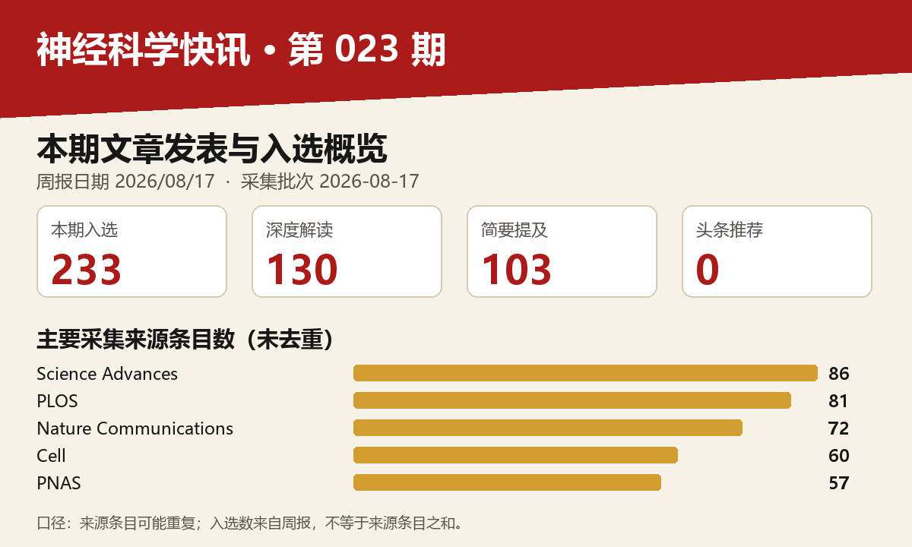

# 神经科学快讯·第023期（2026/08/17）｜1/2

图示口径：采集来源条目未去重；入选文章数以本期周报分类为准。

## 📊 本周概览

- **头条推荐**: 0 篇
- **深度解读**: 130 篇  
- **简要提及**: 103 篇
- **跨界启发**: 0 篇
- **已过滤**: 270 篇

---

### 📊 评分分布

| 评分区间 | 文章数量 |
|----------|----------|
| 2-3 | 1 |
| 3-4 | 1 |
| 4-5 | 2 |
| 5-6 | 4 |
| 6-7 | 36 |
| 7-8 | 134 |
| 8-9 | 77 |
| 9-10 | 1 |

**总计**: 256 篇评分文章

## 📈 各领域文章分布

| 领域 | 深度解读 | 简要提及 | 总计 |
|------|----------|----------|------|
| 未知领域 | 0 | 79 | 79 |
| 系统与环路神经科学 | 31 | 8 | 39 |
| 分子与细胞神经科学 | 22 | 3 | 25 |
| 临床与转化神经科学 | 18 | 4 | 22 |
| 计算与理论神经科学 | 16 | 4 | 20 |
| 感觉与运动神经科学 | 14 | 1 | 15 |
| 认知神经科学 | 13 | 2 | 15 |
| 方法学 | 9 | 1 | 10 |
| 发育神经科学 | 5 | 1 | 6 |
| 社会与情感神经科学 | 2 | 0 | 2 |

**合计**: 深度解读 130 篇，简要提及 103 篇，共 233 篇

---

## 📚 精选文献（按领域分类）

### 临床与转化神经科学

### The structural basis for LRRK2's activation and autoinhibition.

**中文标题**: LRRK2激活和自抑制的结构基础

**作者**: Villagran Suarez A, Hatch KS, Bodrug T et al.

**期刊**: Cell + Europe PMC | **发表日期**: 10 Aug 2026

**研究领域**: 临床与转化神经科学 / ['分子与细胞神经科学', '临床与转化神经科学']

**关键词**: 冷冻电镜, LRRK2蛋白, 帕金森病, 激酶激活, GTPase, 结构生物学

**推荐等级**: 深度解读

**评分**: 8.4/10  

**亮点**: 多种PD突变结构机制解析，为LRRK2靶向治疗提供统一框架

**核心优势**: 首次揭示ROC GTPase调控LRRK2活性转换的结构基础，并区分不同突变体的致病通路

**研究局限**: 基于体外和细胞实验，需要体内模型验证；且摘要未提及对抑制剂开发的直接验证

**目标读者**: 结构生物学、神经科学、帕金森病药物研发研究者

**推荐理由**: 该研究通过冷冻电镜技术解析了LRRK2在激活与自抑制状态下的高分辨率结构，揭示了ROC GTPase如何通过GDP/GTP转换调控激酶活性。这一机制不仅解释了LRRK2突变如何导致帕金森病，更为设计特异性LRRK2激酶抑制剂提供了结构基础，是通往理性药物开发的关键一步。对从事神经退行性疾病机制和结构生物学研究的读者具有重要参考价值。

### Histone H3K27M variants determine myeloid subset dependencies and immune reprogramming in diffuse midline glioma.

**中文标题**: 组蛋白H3K27M变体决定弥漫性中线胶质瘤中髓系亚群依赖性和免疫重编程

**作者**: Puigdelloses Vallcorba M, Rawat K, Soni N et al.

**期刊**: PNAS | **发表日期**: 13 Aug 2026

**研究领域**: 临床与转化神经科学 / ['临床与转化神经科学', '分子与细胞神经科学']

**关键词**: 组蛋白修饰, H3K27M, 弥漫性中线胶质瘤, 髓系细胞, 免疫微环境, 单细胞测序

**推荐等级**: 深度解读

**评分**: 8.2/10  

**亮点**: 揭示H3K27M变异通过重编程髓系微环境驱动弥漫性中线胶质瘤免疫逃逸的新机制

**核心优势**: 首次将组蛋白突变与髓系细胞依赖性免疫重编程联系起来，为DMG免疫治疗提供新靶点

**研究局限**: 仅基于标题评估，缺少摘要细节；可能缺乏临床样本验证或深入机制解析

**目标读者**: 神经肿瘤学、免疫学、表观遗传学研究者

**推荐理由**: 该研究揭示了组蛋白H3K27M突变在弥漫性中线胶质瘤中通过重塑髓系细胞亚群依赖性，驱动免疫抑制性微环境的关键机制。研究将表观遗传变异与肿瘤免疫逃逸联系起来，为理解这类高致死性儿童肿瘤的病理机制提供了新视角，并为开发靶向免疫微环境的联合治疗策略奠定了理论基础，具有明确的临床转化潜力。

### Myasthenia thymus reprograms class-switched B cells into BAFF-dependent survivors

**中文标题**: 重症肌无力胸腺将类别转换的B细胞重编程为依赖BAFF的存活细胞

**作者**: Yuanqing Yan, Diego Avella Patino, Yimeng Zhao et al.

**单位**: Dewitt Daughtry Family Department Of Surgery, Miller School Of Medicine, University Of Miami, Coral Gables, Fl 33124, Usa; Department Of Surgery, Division Of Thoracic Surgery, Feinberg School Of Medicine, Northwestern University, Chicago, Il 60611, Usa

**期刊**: Science Advances + Europe PMC | **发表日期**: 12 Aug 2026

**研究地区**: United States

**研究领域**: 临床与转化神经科学 / ['临床与转化神经科学', '分子与细胞神经科学']

**关键词**: 单细胞测序, 空间转录组学, B细胞, 胸腺, 重症肌无力, 免疫耐受

**推荐等级**: 深度解读

**评分**: 8.2/10  

**亮点**: 揭示重症肌无力胸腺B细胞逃逸耐受检查点的BAFF-BCMA生存新轴

**核心优势**: 基于迄今最大规模的MG单细胞/空间组学图谱，首次提出耐受检查点代偿机制并锁定BAFF-BCMA轴为潜在治疗靶点。

**研究局限**: 结论主要依赖转录组推断，缺乏功能学实验验证（如动物模型或体外干预）。

**目标读者**: 神经免疫学、自身免疫病机制、单细胞组学和计算生物学研究者

**推荐理由**: 该研究通过迄今最大规模的重症肌无力胸腺单细胞图谱，揭示了病理状态下类别转换B细胞获得BAFF依赖性存活的全新机制，颠覆了传统耐受检查点模型。结合V(D)J谱系与空间转录组分析，为自身免疫病的细胞起源和治疗靶点提供了关键线索，对神经免疫交叉领域具有重要参考价值。

### Microglia deploy TAM receptors to kill motor neurons in a mouse model of amyotrophic lateral sclerosis

**中文标题**: 小胶质细胞在肌萎缩侧索硬化小鼠模型中部署TAM受体杀死运动神经元

**作者**: Youtong Huang, Ananya Mavinkurve, Greg Lemke

**期刊**: Nature Communications | **发表日期**: 15 Aug 2026

**资深研究者**: Greg Lemke (h指数=83)

**研究领域**: 临床与转化神经科学 / ['临床与转化神经科学', '分子与细胞神经科学']

**关键词**: 小胶质细胞, TAM受体, 运动神经元, ALS, 小鼠模型, 神经炎症

**推荐等级**: 深度解读

**评分**: 8.1/10  

**亮点**: 揭示小胶质细胞通过TAM受体直接杀死运动神经元的新颖致病机制，为ALS提供潜在治疗靶点。

**核心优势**: 首次将TAM受体介导的小胶质细胞吞噬功能异常与ALS运动神经元死亡直接联系起来，提出小胶质细胞激活为‘杀手’的新机制。

**研究局限**: 完全依赖小鼠模型，人类ALS样本和更接近生理的微环境验证有待补充；具体信号通路及是否可转化为治疗策略尚未明确。

**目标读者**: 神经退行性疾病研究者、小胶质细胞生物学与免疫神经科学学者、ALS治疗靶向研发人员

**推荐理由**: 本研究揭示TAM受体在小胶质细胞介导的运动神经元杀伤中起关键作用，为ALS的病理机制提供了新的免疫学视角。通过小鼠模型证实TAM受体信号驱动神经毒性，靶向该通路可能成为延缓ALS进展的潜在治疗策略。这一发现不仅深化了对小胶质细胞功能二态性的理解，也为神经退行性疾病的免疫调节干预提供了新靶点。

### Challenging the right-hemisphere assumption in post-stroke pragmatics: largely comparable impairment profiles across lesion sides

**中文标题**: 挑战中风后语用学中的右半球假设：病变侧别间的损伤特征基本相似

**作者**: Gastaldon, S., Romeo, F., Barattieri Di San Pietro, C. et al.

**期刊**: bioRxiv | **发表日期**: 10 Aug 2026

**研究领域**: 临床与转化神经科学 / ['临床与转化神经科学', '认知神经科学']

**关键词**: 卒中, 语用障碍, 行为学评估, 左右半球, 神经心理测评, 人类

**推荐等级**: 深度解读

**评分**: 8.0/10  

**亮点**: 对卒中后语用障碍的右半球特化假设提出大规模实证挑战，LHD与RHD表现高度相似。

**核心优势**: 使用99例患者和三种互补统计方法，同时排除失语影响，系统地证明左右半球语用障碍谱基本重叠。

**研究局限**: 横断面单中心设计，缺乏纵向追踪和行为-脑影像关联，且语用评估依赖任务表现，生态效度有限。

**目标读者**: 神经心理学家、失语症临床医生、语言神经科学和认知神经科学研究者。

**推荐理由**: 该研究通过较大规模的卒中患者样本和标准化语用评估工具，系统比较了左右半球损伤后的语用障碍特征，发现两侧损伤患者的语用损伤轮廓高度相似，有力挑战了传统的右半球假设。这一发现提示语用加工可能依赖双侧半球的协同网络，对神经语言学理论和卒中后语言康复策略的设计都具有重要启示意义。

### Breathing new life into the rational design of Alzheimer's therapeutics.

**中文标题**: 为阿尔茨海默病治疗药物的理性设计注入新活力

**作者**: Dries DR, Yu G

**期刊**: Cell + Europe PMC | **发表日期**: 11 Aug 2026

**研究领域**: 临床与转化神经科学 / ['临床与转化神经科学', '方法学']

**关键词**: 阿尔茨海默病, 药物设计, 靶向治疗, 结构生物学, 计算建模, 临床转化

**推荐等级**: 深度解读

**评分**: 7.9/10  

**亮点**: 为阿尔茨海默病治疗剂的理性设计注入新视角，整合多学科进展

**核心优势**: 以全新视角审视阿尔茨海默病治疗设计，可能提出变革性的理性设计框架。

**研究局限**: 缺乏实验数据支撑，观点主观性较强，具体可行性有待验证。

**目标读者**: 阿尔茨海默病研究者、药物设计专家、神经科学领域学者

**推荐理由**: 该文系统梳理了阿尔茨海默病治疗剂理性设计的最新进展，强调从经验性筛选向基于靶点结构和病理机制的精准设计转变。文章总结了现有挑战，并提出整合冷冻电镜、计算建模和生物标志物等工具的新框架，为神经科学基础发现向临床转化提供了清晰路线图。对AD研究与药物开发从业者而言，这是一篇具有战略前瞻性的必读综述。

### Wearable transparent OLED glasses for cognitive stimulation: Enhancing brain connectivity through gamma entrainment

**中文标题**: 用于认知刺激的可穿戴透明OLED眼镜：通过伽马夹带增强脑连接

**作者**: Hyeonwook Chae, Yeseung Park, Yejung Kim et al.

**单位**: School Of Electrical Engineering, Korea Advanced Institute Of Science And Technology (Kaist), Daejeon 34141, Republic Of Korea; Department Of Neuropsychiatry, Seoul National University Bundang Hospital, Seongnam, Republic Of Korea

**期刊**: Science Advances + Europe PMC | **发表日期**: 14 Aug 2026

**资深研究者**: Seunghyup Yoo (h指数=60)

**研究领域**: 临床与转化神经科学 / ['临床与转化神经科学']

**关键词**: OLED眼镜, 伽马振荡, 光刺激, 阿尔茨海默, 脑连接性, 可穿戴设备

**推荐等级**: 深度解读

**评分**: 7.7/10  

**亮点**: 透明OLED眼镜首次实现在自然视觉下进行伽马夹带，为早期认知干预提供舒适可穿戴方案

**核心优势**: 创新性地将透明OLED技术与伽马夹带结合，实现高透过率和良好佩戴性，并在真实条件下初步验证了脑连接增强

**研究局限**: 证据主要基于短期或小样本实验，长期认知改善效果及临床转化潜力尚需更大规模研究确认

**目标读者**: 神经科学、生物医学工程、老年医学及可穿戴医疗设备研究者

**推荐理由**: 该研究开发了高透光率（75%）的可穿戴透明OLED眼镜，用于伽马频段光刺激，在保持正常视觉的同时实现认知促进。针对早期阿尔茨海默症患者，通过诱导伽马振荡增强脑连接性，为非药物干预提供了易于融入日常生活的方案。这一工作体现了材料工程与神经调控的交叉创新，为临床转化神经科学提供了新工具。

### Endothelial cell-microglia crosstalk mediates heart failure-associated synaptic loss and cognitive impairment in male mice

**中文标题**: 内皮细胞-小胶质细胞串扰介导雄性小鼠心力衰竭相关的突触丢失和认知障碍

**作者**: Mengdan Wang, Xiaoxuan Yu, Shuo Zhang

**期刊**: Nature Communications | **发表日期**: 14 Aug 2026

**资深研究者**: Shuo Zhang (h指数=32)

**研究领域**: 临床与转化神经科学 / ['临床与转化神经科学', '分子与细胞神经科学']

**关键词**: 小鼠, 心力衰竭模型, 内皮细胞, 小胶质细胞, 突触丢失, 认知障碍

**推荐等级**: 深度解读

**评分**: 7.6/10  

**亮点**: 首次揭示内皮细胞-小胶质细胞串扰作为心力衰竭引发认知障碍的关键桥梁，提供全新治疗靶点

**核心优势**: 跨系统（心血管-神经免疫）机制研究，将心衰与突触丢失和认知衰退直接关联，具有较强的转化潜力。

**研究局限**: 缺乏摘要细节，无法评估实验设计的深度和证据充分性；可能仅依赖单一动物模型，且性别特异性结果推广需谨慎。

**目标读者**: 神经科学家、心脏病学家、神经免疫学研究者及转化医学从业者

**推荐理由**: 这项研究揭示了心力衰竭通过内皮细胞-小胶质细胞串扰驱动突触丢失与认知障碍的新机制，将心血管病理与神经退行性过程联系起来。作者在雄性小鼠模型中结合分子、细胞与行为分析，证明内皮细胞信号能够调节小胶质细胞状态从而影响突触完整性。该发现为心力衰竭相关认知障碍提供了潜在的生物标志物和干预靶点，也为跨器官互作与神经炎症研究提供了新的理论框架。

### Overcoming the blood-brain barrier using central nervous system-accessing lipid nanoparticles for enhanced mRNA therapeutics.

**中文标题**: 利用可进入中枢神经系统的脂质纳米颗粒克服血脑屏障，增强mRNA治疗效果

**作者**: Wang S, Zhong Y, Wang C et al.

**期刊**: PNAS | **发表日期**: 14 Aug 2026

**研究领域**: 临床与转化神经科学 / ['临床与转化神经科学', '方法学']

**关键词**: 药物递送, 血脑屏障, mRNA疗法, 脂质纳米颗粒, 中枢神经系统, 基因治疗

**推荐等级**: 深度解读

**评分**: 7.6/10  

**亮点**: CNS靶向脂质纳米颗粒突破血脑屏障，为mRNA神经治疗提供新路径。

**核心优势**: 中枢神经系统特异性LNP递送平台，避免系统性副作用，具强转化潜力。

**研究局限**: 未见递送效率与毒理对照数据，长期安全性和BBB穿越机制尚待阐明。

**目标读者**: 神经科学、纳米医学、基因治疗与药物递送研究者

**推荐理由**: 该研究针对中枢神经系统药物递送的核心瓶颈——血脑屏障，提出了一种中枢神经系统靶向的脂质纳米颗粒平台，用于高效递送mRNA治疗药物。这一策略可能为神经退行性疾病、脑肿瘤等难治性疾病提供新的治疗窗口，也为神经科学的转化研究带来了可操作的递送工具。对于关注神经疾病模型和基因治疗的读者，这项工作在递送效率和靶向性方面提供了重要思路。

### Prediction of mild cognitive impairment progression using time-sensitive multimodal biomarkers

**中文标题**: 使用时间敏感的多模态生物标志物预测轻度认知障碍进展

**作者**: Jonathan Gallego-Rudolf, Alex I. Wiesman, Yara Yakoub et al.

**单位**: Department Of Psychiatry And Neurochemistry, Institute Of Neuroscience And Physiology, The Sahlgrenska Academy, University Of Gothenburg, Gothenburg, Sweden; Institute Of Neuroscience And Physiology, University Of Gothenburg, Mölndal, Sweden; Douglas Research Centre, Mcgill University, Montreal, Canada 等

**期刊**: Science Advances + Europe PMC | **发表日期**: 12 Aug 2026

**资深研究者**: Sylvain Baillet (h指数=58)

**研究地区**: Canada, Sweden

**研究领域**: 临床与转化神经科学 / ['临床与转化神经科学', '方法学']

**关键词**: 阿尔茨海默病, 多模态生物标志物, 脑磁图, 机器学习, 疾病预测, 认知衰退

**推荐等级**: 深度解读

**评分**: 7.6/10  

**亮点**: 多模态生物标志物的时间敏感性分析为阿尔茨海默病早期进展预测提供了新视角

**核心优势**: 融合MEG、MRI、PET和血浆标志物的纵向多模态模型，揭示不同生物标志物在预测MCI进展中的时间动态差异。

**研究局限**: 样本量较小（n=102，进展者仅31），且缺乏独立外部验证，模型稳健性和泛化性需进一步考验。

**目标读者**: 阿尔茨海默病神经影像、神经电生理、体液生物标志物及临床预防研究人员

**推荐理由**: 该研究在认知正常但有AD家族史人群中，系统比较了神经生理（脑磁图）、影像（MRI、PET）和血浆生物标志物对MCI进展的预测效能，并强调时间敏感的动态信息。其多模态整合策略为早期AD风险分层提供了更精准的框架，对预防性临床试验设计具有直接参考价值。

### Magic or realism?

**中文标题**: 魔法还是现实？

**作者**: Piller C, Smith JE

**期刊**: Science + Europe PMC | **发表日期**: 13 Aug 2026

**研究领域**: 临床与转化神经科学 / ['临床与转化神经科学', '分子与细胞神经科学']

**关键词**: 阿尔茨海默病, 遗传变异, 保护性突变, 药物靶点, 人类, 转化医学

**推荐等级**: 深度解读

**评分**: 7.4/10  

**亮点**: 对阿尔茨海默病保护性基因变异的可信度提出尖锐质疑，启发读者审视遗传证据的可靠性

**核心优势**: 以批判性视角审视最新发现的遗传变异，提醒读者辨别证据真伪

**研究局限**: 篇幅简短，缺乏系统性的全面综述，可能无法深入覆盖领域全貌

**目标读者**: 神经科学研究者、遗传学家、关注阿尔茨海默病进展的读者

**推荐理由**: 该评论聚焦于最新发现的阿尔茨海默病保护性遗传变异，深入剖析其证据强度与机制可信度，并探讨这些发现是否真能为治疗提供可行路径。作者将遗传学线索与临床干预靶点联系起来，对‘可治愈性’持审慎态度，为神经科学和转化医学研究者提供了重要的批判性视角，有助于理性评估从遗传发现到治疗开发的鸿沟。

### Fronto-striatal molecular convergence in eating and obsessive-compulsive disorders.

**中文标题**: 进食障碍与强迫症中额叶-纹状体分子汇聚

**作者**: Glausier JR

**期刊**: Trends in Neurosciences + Europe PMC | **发表日期**: 11 Aug 2026

**研究领域**: 临床与转化神经科学 / ['临床与转化神经科学', '分子与细胞神经科学']

**关键词**: 转录组学, 人类, 前额叶, 纹状体, 进食障碍, 强迫症

**推荐等级**: 深度解读

**评分**: 7.3/10  

**亮点**: 跨诊断分子趋同：进食障碍与强迫症共享额叶-纹状体能量代谢与突触信号改变

**核心优势**: 敏锐评述最新转录组研究，提出ED和OCD在神经元能量学和突触信号层面的共同分子基础，促进跨诊断研究视角。

**研究局限**: 作为评论文章，缺乏原始数据，且可能过度依赖单篇研究，全面性和深度受限于篇幅。

**目标读者**: 精神医学、分子神经科学、计算生物学研究者

**推荐理由**: 该研究利用人脑组织转录组数据，系统揭示了进食障碍与强迫症在前额叶-纹状体环路中的分子汇聚，核心指向神经元能量代谢与突触信号通路。这一发现为跨诊断理解 compulsivity 提供了分子层面的证据，也为未来针对共享病理机制的精准干预奠定了基础。

### A microRNA atlas of CD4+ T cell subsets in experimental autoimmune encephalomyelitis identifies regulators of disease pathogenesis.

**中文标题**: 实验性自身免疫性脑脊髓炎中CD4+ T细胞亚群的microRNA图谱识别疾病发病机制的调节因子

**作者**: Cunha C, Inácio D, Romero PV et al.

**期刊**: PLOS | **发表日期**: 10 Aug 2026

**研究领域**: 临床与转化神经科学 / ['临床与转化神经科学', '分子与细胞神经科学']

**关键词**: microRNA, CD4+ T细胞, EAE模型, 小鼠, 神经炎症, 转录组

**推荐等级**: 深度解读

**评分**: 7.3/10  

**亮点**: 首个CD4+ T细胞亚群microRNA图谱揭示EAE疾病调控新因子

**核心优势**: 系统构建CD4+ T细胞亚群microRNA表达图谱，并结合功能筛选发现疾病病程调控关键miRNA。

**研究局限**: 基于单一EAE模型，尚需在人类多发性硬化样本中验证，且图谱的调控机制解析可能不够深入。

**目标读者**: 神经免疫学、自身免疫病、非编码RNA及系统生物学研究者

**推荐理由**: 该研究通过系统性分析实验性自身免疫性脑脊髓炎(EAE)中不同CD4+ T细胞亚群的microRNA表达谱，构建了首个相关图谱，并鉴定出多个参与疾病发生发展的关键调控因子。这一工作不仅为多发性硬化等神经免疫疾病的机制研究提供了新资源，也为靶向microRNA的免疫治疗策略奠定了基础。对于关注神经炎症和免疫调节的读者而言，该图谱具有重要的参考价值。

### History Matters: Damage-Mediated Amplification of Brain Deformation and Injury Risk under Repeated Head Impacts

**中文标题**: 历史重要：重复头部撞击下损伤介导的脑变形和损伤风险放大

**作者**: Carson Cooper, Anu Tripathi, Genevieve Palardy et al.

**期刊**: arXiv | **发表日期**: 11 Aug 2026

**研究领域**: 临床与转化神经科学 / ['临床与转化神经科学', '计算与理论神经科学']

**关键词**: 有限元建模, 重复冲击, 脑损伤, 生物力学, 本构模型, 人类

**推荐等级**: 深度解读

**评分**: 7.2/10  

**亮点**: 揭示重复头冲击下损伤介导的软化如何放大脑变形和损伤风险，挑战损伤无记忆假设。

**核心优势**: 首次在头部有限元模型中引入Mullins损伤效应，量化了重复加载历史对变形和损伤概率的放大效应。

**研究局限**: 完全依赖计算模拟，缺乏实验数据校准验证；且使用简化的损伤模型，可能高估或低估真实软组织行为。

**目标读者**: 计算生物力学、脑外伤生物力学、运动医学和有限元建模研究人员

**推荐理由**: 本研究在计算头模型中引入Mullins损伤效应，揭示了重复头部冲击下的累积软组织软化如何放大脑组织变形与损伤风险。与传统的单次冲击模型相比，该工作更真实地刻画了混合武术等场景中反复头部撞击的病理力学过程，为理解运动相关脑损伤的累积性提供了新的建模框架，也为头盔设计和临床风险评估提供了定量工具。

### Sex differences in the effects of shift work-like schedules on gut microbiome and intestinal barrier in relation to stroke survival.

**中文标题**: 轮班式日程对肠道微生物组和肠道屏障影响的性别差异及其与中风存活率的关系

**作者**: Barnum E, Turck JL, Souza KA et al.

**期刊**: PLOS | **发表日期**: 14 Aug 2026

**研究领域**: 临床与转化神经科学 / ['临床与转化神经科学', '分子与细胞神经科学']

**关键词**: 性别差异, 肠道菌群, 肠道屏障, 卒中模型, 昼夜节律, 小鼠

**推荐等级**: 深度解读

**评分**: 7.2/10  

**亮点**: 性別差异视角下轮班工作样作息对肠道微生态及屏障功能与卒中预后的关联

**核心优势**: 首次系统探讨轮班工作样时间表对性别特异性肠道微生物组和肠屏障的影响，并将其与卒中生存结局联系，具有新颖的交叉学科切入点。

**研究局限**: 仅基于摘要信息，缺乏具体实验设计细节及效应量；期刊影响力相对有限，且样本量、因果机制及临床转化证据可能不足。

**目标读者**: 神经科学、肠道微生物组、卒中生物学及职业健康研究者

**推荐理由**: 本研究通过模拟轮班工作样时间表，揭示其对卒中后生存的影响存在显著性别差异，并发现肠道微生物组与肠道屏障在其中发挥关键介导作用。这一发现将昼夜节律紊乱、肠脑轴功能与卒中预后紧密联系起来，为基于性别和肠道稳态的卒中个体化干预提供了新的靶点与证据，值得临床与基础研究者共同关注。

### Simulation-informed low-current anodal tDCS accelerates early motor recovery after photochemically induced cortical stroke in rats

**中文标题**: 仿真校准的低电流阳极经颅直流电刺激加速光化学诱导皮层卒中大鼠早期运动恢复

**作者**: Morishita, S., Tanaka, S., Yamada, E. et al.

**期刊**: bioRxiv | **发表日期**: 10 Aug 2026

**研究领域**: 临床与转化神经科学 / ['临床与转化神经科学', '方法学']

**关键词**: tDCS, 运动恢复, 脑卒中, 电场模拟, 大鼠, 神经调控

**推荐等级**: 深度解读

**评分**: 7.2/10  

**亮点**: 利用电场模拟校准低电流tDCS，揭示临床等效弱电场加速卒中后早期运动恢复的新策略

**核心优势**: 将模拟预测与体内行为实验结合，系统评估不同电流强度，发现低电流（50 μA）在早期恢复中优于传统高电流（1 mA）。

**研究局限**: 仅使用单一行为学指标（beam-walking），缺乏电生理、组织学或分子机制证据，且样本量未知、长期恢复无差异。

**目标读者**: 神经调控、卒中康复、计算神经科学和转化医学研究者

**推荐理由**: 这项研究通过电场仿真校准大鼠tDCS强度，使其电场强度接近临床人用水平，并证实重复阳极刺激可在光栓性卒中后早期加速运动功能恢复。它填补了动物tDCS研究常用超临床强度而难以向临床转化的空白，为无创神经调控的剂量选择和机制研究提供了方法学参照。对从事卒中康复和神经调控转化的研究者具有重要参考价值。

### Resting bilateral sensorimotor mu rhythm suppression facilitates ipsilesional M1 excitability after stroke

**中文标题**: 静息态双侧感觉运动μ节律抑制促进卒中后病灶侧M1兴奋性

**作者**: Khatri, U., Suresh, T., Tatz, J. et al.

**期刊**: bioRxiv | **发表日期**: 10 Aug 2026

**研究领域**: 临床与转化神经科学 / ['临床与转化神经科学']

**关键词**: 脑电, 经颅磁刺激, 运动皮层, 卒中, mu节律, 神经调控

**推荐等级**: 深度解读

**评分**: 7.1/10  

**亮点**: 揭示慢性卒中后双侧感觉运动mu抑制作为同侧M1兴奋性的群组水平标记，为神经调控提供更稳定的EEG靶点。

**核心优势**: 首次系统表征卒中后M1兴奋性的EEG状态，结合TMS-EEG-EMG，发现群组级双侧mu抑制标记，且不依赖于损伤严重度。

**研究局限**: 样本量小（15人），个体化EEG模式仅出现在60%参与者中，可靠性不足，且组水平mu抑制未与行为学或兴奋性指标直接相关。

**目标读者**: 神经康复、脑机接口、TMS-EEG神经调控和卒中神经恢复研究者

**推荐理由**: 本研究聚焦卒中后脑状态与皮层兴奋性关系的改变，提出静息态双侧感觉运动mu节律抑制可作为损伤侧M1兴奋性的可靠指标。这一发现为脑状态依赖的TMS干预提供了新的靶向生物标志物，有望推动个性化神经调控策略在卒中康复中的精准应用，对理解脑状态-兴奋性耦合及其病理重塑具有重要转化意义。

### In vivo mapping of striatal neurodegeneration in Huntington's disease with Soma and Neurite Density Imaging.

**中文标题**: 亨廷顿病纹状体神经退行性变的体内定位：胞体和神经突密度成像

**作者**: Ioakeimidis V, Palombo M, Casella C et al.

**期刊**: eLife | **发表日期**: 11 Aug 2026

**研究领域**: 临床与转化神经科学 / ['临床与转化神经科学', '方法学']

**关键词**: 亨廷顿病, 纹状体, SANDI, 神经退行性变, 在体成像

**推荐等级**: 深度解读

**评分**: 7.0/10  

**亮点**: 利用SANDI成像在亨廷顿病患者中多维刻画纹状体神经退行性变，为疾病监测提供新型成像指标

**核心优势**: 首次将Soma and Neurite Density Imaging（SANDI）应用于亨廷顿病，能够非侵入性地区分细胞体与神经突密度变化，从而反映病理过程的特异性

**研究局限**: 受样本量与横断面设计限制，且SANDI模型对组织微结构假设的简化可能影响绝对密度的解释，需要与组织学或纵向数据进一步验证

**目标读者**: 神经影像学、亨廷顿病研究、神经退行性疾病生物标志物开发领域的科学家

**推荐理由**: 该研究将Soma and Neurite Density Imaging（SANDI）应用于亨廷顿病，实现了在体纹状体神经退行性变的特异性测量。相比传统扩散成像，SANDI能区分胞体与神经突的密度变化，为疾病早期诊断和进展监测提供了更精准的影像标志物。这项方法学创新有望推动临床转化，并为其他神经退行性疾病研究提供新思路。

### Departure from OFF-State Microstate Dynamics Tracks Levodopa Response in Parkinson's Disease

**中文标题**: 帕金森病中OFF状态微状态动力学的偏离追踪左旋多巴反应

**作者**: Demuru, M., Angiolelli, M., Troisi Lopez, E. et al.

**期刊**: bioRxiv | **发表日期**: 10 Aug 2026

**研究领域**: 临床与转化神经科学

**推荐等级**: 简要提及

**评分**: 7.0/10 | **摘要**: 利用脑电微状态动态偏离OFF状态的程度量化左旋多巴反应性，为帕金森病个体化疗效评估提供新神经生理标志物。

**优势**: 从全脑动态角度揭示左旋多巴对微状态转移概率的个体化重构作用，并与临床改善幅度直接关联，具有转化潜力。
**局限**: 样本量仅13例且缺乏独立验证队列，结论的稳健性和普遍性受限。
**受众**: 帕金森病研究者、神经影像与MEG动力学分析专家、计算神经科学和转化医学领域从业者

### Differential associations of insulin resistance with anterior hippocampal volume in mild cognitive impairment and Alzheimer's disease

**中文标题**: 轻度认知障碍和阿尔茨海默病中胰岛素抵抗与前海马体积的差异关联

**作者**: Watanabe, N., Ogawa, A., Osada, T. et al.

**期刊**: bioRxiv | **发表日期**: 10 Aug 2026

**研究领域**: 临床与转化神经科学

**推荐等级**: 简要提及

**评分**: 6.9/10 | **摘要**: 胰岛素抵抗与海马前部体积的关联在MCI和AD中方向相反，提示代谢-结构-认知关系随疾病阶段转换

**优势**: 发现HOMA-IR与海马前部体积的关联在MCI和AD中方向相反，并揭示中介效应，强调疾病分期的重要性
**局限**: 横断面设计、HOMA-IR替代指标、未控制全部混杂因素（如糖尿病药物）、缺乏纵向验证
**受众**: 阿尔茨海默病研究者、神经影像与代谢交叉领域、认知神经科学

### Translational reading frame predicts the pathogenicity of C-terminal frameshift deletions in MeCP2.

**中文标题**: 翻译阅读框预测MeCP2 C末端移码缺失的致病性

**作者**: Guy J, Hein E, Alexander-Howden B et al.

**期刊**: eLife | **发表日期**: 10 Aug 2026

**研究领域**: 临床与转化神经科学

**推荐等级**: 简要提及

**评分**: 6.6/10 | **摘要**: 利用翻译阅读框预测MeCP2 C端移码缺失致病性，为神经遗传学变异解读提供新依据

**优势**: 提出以翻译阅读框为指标的预测策略，可能更准确区分致病与良性变异
**局限**: 缺乏大规模实验验证，且仅针对MeCP2单个基因，泛化性待证实
**受众**: 神经遗传学、计算生物学、Rett综合征临床与基础研究者

### Researchers struggle to improve nonopioid pain drugs.

**中文标题**: 研究者努力改进非阿片类止痛药

**作者**: Smith JE

**期刊**: Science + Europe PMC | **发表日期**: 13 Aug 2026

**研究领域**: 临床与转化神经科学

**推荐等级**: 简要提及

**评分**: 6.0/10 | **摘要**: 聚焦非阿片类止痛药研发瓶颈，以钠通道阻滞剂为切入点审视现有疗法的临床缺陷与未来出路

**优势**: 及时跟踪最新研究，以简洁语言向多学科读者阐明非阿片类止痛药面临的科学和转化障碍。
**局限**: 作为新闻评论，缺乏系统性文献覆盖和深入的数据分析，批判性论述可能流于表面。
**受众**: 疼痛医学、神经药理学、药物研发人员以及关注止痛药替代治疗的生物医学研究者

### 分子与细胞神经科学

### Dendritic translation and neuroproteasome-mediated degradation of endogenous tau revealed by STARFISH

**中文标题**: STARFISH揭示内源性tau的树突翻译和神经蛋白酶体介导的降解

**作者**: Kalin D. Konrad-Vicario, Victoria Paradise, Kapil V. Ramachandran

**期刊**: Nature Neuroscience | **发表日期**: 13 Aug 2026

**研究领域**: 分子与细胞神经科学 / ['分子与细胞神经科学', '方法学']

**关键词**: STARFISH, 单分子成像, tau蛋白, 树突翻译, 蛋白酶体降解, 阿尔茨海默病

**推荐等级**: 深度解读

**评分**: 8.8/10  

**亮点**: 单分子分辨率可视化内源tau蛋白在树突中的局部翻译，揭示神经蛋白酶体介导的降解保护机制

**核心优势**: 开发了全新的STARFISH技术，首次实现对内源mRNA翻译位点的单分子、近密码子分辨率成像，无需修饰新生多肽，并直接揭示tau蛋白在树突局部翻译及神经蛋白酶体共翻译降解的稳态调控。

**研究局限**: 摘要中未提供详细统计和体内验证的具体量化细节，且STARFISH技术的普适性和对组织穿透性等限制可能尚未完全解决。

**目标读者**: 神经科学、细胞生物学、蛋白质稳态和阿尔茨海默病研究者

**推荐理由**: 这项研究开发了STARFISH技术，能够在原代神经元和体内实现内源性tau mRNA翻译位点的单分子可视化，首次揭示tau蛋白在树突中的局部翻译及其受神经蛋白酶体降解的动态调控。通过将RNA成像与蛋白酶体活性检测相结合，作者证明树突内tau合成与降解的平衡对防止蛋白聚集至关重要，为阿尔茨海默病的病理机制提供了亚细胞分辨率的新视角，同时为研究其他神经元内源蛋白的局部翻译降解偶联提供了高灵敏度方法学工具。

### Sub-millivolt voltage imaging reveals gap junction-mediated bioelectric contact inhibition

**中文标题**: 亚毫伏电压成像揭示缝隙连接介导的生物电接触抑制

**作者**: Philipp Rühl, Rama A. Hussein, Stefan H. Heinemann

**单位**: Philipp; Ruehl@Uni-Jena; Center For Molecular Biomedicine, Department Of Biophysics, Friedrich Schiller University Jena And Jena University Hospital, Jena, Germany

**期刊**: Nature Communications + Europe PMC | **发表日期**: 15 Aug 2026

**资深研究者**: Stefan H. Heinemann (h指数=71)

**研究地区**: Germany

**研究领域**: 分子与细胞神经科学 / ['分子与细胞神经科学', '方法学']

**关键词**: 电压成像, 基因编码指示器, 间隙连接, 膜电位, 生物电, 网络动力学

**推荐等级**: 深度解读

**评分**: 8.6/10  

**亮点**: 亚毫伏电压成像揭示缝隙连接耦合如何通过缓冲膜电位波动来抑制细胞网络中的电噪声。

**核心优势**: 开发高灵敏度电压指示器并发现缝隙连接介导的生物电接触抑制，为电稳态提供统一机制。

**研究局限**: 该研究可能主要在体外表征；尚未在体内/生理环境中得到验证，并且该感应器可能专门针对慢电压信号，在快速兴奋性细胞中的适用性需要测试。

**目标读者**: 生物电、发育生物学、癌症生物学和电压成像领域研究人员。

**推荐理由**: 该研究推出新一代基因编码电压指示器rEstus2s，首次实现多细胞非兴奋性网络亚毫伏级膜电位动态的高分辨率成像，突破传统工具灵敏度不足的瓶颈。基于这一技术，作者发现间隙连接介导的生物电接触抑制（BCI）：网络耦合通过被动电学机制稳定膜电位，使电压方差随网络规模呈1/n缩放。这一机制为理解非兴奋性细胞间的电信号协同、组织稳态和发育调控提供了全新物理学框架，不仅为电压成像领域树立了新标杆，也为探索生物电在健康和疾病中的作用开辟了实验路径。

### Temporal changes in metabolism guide oligodendrocyte precursor cell dynamics in aging and multiple sclerosis.

**中文标题**: 衰老与多发性硬化中代谢的时间变化引导少突胶质前体细胞动力学

**作者**: Dierckx T, Wilson SE, Buchanan R et al.

**期刊**: Neuron + Europe PMC | **发表日期**: 07 Aug 2026

**研究领域**: 分子与细胞神经科学 / ['分子与细胞神经科学', '临床与转化神经科学']

**关键词**: OPC, 昼夜节律, 代谢, 细胞衰老, 多发性硬化, 小鼠

**推荐等级**: 深度解读

**评分**: 8.3/10  

**亮点**: 揭示昼夜节律核心调控因子BMAL1通过代谢重塑控制OPC衰老与动力学，为衰老及多发性硬化中的髓鞘再生提供时间治疗新策略

**核心优势**: 多维度证据链（基因敲除、时间生物学、iPSC及MS病灶样本）系统确立了BMAL1-代谢-衰老轴在OPC功能中的因果作用，并提出chronotherapy潜在干预窗口。

**研究局限**: 摘要未提供具体效应量及统计细节，自然衰老与Bmal1缺失的代谢表型异同尚需更直接对比；时间疗法的长期有效性和临床转化可行性仍需进一步验证。

**目标读者**: 髓鞘生物学、胶质细胞研究、衰老与昼夜节律领域，以及多发性硬化转化医学研究者

**推荐理由**: 本研究通过转录组和功能实验揭示，昼夜节律核心基因Bmal1在衰老少突胶质前体细胞（OPC）中表达下降，其缺失导致代谢功能障碍和细胞衰老，进而破坏OPC的昼夜节律性增殖与分化。该工作将生物钟、代谢与髓鞘再生联系起来，为多发性硬化及衰老相关髓鞘缺陷提供了新的治疗靶点。

### Early-life stress alters H3K4me1 in VTA to prime stress sensitivity.

**中文标题**: 早期生活压力改变腹侧被盖区H3K4me1以启动应激敏感性

**作者**: Kim HJJ, Geiger LT, Balouek JA et al.

**期刊**: Neuron + Europe PMC | **发表日期**: 07 Aug 2026

**研究领域**: 分子与细胞神经科学 / ['分子与细胞神经科学', '系统与环路神经科学']

**关键词**: 表观遗传, 早期应激, 小鼠, 腹侧被盖区, 多巴胺神经元, 转录组学

**推荐等级**: 深度解读

**评分**: 8.3/10  

**亮点**: 揭示早期压力通过VTA中H3K4me1表观修饰预置成年应激敏感性的关键机制

**核心优势**: 利用多组学与体内表观编辑，建立了早期应激→H3K4me1→VTA多巴胺神经元功能→成年应激敏感性的因果链条。

**研究局限**: 结论基于小鼠模型，人类相关性未验证；且未剖析SETD7上游信号通路及修饰的细胞特异性。

**目标读者**: 神经科学、表观遗传学、精神病学与应激生物学研究者

**推荐理由**: 该研究通过整合质谱、表观基因组编辑、RNA测序、电生理和行为学，揭示了早期生活应激通过改变VTA多巴胺神经元H3K4me1修饰，长期增强对应激的敏感性。这一发现为应激相关精神疾病的表观遗传机制提供了直接证据，并展示了染色质修饰作为情绪记忆存储介质的潜力，对理解发育可塑性与疾病易感性有重要意义。

### Brain perivascular macrophages regulate endothelial cell function via a cMAF-dependent transcriptional program in mouse and human.

**中文标题**: 脑血管周围巨噬细胞通过cMAF依赖性转录程序调控小鼠和人类的内皮细胞功能

**作者**: Brioschi S, Belk JA, Storck SE et al.

**期刊**: Cell + Europe PMC | **发表日期**: 14 Aug 2026

**研究领域**: 分子与细胞神经科学 / ['分子与细胞神经科学', '临床与转化神经科学']

**关键词**: 单细胞多组学, 血管巨噬细胞, 内皮细胞, cMAF, 小鼠, 人类

**推荐等级**: 深度解读

**评分**: 8.2/10  

**亮点**: 揭示脑周巨噬细胞通过cMAF-IGF1轴调控脑血管功能并影响阿尔茨海默病保护机制

**核心优势**: 整合单细胞多组学与条件性基因敲除，鉴定cMAF为脑周巨噬细胞关键转录因子，并阐明其经IGF1与内皮细胞通讯的新机制，且在人鼠间保守并关联AD遗传风险。

**研究局限**: 主要依赖小鼠模型和转录组分析，对人类疾病中的因果验证和具体信号通路细节尚不够深入。

**目标读者**: 神经免疫学、脑血管生物学、阿尔茨海默病研究及单细胞多组学领域的研究者

**推荐理由**: 本研究运用单细胞多组学与条件基因敲除，鉴定cMAF为脑血管周围巨噬细胞的核心转录因子，并揭示其通过IGF1信号调控内皮细胞功能的机制。研究在小鼠与人类中共同验证，为神经血管单元中免疫-内皮互作提供了新的分子节点，也为脑血管疾病干预提供了潜在靶点。

### Divergent somatic mutation patterns among human cerebellar neuron types.

**中文标题**: 人类小脑神经元类型间不同的体细胞突变模式

**作者**: Grońska-Pęski M, Srinivasa A, Evrony GD

**期刊**: Neuron + Europe PMC | **发表日期**: 10 Aug 2026

**研究领域**: 分子与细胞神经科学 / ['分子与细胞神经科学', '方法学']

**关键词**: 人类, 小脑, 浦肯野细胞, 颗粒神经元, 体细胞突变, 高保真测序

**推荐等级**: 深度解读

**评分**: 8.2/10  

**亮点**: 揭示人小脑不同类型神经元体细胞突变模式的异同，以及转录相关突变特征。

**核心优势**: 利用高保真双链DNA测序，系统比较了浦肯野细胞和颗粒细胞跨生命周期的体细胞突变，发现突变率相似但突变类型和模式显著不同，并关联转录活动。

**研究局限**: 样本数量和覆盖区域可能有限，且主要基于小脑特定神经元类型，发现的普适性和机制仍需进一步实验验证。

**目标读者**: 神经基因组学、细胞生物学、衰老与神经退行性疾病研究者。

**推荐理由**: 该研究利用高保真双链DNA测序，系统比较了人类小脑浦肯野细胞与颗粒神经元在生命周期中的体细胞突变积累模式。尽管两类神经元在形态和生理上差异显著，替代率却惊人地相似，而突变谱却存在分化。这一发现挑战了神经元类型决定突变负荷的简单假设，为理解基因组稳定性维持机制、脑衰老与神经退行性疾病的起源提供了关键线索，也为神经基因组学方法提供了新范式。

### Phagocytic activity of perivascular cell promotes CNS injury pathology

**中文标题**: 血管周围细胞的吞噬活性促进中枢神经系统损伤病理

**作者**: Zhou, T., Zhang, Z., Zeng, F. et al.

**期刊**: bioRxiv | **发表日期**: 09 Aug 2026

**研究领域**: 分子与细胞神经科学 / ['分子与细胞神经科学', '临床与转化神经科学']

**关键词**: 血管周围细胞, 吞噬作用, 损伤微环境, 小胶质细胞, 卒中, 小鼠模型

**推荐等级**: 深度解读

**评分**: 8.1/10  

**亮点**: 揭示血管周围细胞作为新吞噬细胞清除髓鞘碎片却加剧损伤的机制，并验证Axl抑制剂作为CNS修复疗法。

**核心优势**: 首次鉴定血管周围细胞为CNS损伤中的功能性吞噬细胞，并阐明其通过Axl介导的髓鞘吞噬驱动病变进展，使用FDA批准药物进行干预。

**研究局限**: 作为预印本未经同行评审，且机制细节和人体相关性需进一步验证；血管周围细胞异质性及长期安全性有待明确。

**目标读者**: 神经修复、胶质生物学、神经免疫、转化医学研究者

**推荐理由**: 该研究颠覆了传统观点，首次揭示血管周围细胞是中枢神经系统损伤后重要的吞噬细胞，其扩增和吞噬活性在多种小鼠损伤模型及人类卒中病变中保守。这一发现不仅重塑了对损伤后细胞碎片清除机制的理解，还为改善损伤微环境、促进CNS修复提供了新的潜在靶点，兼具基础科学价值与临床转化意义。

### Epilepsy and premature mortality driven by inhibitory neuron dysfunction in a mouse model of SCN1A gain-of-function neurodevelopmental disorder

**中文标题**: SCN1A功能获得性神经发育障碍小鼠模型中由抑制性神经元功能障碍驱动的癫痫和过早死亡

**作者**: Hill, S. F., Rosenthal, Z. P., Goldberg, E. M.

**期刊**: bioRxiv | **发表日期**: 09 Aug 2026

**研究领域**: 分子与细胞神经科学 / ['分子与细胞神经科学', '系统与环路神经科学']

**关键词**: SCN1A, 小鼠, 抑制性神经元, 癫痫, 神经发育障碍, 功能增强

**推荐等级**: 深度解读

**评分**: 8.1/10  

**亮点**: 首个SCN1A功能获得性癫痫小鼠模型揭示抑制性中间神经元关键作用

**核心优势**: 首次建立SCN1A GoF癫痫的临床前模型，并通过细胞类型特异性敲除明确PV中间神经元是驱动癫痫和早夭的核心机制

**研究局限**: 尚未阐明R1636Q突变导致PV中间神经元功能障碍的具体电生理机制，且药物延长寿命的效应未与癫痫控制直接关联

**目标读者**: 癫痫和离子通道病研究者、神经发育疾病模型开发者、中间神经元功能与环路研究专家

**推荐理由**: 该研究揭示了SCN1A功能增强突变通过损害抑制性神经元功能而非传统的功能缺失机制，导致早发性癫痫和过早死亡的神经发育障碍。通过小鼠模型，作者精确解析了NaV1.1通道增益功能性改变对抑制性电路的影响，为理解不同SCN1A突变谱的病理机制提供了新范式，并提示针对抑制性神经元功能的干预可能成为该类疾病治疗的关键靶点。

### Senescent microglia with shortened telomeres secrete soluble DLK1 to induce aging-associated hypomyelination and neuronal dysfunction.

**中文标题**: 端粒缩短的衰老小胶质细胞分泌可溶性DLK1诱导衰老相关的髓鞘形成不足和神经元功能障碍

**作者**: Liu B, Mahoney M, Feng Y et al.

**期刊**: Neuron + Europe PMC | **发表日期**: 11 Aug 2026

**资深研究者**: Fan L (h指数=61)

**研究领域**: 分子与细胞神经科学 / ['分子与细胞神经科学', '系统与环路神经科学']

**关键词**: snRNA-seq, 小胶质细胞, 端粒, DLK1, 髓鞘形成, 细胞衰老

**推荐等级**: 深度解读

**评分**: 8.1/10  

**亮点**: 揭示衰老微glia分泌sDLK1阻碍少突胶质细胞成熟和神经元功能的新机制

**核心优势**: 多模态证据链（端粒缩短小鼠、iPSC微glia、体内干预）确证sDLK1在衰老相关髓鞘和神经元功能障碍中的因果作用。

**研究局限**: 缺乏人类临床样本直接证据，且微glia体内耗竭后CSF sDLK1下降但未完全恢复，sDLK1来源可能不限于微glia。

**目标读者**: 神经退行性疾病、胶质生物学、衰老研究及髓鞘修复领域的科研人员

**推荐理由**: 该研究通过端粒缩短小鼠模型和人类iPSC来源的小胶质细胞，首次揭示衰老小胶质细胞分泌DLK1作为新型衰老相关分泌因子，直接导致髓鞘形成障碍和神经元功能衰退。研究将端粒生物学、胶质细胞衰老与神经退行性变机制联系起来，为衰老相关认知减退和神经退行性疾病提供了潜在干预靶点，具有重要的转化意义。

### Transcriptome profiling of human hypothalamic agouti-related protein and proopiomelanocortin neurons regulating energy homeostasis

**中文标题**: 人类下丘脑agouti相关蛋白和前阿黑皮素神经元调控能量稳态的转录组分析

**作者**: Szabolcs Takács, Katalin Skrapits, Erik Hrabovszky

**期刊**: Nature Communications + Europe PMC | **发表日期**: 15 Aug 2026

**资深研究者**: Szabolcs Takács (h指数=12); Erik Hrabovszky (h指数=43)

**研究领域**: 分子与细胞神经科学 / ['分子与细胞神经科学', '方法学']

**关键词**: 激光捕获显微切割, 转录组, 人类, 下丘脑, 能量代谢, 神经肽

**推荐等级**: 深度解读

**评分**: 8.0/10  

**亮点**: 人类下丘脑能量调节神经元的开创性空间转录组图谱

**核心优势**: 创新性的IHC/LCM-Seq方法实现了对甲醛固定人脑中特定神经元亚群的转录组分析，提供了前所未有的分子洞察。

**研究局限**: 样本量可能有限，转录组分析缺乏功能验证，且IHC/LCM-Seq的细胞纯度与可重复性需进一步评估。

**目标读者**: 神经科学家、代谢与肥胖研究者、空间转录组学专家

**推荐理由**: 该研究开发并验证了一种基于免疫组化与激光捕获显微切割的转录组分析方法（IHC/LCM-Seq），首次在甲醛固定的人脑组织中实现对AgRP和POMC神经元的高通量转录组解析。通过鉴定数万种基因表达，揭示了这两类调控能量平衡的关键神经元在分子层面的差异和独特信号通路，为理解人类食欲与能量代谢的调控机制提供了重要资源，也为FFPE脑组织的细胞类型特异性转录组研究开辟了新路径。

### Translation elongation in the nervous system.

**中文标题**: 神经系统中的翻译延伸

**作者**: Mikesell AR, Willis AE, Loerch S et al.

**期刊**: Trends in Neurosciences + Europe PMC | **发表日期**: 11 Aug 2026

**研究领域**: 分子与细胞神经科学 / ['分子与细胞神经科学']

**关键词**: 蛋白质合成, 翻译调控, 突触可塑性, eEF2, 局部翻译, 神经元极化

**推荐等级**: 深度解读

**评分**: 8.0/10  

**亮点**: 聚焦翻译延伸这一被忽视的调控节点，系统梳理其在神经系统发育与疾病中的关键作用

**核心优势**: 全面整合eEF1A/eEF2、tRNA动力学和核糖体速度等延伸机制在神经系统中的生理与病理意义，为该领域提供全景式视角。

**研究局限**: 作为综述，主要依赖已有文献，缺乏原创实验数据；对具体疾病机制多停留在关联层面。

**目标读者**: 神经科学、翻译调控、RNA生物学和神经退行性疾病研究者

**推荐理由**: 该综述重新审视了翻译延伸在神经系统蛋白质合成调控中的核心地位，系统阐述了eEF1A/eEF2等延伸因子、核糖体速度与tRNA动力学如何响应神经活动。文章强调在高度极化的神经元中，局部蛋白合成必须依赖延伸阶段的精细调控，为理解突触可塑性、学习记忆及神经退行性疾病的分子机制提供了新视角。值得分子与细胞神经科学研究者深入阅读。

### An epigenetic view of anxiety disorders, one cell type at a time.

**中文标题**: 焦虑障碍的表观遗传学视角：一次一个细胞类型

**作者**: Mareckova K, Nikolova YS

**期刊**: Trends in Neurosciences + Europe PMC | **发表日期**: 12 Aug 2026

**研究领域**: 分子与细胞神经科学 / ['分子与细胞神经科学', '临床与转化神经科学']

**关键词**: DNA甲基化, 细胞反卷积, 焦虑障碍, 人类, 外周血, 压力炎症

**推荐等级**: 深度解读

**评分**: 7.8/10  

**亮点**: 强调细胞类型特异性的表观遗传学分型与焦虑的关联，为外周表观基因组与大脑功能架起桥梁。

**核心优势**: 提出细胞类型分辨率对于理解焦虑表观遗传机制的关键作用，整合了应激、炎症和衰老相关信号。

**研究局限**: 作为观点性文章，篇幅有限，未提供系统性数据支持，且主要基于单一研究进行评论。

**目标读者**: 精神病学表观遗传学、神经影像学和细胞生物学研究者。

**推荐理由**: 这项评述聚焦Ingram等人近期在焦虑症表观遗传学中的突破，强调从单一细胞类型水平解析DNA甲基化修饰的重要性。通过细胞反卷积技术，研究发现焦虑相关甲基化特征与压力、炎症及加速衰老在特定免疫细胞类型中特异富集，为连接外周表观基因组与大脑功能提供了新框架。对从事分子与临床神经科学的研究者，这项工作是理解精神疾病外周标志物和细胞异质性的重要参考。

### CD36-mediated lipid-accumulation in reactive microglia contributes to retinal degeneration via the NLRP3-IL-1β pathway in mice

**中文标题**: CD36介导的反应性小胶质细胞脂质积聚经NLRP3-IL-1β通路促进小鼠视网膜变性

**作者**: Tian Zhou, Ziqi Yang, Chang He

**期刊**: Nature Communications | **发表日期**: 15 Aug 2026

**资深研究者**: Tian Zhou (h指数=42); Ziqi Yang (h指数=27)

**研究领域**: 分子与细胞神经科学 / ['分子与细胞神经科学', '临床与转化神经科学']

**关键词**: 小胶质细胞, 脂质代谢, 神经炎症, 视网膜变性, NLRP3炎症小体, 小鼠

**推荐等级**: 深度解读

**评分**: 7.7/10  

**亮点**: 揭示CD36介导的小胶质细胞脂质积聚通过NLRP3-IL-1β通路驱动视网膜变性的新机制

**核心优势**: 首次将CD36介导的脂质代谢与NLRP3炎症小体通路在小胶质细胞介导的视网膜变性中联系起来，为治疗提供了新靶点。

**研究局限**: 主要基于小鼠模型，人体视网膜微环境差异及临床转化价值需进一步验证；机制细节尚待完善。

**目标读者**: 视网膜神经科学、神经炎症、小胶质细胞生物学及脂质代谢研究者

**推荐理由**: 该研究揭示了CD36介导的反应性小胶质细胞脂质积累如何通过NLRP3-IL-1β通路驱动视网膜变性，将脂质代谢与神经炎症紧密关联。这一发现不仅为视网膜疾病的病理机制提供了新视角，也为靶向小胶质细胞代谢重编程的干预策略奠定了基础，对神经退行性疾病的转化研究具有重要参考价值。

### Lymphatic CD49a is a driver of meningeal immune aging and cognitive decline.

**中文标题**: 淋巴CD49a是脑膜免疫衰老和认知衰退的驱动因素

**作者**: Frederick, N. M., Tinkey, R., Tavares, G. A. et al.

**期刊**: bioRxiv | **发表日期**: 09 Aug 2026

**研究领域**: 分子与细胞神经科学 / ['分子与细胞神经科学', '系统与环路神经科学']

**关键词**: 基因敲除, 小鼠, 脑膜淋巴系统, 免疫衰老, 认知衰退, 淋巴内皮细胞

**推荐等级**: 深度解读

**评分**: 7.7/10  

**亮点**: 揭示淋巴内皮细胞CD49a作为连接外周免疫衰老与认知衰退的可靶向枢纽

**核心优势**: 首次将CD49a介导的淋巴内皮CCL21释放与衰老相关的多脑区免疫失调和认知行为缺陷直接挂钩，提供了内皮内在的可干预靶点。

**研究局限**: 作为预印本未经同行评审，证据主要来自小鼠模型，缺乏人体验证及下游分子机制的深入解析。

**目标读者**: 神经免疫学、淋巴生物学、衰老机制及神经退行性疾病研究者

**推荐理由**: 该研究在脑膜淋巴内皮细胞中鉴定出CD49a整合素作为衰老驱动因子，发现其上调通过调控CCL21释放扰乱硬脑膜免疫稳态与CSF引流，进而加剧年龄相关认知衰退。研究利用基因敲除小鼠模型证明，干预CD49a可改善老年脑的淋巴功能与认知损害。这一发现将外周免疫老化、脑膜淋巴系统与中枢认知功能直接相连，为衰老相关认知障碍提供了新的分子靶点，也深化了对神经免疫交互机制的理解。

### Parkinson's disease-associated PINK1 loss disrupts ensheathing glia and causes dopaminergic neuron synapse loss.

**中文标题**: 帕金森病相关的PINK1缺失破坏了包裹胶质细胞并导致多巴胺能神经元突触丢失

**作者**: Ghezzi L, Kuenen S, Pech U et al.

**期刊**: eLife | **发表日期**: 13 Aug 2026

**研究领域**: 分子与细胞神经科学 / ['分子与细胞神经科学', '临床与转化神经科学']

**关键词**: 帕金森病, 多巴胺能神经元, 胶质细胞, 突触丢失, 小鼠模型, 基因敲除

**推荐等级**: 深度解读

**评分**: 7.7/10  

**亮点**: 揭示PINK1缺失通过破坏包裹胶质细胞导致多巴胺能神经元突触丢失的新机制

**核心优势**: 首次将PINK1相关的胶质细胞功能障碍与多巴胺能突触丢失直接联系起来，拓展了对PD病理机制的理解。

**研究局限**: 主要基于模式动物和细胞实验，人体样本验证有限，且胶质细胞具体分子通路尚需深入解析。

**目标读者**: 神经退行性疾病研究者、胶质细胞生物学专家、帕金森病机制和转化研究者

**推荐理由**: 该研究揭示了PINK1缺失导致帕金森病相关病理的另一条关键路径：通过破坏包裹胶质细胞的功能，间接引发多巴胺能神经元突触丢失。以往对PINK1的研究多聚焦于神经元内在的线粒体自噬，本文则转向胶质-神经元互作，为帕金森病的细胞非自主机制提供了直接证据。这一发现不仅深化了对多巴胺能神经元退行性病变的理解，也为靶向胶质细胞保护突触的干预策略提供了新思路。

### Ligand-tuned extracellular domain dynamics are correlated with signaling states in an adhesion GPCR

**中文标题**: 配体调控的细胞外结构域动力学与黏附GPCR信号状态相关

**作者**: Kristina Cechova, Sumit J. Bandekar, Szymon P. Kordon et al.

**单位**: Department Of Molecular Biosciences, Northwestern University, Evanston, Il, Usa; Department Of Biochemistry And Molecular Biology, The University Of Chicago, Chicago, Il, Usa

**期刊**: Science Advances + Europe PMC | **发表日期**: 14 Aug 2026

**研究地区**: United States

**研究领域**: 分子与细胞神经科学 / ['分子与细胞神经科学', '方法学']

**关键词**: 单分子FRET, 构象动态, GPCR信号, ADGRG6, 髓鞘发育

**推荐等级**: 深度解读

**评分**: 7.6/10  

**亮点**: 单分子FRET揭示粘附GPCR ADGRG6胞外域三态构象动态与激活信号的直接关联

**核心优势**: 首次通过单分子FRET直接观测并锁定ADGRG6胞外域的功能构象状态，将配体调控的构象动态与细胞内信号活性明确关联。

**研究局限**: 主要基于体外重组体系，缺乏完整细胞环境及体内验证，且仅限于ADGRG6单一受体，泛化性有待证明。

**目标读者**: GPCR领域研究者、单分子生物物理学家、神经发育与髓鞘化相关疾病研究者

**推荐理由**: 该研究通过单分子FRET技术揭示了粘附GPCR ADGRG6胞外域在配体调控下的动态构象变化，并关联其不同信号状态。这一发现填补了ECR构象动态与受体激活之间机制联系的空白，为理解GPCR信号转导的复杂调控提供了新视角，也对髓鞘形成等发育过程的研究具有重要启示。

### Long-term amyloid aggregation kinetic assay and rapid amyloid clustering enabled by programmable microdroplet water extraction

**中文标题**: 通过可编程微滴水萃取实现的长时程淀粉样蛋白聚集动力学测定和快速淀粉样蛋白聚集

**作者**: Da Yeon Cheong, Seokbeom Roh, Jung Bae Seong et al.

**单位**: Department Of Biotechnology And Bioinformatics, Korea University, Sejong 30019, Republic Of Korea; Department Of Biomedical Engineering, Yonsei University, Wonju 26493, Republic Of Korea; National Primate Research Center, Korea Research Institute Of Bioscience And Biotechnology (Kribb), Cheongju 28116, Republic Of Korea 等

**期刊**: Science Advances + Europe PMC | **发表日期**: 12 Aug 2026

**研究地区**: United States

**研究领域**: 分子与细胞神经科学 / ['分子与细胞神经科学', '方法学']

**关键词**: 微液滴, 水提取, 聚集动力学, 淀粉样蛋白, 神经退行性疾病, 高通量测定

**推荐等级**: 深度解读

**评分**: 7.6/10  

**亮点**: 可编程微滴水提取技术实现长期聚集动力学与快速淀粉样成簇的灵活调控

**核心优势**: 首创可编程抑制或促进微滴水提取的策略，在单一平台上兼顾长期动力学测量（30天）和快速聚集（1小时），显著扩展了液滴实验的灵活性。

**研究局限**: 研究主要在体外进行，MDACs的生物学相关性及实际应用仍需进一步验证；缺乏与体内或真实病理条件的直接对照。

**目标读者**: 微流控技术开发者、淀粉样蛋白聚集与神经退行性疾病机制研究者、高通量筛选领域科学家

**推荐理由**: 该研究针对微滴实验长期孵育中水不可控蒸发这一关键瓶颈，提出可编程水提取策略，实现对溶质浓度的精确调控。由此使淀粉样蛋白聚集动力学测量扩展到更宽的温度和时间窗口，显著提升数据统计学稳健性。该方法不仅增强了体外聚集实验的重现性，还支持快速聚类分析，为神经退行性疾病相关蛋白质错误折叠研究及药物筛选提供了高适配性的工具平台。

### Spine nanostructure profiling of cultured neurons from mouse models reveals a schizophrenia-linked role for Ecrg4.

**中文标题**: 小鼠模型培养神经元棘纳米结构分析揭示Ecrg4在精神分裂症中的关联作用

**作者**: Kashiwagi Y, Liu Q, Go Y et al.

**期刊**: eLife | **发表日期**: 11 Aug 2026

**研究领域**: 分子与细胞神经科学 / ['分子与细胞神经科学', '临床与转化神经科学']

**关键词**: 树突棘, 超分辨成像, 小鼠, 神经元培养, 精神分裂症, Ecrg4

**推荐等级**: 深度解读

**评分**: 7.6/10  

**亮点**: 揭示Ecrg4通过调控树突棘纳米结构参与精神分裂症机制的新角色

**核心优势**: 结合培养神经元与小鼠模型，从纳米结构层面提供多维度证据，将Ecrg4与精神分裂症病理机制直接关联。

**研究局限**: 主要基于体外培养体系，在体验证尚需深入；摘要未展示具体分子机制细节。

**目标读者**: 神经科学、突触生物学与精神疾病机制研究者

**推荐理由**: 该研究利用超分辨成像技术对小鼠培养神经元的树突棘纳米结构进行了系统剖析，揭示了Ecrg4在维持棘形态与突触功能中的关键作用，并指出其与精神分裂症风险的潜在联系。工作将结构分析、分子调控与疾病表型对接，为理解精神分裂症的突触病理提供了新的细胞层面证据。

### Alternative splicing dysregulation in CAG repeat expansion diseases.

**中文标题**: CAG重复扩增疾病中的选择性剪接失调

**作者**: Aliyeva A, Cleary JD, Shorrock HK et al.

**期刊**: Trends in Neurosciences + Europe PMC | **发表日期**: 14 Aug 2026

**研究领域**: 分子与细胞神经科学 / ['分子与细胞神经科学', '临床与转化神经科学']

**关键词**: 选择性剪接, CAG重复扩增, 亨廷顿病, RNA代谢, 疾病模型, 剪接失调

**推荐等级**: 深度解读

**评分**: 7.6/10  

**亮点**: 系统梳理CAG重复扩展疾病中可变剪接失调的机制与潜在治疗靶点

**核心优势**: 聚焦CAG重复扩展疾病的全新综述，整合HD与SCAs的最新模型证据，为神经退行性疾病中RNA剪接治疗提供线索

**研究局限**: 作为综述，依赖已有文献，缺乏原创实验数据；对具体调控网络的深度可能不足

**目标读者**: 神经退行性疾病、RNA生物学、剪接调控领域的研究者及基因治疗开发者

**推荐理由**: 该综述系统总结了CAG重复扩增疾病中RNA选择性剪接失调的分子机制与功能后果，强调剪接病变不仅是CTG重复疾病的特征，也在亨廷顿病等CAG疾病中发挥核心驱动作用。文章整合了小鼠模型和患者来源样本的证据，为神经退行性疾病的病理机制提供了新视角，并指出剪接调控可作为潜在治疗靶点，对分子神经科学和转化研究均有重要参考价值。

### Dielectrophoretic estimation of resting membrane potential in excitable cells.

**中文标题**: 介电电泳估算可兴奋细胞的静息膜电位

**作者**: Johnson MP, Hamka AA, Chacar S et al.

**期刊**: PLOS | **发表日期**: 14 Aug 2026

**研究领域**: 分子与细胞神经科学 / ['分子与细胞神经科学', '方法学']

**关键词**: 介电电泳, 膜电位, 电生理, 细胞兴奋性, 无创检测

**推荐等级**: 深度解读

**评分**: 7.5/10  

**亮点**: 利用介电电泳无创估计可兴奋细胞静息膜电位，为电生理研究提供新工具

**核心优势**: 提出基于介电电泳的膜电位测量方法，可能避免传统膜片钳的侵入性损伤，具有创新性

**研究局限**: 摘要信息有限，缺乏具体实验设计、验证数据和与金标准方法的对比，证据强度尚不明确

**目标读者**: 电生理学家、生物物理学家及神经科学研究者

**推荐理由**: 该研究提出一种基于介电电泳原理的非侵入性方法，用于估算可兴奋细胞的静息膜电位。相比传统膜片钳等技术，该方法可在不损伤细胞的情况下快速获取电生理关键参数，为神经元、心肌细胞等可兴奋细胞的实时监测和高通量筛选提供了新的技术路径，对神经科学基础研究与药物评价具有重要方法学价值。

### Sibling chimerism among microglia in marmosets.

**中文标题**: 狨猴小胶质细胞的同胞嵌合

**作者**: Del Rosario RCH, Krienen FM, Zhang Q et al.

**期刊**: eLife | **发表日期**: 14 Aug 2026

**研究领域**: 分子与细胞神经科学 / ['分子与细胞神经科学', '发育神经科学']

**关键词**: 小胶质细胞, 狨猴, 嵌合体, 谱系追踪, 单细胞测序, 神经免疫

**推荐等级**: 深度解读

**评分**: 7.2/10  

**亮点**: 揭示狨猴小胶质细胞中兄弟姐妹嵌合现象，可能为理解灵长类小胶质细胞发育和动态提供新线索。

**核心优势**: 研究主题新颖，聚焦于非人灵长类模型中的小胶质细胞嵌合，有望填补该领域在灵长类中的空白。

**研究局限**: 仅依据标题和作者信息评估，缺乏摘要和实验细节，难以准确判断方法学严谨性和证据强度。

**目标读者**: 神经免疫学、发育神经科学、灵长类生物学和细胞谱系示踪研究者

**推荐理由**: 该研究聚焦狨猴小胶质细胞中出现的同胞嵌合现象，揭示了免疫细胞在灵长类大脑中的独特谱系动态。通过追踪单细胞水平的嵌合状态，这项工作为理解小胶质细胞在发育和成熟过程中的起源、迁移及局部更新提供了关键证据，也为神经免疫相互作用的种属差异提供了新视角。对研究胶质细胞生物学和非人灵长类模型的读者具有重要参考价值。

### Mechanochemical endothelial-astrocyte signalling via Piezo1-Epac1 drives neurovascular injury after stroke.

**中文标题**: 通过Piezo1-Epac1的机械化学内皮-星形胶质细胞信号传导驱动卒中后神经血管损伤

**作者**: Liu Y, Sun M, Shen M et al.

**期刊**: Brain | **发表日期**: 11 Aug 2026

**研究领域**: 分子与细胞神经科学 / ['分子与细胞神经科学', '临床与转化神经科学']

**关键词**: Piezo1, Epac1, 机械传导, 星形胶质细胞, 内皮细胞, 卒中

**推荐等级**: 深度解读

**评分**: 7.1/10  

**亮点**: 揭示机械敏感性Piezo1-Epac1通路介导内皮-星形胶质细胞通讯在卒中后神经血管损伤中的关键作用

**核心优势**: 提出Piezo1-Epac1轴作为神经血管单元中机械信号转导的新型偶联机制

**研究局限**: 由于摘要内容缺失，无法评估实验设计与证据强度，评分仅基于标题和期刊推断

**目标读者**: 神经科学、脑血管病、机械生物学与信号转导研究者

**推荐理由**: 该研究揭示了卒中后神经血管损伤的新机制：内皮细胞通过机械敏感通道Piezo1感知微环境变化，经Epac1信号与星形胶质细胞相互作用，驱动血管和神经损伤。这一发现将机械力转导与神经血管偶联联系起来，为理解卒中病理提供了新视角，并提示Piezo1-Epac1轴可作为潜在治疗靶点。工作整合分子、细胞和动物模型，具有重要的转化意义。

### Th17 effector cytokines induce shared and distinct microglial and endothelial cell responses in a mouse model for post-streptococcal encephalitis

**中文标题**: Th17效应细胞因子在链球菌后脑炎小鼠模型中诱导小胶质细胞和内皮细胞共享且独特的反应

**作者**: Charlotte R. Wayne, Uğur Akcan, Dritan Agalliu

**期刊**: Nature Communications | **发表日期**: 11 Aug 2026

**研究领域**: 分子与细胞神经科学 / ['分子与细胞神经科学', '临床与转化神经科学']

**关键词**: 小胶质细胞, 内皮细胞, Th17细胞因子, 神经炎症, 小鼠模型, 链球菌脑炎

**推荐等级**: 简要提及

**评分**: 7.0/10 | **摘要**: 揭示Th17效应细胞因子在小胶质细胞和内皮细胞上诱导共享且不同的免疫应答，为感染后脑炎的细胞型特异性机制提供新见解。

**优势**: 聚焦感染后自身免疫性脑炎中的Th17效应功能，比较不同类型中枢神经系统细胞对细胞因子的响应差异，具有机制新颖性。
**局限**: 摘要信息不足，方法学创新与证据强度难以全面评估；基于小鼠模型，与人类疾病的关联性仍需验证。
**受众**: 神经免疫学、感染性/自身免疫性脑炎研究者、胶质细胞生物学与神经血管单元研究者

### Mito-TEMPO improves survival rates innpc1-knockout zebrafish by reducing oxidative stress and enhancing mitophagy via Sod2

**中文标题**: Mito-TEMPO通过Sod2减少氧化应激并增强线粒体自噬，提高了npc1敲除斑马鱼的存活率

**作者**: Wenhao Zhao, Xudong Hu, Ruyi Wang et al.

**单位**: Institute Of Hydrobiology, Chinese Academy Of Sciences, Wuhan, China

**期刊**: Science Advances + Europe PMC | **发表日期**: 12 Aug 2026

**资深研究者**: Han Zhang (h指数=182); Hong Cao (h指数=42)

**研究地区**: China

**研究领域**: 分子与细胞神经科学

**推荐等级**: 简要提及

**评分**: 6.5/10 | **摘要**: 靶向线粒体抗氧化和自噬通路为NPC疾病提供新治疗策略

**优势**: 在基因敲除斑马鱼模型中揭示了SOD2在NPC发病中的关键作用，并证明Mito-TEMPO通过促进PINK1/Parkin介导的线粒体自噬改善生存，具有转化潜力。
**局限**: 研究局限于斑马鱼模型，缺乏哺乳动物和人类细胞验证；机制深度和临床相关性证据不足；未提供定量数据支撑。
**受众**: 神经退行性疾病研究者、溶酶体贮积症领域科学家、线粒体生物学和自噬研究者、药物研发人员

### Tau can wreak havoc in brain cells' energy factories.

**中文标题**: tau蛋白可破坏脑细胞能量工厂

**作者**: Reardon S

**期刊**: Science + Europe PMC | **发表日期**: 13 Aug 2026

**研究领域**: 分子与细胞神经科学

**推荐等级**: 简要提及

**评分**: 2.7/10 | **摘要**: 线粒体功能障碍作为阿尔茨海默病新药靶点的简短新闻亮点

**优势**: 标题明确指出了线粒体能量工厂与阿尔茨海默病的联系，概念清晰易懂。
**局限**: 内容极简，缺乏系统综述或原创数据，提供的信息深度不足。
**受众**: 关注神经退行性疾病研究动态的快速阅读读者

### 发育神经科学

### Positional cues, not Notch, direct neuroblast selection during early neurogenesis in the Drosophila embryo.

**中文标题**: 位置线索而非Notch指导果蝇胚胎早期神经发生中的成神经细胞选择

**作者**: Green D, Mazouni K, Nos M et al.

**期刊**: Current Biology + Europe PMC | **发表日期**: 12 Aug 2026

**研究领域**: 发育神经科学 / ['发育神经科学', '分子与细胞神经科学']

**关键词**: 果蝇, 神经母细胞, 活体成像, Notch信号, 位置线索, 细胞命运决定

**推荐等级**: 深度解读

**评分**: 8.3/10  

**亮点**: 直接活体成像挑战Notch经典模型，揭示位置信息主导果蝇早期神经母细胞命运选择

**核心优势**: 通过实时转录成像直接证明Notch信号在神经母细胞选定前未被检测到，并提出位置信息预先模式化神经母细胞命运的全新机制。

**研究局限**: 研究聚焦于果蝇早期神经发生特定阶段，结果向其他物种或后期神经发生的推广性尚需验证；Notch信号检测依赖单一报告基因可能存在灵敏度局限。

**目标读者**: 发育神经生物学、Notch信号通路、果蝇遗传学以及细胞命运决定机制研究者

**推荐理由**: 该研究通过活体成像追踪果蝇胚胎早期神经母细胞的选择过程，发现位置性线索而非经典的Notch侧向抑制决定了proneural基因的表达偏倚。这一发现颠覆了传统模型中对Notch随机放大波动的依赖，为理解早期神经发生中细胞命运决定的空间调控机制提供了全新视角。对发育神经科学和细胞命运决定研究具有重要推动作用。

### Temporal uncoupling of radial glia lineage progression in cortical organoids

**中文标题**: 皮质类器官中放射状胶质细胞谱系进展的时间解耦

**作者**: Melissa Stouffer, Osvaldo A. Miranda, Simon Hippenmeyer

**期刊**: Nature | **发表日期**: 12 Aug 2026

**研究领域**: 发育神经科学 / ['发育神经科学', '方法学']

**关键词**: 类器官, 放射状胶质细胞, 谱系追踪, MADM, 小鼠, 皮层发育

**推荐等级**: 深度解读

**评分**: 8.2/10  

**亮点**: 首次在皮层类器官中实现MADM谱系追踪，揭示径向胶质细胞谱系进展的时间解偶联

**核心优势**: 将金标准体内谱系追踪技术MADM成功应用于类器官，直接揭示类器官模型在时间控制上的固有局限

**研究局限**: 缺乏与体内谱系的系统性定量比较，且未通过干预实验验证非细胞自主因果机制

**目标读者**: 神经发育生物学家、类器官工程研究者、干细胞与谱系追踪领域科学家

**推荐理由**: 该研究利用MADM技术在小鼠胚胎干细胞来源的皮层类器官中追踪放射状胶质细胞谱系，揭示类器官中RGP增殖潜能具有高度可塑性，而非体内观察到的严格时序性谱系进程。这一发现为理解类器官模型与体内发育的差异、以及神经祖细胞命运决定的灵活性提供了重要见解，也为利用类器官研究人类皮层发育和神经精神疾病机制提供了新的分析框架。

### Modeling maternal immune activation in 3D ex vivo human fetal brain cerebroids reveals IL-17A-driven disruption of cortical development

**中文标题**: 在3D离体人类胎儿脑类器官中建模母体免疫激活揭示IL-17A驱动的皮质发育破坏

**作者**: Muhammad Z. K. Assir, Mario Yanakiev, Eunchai Kang

**期刊**: Nature Neuroscience | **发表日期**: 11 Aug 2026

**研究领域**: 发育神经科学 / ['发育神经科学', '方法学']

**关键词**: 类脑器官, 人类, 前额叶, IL-17A, 母体免疫激活, 皮层发育

**推荐等级**: 深度解读

**评分**: 8.2/10  

**亮点**: 利用人胎儿皮层来源的3D培养模型揭示MIA中IL-17A通过NF-κB破坏皮层发育的新机制

**核心优势**: 创新性地建立来自人胎儿前额叶的3D cerebroids模型，并系统揭示IL-17A驱动的NF-κB炎症信号如何导致皮质折叠异常和神经发育加速。

**研究局限**: 该模型虽保留皮层发育特征，但与体内环境的差异及样本来源有限可能限制其直接转化；机制研究主要集中在NF-κB通路。

**目标读者**: 发育神经生物学、神经免疫学、精神疾病机制研究和类器官模型研究者

**推荐理由**: 该研究建立了一种基于人类胎儿脑组织的三维离体培养体系cerebroids，保留皮层发育关键过程与细胞多样性，并利用该模型阐明母体免疫激活关键因子IL-17A直接干扰皮层发育的机制。相比传统动物模型，这一人类特异性模型为研究神经发育障碍的病因提供了更直接的实验平台，并为筛选干预策略创造了新条件。

### Notch-mediated lateral inhibition is shaped by morphological differences to reinforce bias toward signal-sending or -receiving roles.

**中文标题**: Notch介导的侧向抑制受形态学差异塑造，以强化向信号发送或接收角色的偏差

**作者**: Richa P, Roussos C, Zhu C et al.

**期刊**: Current Biology + Europe PMC | **发表日期**: 12 Aug 2026

**研究领域**: 发育神经科学 / ['发育神经科学', '分子与细胞神经科学']

**关键词**: Notch信号, 侧向抑制, 神经母细胞, 实时成像, 形态异质性, 果蝇

**推荐等级**: 深度解读

**评分**: 8.2/10  

**亮点**: 揭示Notch侧向抑制中形态差异作为预先偏向的决定因素

**核心优势**: 实时追踪与数学建模结合，发现形态差异预先决定细胞命运，补充了传统转录反馈模型。

**研究局限**: 较少直接操控形态差异进行因果验证，且模型可能简化了体内复杂力学与信号交互。

**目标读者**: 发育神经生物学、Notch信号通路、系统生物学和计算建模研究者

**推荐理由**: 本研究通过实时追踪Notch靶基因转录与细胞形态，发现神经母细胞选择并非由动态竞争启动，而是由预先存在的顶端面积差异所决定，并通过细胞接触的时空特征进一步强化信号发送/接收倾向。这一发现颠覆了侧向抑制纯粹依赖随机波动启动的传统观点，将形态学异质性纳入经典Notch信号调控框架，为理解神经发生中细胞命运决定的机械论基础提供了全新视角。

### Developmental Changes to the M-Current Shape the Direction of Its Neuromodulation in Zebrafish Motoneurons.

**中文标题**: 斑马鱼运动神经元中M-电流的发育变化塑造其神经调制的方向

**作者**: Gaudreau SF, Bui TV

**期刊**: Journal of Neuroscience | **发表日期**: 12 Aug 2026

**研究领域**: 发育神经科学 / ['发育神经科学', '分子与细胞神经科学']

**关键词**: 斑马鱼, 运动神经元, M电流, 发育可塑性, 电生理

**推荐等级**: 深度解读

**评分**: 7.2/10  

**亮点**: 发育期M电流调控方向的逆转揭示运动神经元兴奋性的动态重塑

**核心优势**: 聚焦发育与神经调制的交叉点，提出M电流功能重塑的新视角

**研究局限**: 基于标题无法评估数据支撑强度，需全文验证普适性

**目标读者**: 神经发育学、离子通道与神经调制研究者

**推荐理由**: 该研究揭示发育过程中M电流特性的变化如何重塑神经调质对斑马鱼运动神经元的作用方向，提示离子通道的发育调控可逆转同一调质的效应。工作不仅为理解运动回路的成熟提供了新的细胞机制，也强调了在神经发育研究中纳入通道动态视角的必要性。

### A solution to generalized learning from small training sets found in infants' repeated visual experiences of individual objects.

**中文标题**: 在婴儿对个体物体的重复视觉经验中发现的从小训练集进行泛化学习的解决方案

**作者**: Ramirez FM, Clerkin EM, Crandall DJ et al.

**期刊**: PNAS | **发表日期**: 12 Aug 2026

**研究领域**: 发育神经科学

**推荐等级**: 简要提及

**评分**: 6.8/10 | **摘要**: 将婴儿视觉重复经验转化为可泛化学习的新原理

**优势**: 以发展心理学实证为基础提出小样本学习策略，具有跨学科启发性
**局限**: 未能提供具体方法细节和实验验证，难以判断证据强度
**受众**: 发展科学家、计算神经科学家与机器学习研究者

### 感觉与运动神经科学

### Approaching a connectome of the human foveal retina.

**中文标题**: 接近人类中央凹视网膜的连接组

**作者**: Kim YJ, Packer O, Macrina T et al.

**期刊**: PNAS | **发表日期**: 11 Aug 2026

**研究领域**: 感觉与运动神经科学 / ['感觉与运动神经科学', '系统与环路神经科学']

**关键词**: 视网膜, 连接组, 电镜重建, 人类, 突触图谱, 中央凹

**推荐等级**: 深度解读

**评分**: 8.8/10  

**亮点**: 人类视网膜中央凹首个接近完整连接组图谱，开启视觉神经科学精细结构新纪元

**核心优势**: 首次实现人类视网膜中央凹的突触级连接组重建，将细胞类型、突触连接与视觉功能紧密联系起来。

**研究局限**: 可能受限于样本数量和制备过程中的组织损伤，且只覆盖中央凹局部区域，未涵盖完整视网膜。

**目标读者**: 视觉神经科学、突触连接组学、视网膜疾病研究者及计算神经科学家

**推荐理由**: 该研究构建了人类视网膜中央凹的突触级连接组，首次在人类组织上实现跨神经元与胶质环路的精细解剖重建。通过大规模电子显微成像与智能追踪算法，不仅解析了中央凹圆锥与双极细胞的特异连接模式，还揭示了无长突细胞与神经节细胞之间的非对称网络。这项工作为视觉信号起始通路提供了前所未有的结构蓝图，并为视网膜疾病相关的回路病变提供了解剖基础。其重建策略对三维神经组织分析与连接组学方法具有普遍参考价值。

### Cold-gated potentiation of mechanotransduction supports touch sensation below 5°C in a mammalian hibernator.

**中文标题**: 冷门控的机械转导增强支持冬眠哺乳动物在5°C以下的触觉感知

**作者**: Greenberg RA, Gracheva EO, Bagriantsev SN

**期刊**: Current Biology + Europe PMC | **发表日期**: 10 Aug 2026

**研究领域**: 感觉与运动神经科学 / ['感觉与运动神经科学', '分子与细胞神经科学']

**关键词**: 冬眠地松鼠, DRG神经元, 低温, 机械转导, 电生理, 触觉

**推荐等级**: 深度解读

**评分**: 8.5/10  

**亮点**: 冬眠动物通过冷门控增强机械传导在低温下维持触觉，揭示外周神经元的可塑性机制

**核心优势**: 首次在冬眠哺乳动物中揭示低温维持触觉的细胞机制，并证明冷暴露足以增强机械传导，具有原创性和转化潜力。

**研究局限**: 尚未明确具体分子通道和调控途径，且研究仅基于单一冬眠物种，泛化性有限。

**目标读者**: 温度与机械感觉神经科学家、冬眠生物学与生理学研究者、比较生物学及低温医学领域专家

**推荐理由**: 这项研究揭示了冬眠地松鼠在近冰点体温下维持触觉功能的独特机制：冷门控增强机械转导，使DRG神经元在低温下仍保持兴奋性和感觉传递。该工作不仅拓展了低温生理学的边界，也为温度依赖的感受器调控和神经保护策略提供了新视角，是理解感觉适应性与进化妥协的典范。

### Visual consequences of saccades explain early cortical response dynamics during natural vision

**中文标题**: 眼跳的视觉后果解释了自然视觉过程中早期皮层反应动态

**作者**: Schweitzer, R., Dimigen, O., Huber-Huber, C.

**期刊**: bioRxiv | **发表日期**: 10 Aug 2026

**研究领域**: 感觉与运动神经科学 / ['感觉与运动神经科学', '方法学']

**关键词**: 眼动, EEG, 自然视觉, 自由观看, 视觉皮层, lambda响应

**推荐等级**: 深度解读

**评分**: 8.3/10  

**亮点**: 通过重放视网膜位移证明扫视本身而非新视觉输入驱动早期皮层响应，颠覆传统lambda响应解释

**核心优势**: 采用精确的重放实验与计算模型相结合，严格区分扫视位移与注视输入，提出简洁且可检验的模型

**研究局限**: 预印本未经同行评审，且基于EEG宏观信号，难以直接验证细胞层面的机制

**目标读者**: 系统神经科学、视觉科学、眼动与EEG研究者，计算神经科学家

**推荐理由**: 该研究对自然视觉中眼跳诱发的皮层电位（lambda响应）提出了颠覆性解释：其动力学主要由眼跳带来的视网膜图像位移决定，而非传统认为的注视新输入。通过精妙的回放范式，作者证明真实眼跳与纯视网膜位移诱发的EEG响应几乎一致。这一发现重塑了我们对自然视觉早期皮层加工机制的理解，并为使用回放控制视觉输入的研究提供了重要方法学参考。

### The extreme diversity of retinal amacrine cells has deep evolutionary roots

**中文标题**: 视网膜无长突细胞的极端多样性具有深层进化根源

**作者**: Dario Tommasini, Aboozar Monavarfeshani, Vishruth Dinesh et al.

**单位**: Department Of Neuroscience, University Of California, Berkeley, Berkeley, Ca, Usa; Department Of Molecular And Cellular Biology And Center For Brain Science, Harvard University, Cambridge, Ma, Usa; Department Of Chemical And Biomolecular Engineering, University Of California, Berkeley, Berkeley, Ca, Usa 等

**期刊**: Science Advances + Europe PMC | **发表日期**: 14 Aug 2026

**研究地区**: United States, France

**研究领域**: 感觉与运动神经科学 / ['感觉与运动神经科学', '分子与细胞神经科学']

**关键词**: 单细胞转录组, 视网膜, 无长突细胞, 进化保守, 脊椎动物, 细胞类型

**推荐等级**: 深度解读

**评分**: 8.2/10  

**亮点**: 跨物种转录组比较揭示无长突细胞多样性进化起源的统一框架

**核心优势**: 整合24种脊椎动物单细胞/单核数据，识别42种保守AC类型，并提出AC-RGC共分化模型，为理解抑制性神经元进化提供重要资源。

**研究局限**: 主要基于计算分析方法，缺少功能实验验证；对进化重构的可靠性未提供独立验证。

**目标读者**: 视觉神经科学、进化生物学、单细胞组学和计算生物学研究者

**推荐理由**: 该研究通过整合24个脊椎动物物种的单细胞转录组图谱，系统重建了视网膜无长突细胞（ACs）的进化起源，揭示了42种直系同源细胞类型在羊膜动物乃至脊椎动物中的高度保守性。研究不仅展示了核心分子身份的深层守恒，还揭示了不同物种间AC类型丰度与基因表达的差异，为理解抑制性中间神经元的进化逻辑提供了重要数据资源和全新视角，对感觉系统比较生物学与细胞类型进化研究具有示范意义。

### Human ticklishness is a widespread, culturally shared and bodily organized sensory experience

**中文标题**: 人类的痒感是一种广泛存在、跨文化共享且具有身体组织性的感官体验

**作者**: Ziliang Xiong, Konstantina Kilteni

**期刊**: Nature Human Behavior | **发表日期**: 10 Aug 2026

**研究领域**: 感觉与运动神经科学 / ['感觉与运动神经科学', '社会与情感神经科学']

**关键词**: 跨文化比较, 身体图谱, 行为学, 人类, 触觉感知, 社会互动

**推荐等级**: 深度解读

**评分**: 7.9/10  

**亮点**: 跨文化高分辨率痒感身体图谱揭示其独特感官组织，挑战经典理论

**核心优势**: 采用大规模跨文化样本构建高分辨率痒感地形图，并与触觉、痛觉、愉悦图谱系统比较，证据充分且方法严谨。

**研究局限**: 研究基于主观报告而非神经生理测量，且样本局限于三个文化群体，对理论检验的深度有限。

**目标读者**: 躯体感觉神经科学、文化心理学、进化生物学和计算神经科学研究者

**推荐理由**: 该研究通过跨文化样本（中国、荷兰、希腊）系统刻画了人类痒感的普遍性与文化特性，揭示了痒感的行为模式和社会动态，并构建了高分辨率的身体拓扑图谱。其发现表明痒感并非随意的感觉现象，而是具有组织性的躯体表征，且在不同文化间高度一致，为理解触觉与其他躯体感觉的组织原则、以及痒感的进化与社交功能提供了重要实证基础。方法上，身体图谱范式和跨文化比较设计也为后续研究提供了可复用的工具。

### Cutting a nerve of the hand alters the organization of digit maps in primary somatosensory cortex

**中文标题**: 手部神经切断改变了初级体感皮层中手指图谱的组织结构

**作者**: Martin Weber, Andrew Marshall, Kenneth F. Valyear

**期刊**: Nature Human Behavior | **发表日期**: 13 Aug 2026

**研究领域**: 感觉与运动神经科学 / ['感觉与运动神经科学', '系统与环路神经科学']

**关键词**: fMRI, 人类, 初级体感皮层, 手指图谱, 神经可塑性, 神经损伤

**推荐等级**: 深度解读

**评分**: 7.8/10  

**亮点**: 人类手神经修复后S1手指地图系统性重组的首次直接证据

**核心优势**: 首次在人类患者中证实手神经修复导致S1手指地图重组，并意外发现双侧S1均受影响。

**研究局限**: 未发现S1地图变化与功能损伤之间的关联，临床意义待明确。

**目标读者**: 系统神经科学、神经影像、周围神经损伤与康复研究者

**推荐理由**: 这项研究在人类患者中利用高分辨率fMRI证实，外周神经损伤修复后初级体感皮层的手指表征图谱发生系统性重组，并伴随激活幅度增强。该工作将非人灵长类的基础发现拓展到临床人群，为理解成人皮层可塑性提供了关键证据，也为神经康复评估与靶向干预提供了影像学参考。

### Neural encoding of pain is robust within but unstable between individuals.

**中文标题**: 疼痛的神经编码在个体内稳定但在个体间不稳定

**作者**: Tiemann L, Bott FS, May ES et al.

**期刊**: PLOS | **发表日期**: 10 Aug 2026

**研究领域**: 感觉与运动神经科学 / ['感觉与运动神经科学', '系统与环路神经科学']

**关键词**: 疼痛, 神经编码, 个体差异, fMRI, 人类, 岛叶

**推荐等级**: 深度解读

**评分**: 7.8/10  

**亮点**: 揭示疼痛神经编码在个体内稳定而个体间不稳定的现象，挑战疼痛标准化治疗理念。

**核心优势**: 聚焦个体差异对疼痛神经表征的影响，具有重要的临床转化意义。

**研究局限**: 摘要信息有限，具体实验设计和多模态验证细节不明，影响证据强度评估。

**目标读者**: 疼痛研究者、神经影像学家、个体化医疗开发者

**推荐理由**: 该研究聚焦于疼痛神经编码的可靠性问题，发现个体内疼痛表征具有较高稳健性，而个体间差异显著。这一发现对疼痛的神经生物标志物开发和个性化治疗具有重要价值，提示基于群体的疼痛模型可能掩盖个体特异的表征模式。研究者利用先进神经影像技术，系统评估了疼痛表征的重测信度，为疼痛研究的可重复性提供了关键证据。对于从事感觉编码和临床转化研究的神经科学家而言，这项工作提供了理解个体化脑功能的重要窗口。

### Preparatory encoding of intended movement in the human motor cortex and implications for brain-computer interfaces.

**中文标题**: 人类运动皮层中预期动作的预备编码及其对脑机接口的意义

**作者**: Rigotti-Thompson M, Nason-Tomaszewski SR, Bechefsky PH et al.

**期刊**: Current Biology + Europe PMC | **发表日期**: 11 Aug 2026

**研究领域**: 感觉与运动神经科学 / ['感觉与运动神经科学', '临床与转化神经科学']

**关键词**: 人类, 运动皮层, 准备活动, 脑机接口, 神经解码

**推荐等级**: 深度解读

**评分**: 7.8/10  

**亮点**: 实时利用运动皮层准备活动解码多维度运动意图，为人脑-机接口提供新范式

**核心优势**: 系统验证了人类运动皮层准备活动对方向、曲率、距离等多种特征的编码，并成功实现基于准备活动的在线光标控制

**研究局限**: 仅基于3名参与者的颅内记录，样本量小，且未涉及运动执行阶段的干扰控制，泛化性受限

**目标读者**: 系统神经科学、运动控制、脑-机接口及神经工程领域研究人员

**推荐理由**: 这项研究系统解析了人类运动皮层在运动准备期的神经活动如何编码即将执行的运动特征，为利用准备活动提升脑机接口的响应速度与自然性提供了重要的神经生理学基础。通过揭示准备期与执行期活动的差异，研究为开发更具预测性和流畅性的神经假肢控制策略开辟了新途径。

### Odorant receptor coexpression and multi-expression in the dengue mosquito

**中文标题**: 登革热蚊子中气味受体的共表达和多表达

**作者**: Elisha David, Vitor L. dos Anjos, Carolyn S. McBride

**期刊**: Nature Communications | **发表日期**: 15 Aug 2026

**资深研究者**: Carolyn S. McBride (h指数=25)

**研究领域**: 感觉与运动神经科学 / ['感觉与运动神经科学', '分子与细胞神经科学']

**关键词**: 蚊子, 嗅觉受体, 共表达, 转录组, 气味识别

**推荐等级**: 深度解读

**评分**: 7.4/10  

**亮点**: 揭示登革热蚊虫中气味受体广泛共表达，挑战经典嗅觉编码规则

**核心优势**: 系统描绘蚊子嗅觉受体共表达图谱，为昆虫嗅觉编码及媒介防控提供新靶标

**研究局限**: 缺乏功能验证，共表达受体是否具有独立或协同功能尚不明确，且样本可能局限于特定阶段或组织

**目标读者**: 昆虫嗅觉、化学生态学、蚊虫生物学及疾病媒介防控研究者

**推荐理由**: 该研究聚焦登革热蚊虫嗅觉受体的共表达与多表达模式，突破传统嗅觉编码中'一个神经元仅表达一种受体'的组织原则，为理解蚊虫对宿主气味的感知机制提供了新的分子基础。对于嗅觉神经科学领域，这一发现拓展了我们对化学感觉编码多样性的认知，同时可能为蚊媒传染病的防控策略提供新靶点。

### Localized Tuning Fields for 3D Hand Position in the Primary Motor Cortex and Premotor Cortex of Macaques.

**中文标题**: 猕猴初级运动皮层和前运动皮层中三维手位置的局部调谐场

**作者**: Cao 曹盛浩 S, Tian 田凯茜 K, Yu 余山 S

**期刊**: Journal of Neuroscience | **发表日期**: 14 Aug 2026

**研究领域**: 感觉与运动神经科学 / ['感觉与运动神经科学', '系统与环路神经科学']

**关键词**: 猕猴, 初级运动皮层, 前运动皮层, 电生理, 3D手位置, 局部调谐场

**推荐等级**: 深度解读

**评分**: 7.3/10  

**亮点**: 揭示猕猴运动皮层和前运动皮层中三维手部位置的局部调谐表征，为运动控制的神经机制提供新证据。

**核心优势**: 系统刻画了M1和PM中手部三维位置的空间调谐特性，深化了对运动皮层体表表征组织的理解。

**研究局限**: 具体实验细节和结果未提供，难以全面评估；且仅基于单物种电生理数据，缺乏因果验证。

**目标读者**: 运动神经科学、系统神经科学、计算神经科学研究者。

**推荐理由**: 该研究通过猕猴初级运动皮层和前运动皮层的单神经元记录，系统揭示了三维手位置编码的局部调谐场结构。不同于传统整体调谐假设，研究指出神经元在手位置空间中具有局部且特异性的响应区域，为运动皮层如何表征三维空间信息提供了新的证据。这一发现对理解运动控制的神经编码机制和构建脑机接口解码算法具有重要参考价值。

### Revisiting Face-to-Hand Area Remapping in the Human Primary Somatosensory Cortex after a Cervical Spinal Cord Injury.

**中文标题**: 重新审视颈髓损伤后人类初级体感皮层的面部-手部区域重映射

**作者**: Howell P, Rabe F, Meneghin C et al.

**期刊**: Journal of Neuroscience | **发表日期**: 12 Aug 2026

**研究领域**: 感觉与运动神经科学 / ['感觉与运动神经科学', '临床与转化神经科学']

**关键词**: fMRI, 人类, 初级躯体感觉皮层, 皮层重组, 脊髓损伤, 可塑性

**推荐等级**: 深度解读

**评分**: 7.2/10  

**亮点**: 极高分辨率成像揭示颈脊髓损伤后S1皮层面部-手部代表区的动态重组

**核心优势**: 采用顶尖体感皮层高分辨率成像方法，在人类脊髓损伤中提供新的皮层重组证据。

**研究局限**: 样本量可能有限，且受损伤异质性影响，结论的普适性仍需多中心验证。

**目标读者**: 系统神经科学、神经影像学及脊髓损伤康复研究者

**推荐理由**: 这项研究重新审视了颈脊髓损伤后初级躯体感觉皮层中面部代表区向手部区域扩展的关键问题。通过高分辨率fMRI技术，研究者为皮层重映射的可塑性机制提供了新证据，并挑战了以往关于该现象的解释。该工作不仅深化了我们对感觉皮层损伤后重组规律的理解，也为脊髓损伤后的康复干预和神经假肢设计提供了重要的基础参考。

### Motor Prediction Reduces Beta-Band Power and Enhances Cerebellar-Somatosensory Connectivity before Self-Touch to Enable Its Attenuation.

**中文标题**: 运动预测在自我触摸前降低β波段功率并增强小脑-躯体感觉连接以实现其衰减

**作者**: Job X, Andersen LM, Vinding MC et al.

**期刊**: Journal of Neuroscience | **发表日期**: 12 Aug 2026

**研究领域**: 感觉与运动神经科学 / ['感觉与运动神经科学', '系统与环路神经科学']

**关键词**: 小脑, 体感皮层, beta振荡, 运动预测, 自我触摸, 功能连接

**推荐等级**: 深度解读

**评分**: 7.1/10  

**亮点**: 揭示运动预测通过降低beta振荡和增强小脑-躯体感觉连接来衰减自我触摸感知的新机制

**核心优势**: 结合频段功率和功能连接分析，阐明了运动预测在自我触摸衰减中的神经基础

**研究局限**: 仅基于标题和摘要信息有限，具体实验设计和控制条件未知，影响评分的精确性

**目标读者**: 系统神经科学、运动控制、感觉运动整合、脑电/脑磁研究者

**推荐理由**: 本研究揭示了运动预测在自我触摸前通过降低beta频段功率并增强小脑-体感皮层连接，实现感觉衰减的神经机制。该发现将小脑-皮层动态与预测性感觉控制联系起来，为自我产生感觉的抑制理论提供了直接的神经生理证据，并对理解运动障碍中的感觉异常具有潜在价值。

### AAV-NRF2 protects retinal and choroidal vasculature in a GDF15-dependent manner in an oxidative damage model of AMD.

**中文标题**: AAV-NRF2在AMD氧化损伤模型中通过GDF15依赖性方式保护视网膜和脉络膜血管

**作者**: Wang S, Zhao S, Daniels A et al.

**期刊**: PNAS | **发表日期**: 11 Aug 2026

**研究领域**: 感觉与运动神经科学 / ['感觉与运动神经科学', '临床与转化神经科学']

**关键词**: AAV基因治疗, 视网膜, 脉络膜, 氧化应激, GDF15, AMD

**推荐等级**: 深度解读

**评分**: 7.1/10  

**亮点**: 以AAV-NRF2介导的基因治疗为核心，揭示GDF15在氧化性AMD中保护视网膜血管的全新机制

**核心优势**: 首次将NRF2-GDF15轴与AMD视网膜血管保护联系起来，并提供基因治疗干预策略

**研究局限**: 仅基于氧化损伤动物模型，缺乏临床样本和人体验证，机制细节未完全阐明

**目标读者**: 视网膜疾病研究者、基因治疗团队、AMD病理机制与抗氧化信号通路相关科学家

**推荐理由**: 该研究在AMD氧化损伤模型中，利用AAV靶向递送NRF2基因，发现其对视网膜和脉络膜血管的保护作用依赖于GDF15信号。研究揭示了NRF2在血管保护中的新下游机制，并提示GDF15可能成为AMD基因治疗的关键调控节点。对于关注视觉系统退行性病变和血管-神经交互的读者，本文提供了从分子通路到治疗策略的完整链条，具有重要的转化意义和机制创新性。

### Regional and tissue-specific metabolic differences in human neural retina and RPE/choroid

**中文标题**: 人类神经视网膜和RPE/脉络膜的区域和组织特异性代谢差异

**作者**: Zhang, T., Xiang, Y., Gillies, M. C. et al.

**期刊**: bioRxiv | **发表日期**: 10 Aug 2026

**研究领域**: 感觉与运动神经科学 / ['感觉与运动神经科学', '分子与细胞神经科学']

**关键词**: 靶向代谢组学, 人类, 视网膜, 黄斑, RPE/脉络膜, 区域代谢

**推荐等级**: 深度解读

**评分**: 7.0/10  

**亮点**: 人眼黄斑与周边视网膜及RPE/脉络膜的代谢差异揭示黄斑高能耗特征，为黄斑疾病易感性提供代谢基础。

**核心优势**: 首次系统比较人眼不同区域和组织的靶向代谢组，揭示黄斑高糖酵解与NADH增加，直接支持其高能量需求。

**研究局限**: 短期培养外植体可能偏离体内真实状态，样本量和供体信息未明确，且缺乏功能验证。

**目标读者**: 视网膜生物学、眼科、代谢组学和黄斑疾病研究者

**推荐理由**: 本研究利用靶向代谢组学系统描绘了人类神经视网膜与RPE/脉络膜在黄斑区和周边区的代谢差异，揭示了黄斑高能量需求与氧化代谢的特殊性。这一代谢图谱为理解年龄相关性黄斑变性等视觉疾病的代谢基础提供了关键人体数据，也为组织特异性代谢研究提供了方法学参考。

### PEDF/PEDF-R Signaling Regulates Retinal Phospholipid Homeostasis and Photoreceptor Survival

**中文标题**: PEDF/PEDF-R信号调节视网膜磷脂稳态和感光细胞存活

**作者**: Bernardo Colon,, A., Crawford, S. E., Agbaga, M. P. et al.

**期刊**: bioRxiv | **发表日期**: 09 Aug 2026

**研究领域**: 感觉与运动神经科学

**推荐等级**: 简要提及

**评分**: 6.8/10 | **摘要**: 首次在体内揭示PEDF/PEDF-R信号轴调控视网膜磷脂稳态并影响光感受器存活的机制

**优势**: 利用双基因敲除小鼠模型结合脂质质谱成像，将视网膜脂质代谢与光感受器变性和视觉功能直接关联。
**局限**: 研究为预印本，尚未经同行评审；机制深度有限，未明确PEDF/PEDF-R下游分子通路如何特异调控磷脂合成/重塑。
**受众**: 视网膜神经生物学、脂质代谢、神经退行性疾病及视觉转导研究者

### 方法学

### Voltage imaging of neurons distributed across entire brains of larval zebrafish

**中文标题**: 斑马鱼幼鱼全脑分布式神经元的电压成像

**作者**: Zeguan Wang, Jie Zhang, Edward S. Boyden

**期刊**: Nature Method | **发表日期**: 14 Aug 2026

**资深研究者**: Edward S. Boyden (h指数=95)

**研究领域**: 方法学 / ['方法学', '系统与环路神经科学']

**关键词**: 全脑成像, 电压成像, 光片显微镜, 斑马鱼, 电压指示剂, 高速体积成像

**推荐等级**: 深度解读

**评分**: 8.5/10  

**亮点**: 全脑电压成像首次以200Hz体积速率记录斑马鱼幼鱼神经活动，揭示不同脑区动态映射

**核心优势**: 实现了全脑范围的电压成像，时间分辨率极高，为研究快速神经动态提供了全新手段

**研究局限**: 实际测量神经元比例仅约四分之一，且未明确噪声与光毒性影响，生物学发现尚属初步

**目标读者**: 系统神经科学、光学成像技术、神经环路与计算神经科学研究者

**推荐理由**: 该研究首次实现了对斑马鱼幼虫全脑范围内神经元电压信号的以200.8 Hz体积速率成像，突破了传统钙成像在时间分辨率上的瓶颈。通过结合光片显微镜与基因编码电压指示剂，为从系统层面解析神经回路高速动态提供了关键技术平台。这一方法学进展有望推动大规模神经活动记录进入毫秒级时代，对理解快速计算过程和跨脑网络协调具有里程碑意义。

### Wide-field two-photon random illumination microscopy (2P-RIM)

**中文标题**: 宽场双光子随机照明显微术（2P-RIM）

**作者**: Assia Benachir, Xiangyi Li, Eric M. Fantuzzi et al.

**单位**: Aix Marseille Univ, Cnrs, Centrale Med, Institut Fresnel, Marseille, France; Centre De Biologie Intégrative, Toulouse, France

**期刊**: Science Advances + Europe PMC | **发表日期**: 12 Aug 2026

**研究地区**: France

**研究领域**: 方法学 / ['方法学']

**关键词**: 双光子显微镜, 宽场成像, 随机照明, 光毒性, 荧光显微术, 活体成像

**推荐等级**: 深度解读

**评分**: 8.4/10  

**亮点**: 宽场双光子随机照明实现低光毒性、超分辨与任意大视场兼得的突破性成像技术

**核心优势**: 首次将随机照明与宽场双光子结合，通过散斑照明和标准差匹配算法，在降低约10倍峰值激发功率的同时实现220nm横向分辨率和2μm轴向层切，兼顾光毒性与成像性能

**研究局限**: 尚未验证在深层组织或活体动物体内的实用性，且散斑成像的计算复杂度和速度可能限制实时应用

**目标读者**: 神经光学成像、生物医学光学、细胞生物学、计算成像及活体显微技术研究者

**推荐理由**: 本文提出宽场双光子随机照明显微术（2P-RIM），通过结合宽场照明与随机图案激发，在降低峰值激发强度的同时保持双光子轴向层切优势，显著减少光损伤和光漂白，适用于活体组织乃至神经系统的长期成像。该技术为神经科学研究提供了兼顾高分辨率与低光毒性的新工具，尤其对敏感样本或需重复成像的实验具有重要意义。

### Modeling and Interpreting Correlations, Null Distributions and Significance Levels in Neural Tracking of Natural Stimuli

**中文标题**: 自然刺激下神经追踪中相关性、零分布与显著性水平的建模与解释

**作者**: Simon Geirnaert, Alexander Bertrand, Tom Francart et al.

**期刊**: arXiv | **发表日期**: 11 Aug 2026

**研究领域**: 方法学 / ['方法学', '计算与理论神经科学']

**关键词**: 神经追踪, 自然刺激, 相关性分析, 零分布, 统计推断, EEG/MEG

**推荐等级**: 深度解读

**评分**: 8.4/10  

**亮点**: 用零分布标准化相关值，为神经追踪研究提供更可靠的统计推断与跨模型比较框架

**核心优势**: 提出半参数零分布模型与零归一化跟踪分数，仅需3-5分钟数据即可获得准确的显著性水平，并在121人EEG数据上证明其能逆转原始相关的错误结论

**研究局限**: 发表于arXiv尚未经同行评审，且半参数假设在不同刺激类型或病理人群中的普适性有待进一步验证

**目标读者**: 计算神经科学、EEG/MEG信号处理、听觉与语言神经科学研究者

**推荐理由**: 神经追踪已成为研究自然刺激下大脑动态响应的核心手段，但相关强度的解读长期受信号统计特性干扰。该文系统建模了相关值的理论分布与显著性检验，厘清了刺激特征、模型选择与统计功效之间的混淆因素。对依赖神经追踪技术的认知与临床研究而言，这是一份不可多得的统计框架性指南，有望提升结果的可靠性与跨研究可比性。

### aDISCO: A clearing method to enable 3D microscopy of large archival paraffin-embedded human tissue blocks

**中文标题**: aDISCO：一种实现大型存档石蜡包埋人组织块三维显微镜成像的透明化方法

**作者**: Anna Maria Reuss, Dominik Groos, Martina Cerisoli et al.

**单位**: Institute For The Science Of The Aging Brain (Isab), Lerchenfeldstrasse 3, 9014 St; Institute Of Neuropathology, University Hospital Zurich, Schmelzbergstrasse 12, 8091 Zurich, Switzerland; Brain Research Institute, University Of Zurich, Winterthurerstrasse 190, 8057 Zurich, Switzerland 等

**期刊**: Science Advances + Europe PMC | **发表日期**: 12 Aug 2026

**研究地区**: Switzerland

**研究领域**: 方法学 / ['方法学']

**关键词**: 组织透明化, 3D显微成像, 免疫标记, 人类组织, FFPE样本, 全组织成像

**推荐等级**: 深度解读

**评分**: 8.0/10  

**亮点**: 解锁大型石蜡包埋人体组织块的三维荧光成像与深度学习病理分析

**核心优势**: 首次实现对保存15年以上大型FFPE人体组织块的高效透明化和免疫标记，并兼容深度学习分析，能揭示传统切片遗漏的细微或稀疏病理变化。

**研究局限**: 摘要未提供定量结果和与现有方法的对比，需要更多重复性和稳定性数据；透明化过程可能影响某些抗原或荧光信号，需要进一步优化。

**目标读者**: 组织透明化与三维成像研究者、分子病理学家、计算病理学和神经病理学研究者

**推荐理由**: aDISCO实现了对保存15年以上的人类石蜡包埋组织块的高效透明化和免疫标记，使大量珍贵的病理档案样本首次可用于3D显微成像。该方法突破了传统透明化技术在样本尺寸、交联程度和处理时间上的瓶颈，为神经科学领域进行回顾性人脑结构与病理研究提供了可行工具，也有望推动空间组学和全脑成像在临床样本中的应用。

### Label-free biochemical imaging and time point analysis of neural organoids via deep learning–enhanced Raman microspectroscopy

**中文标题**: 通过深度学习增强的拉曼显微光谱对神经类器官进行无标记生化成像与时间点分析

**作者**: Dimitar Georgiev, Ruoxiao Xie, Daniel Reumann et al.

**单位**: Department Of Mathematics, Imperial College London, London, Uk Sw7 2Az; Department Of Computing, And Ukri Centre For Doctoral Training In Ai For Healthcare, Imperial College London, London, Uk Sw7 2Az; Department Of Materials, Department Of Bioengineering, And Institute Of Biomedical Engineering, Imperial College London, London, Uk Sw7 2Az

**期刊**: Science Advances + Europe PMC | **发表日期**: 12 Aug 2026

**研究地区**: United Kingdom

**研究领域**: 方法学 / ['方法学', '分子与细胞神经科学']

**关键词**: 无标记成像, 拉曼光谱, 深度学习, 神经类器官, 生化分析, 高光谱成像

**推荐等级**: 深度解读

**评分**: 7.8/10  

**亮点**: 无标记拉曼成像结合深度学习，解锁神经类器官的时空生化动态

**核心优势**: 实现了对神经类器官中神经玫瑰花结的3D体积成像和早期发育阶段的生化组成时空变化分析，全程无需外源标记

**研究局限**: 当前平台在成像深度和空间分辨率上仍有局限，深度学习解混对训练数据的依赖可能影响不同类器官模型的通用性

**目标读者**: 类器官生物学家、生物光子学与显微成像专家、深度学习和计算生物学家、神经发育研究人员

**推荐理由**: 本研究开发了一种无需标记的拉曼显微成像平台，结合深度学习高光谱解混，可对神经类器官进行非侵入性、空间分辨的生化分析。它能在2D和3D层面描绘细胞及亚细胞分子组成，为追踪类器官发育、疾病建模和药物反应提供了新的工具，有望减少对传统免疫染色和荧光标记的依赖，推动类器官研究的定量化和动态监测。

### Improved cross-validated distances for multivariate pattern analysis

**中文标题**: 改进的交叉验证距离用于多元模式分析

**作者**: Laurent Caplette, Sarah Lippé

**期刊**: arXiv | **发表日期**: 11 Aug 2026

**研究领域**: 方法学 / ['方法学', '计算与理论神经科学']

**关键词**: 多变量模式分析, 交叉验证, 距离度量, MEG, 表征相似性, 神经影像分析

**推荐等级**: 深度解读

**评分**: 7.7/10  

**亮点**: 提出广义交叉验证与交叉验证相关距离，显著提升神经表征距离估计的可靠性与准确性

**核心优势**: 在方法学上提出新的广义交叉验证框架，并理论推导出与欧氏距离的关系，为多变量模式分析提供了更优的距离度量。

**研究局限**: 主要为理论推导和仿真验证，缺乏真实神经数据上的广泛应用验证，需更多实证支持。

**目标读者**: 计算神经科学、fMRI/MEG/EEG多变量模式分析研究者

**推荐理由**: 该研究针对多变量模式分析中表征距离估计的可靠性问题，提出了改进的交叉验证距离指标。作者证明传统交叉验证欧氏距离等价于分区间的距离和，并在此基础上引入校正，显著提升了统计效能和稳定性。对依赖MEG/EEG等功能影像数据进行表征动态分析的神经科学研究者而言，这一方法学进展有助于更准确地刻画条件间神经表征差异，是复杂实验设计中颇具实用价值的工具。

### Testing the limits of past-adapted explanations by post-endpoint randomisation: anticipatory EEG as a worked case

**中文标题**: 通过端点后随机化检验基于过去信息适配的解释的边界：以预期性EEG为例

**作者**: George Sopasakis, Alexandros Sopasakis

**期刊**: arXiv | **发表日期**: 12 Aug 2026

**研究领域**: 方法学 / ['方法学', '计算与理论神经科学']

**关键词**: EEG, 实验设计, 统计推断, 预测模型, 人类, 伴随负变化

**推荐等级**: 深度解读

**评分**: 7.7/10  

**亮点**: 提出后端点随机化设计框架，将'过去解释它'转化为定量可检验的声明

**核心优势**: 通过负对照设计区分信息充足与不足的预测模型，提供了可迁移的统计推断工具

**研究局限**: 仅依靠合成基准验证，缺乏真实EEG数据支持；概念和实现复杂度较高

**目标读者**: 计算神经科学、统计方法学与认知神经科学研究者

**推荐理由**: 本文提出Level II-A设计式推断框架，针对预测模型拟合虽佳但信息集不足这一常见困境，提供基于事后端点随机化的负控制检验方法。以预期性EEG中的伴随负变化为实例，作者论证了如何在实验设计阶段预先提交端点，通过随机化延迟检验过去适应信息是否足以产生已提交结果。这一框架对评估神经机制解释的充分性具有方法论革新意义，尤其适用于事件相关电位、脑成像及行为预测研究，有助于提升因果推断的严谨性。

### Myelin-Free Nuclei Isolation from Mouse Hippocampus and Cerebellum for snRNA-Seq with Benchtop Gradient Centrifugation

**中文标题**: 利用台式梯度离心从小鼠海马和小脑中分离无髓鞘细胞核用于snRNA测序

**作者**: George, B., Kirkpatrick, B. Q., Kilonzo, V. et al.

**期刊**: bioRxiv | **发表日期**: 09 Aug 2026

**研究领域**: 方法学 / ['方法学']

**关键词**: 小鼠, 海马, 小脑, snRNA-seq, 梯度离心, 磁珠富集

**推荐等级**: 深度解读

**评分**: 7.2/10  

**亮点**: 无需超速离心机的简化蔗糖梯度法，快速纯化成年小鼠脑组织单核用于snRNA-seq

**核心优势**: 方法简便实用，适配标准台式离心机，兼容主流10x平台，降低技术门槛。

**研究局限**: 仅验证了特定脑区和输入量，缺乏与其他方法系统性对比，且为预印本未经同行评审。

**目标读者**: 神经科学、单细胞基因组学、计算生物学领域的研究人员

**推荐理由**: 本文针对成年小鼠海马和小脑等髓鞘丰富脑区单核RNA测序中核分离质量不佳的问题，提出了一套优化的无髓核分离方案。该方法采用管-杵匀浆、低体积蔗糖梯度垫层离心和磁珠富集，可在标准台式离心机上完成，显著减少了髓鞘和碎片污染，同时保持了核的完整性。研究团队在10x Genomics Flex和Parse WT等建库体系中验证了其兼容性，为神经科学研究者提供了一种简便、经济、可重复的样本前处理流程，尤其适合关注基因表达异质性的单细胞水平研究。

### ABISS: An Open-Source, Low-Cost Platform for Auditory and Visual Intrinsic Optical Signal Imaging

**中文标题**: ABISS：用于听觉和视觉内在光信号成像的开源低成本平台

**作者**: Qu, Z., Kazemi, K., Wu, T. et al.

**期刊**: bioRxiv | **发表日期**: 09 Aug 2026

**研究领域**: 方法学 / ['方法学', '系统与环路神经科学']

**关键词**: 内在光信号成像, 开源平台, 功能性皮层映射, 多模态刺激, 低成本, 神经影像

**推荐等级**: 深度解读

**评分**: 7.2/10  

**亮点**: 一体化低成本开源平台，实现听觉与视觉皮层功能映射，大幅降低内源光学成像的技术门槛

**核心优势**: 将刺激生成、同步控制和图像采集触发集成于单一可编程设备，并以开源形式提供，通过工程和生物双重验证表明其功能与商业系统相当，显著提高可及性和可复现性。

**研究局限**: 验证局限于小鼠特定皮层区且刺激形式较为基础，对于复杂刺激协议和更广泛的实验场景仍需进一步验证；长期稳定性和跨实验室泛化性有待评估。

**目标读者**: 从事皮层功能图谱定位、感觉神经科学和光学成像的实验神经科学家，以及寻求低成本开源成像控制方案的系统神经科学实验室。

**推荐理由**: 该研究提出ABISS，一个开源的听觉与视觉内在光信号成像平台，大幅降低了功能皮层映射的技术门槛。通过模块化硬件与软件集成，它实现了多模态刺激与数据采集的同步，为靶向电生理、光学操控和环路研究提供了高效可复用的工具。其开放性和低成本设计有望推动IOSI成为常规神经科学实验室的标准方法，提升研究可重复性与跨实验室可比性。

### A Low-Cost, Modular Hardware and Software Platform for Head-Fixed Mouse Decision-Making Tasks

**中文标题**: 用于头固定小鼠决策任务的低成本模块化硬件和软件平台

**作者**: Madden, M. B., Khatri, M., Mohanty, A. et al.

**期刊**: bioRxiv | **发表日期**: 09 Aug 2026

**研究领域**: 方法学

**推荐等级**: 简要提及

**评分**: 6.9/10 | **摘要**: 低成本模块化开源平台结合自动化训练，显著降低头部固定小鼠决策任务的实验门槛

**优势**: 自动化训练流程和触摸屏GUI设计，支持大型团队协作并减少人为误差
**局限**: 预印本缺乏同行评审，且未与传统平台进行直接性能对比
**受众**: 行为神经科学、系统神经科学实验室及需要低成本动物行为装置的科研人员

### 社会与情感神经科学

### Recursive mentalizing and public salience in the perception of common knowledge.

**中文标题**: 共同知识感知中的递归心智化与公共显著

**作者**: De Freitas J, Huang Y, Pinker S

**期刊**: PNAS | **发表日期**: 12 Aug 2026

**研究领域**: 社会与情感神经科学 / ['社会与情感神经科学', '认知神经科学']

**关键词**: 心理理论, 共同知识, 递归加工, 社会认知, 人类, 神经影像

**推荐等级**: 深度解读

**评分**: 7.7/10  

**亮点**: 揭示人们如何通过递归心理化和公共显著性推断共同知识的心理机制

**核心优势**: 整合社会认知与推理模型，为共同知识感知提供新颖的理论框架

**研究局限**: 主要基于行为实验，未直接测量神经机制，且可能受限于文化背景

**目标读者**: 认知科学家、社会心理学家、计算社会科学研究者

**推荐理由**: 该研究聚焦人类如何通过递归心理化形成对共同知识的感知，创造性地引入公共显著性作为关键调节变量，推动了社会认知神经科学对心理理论动态过程的理解。研究将博弈论概念与神经科学实证方法相结合，揭示了递归推理的认知与神经机制，对于理解人类合作、沟通与社会互动具有重要意义。推荐给关注社会认知及其神经基础的读者，尤其是对心理理论与共同知识交叉感兴趣的同行。

### Lateralised neural mechanisms facilitate auditory self-other distinction and coordination in human dyads.

**中文标题**: 人类双人互动中偏侧化神经机制促进听觉自我-他人区分与协调

**作者**: Varlet M, Lenc T, Nozaradan S et al.

**期刊**: PLOS | **发表日期**: 10 Aug 2026

**研究领域**: 社会与情感神经科学 / ['社会与情感神经科学', '系统与环路神经科学']

**关键词**: 人类, 听觉, 双人互动, 偏侧化, fMRI, 社会认知

**推荐等级**: 深度解读

**评分**: 7.4/10  

**亮点**: 双人互动中听觉自我-他人区分的偏侧化神经机制

**核心优势**: 采用双人脑电超扫描与协调任务，结合行为学与神经数据，直接揭示了人际听觉协调中的偏侧化动态。

**研究局限**: 样本量可能有限，且生态效度受实验室任务限制，对真实社交情境的推广需谨慎。

**目标读者**: 社会神经科学、听觉认知、人际协调与互动研究的学者

**推荐理由**: 本研究关注人类双人互动中听觉自我-他人区分与行为协调的神经基础，发现偏侧化的神经机制在其中发挥关键作用。这一发现将社会认知与系统神经科学紧密连接，为理解真实社交场景中大脑如何实现自我监控与互动同步提供了新颖的神经证据。对于研究社会互动、听觉感知和脑偏侧化的读者，本文具有重要的理论和方法学参考价值。

### 系统与环路神经科学

### Deep learning-based control of electrically evoked activity in human visual cortex.

**中文标题**: 基于深度学习的电刺激诱发人类视觉皮层活动的控制

**作者**: Moure P, Granley J, Grani F et al.

**期刊**: Neuron + Europe PMC | **发表日期**: 07 Aug 2026

**研究领域**: 系统与环路神经科学 / ['系统与环路神经科学', '方法学']

**关键词**: 深度学习, 视觉皮层, 电刺激, 神经假体, 人类, 脑机接口

**推荐等级**: 深度解读

**评分**: 8.8/10  

**亮点**: 深度学习驱动的皮层假体调控：首次在人类视觉皮层实现群体水平电刺激精准塑造，并破解感知预测难题

**核心优势**: 将双向皮层植入与深度学习相结合，实现了刺激-群体活动-感知闭环的因果调控，显著超越传统逐电极校准方法，且揭示了感知解码的低维流形基础。

**研究局限**: 样本量可能较小（人类受试者），刺激位点覆盖有限，长期稳定性与临床转化安全性尚未充分验证。

**目标读者**: 神经工程、视觉假体、计算神经科学和脑机接口研究者

**推荐理由**: 本研究利用双向皮层植入物结合深度学习框架，实现了对人类视觉皮层刺激诱发群体活动的因果性调控，突破了传统人工视觉假肢依赖逐电极手动校准的瓶颈。该工作不仅为视觉修复提供了可扩展的技术路径，也为理解电刺激如何塑造人脑皮层动态表征提供了系统层面的新框架，对神经调控与神经工程研究具有重要启发。

### Procognitive restoration of PV neuron plasticity in neurodevelopmental disorders

**中文标题**: 神经发育障碍中PV神经元可塑性的促认知修复

**作者**: Yu-Tzu Shih, Jason Bondoc Alipio, Amar Sahay

**期刊**: Nature | **发表日期**: 12 Aug 2026

**资深研究者**: Amar Sahay (h指数=34)

**研究领域**: 系统与环路神经科学 / ['系统与环路神经科学', '临床与转化神经科学']

**关键词**: 海马, PV中间神经元, 神经发育障碍, 可塑性, 前馈抑制, 认知恢复

**推荐等级**: 深度解读

**评分**: 8.6/10  

**亮点**: 揭示神经发育障碍中PV中间神经元经验依赖性可塑性受损的汇聚机制，并在成年期恢复可塑性以改善认知和癫痫。

**核心优势**: 结合输入特异性转译组筛选与功能验证，发现NDD风险基因的共享可塑性轴，证明成年期干预可逆转发育缺陷。

**研究局限**: 主要基于小鼠模型和单一基因Meis2验证，其他候选XPGs的贡献和临床转化价值尚需进一步研究。

**目标读者**: 神经发育障碍、抑制性神经环路及可塑性研究者和转化医学科学家

**推荐理由**: 该研究聚焦海马DG-CA3/CA2环路中PV中间神经元的经验依赖性可塑性，揭示其在神经发育障碍中的损伤机制，并通过干预恢复其可塑性进而改善认知功能。研究整合环路生理与行为表型，为理解发育障碍的认知缺陷提供了新视角，并提出了潜在的干预靶点。

### Microsaccadic eye movement generation is sufficient to enhance peripheral visual sensitivity

**中文标题**: 微眼跳的产生足以增强周边视觉敏感性

**作者**: Zhang, T., Tian, X., Malevich, T. et al.

**期刊**: bioRxiv | **发表日期**: 09 Aug 2026

**研究领域**: 系统与环路神经科学 / ['系统与环路神经科学', '感觉与运动神经科学']

**关键词**: 微跳视, 上丘, 电生理, 行为学, 非人灵长类, 视觉敏感性

**推荐等级**: 深度解读

**评分**: 8.6/10  

**亮点**: 实时视网膜稳定结合神经生理学证明微眼跳生成本身增强外周视觉敏感性，为眼动与注意力因果联系提供直接证据

**核心优势**: 通过严格控制注视眼动状态，结合上丘神经电生理记录，在不引入注意力差异的条件下确立微眼跳对外周感觉的因果增强作用

**研究局限**: 研究基于恒河猴模型且离心率范围有限，人类适用性及机制普适性需进一步验证

**目标读者**: 视觉神经科学、系统神经科学、眼动控制与认知神经科学家

**推荐理由**: 这项研究通过实时视网膜图像稳定技术，在恒河猴行为学与上丘神经生理记录中成功解耦了微跳视产生与周边视觉敏感性变化之间的因果关系。结果表明，主动生成微跳视本身即可增强视觉敏感性，而无需依赖外源性注意提示，为上丘介导的眼动-感知交互提供了直接的因果性神经证据。该研究不仅革新了对微跳视功能的经典认识，也展示了行为与神经记录相结合的精细实验范式，对视觉系统、眼动控制以及感知-动作耦合领域具有重要启发。

### Subtypes of neurons in the cerebellar cortex.

**中文标题**: 小脑皮层神经元的亚型

**作者**: Regehr WG, Macosko EZ, Hull CA

**期刊**: Neuron + Europe PMC | **发表日期**: 07 Aug 2026

**研究领域**: 系统与环路神经科学 / ['系统与环路神经科学', '分子与细胞神经科学']

**关键词**: 小脑, 神经元亚型, 单核RNA测序, 转录组学, 细胞类型多样性, 环路计算

**推荐等级**: 深度解读

**评分**: 8.5/10  

**亮点**: 提出多模态研究框架，将单核转录组学与功能学结合，重新定义小脑神经元亚型的计算角色。

**核心优势**: 整合转录组多样性与功能对立（如MLI亚型调节浦肯野细胞放电与树突钙信号），并提供可推广到其他小脑细胞类型的系统性研究范式。

**研究局限**: 作为综述缺少原始数据，且所提出的框架在不同物种和实验条件下的普适性仍需验证。

**目标读者**: 神经科学研究者，尤其适合小脑功能、细胞类型分类、计算神经科学和功能基因组学领域的学者。

**推荐理由**: 该综述系统梳理了小脑皮层神经元亚型的最新发现，指出单核RNA测序揭示的转录组多样性正在改变我们对小脑环路计算的理解。文章整合分子分类与生理功能，强调每个神经元类群内部存在功能异质性，为解析小脑在运动控制与认知中的精确计算提供了新的细胞生物学基础。对于关注细胞类型特异性和神经计算的读者，本文是连接转录组与功能的桥梁之作。

### A thalamocortical circuit encoding deviations from sensory history.

**中文标题**: 丘脑皮层环路编码对感觉历史的偏差

**作者**: Leow YN, Natesan A, Barlowe A et al.

**期刊**: Science + Europe PMC | **发表日期**: 13 Aug 2026

**研究领域**: 系统与环路神经科学 / ['系统与环路神经科学', '认知神经科学']

**关键词**: 光遗传学, 小鼠, 丘脑, 前扣带皮层, 预测加工, 决策

**推荐等级**: 深度解读

**评分**: 8.4/10  

**亮点**: 首次揭示丘脑LP-ACC轴突通路通过动态低维流形编码感觉偏差，为历史依赖决策提供突触前机制。

**核心优势**: 通过光遗传学与双光子成像的直接证据，将LP-ACC通路确立为编码感官历史偏差的关键节点。

**研究局限**: 研究局限于小鼠视觉辨别任务，且未提供跨模态、跨任务泛化证据；未来需探索该回路在健康和疾病状态下的长时程可塑性。

**目标读者**: 研究决策、丘脑-皮层回路、光遗传学与成像技术的神经科学团队，以及计算神经科学家。

**推荐理由**: 该研究揭示了一条从丘脑外侧后核（LP）投射到前扣带皮层（ACC）的环路，专门编码当前刺激与感觉历史之间的偏差，并据此指导视觉辨别决策。通过光遗传学操作和行为学分析，作者将历史依赖的感知评估与特定的丘脑-皮层投射功能联系起来，为理解预测加工和选择性注意的神经机制提供了新视角。对系统与认知神经科学研究者具有重要参考价值。

### A prefrontal peptidergic circuit for psychogenic itch

**中文标题**: 用于心理性瘙痒的前额叶肽能回路

**作者**: Sipin Zhang, Zhenhua Qi, Huoqing Luo et al.

**单位**: Department Of Anesthesiology & Perioperative Medicine, Xijing Hospital, Fourth Military Medical University, Xi'An 710032, China; School Of Life Science And Technology, Shanghaitech University, Shanghai 201210, China; Department Of Anesthesiology, State Key Laboratory Of Oncology In South China, Guangdong Provincial Clinical Research Center For Cancer, Sun Yat-Sen University Cancer Center, Guangzhou 510060, China

**期刊**: Science Advances + Europe PMC | **发表日期**: 12 Aug 2026

**研究地区**: China

**研究领域**: 系统与环路神经科学 / ['系统与环路神经科学', '分子与细胞神经科学']

**关键词**: 心理性瘙痒, 内侧前额叶, 胃泌素释放肽, 光遗传学, 小鼠, 慢性应激

**推荐等级**: 深度解读

**评分**: 8.3/10  

**亮点**: 首次揭示mPFC中GRP-GRPR肽能回路将心理应激转化为痒觉，开辟心理性瘙痒中枢机制研究新方向

**核心优势**: 多模态实验证据（药理、光遗传、消融、体内释放检测）完整构建心理应激至瘙痒行为的因果链条

**研究局限**: 小鼠模型与人类心理性瘙痒的相关性未验证，且环路下游输出机制尚未阐明

**目标读者**: 瘙痒机制研究者、系统神经科学家、应激与情感障碍交叉领域专家

**推荐理由**: 这项研究揭示了内侧前额叶皮层中一个基于胃泌素释放肽（GRP）信号通路的肽能环路如何介导心理压力诱发的瘙痒行为。通过结合慢性束缚应激模型、GRP微注射、GRPR神经元消融及光遗传学操控，作者证明该皮层环路的过度激活是应激性瘙痒的关键机制。这一发现不仅将心因性瘙痒的神经基础从传统的外周与脊髓机制拓展到前额叶皮层，也为理解应激如何通过肽能神经调控驱动躯体症状提供了新范式，可能为慢性瘙痒和相关心身疾病的靶向干预提供潜在的分子靶点。

### Non-overlapping social and sucrose reward representations in the basolateral amygdala.

**中文标题**: 基底外侧杏仁核中社会奖赏和蔗糖奖赏表征的非重叠性

**作者**: Javier JL, Balasubramanian H, Isaac J et al.

**期刊**: Journal of Neuroscience | **发表日期**: 13 Aug 2026

**研究领域**: 系统与环路神经科学 / ['系统与环路神经科学', '社会与情感神经科学']

**关键词**: 基底外侧杏仁核, 社会奖励, 蔗糖奖励, 钙成像, 群体编码, 小鼠

**推荐等级**: 深度解读

**评分**: 8.3/10  

**亮点**: 基底外侧杏仁核中社会奖赏与蔗糖奖赏的完全分离表征

**核心优势**: 首次揭示社会性奖赏与基本味觉奖赏在杏仁核中的独立神经编码

**研究局限**: 摘要信息有限，未提供具体实验方法和验证，跨脑区普适性未证实

**目标读者**: 情感与奖赏神经科学、社会行为研究及神经回路领域研究者

**推荐理由**: 这项研究通过体内钙成像技术，在基底外侧杏仁核中系统比较了社会接触与蔗糖奖励引发的神经活动，发现两类奖励由高度分离的神经元群体编码，重叠极少。这一结果表明杏仁核以平行的独立通道处理不同类别奖励，为理解社会奖赏的独特神经机制以及社交障碍、成瘾等疾病中奖励处理异常提供了重要的回路证据，也为后续跨奖励类型的编码研究设立了新基准。

### Neural basis of compositional control

**中文标题**: 组合控制的神经基础

**作者**: Assia Chericoni, Justin M. Fine, Benjamin Y. Hayden

**期刊**: Nature | **发表日期**: 12 Aug 2026

**研究领域**: 系统与环路神经科学 / ['系统与环路神经科学', '认知神经科学']

**关键词**: 人类, fMRI, 连续决策, 控制理论, 目标导向行为, 运动控制

**推荐等级**: 深度解读

**评分**: 8.2/10  

**亮点**: 融合控制论与神经科学，揭示大脑在连续目标追求中执行策略组合控制的三方神经机制

**核心优势**: 首创控制论行为分解方法，将连续行为建模为策略混合，并提供人类颅内记录证据支持前扣带回、海马和眶额叶的功能分工。

**研究局限**: 样本量和具体记录技术细节未在摘要中体现；实验任务为简化的追击任务，向自然动态行为的推广性有待验证。

**目标读者**: 认知神经科学、计算神经科学、控制论与决策科学研究者

**推荐理由**: 该研究将控制理论引入连续目标导向行为的神经机制研究，通过人类追捕猎物任务结合神经影像，揭示了大脑如何动态重加权目标特异性控制策略以应对不断变化的目标。这一框架突破了传统离散选择范式，为理解真实世界中的连续决策提供了新的理论视角，并可能为运动控制、多目标协调及精神疾病中的行为障碍研究提供关键启示。

### Status-dependent competition engagement via mesocortical pathway.

**中文标题**: 通过中皮层通路的状态依赖性竞争参与

**作者**: Jin S, Liu Y, Wang T et al.

**期刊**: Neuron + Europe PMC | **发表日期**: 12 Aug 2026

**研究领域**: 系统与环路神经科学 / ['系统与环路神经科学', '认知神经科学']

**关键词**: 小鼠, 行为学, 前额叶, 群体编码, 中皮层通路, 竞争决策

**推荐等级**: 深度解读

**评分**: 8.2/10  

**亮点**: 揭示优势地位经由中脑皮层多巴胺通路编码竞争性再参与的神经群体动力学机制

**核心优势**: 整合新行为范式、群体神经活动记录与通路特异性操控，从多维度因果链阐明了状态依赖的竞争决策神经基础。

**研究局限**: 结论主要基于雄性小鼠和特定竞争范式，社会等级的动态变化及跨物种通用性尚需进一步验证。

**目标读者**: 系统神经科学、社会行为神经科学、神经调控与计算神经科学家

**推荐理由**: 这项研究通过精巧的“赢迷宫”任务，揭示了优势地位如何调节竞争参与的决策。作者发现，领导型雄性更倾向于在获胜后再次投入竞争，而这一行为差异与dmPFC群体活动的旋转动力学密切相关，并依赖于中皮层通路的信号传递。该工作将社会层级与决策神经机制联系起来，为理解竞争行为的动态编码提供了全新的系统层面视角。其旋转动力学分析方法和状态依赖的行为范式，对研究决策中的历史效应和状态变量具有重要启发。

### White-matter functional connectivity uniquely predicts brain age, cognition, and psychopathology beyond gray-matter connectivity.

**中文标题**: 白质功能连接在灰质连接之外独特预测脑年龄、认知和精神病理学

**作者**: Cong J, Zhao S, Xu H et al.

**期刊**: PNAS | **发表日期**: 10 Aug 2026

**资深研究者**: Li Y (h指数=60)

**研究领域**: 系统与环路神经科学 / ['系统与环路神经科学', '方法学']

**关键词**: 白质功能连接, fMRI, 脑年龄, 预测建模, 人类, 精神病理

**推荐等级**: 深度解读

**评分**: 8.2/10  

**亮点**: 白质功能连接独立于灰质连接，为脑年龄、认知和精神病理预测提供补充信息。

**核心优势**: 大规模多数据集验证，揭示白质功能连接在个体差异预测中的独特作用。

**研究局限**: 仅依赖静息态功能磁共振，且白质功能信号的生理基础仍需进一步验证。

**目标读者**: 神经影像学、认知神经科学、精神疾病研究者

**推荐理由**: 这项研究系统比较了白质与灰质功能连接在脑年龄预测、认知表现和精神病理学关联中的相对价值，发现白质功能连接提供独立且额外的预测信息。这不仅挑战了将白质fMRI信号视为噪声的传统观点，也为多模态神经影像整合分析提供了新思路，并可能为精神疾病的影像学标志物开发开辟新途径。

### Synaptic zinc plasticity shapes adaptive and maladaptive cortical plasticity following cochlear injury

**中文标题**: 突触锌可塑性塑造耳蜗损伤后的适应性和适应不良性皮层可塑性

**作者**: Manoj Kumar, Cassandra Linnertz, Brandon Bizup et al.

**单位**: Center For Membrane And Cell Physiology, Department Of Molecular Physiology And Biological Physics, University Of Virginia School Of Medicine, Charlottesville, Virginia 22908, Usa; Pittsburgh Hearing Research Center, Department Of Otolaryngology, University Of Pittsburgh, Pittsburgh, Pa 15261

**期刊**: Science Advances + Europe PMC | **发表日期**: 12 Aug 2026

**研究地区**: United States

**研究领域**: 系统与环路神经科学 / ['系统与环路神经科学', '感觉与运动神经科学']

**关键词**: 初级听觉皮层, 突触可塑性, 锌信号, 耳蜗损伤, 耳鸣, 神经调质

**推荐等级**: 深度解读

**评分**: 8.1/10  

**亮点**: 揭示突触锌作为双向神经调质，在耳蜗损伤后协调适应性与适应不良皮层可塑性的细胞类型特异性机制

**核心优势**: 首次阐明突触锌通过差异调控兴奋性和抑制性神经元亚型，同时参与听觉功能恢复和过度活跃的病理过程，提出新的干预靶点。

**研究局限**: 结论主要基于急性噪声损伤动物模型，长期效应和临床转化意义未充分验证，且具体分子通路细节不明确。

**目标读者**: 听觉神经科学、突触传递与神经调质、神经可塑性及耳鸣/听觉过敏转化研究者

**推荐理由**: 该研究揭示噪声诱导耳蜗损伤后，初级听觉皮层中突触锌信号的双向可塑性如何驱动适应性与病理性皮层重塑，为理解耳鸣和听觉过敏的成因提供了关键的分子-环路机制。其将锌信号与损伤后皮层可塑性联系起来的视角，拓展了感觉系统稳态调控的认知维度，对听觉神经科学及临床干预策略设计具有重要启示。

### An octopamine-glutamate cotransmitting neuron gates aggressive escalation through layered inhibition inDrosophila

**中文标题**: 果蝇中一个章鱼胺-谷氨酸共递质神经元通过分层抑制控制攻击行为的升级

**作者**: Antoine Prunier, Lewis M. Sherer, Mariana Da Silva et al.

**单位**: Barnard College, New York City, Ny, Usa; Research Center For Animal Cognition, Integrative Biology Center, Toulouse University, Toulouse, France

**期刊**: Science Advances + Europe PMC | **发表日期**: 14 Aug 2026

**研究地区**: France, United States

**研究领域**: 系统与环路神经科学 / ['系统与环路神经科学', '分子与细胞神经科学']

**关键词**: 果蝇, 攻击行为, 共传递, 抑制性环路, 行为学, 遗传操控

**推荐等级**: 深度解读

**评分**: 8.1/10  

**亮点**: 首次揭示章鱼胺-谷氨酸共传递神经元通过分层抑制闸门控制攻击升级

**核心优势**: 发现共传递神经递质在攻击行为中通过独立受体和分层抑制回路精密调控攻击强度，揭示了行为主动抑制机制。

**研究局限**: 摘要中未提供完整实验细节，如行为范式的准确性、特异性操控的验证，以及跨物种保守性尚需进一步研究。

**目标读者**: 神经环路、行为神经科学、果蝇遗传学研究者

**推荐理由**: 该研究在果蝇中揭示了一个由VPM4神经元通过章鱼胺和谷氨酸共传递、经GABAergic下游MBON-11介导的多层抑制环路，精准约束攻击行为的升级。研究采用递质特异性操控，清晰区分了两种递质在行为调控中的独立功能，为理解攻击行为的神经编码和抑制性门控机制提供了新范式，对进化保守的社交行为研究具有重要参考价值。

### Cross-region neuron co-firing mediated by ripple oscillations supports distributed working memory representations

**中文标题**: 波纹振荡介导的跨区域神经元协同放电支持分布式工作记忆表征

**作者**: Ilya A. Verzhbinsky, Jonathan Daume, Eric Halgren

**期刊**: Nature Neuroscience | **发表日期**: 12 Aug 2026

**研究领域**: 系统与环路神经科学 / ['系统与环路神经科学', '认知神经科学']

**关键词**: 颅内电生理, 人类, 海马, 前额叶, 工作记忆, 振荡耦合

**推荐等级**: 深度解读

**评分**: 8.0/10  

**亮点**: 跨脑区高频振荡协调长距离神经元共放电，揭示工作记忆的分布式动态表征

**核心优势**: 首次在人类颅内记录中证明ripple共发生可促进长达220mm的跨脑区神经元共放电，并支持刺激特异性记忆恢复

**研究局限**: 样本为癫痫患者，脑区覆盖有限（仅五个区域），且缺乏因果操控，无法完全确立ripple共发生在记忆中的必要性

**目标读者**: 系统神经科学、认知神经科学、神经生理学与计算建模研究者

**推荐理由**: 该研究利用人类颅内微电极记录，首次在多个脑区（海马、杏仁核、前额叶等）同步观察到ripple振荡介导的跨区域神经元共发放，并揭示其与工作记忆的分布式表征相关。这一发现为理解高频振荡促进远距离神经整合的机制提供了直接证据，对系统与认知神经科学中的跨脑区通信理论具有重要价值。

### Artificial hibernation reveals synaptic engram architecture associated with memory retention.

**中文标题**: 人工冬眠揭示与记忆保留相关的突触印记结构

**作者**: Lin YJ, Takahashi-Nakazato A, Tsutsumi K et al.

**期刊**: Science + Europe PMC | **发表日期**: 13 Aug 2026

**研究领域**: 系统与环路神经科学 / ['系统与环路神经科学', '分子与细胞神经科学']

**关键词**: 人工冬眠, 海马, 小鼠, 树突棘, 突触可塑性, 记忆保留

**推荐等级**: 深度解读

**评分**: 8.0/10  

**亮点**: 借助人工冬眠模型揭示记忆保留背后的突触印迹结构特征，挑战传统大棘突触假说。

**核心优势**: 利用人工冬眠实现大规模突触消除的同时保持记忆和行为表征，巧妙地区分了突触大小与印迹结构对记忆的贡献。

**研究局限**: 主要聚焦海马区突触，对皮层等其他记忆相关脑区的普适性尚需验证；此外，人工冬眠模型的生理相关性及休眠期间整个神经网络的代谢变化可能引入混杂因素。

**目标读者**: 学习记忆神经机制研究者、突触可塑性专家、神经成像与计算神经科学家、睡眠与冬眠生物学研究者

**推荐理由**: 记忆如何长期保留而不被突触持续重构所破坏，是神经科学的核心谜题。该研究利用人工冬眠小鼠模型，在显著降低海马神经元活动并大规模消除树突棘和突触的条件下，发现记忆仍能稳定保留。这一结果对'稳定大棘支撑记忆'的传统观点提出挑战，提示存在更韧性的突触印记架构。研究结合行为学、成像与结构分析，为理解记忆的物理载体提供了新的实验范式与理论视角，也开辟了低温保护与记忆干预的交叉方向。

### Strong connections of locally clustered neurons in the upper-layer cortex underlie schizophrenia-related auditory deviance detection

**中文标题**: 上层皮层局部聚集神经元的强连接构成精神分裂症相关听觉偏差检测的基础

**作者**: Shunsuke Mizutani, Yasuhiro Go, Atsu Aiba et al.

**单位**: Department Of Cellular Neurobiology, Graduate School Of Medicine, The University Of Tokyo, Tokyo 113-0033, Japan; Graduate School Of Information Science, University Of Hyogo, Kobe 650-0047, Japan; Laboratory Of Animal Resources, Center For Disease Biology And Integrated Medicine, Graduate School Of Medicine, The University Of Tokyo, Tokyo 113-0033, Japan 等

**期刊**: Science Advances + Europe PMC | **发表日期**: 14 Aug 2026

**研究地区**: Japan

**研究领域**: 系统与环路神经科学 / ['系统与环路神经科学', '方法学']

**关键词**: 双光子钙成像, 听觉皮层, L2/3神经元, 群体编码, 精神分裂症, 小鼠

**推荐等级**: 深度解读

**评分**: 8.0/10  

**亮点**: 结合双光子钙成像与疾病模型，揭示上层皮层局部聚集神经元亚群在失匹配检测中的核心作用及其在精神分裂症相关模型中的受损机制。

**核心优势**: 多层次整合研究，清晰定位了听觉失匹配检测的细胞簇基础，并发现22q11.2缺失模型中的特异性树突棘丢失。

**研究局限**: 主要基于小鼠模型，缺乏直接的因果操控证据，且与人类精神分裂症的关联为推断性。

**目标读者**: 系统神经科学家、精神疾病研究者、皮层微环路研究学者、计算神经科学建模者

**推荐理由**: 该研究通过双光子钙成像监测听皮层L2/3神经元群体活动，揭示局部强连接环路在声学偏差检测中的关键作用，并阐明精神分裂症相关功能障碍的环路基础。工作将自上而下的预测信号与自下而上的感觉输入在局部微环路层面统一，为理解皮层信息整合提供了新的视角，也为精神分裂症的病理机制研究提供了转化线索。

### Topographic CA1 input shapes subicular spatial coding.

**中文标题**: 拓扑结构化的CA1输入塑造下托空间编码

**作者**: Sun Y, Pederick DT, Xu X et al.

**期刊**: Current Biology + Europe PMC | **发表日期**: 12 Aug 2026

**研究领域**: 系统与环路神经科学 / ['系统与环路神经科学']

**关键词**: 海马, 下托, 空间编码, 拓扑投射, 环路机制

**推荐等级**: 深度解读

**评分**: 7.9/10  

**亮点**: 揭示CA1至下托输入拓扑在空间编码组织中的因果作用，为理解海马体地形投射的功能意义提供关键证据。

**核心优势**: 利用latrophilin-2条件敲除选择性破坏CA1-下托拓扑投射，结合空间编码和多维度行为/电生理分析，以遗传学手段直接验证解剖投射与功能结构之间的因果关系。

**研究局限**: 摘要未提供详细实验参数、对照组和统计细节，且难以完全排除EC输入潜在线路重组的干扰，长期网络稳定性的测量方法有待进一步阐明。

**目标读者**: 海马体与空间导航研究者、系统神经科学家、计算神经科学家及神经环路功能研究的学者。

**推荐理由**: 该研究系统解析了CA1到背侧下托的拓扑投射模式，证明这种输入组织结构精准塑造了下托神经元的空间调谐特性。通过结合顺行示踪与在体电生理记录，作者发现不同空间信息流沿特定拓扑路径汇聚，从而形成下托特有的空间编码梯度。这一发现从环路连接组层面解释了海马位置记忆输出的功能组织，为理解空间认知的神经计算提供了关键实验骨架。

### Odor tracking in flying Drosophila requires visual reafference and compass neurons.

**中文标题**: 飞行果蝇的气味追踪需要视觉再传入和罗盘神经元

**作者**: Paul Currea J, Bignell AE, Rieke-Wey I et al.

**期刊**: PNAS | **发表日期**: 12 Aug 2026

**研究领域**: 系统与环路神经科学 / ['系统与环路神经科学', '感觉与运动神经科学']

**关键词**: 果蝇, 中央复合体, 嗅觉追踪, 视觉反馈, 虚拟现实, 行为学

**推荐等级**: 深度解读

**评分**: 7.9/10  

**亮点**: 揭示果蝇嗅觉追踪中视觉重传与罗盘神经元协同作用的神经机制

**核心优势**: 巧妙结合行为学与神经操作，明确视觉重传在嗅觉追踪中的必要性，并锁定罗盘神经元作为整合枢纽。

**研究局限**: 以果蝇为模式生物，跨物种普适性存疑；且摘要信息有限，具体实验设计与统计严谨性需进一步审查。

**目标读者**: 果蝇行为学、嗅觉导航、感觉运动整合以及昆虫神经环路研究者

**推荐理由**: 该研究以果蝇为模型，揭示了嗅觉追踪行为不仅依赖嗅觉信息，更关键地需要视觉自身运动反馈（reafference）和中央复合体的罗盘神经元。通过精确的行为学与神经环路操控，作者证明了飞行中维持稳定航向的定向系统如何与嗅觉线索交互，为多感觉整合下的运动导航提供了环路层面的新机制。对研究感觉-运动整合、导航计算的读者极具参考价值。

### Colourful predictive templates in early visual cortex

**中文标题**: 早期视觉皮层中的彩色预测模板

**作者**: Bartsch, M. V., Spaak, E., de Lange, F. P.

**期刊**: bioRxiv | **发表日期**: 10 Aug 2026

**研究领域**: 系统与环路神经科学 / ['系统与环路神经科学', '认知神经科学']

**关键词**: 视觉皮层, 预测编码, 颜色加工, 人类, 脑磁图

**推荐等级**: 深度解读

**评分**: 7.9/10  

**亮点**: 通过高时空分辨率的脑成像和解码分析，首次直接证明早期视觉皮层在刺激出现前已携带预期的颜色信息。

**核心优势**: 在预刺激阶段成功重建预期颜色，且表征类似于真实感觉输入，为预测编码理论提供了具体感觉内容的直接证据。

**研究局限**: 基于预印本且未经同行评审，M/EEG空间分辨率有限，可能受注意力或其他认知因素混淆，尚需进一步验证。

**目标读者**: 视觉神经科学、计算神经科学、预测处理与感知研究者

**推荐理由**: 该研究通过高时空分辨率的脑磁图记录，在人类早期视觉皮层中发现了刺激呈现前就携带颜色信息的预测模板。结果直接支持预测编码理论，表明视觉系统能够提前构建具体感官特征的内部表征。这项发现为理解预测处理的皮层环路机制提供了关键证据，也有助于连接系统神经科学与认知理论。

### Developmentally defined subcircuits in the hippocampus support spatial learning.

**中文标题**: 发育定义的海马亚环路支持空间学习

**作者**: Huszár R, Kirsanov A, Henze G et al.

**期刊**: Neuron + Europe PMC | **发表日期**: 12 Aug 2026

**研究领域**: 系统与环路神经科学 / ['系统与环路神经科学', '认知神经科学']

**关键词**: 海马, CA3-CA1, 发育亚环路, 空间学习, 电生理, 睡眠重激活

**推荐等级**: 深度解读

**评分**: 7.8/10  

**亮点**: 发育定时揭示海马亚回路空间记忆编码的预配置模式

**核心优势**: 结合出生日期标记、清醒/睡眠电生理与行为学，发现同一天出生的CA1神经元协同编码奖励位置并汇聚到PV中间神经元，提示发育决定的细胞集合是记忆编码的基础。

**研究局限**: 主要基于出生日期的相关性证据，缺乏对发育定义子回路的因果干预；且只使用了单一的空间学习范式，普适性有待验证。

**目标读者**: 海马神经机制、学习记忆、神经发育与电生理学研究者

**推荐理由**: 这项研究通过胚胎出生日期标记结合电生理记录，揭示了海马CA3-CA1环路中发育上共生的神经元亚群在空间学习中的功能性分工。学习过程重塑了奖励位置附近的群体相关性，并在睡眠中被选择性重激活，预测后续记忆提取。该工作将发育谱系与环路功能直接关联，为理解海马如何并行处理空间信息提供了新框架，也为亚环路级编码机制提供了重要实验证据。

### Distinct types of dendritic Ca2+spikes in CA3 pyramidal neurons associated with neuronal activity changes during navigation

**中文标题**: CA3锥体神经元中与导航期间神经活动变化相关的不同类型树突Ca2+尖峰

**作者**: Snezana Raus Balind, Balázs Lükő, Imola Plangár et al.

**单位**: Laboratory Of Neuronal Signaling, Hun-Ren Institute Of Experimental Medicine, Budapest 1083, Hungary

**期刊**: Science Advances + Europe PMC | **发表日期**: 14 Aug 2026

**研究领域**: 系统与环路神经科学 / ['系统与环路神经科学', '方法学']

**关键词**: 钙成像, 树突钙信号, 海马CA3, 虚拟导航, 小鼠

**推荐等级**: 深度解读

**评分**: 7.8/10  

**亮点**: 首次在体区分CA3锥体神经元两种树突Ca2+事件类型，揭示其与空间导航中神经元活动变化的不同关联

**核心优势**: 在体双光子钙成像结合虚拟导航，揭示了CA3锥体神经元树突Ca2+平台与快速Ca2+尖峰在空间表征和活动状态调控中的差异化作用

**研究局限**: 依赖钙成像间接推断树突电位，缺乏直接电生理验证和因果操作，且样本量可能有限

**目标读者**: 海马体研究、树突计算、空间导航和钙成像领域的研究者

**推荐理由**: 本研究在清醒小鼠虚拟导航过程中，对CA3锥体神经元树突与胞体钙活动进行同步成像，鉴定出两种与神经元活动变化相关的再生性树突钙尖峰。该结果首次在在体条件下系统区分树突尖峰类型，揭示了远离胞体的树突输入整合如何参与空间编码，为理解活性树突在回路计算中的功能提供了新视角。

### Hierarchical and context-dependent encoding of actions in human posterior parietal and motor cortex.

**中文标题**: 人类后顶叶皮层和运动皮层中动作的层级和上下文依赖编码

**作者**: Bougou V, Gamez J, Rosario ER et al.

**期刊**: Cell + Europe PMC | **发表日期**: 11 Aug 2026

**研究领域**: 系统与环路神经科学 / ['系统与环路神经科学', '感觉与运动神经科学']

**关键词**: 人类, 电生理, 运动皮层, 顶叶, 动作观察, 意图解码

**推荐等级**: 深度解读

**评分**: 7.8/10  

**亮点**: 人类后顶叶皮层在动作观察与意图间灵活的上下文相关编码

**核心优势**: 在人类单细胞水平证明了SPL对观察和意图动作的共享表示，并揭示了上下文依赖的门控机制。

**研究局限**: 仅有两位受试者，样本量小，可能限制普适性；且缺乏与行为指标的直接关联。

**目标读者**: 系统神经科学、运动控制、镜像神经元和脑机接口研究者

**推荐理由**: 这项研究通过植入式电极阵列在人类运动皮层和上顶叶同时记录神经元群体活动，揭示了动作观察与执行过程中层级化、情境依赖的编码机制。区别于经典镜像神经元理论，研究显示运动皮层在观察时响应较弱，而上顶叶承担更重要的共享表征，为理解人类动作理解的神经基础提供了直接的单细胞证据与群体编码视角。

### Anterior cingulate cortex projections to the amygdala in primates: topographic and layer-specific organization underlying emotion and mood regulation.

**中文标题**: 灵长类前扣带皮层至杏仁核的投射：情绪和情绪调节背后的拓扑与层特异性组织

**作者**: Kimura K, Soga Y, Yoshino R et al.

**期刊**: Journal of Neuroscience | **发表日期**: 14 Aug 2026

**研究领域**: 系统与环路神经科学 / ['系统与环路神经科学']

**关键词**: 灵长类, 前扣带回, 杏仁核, 神经示踪, 情绪调节, 环路连接

**推荐等级**: 深度解读

**评分**: 7.8/10  

**亮点**: 灵长类ACC-杏仁核精细投射图谱，揭示情绪调节的解剖基础

**核心优势**: 系统地描绘了前扣带回皮层到杏仁核的拓扑及层特异投射，为情绪调节环路提供精细的灵长类解剖证据。

**研究局限**: 研究基于解剖学，缺乏直接功能验证或行为学关联，其情绪调节作用仍需电生理或药理实验证实。

**目标读者**: 灵长类神经解剖学家、情绪障碍研究者、系统神经科学家

**推荐理由**: 该研究系统揭示了灵长类前扣带回皮层至杏仁核投射的拓扑与层特异性组织，为理解情绪与心境调节的神经环路基础提供了关键的解剖学证据。通过精细的示踪技术，作者阐明了ACC不同亚区对杏仁核各核团的差异化投射模式，并发现了可能参与自上而下情绪调控的层状通路。这些发现不仅弥合了啮齿类与人类之间的物种差异，也为情绪障碍的环路干预策略提供了重要参考。

### Highly attenuated dendritic propagation of isolated synaptic potentials in vivo

**中文标题**: 体内孤立的突触电位在树突中的高度衰减性传播

**作者**: Victor Hugo Cornejo, Boris Bouazza-Arostegui, Tzitzitlini Alejandre-Garcia et al.

**单位**: Neurotechnology Center, Department Of Biological Sciences, Columbia University, New York, Ny 10027, Usa; Department Of Bioengineering, Stanford University, Stanford, Ca 94305, Usa

**期刊**: Science Advances + Europe PMC | **发表日期**: 14 Aug 2026

**资深研究者**: Michael Z. Lin (h指数=61)

**研究地区**: United States

**研究领域**: 系统与环路神经科学 / ['系统与环路神经科学', '方法学']

**关键词**: 双光子成像, 电压指示剂, 树突整合, 体感皮层, 锥体神经元, 电生理

**推荐等级**: 深度解读

**评分**: 7.8/10  

**亮点**: 体内直接测量揭示分离突触电位在树突中高度衰减，支持时间巧合输入的整合优势

**核心优势**: 结合双光子电压成像和体细胞膜片钳，在体内多种刺激条件下系统验证了树突信号衰减，为树突整合规则提供直接证据

**研究局限**: 电压指示剂的灵敏度和树突光学可达性可能限制对微小信号的捕捉，且结果基于特定皮层区域和神经元类型，泛化性需进一步检验

**目标读者**: 树突计算、突触整合、神经成像与皮层环路研究者

**推荐理由**: 该研究利用双光子电压成像结合体细胞电生理记录，首次在体直接测量单突触电位沿树突向胞体传播的衰减特征，揭示了传统模型未曾预测的强衰减模式。工作为理解皮层神经元树突计算提供了关键实验证据，也展示了新一代电压指示剂在树突功能研究中的强大应用潜力，是系统神经环路研究的重要技术和方法学突破。

### Astrocytic NFIX regulates thalamocortical circuits through GABA and purinergic signaling.

**中文标题**: 星形胶质细胞NFIX通过GABA和嘌呤能信号调控丘脑皮层回路

**作者**: Murali S, Silva-Pérez M, Woo J et al.

**期刊**: Neuron + Europe PMC | **发表日期**: 13 Aug 2026

**研究领域**: 系统与环路神经科学 / ['系统与环路神经科学', '分子与细胞神经科学']

**关键词**: 星形胶质细胞, 丘脑网状核, GABA信号, 嘌呤信号, 记忆形成, 转录因子

**推荐等级**: 深度解读

**评分**: 7.8/10  

**亮点**: 揭示星形胶质细胞NFIX通过平行GABA和嘌呤能信号调控丘脑皮层回路与记忆形成的新机制

**核心优势**: 首次阐明TRN星形胶质细胞中NFIX-MAOB/P2RX7通路对GABA释放和记忆的调控作用，多层面证据链完整。

**研究局限**: 主要基于小鼠模型，人类相关性及跨脑区通用性尚需验证。

**目标读者**: 神经胶质生物学、睡眠与记忆机制、丘脑回路和系统神经科学研究者

**推荐理由**: 该研究首次揭示转录因子NFIX在丘脑网状核星形胶质细胞中的调控作用，通过直接控制MAOB和P2RX7的表达，协调GABA和嘌呤信号，影响丘脑皮层振荡及记忆形成。工作将分子机制与环路功能紧密衔接，为理解胶质细胞如何通过非神经元信号参与高阶脑功能提供了新范式，对睡眠、记忆及相关疾病研究具有重要参考价值。

### Cortico-subcortical multi-head self-attention as a substrate for cognitive performance

**中文标题**: 皮层-皮层下多头自注意力作为认知表现的基础

**作者**: Babu, V. K., Granier, A., Proix, T. et al.

**期刊**: bioRxiv | **发表日期**: 10 Aug 2026

**研究领域**: 系统与环路神经科学 / ['系统与环路神经科学', '计算与理论神经科学']

**关键词**: 计算建模, 丘脑皮层, 注意力机制, 工作记忆, 机器学习, 理论框架

**推荐等级**: 深度解读

**评分**: 7.8/10  

**亮点**: 从Transformer到皮层-丘脑回路：一个可实现认知的多头注意力底物框架

**核心优势**: 以生物现实的方式重新诠释多头自注意力，为大脑认知功能提供统一计算框架，并得到人类颅内记录初步支持

**研究局限**: 作为预印本，关键假说仍缺乏因果验证，且仅基于单一语音感知数据集，需要更多跨任务、跨物种证据

**目标读者**: 计算神经科学家、系统神经科学家、人工智能研究者、认知科学家

**推荐理由**: 该研究将Transformer中的多头注意机制与皮层-丘脑环路计算组织对应，提出L2/3锥体细胞承担键-值记忆、L5锥体细胞执行查询解码，为工作记忆与灵活认知提供了具身计算框架。这项工作在系统神经科学与计算模型间架起桥梁，可能启发新的实验设计和类脑计算架构，是理解哺乳动物认知机制的重要理论进展。

### Dynamics of Dentate Gyrus Place Cells and Dentate Spikes during Spatial and Nonspatial Changes in Environments.

**中文标题**: 空间和非空间环境变化过程中齿状回位置细胞与齿状尖波的动态变化

**作者**: Demetrovich PG, Colgin LL

**期刊**: Journal of Neuroscience | **发表日期**: 12 Aug 2026

**研究领域**: 系统与环路神经科学 / ['系统与环路神经科学', '认知神经科学']

**关键词**: 齿状回, 位置细胞, 空间记忆, 电生理, 海马, 环境变化

**推荐等级**: 深度解读

**评分**: 7.7/10  

**亮点**: 同时追踪齿状回位置细胞与齿状尖波，揭示海马体对空间与非空间环境变化的差异性响应。

**核心优势**: 将DG单细胞动态与网络事件（齿状尖波）结合，提供理解海马体线性分离机制的创新视角。

**研究局限**: 研究局限于特定记录区域和实验范式，且未提供详细样本量及统计信息，可推广性待更多验证。

**目标读者**: 海马体研究、电生理、记忆和空间导航领域的神经科学家

**推荐理由**: 该研究聚焦齿状回位置细胞与齿状尖波在环境空间及非空间变化中的动态响应，揭示了海马环路在情境编码中的新维度。通过同时记录神经元群体活动与局部场电位，作者发现齿状尖波与位置细胞重映射存在时序耦合，为非空间线索如何调制空间表征提供了直接的神经生理证据，对理解记忆泛化与分化机制具有重要价值。

### Distinct neural processes link speech planning and execution

**中文标题**: 连接言语计划与执行的不同神经过程

**作者**: Suseendrakumar Duraivel, Shervin Rahimpour, Gregory Cogan

**期刊**: Nature Human Behavior | **发表日期**: 13 Aug 2026

**研究领域**: 系统与环路神经科学 / ['系统与环路神经科学', '认知神经科学']

**关键词**: 人类, 颅内脑电, 言语计划, 言语执行, 语言网络, 神经解码

**推荐等级**: 深度解读

**评分**: 7.7/10  

**亮点**: 揭示言语计划和执行从离散编码到连续运动序列转换的皮层机制

**核心优势**: 利用多尺度颅内记录直接观测言语计划和执行过程中的神经动态，揭示离散语音单元向连续运动序列转换的机制。

**研究局限**: 基于有限的颅内数据，样本量可能较小，且缺乏对单神经元级别的精细验证，个体差异及不同语言类型间的泛化性待证实。

**目标读者**: 语言神经科学、系统神经科学、脑机接口研究者

**推荐理由**: 该研究利用颅内脑电记录的高时空分辨率优势，在多个空间尺度上分离了言语计划与执行阶段的神经过程，揭示了不同层次言语单位在计划期的离散编码机制。这一发现不仅深化了我们对言语产生动态组织的理解，也为脑机接口和言语康复技术提供了潜在的神经解码基础。

### Decoding Orientation Serial Dependence from V1/V2 Population Responses Using a Cross-Attention Transformer.

**中文标题**: 使用交叉注意力Transformer从V1/V2群体反应中解码方向序列依赖

**作者**: Wang X, Chen CX, Tang SM et al.

**期刊**: Journal of Neuroscience | **发表日期**: 12 Aug 2026

**研究领域**: 系统与环路神经科学 / ['系统与环路神经科学', '计算与理论神经科学']

**关键词**: 视觉皮层, V1/V2, 群体编码, 序列依赖, Transformer, 神经解码

**推荐等级**: 深度解读

**评分**: 7.5/10  

**亮点**: 利用跨注意力Transformer从V1/V2群体反应解码方向序列依赖，揭示视觉皮层时序动态的新视角

**核心优势**: 将先进的跨注意力Transformer架构应用于V1/V2群体反应解码，为研究序列依赖提供了新颖的计算工具。

**研究局限**: 依赖特定实验数据集，模型的可解释性和跨任务泛化能力有待验证。

**目标读者**: 计算神经科学、视觉系统、深度学习交叉领域的研究者

**推荐理由**: 该研究利用跨注意力Transformer从V1/V2群体反应中解码方向序列依赖性，将现代深度学习架构与经典视觉编码问题相结合。不仅揭示了视觉感知中序列依赖的神经表征机制，还为高维群体神经数据的解码提供了新范式。对理解皮层动态编码及视觉认知的时序特征具有重要价值。

### Distinct cortical spatial representations learned along disparate visual pathways

**中文标题**: 不同视觉通路学习到的独特皮层空间表征

**作者**: Yanbo Lian, Patrick A. LaChance, Samantha Malmberg et al.

**单位**: Center For Systems Neuroscience, Department Of Psychological And Brain Sciences, Boston University, Boston, Ma 02215, Usa; Department Of Biomedical Engineering, The University Of Melbourne, Melbourne, Vic 3010, Australia

**期刊**: Science Advances + Europe PMC | **发表日期**: 14 Aug 2026

**研究地区**: Australia, United States

**研究领域**: 系统与环路神经科学 / ['系统与环路神经科学', '计算与理论神经科学']

**关键词**: 视觉通路, 空间表征, 计算建模, 后鼻皮层, 压后皮层

**推荐等级**: 深度解读

**评分**: 7.5/10  

**亮点**: 光流与静态特征双通路建模揭示皮层空间表征差异的起源

**核心优势**: 将SC光流模型与V1静态特征模型进行系统比较，成功复现POR与RSC的差异化空间调谐，提出不同视觉通路编码特征决定下游皮层功能的统一框架。

**研究局限**: 仅为计算模型，缺乏直接的神经元记录或扰动验证；模型预测依赖上游输入设定，可能忽略其他调制因素。

**目标读者**: 计算神经科学、空间认知和视觉通路研究者

**推荐理由**: 该研究通过计算建模方法，比较来自不同视觉通路的输入如何塑造后鼻皮层与压后皮层中的空间表征差异，为理解皮层空间认知的环路机制提供了新的理论框架。研究整合了视觉特征处理和头方向调节，解释了多种空间调谐性质的出现，对系统神经科学和计算神经科学均有重要价值。

### Hypothalamic Glutamatergic/Orexinergic Neurons Attenuate Fentanyl-Induced Respiratory Depression via Medullary Pre-BöTzinger Complex Pathways.

**中文标题**: 下丘脑谷氨酸能/食欲素能神经元通过延髓前包氏复合体通路减轻芬太尼诱导的呼吸抑制

**作者**: Arakawa H, Arakawa K, Levitt ES

**期刊**: Journal of Neuroscience | **发表日期**: 12 Aug 2026

**研究领域**: 系统与环路神经科学 / ['系统与环路神经科学', '临床与转化神经科学']

**关键词**: 下丘脑, pre-Bötzinger复合体, 化学遗传学, 小鼠, 呼吸抑制, 芬太尼

**推荐等级**: 深度解读

**评分**: 7.1/10  

**亮点**: 揭示下丘脑谷氨酸/食欲素能神经元经由延髓pre-Bötzinger复合体缓解芬太尼诱导呼吸抑制的新通路

**核心优势**: 将下丘脑食欲素系统与延髓呼吸中枢连接，为阿片类呼吸抑制的神经调控提供了新靶点

**研究局限**: 仅基于动物模型，缺乏人类验证，且未细化下游受体和信号通路细节（摘要未提供）

**目标读者**: 神经药理学、呼吸神经生物学、疼痛医学以及阿片类药物研究方向的研究者

**推荐理由**: 该研究揭示下丘脑谷氨酸能/食欲素能神经元通过投射至延髓pre-Bötzinger复合体的神经环路，有效减弱芬太尼诱导的呼吸抑制。这一发现不仅阐明了阿片类药物呼吸抑制的中枢调控新机制，也为应对阿片过量所致呼吸衰竭提供了明确的干预靶点，兼具基础科学价值与临床转化潜力。

### Neural multiplexing vs place coding: Multiplexing steps in when most needed

**中文标题**: 神经多路复用与位置编码：多路复用在最需要时发挥作用

**作者**: Leeman, J. M., Willett, S. M., Marco, N. et al.

**期刊**: bioRxiv | **发表日期**: 10 Aug 2026

**研究领域**: 系统与环路神经科学 / ['系统与环路神经科学', '计算与理论神经科学']

**关键词**: 神经编码, 计算建模, 群体编码, 感觉皮层, 复用机制

**推荐等级**: 深度解读

**评分**: 7.1/10  

**亮点**: 从神经反应相似性预测多路复用发生，揭示时间编码补充位置编码的机制

**核心优势**: 直接验证了多路复用理论的关键预测，将刺激相似性与神经编码方式联系起来，为理解并发刺激的神经表征提供了新证据。

**研究局限**: 预印本未经同行评审，且仅使用下丘单一脑区，多路复用检测方法需进一步验证，缺乏行为相关性。

**目标读者**: 系统神经科学、听觉神经生理学、计算神经科学研究者

**推荐理由**: 该研究系统比较了神经复用与位置编码两种信号分离理论，揭示了当神经元群体对刺激反应重叠时分复用成为必要机制，为理解感觉场景中多刺激分离的神经计算原则提供了新视角。结合理论分析与实证证据，对系统神经科学和计算建模均有重要参考价值。

### Plasticity in Thoracic Paravertebral Sympathetic Postganglionic Neurons after High Spinal Cord Transection.

**中文标题**: 高位脊髓横断后胸椎旁交感神经节后神经元的可塑性

**作者**: Li Y, Pusuluri K, Halder M et al.

**期刊**: Journal of Neuroscience | **发表日期**: 12 Aug 2026

**资深研究者**: Li Y (h指数=60)

**研究领域**: 系统与环路神经科学

**推荐等级**: 简要提及

**评分**: 6.9/10 | **摘要**: Reveals plasticity in sympathetic postganglionic neurons after high spinal cord transection, linking injury-induced adaptations to autonomic control.

**优势**: Addresses a relatively underexplored area of sympathetic plasticity after spinal cord injury, with potential computational modeling insights.
**局限**: Limited detail available from the provided information; experimental evidence and methodological rigor cannot be fully assessed without the abstract or full text.
**受众**: Neuroscientists studying autonomic circuits, spinal cord injury, and neuronal plasticity, as well as computational modelers of neural systems.

### Selection and learning shape communication networks in the dog brain.

**中文标题**: 选择与学习塑造狗大脑中的交流网络

**作者**: Cordeau M, Barton SA, Hecht EE

**期刊**: Journal of Neuroscience | **发表日期**: 10 Aug 2026

**研究领域**: 系统与环路神经科学

**推荐等级**: 简要提及

**评分**: 6.8/10 | **摘要**: 揭示自然选择与个体学习对犬脑内沟通网络的协同塑造作用

**优势**: 将演化选择压力与经验依赖性可塑性统一在同一脑网络框架，为比较神经科学提供新视角。
**局限**: 仅基于标题，缺乏方法细节，无法评估实验设计的严谨性与证据强度。
**受众**: 比较神经科学、进化神经科学和犬类认知研究者
